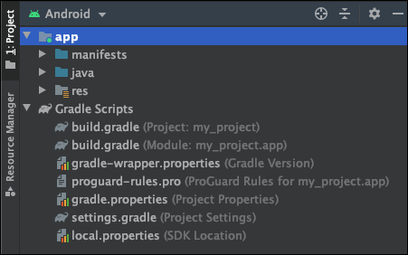
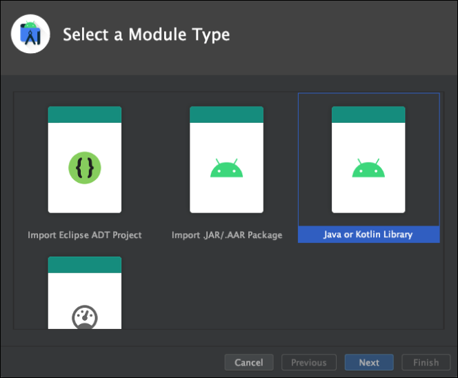
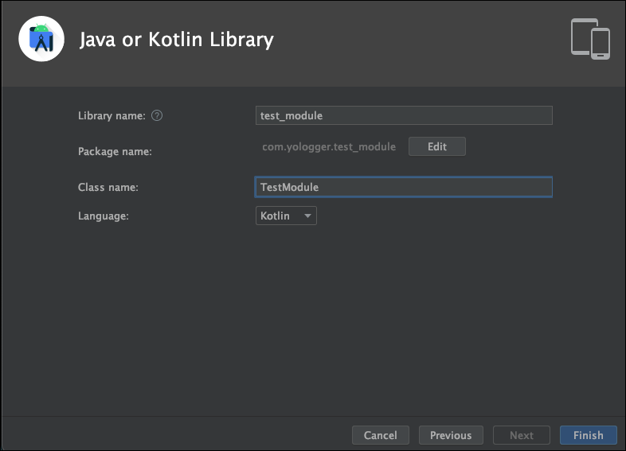
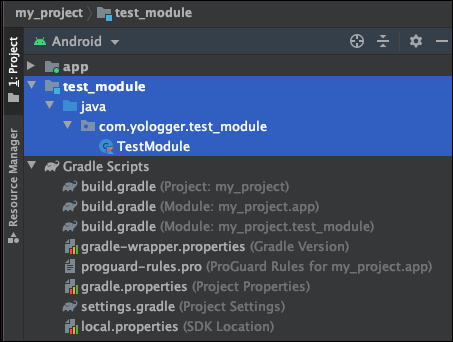
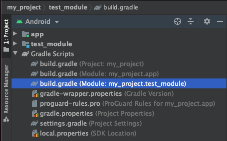

# Table of Contents
[[toc]]

# 모듈
[Android Developers](https://developer.android.com/guide/app-bundle/configure-base?hl=ko)에서는 `모듈(Module)`을 다음과 같이 정의하고 있습니다.

::: tip
<b>모듈</b>은 소스 파일 및 빌드 설정으로 구성된 모음이며, 이를 통해 프로젝트를 별개의 기능 단위로 분할할 수 있습니다. 프로젝트에는 하나 이상의 모듈이 포함될 수 있으며, 하나의 모듈이 다른 모듈을 종속 항목으로 사용할 수 있습니다. 각 모듈은 개별적으로 빌드, 테스트 및 디버그할 수 있습니다.
::: 

프로젝트와 모듈을 직접 만들어보면서 모듈이 무엇인지 알아보겠습니다.

## 모듈 생성하기
안드로이드 스튜디오 프로젝트를 생성하면 `app`이라는 모듈이 자동으로 생성됩니다.



이제 새로운 모듈을 추가해보겠습니다. `Android Studio > File > New > New Module`을 선택하면 다양한 모듈을 선택할 수 있습니다. 일단 `Java or Kotlin Module`을 선택합시다.



모듈의 이름은 `test_module`입니다.



새로운 모듈 `test_module`이 추가된 것을 확인할 수 있습니다.



모듈 `test_module`에 대한 `build.gradle`파일이 별도로 생성되었다는 것에 주목합시다.



모듈 `test_module`에 `TestModule`클래스를 다음과 같이 작성합니다.
``` kotlin
package com.yologger.test_module

class TestModule {
    // ...
}
```

## 모듈 사용하기
이제 `app`모듈에서 `test_module`모듈 의 `TestModule`클래스를 사용하겠습니다. 우선 `app`모듈의 `build.gradle`파일에 의존성을 추가해야합니다.
``` groovy
// build.gradle(Module: my_project.app)

dependencies { 
    implementation project(':test_module')
}
```
이제 `app`모듈에서 `TestModule`클래스를 사용할 수 있습니다.
``` kotlin
package com.yologger.my_project

import com.yologger.test_module.TestModule

class MainActivity : AppCompatActivity() {
    override fun onCreate(savedInstanceState: Bundle?) {
        // ...
        var module = TestModule()
    }
}
```

## 멀티 모듈의 장점
위 예제처럼 <u>하나의 프로젝트에서 여러 개의 모듈을 사용하는 것</u>을 `멀티 모듈`이라고 합니다. 

각 모듈은 자신만의 `build.gradle`을 가지고 있습니다. 이는 각 모듈 단위로 빌드할 수 있다는 뜻입니다. 이를 통해 빌드 시간을 단축시킬 수 있습니다. 또한 기능별로 코드를 분리하여 중복을 제거하고 재사용성을 높일 수 있습니다. 뿐만 아니라 모듈 단위로 테스트를 할 수도 있어 테스트 용이성이 높아집니다.

## 모듈의 종류
자주 사용하는 모듈은 크게 세 가지입니다.
### Phone & Tablet Module
`Phone & Tablet Module Module`을 빌드하면 안드로이드 운영체제에서 실행 가능한 `APK(Android Application Package)`파일이 생성됩니다. 똑같은 앱을 스마트폰, 태플릿 용도로 나누어 출시한다던가 유료 앱, 무료 앱을 구분하여 출시할 때 사용할 수 있습니다. 프로젝트를 생성하면 기본으로 생성되는 `app`모듈이 바로 `Phone & Tablet Module Module`입니다.

`Phone & Tablet Module Module`의 `build.gradle`을 보면 다음과 같은 플러그인을 적용하고 있습니다.
``` groovy
plugins {
    id 'com.android.application'
}
```

### Android Library
안드로이드 프레임워크와 관련된 모듈입니다. `AppCompatActivity`클래스, `Context`클래스처럼 안드로이드 프레임워크에서만 제공하는 API에 접근할 수 있습니다. 빌드의 결과로 `AAR(Android Archieve)` 파일이 생성됩니다.

`Android Library`의 `build.gradle`을 보면 다음과 같은 플러그인을 적용하고 있습니다.
``` groovy
plugins {
    id 'com.android.library'
}
```

### Java or Kotlin Library
순수하게 자바 또는 코틀린으로 이루어진 모듈입니다. 안드로이드 프레임워크와는 독립적이며, 빌드 결과로 `JAR(Java Archive)`파일이 생성됩니다.

`Java or Kotlin Library`의 `build.gradle`을 보면 다음과 같은 플러그인을 적용하고 있습니다.
``` groovy
plugins {
    id 'java-library'
}
```