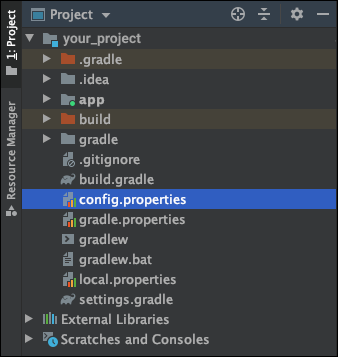

# Table of Contents
[[toc]]

## 왜 환경변수를 코드에서 분리해야할까?
많은 어플리케이션이 Google, Facebook과 같은 SNS 계정을 통한 로그인을 지원합니다. 개발자는 SNS 로그인 API를 사용하기 위해 `키(Key)`를 발급받는데, 이를 소스코드에 포함시키면 여러 보안 이슈가 발생할 수 있습니다. 

`properties 파일`을 사용하면 민감한 데이터를 코드에서 분리하여 이 파일에 저장할 수 있습니다.

## properties 파일 만들기
프로젝트의 루트 디렉토리에 `config.properties`파일을 생성합니다.

``` groovy config.properties
CLIENT_ID="your_client_id"
CLIENT_SECRET="your_client_secret"
```

## 모듈 수준의 build.gradle 설정하기
`build.gradle`에서 다음과 같이 `config.properties`파일을 읽어올 수 있습니다.
``` groovy build.gradle
def configPropertiesFile = rootProject.file("config.properties")
def configProperties = new Properties()
configProperties.load(new FileInputStream(configPropertiesFile))
``` 

이제 `configProperties['your_key']`형태로 값을 읽어올 수 있습니다.
``` groovy build.gradle
def configPropertiesFile = rootProject.file("config.properties")
def configProperties = new Properties()
configProperties.load(new FileInputStream(configPropertiesFile))

android {
    defaultConfig {
        applicationId "com.example.simple_memo"
        minSdkVersion 21
        targetSdkVersion 30
        versionCode 1
        versionName "1.0"
        testInstrumentationRunner "androidx.test.runner.AndroidJUnitRunner"

        // for xml file
        resValue "string", "CLIENT_ID", configProperties['CLIENT_ID']
        resValue "string", "CLIENT_SECRET", configProperties['CLIENT_SECRET']

        // for source file
        buildConfigField("String", "CLIENT_ID", configProperties['CLIENT_ID'])
        buildConfigField("String", "CLIENT_SECRET", configProperties['CLIENT_SECRET'])
    }
}
``` 

## 소스코드에서 값을 사용하기
이제 `소스 코드`에서 사용할 수 있습니다.
``` kotlin MainActivity.kt
class MainActivity : AppCompatActivity() {
    override fun onCreate(savedInstanceState: Bundle?) {
        super.onCreate(savedInstanceState)
        setContentView(R.layout.activity_main)

        val clientId = BuildConfig.CLIENT_ID            // your_client_id
        val clientSecret = BuildConfig.CLIENT_SECRET    // your_client_secret
    }
}
```

## xml 파일에서 값을 사용하기
`xml 파일`에서도 접근할 수 있습니다.
``` xml
<TextView android:text="@string/CLIENT_ID"/>
<TextView android:text="@string/CLIENT_SECRET"/>
``` 

## .gitignore파일에 추가하기
보통 `.properties`파일처럼 민감한 데이터가 포함된 파일은 원격 저장소에 업로드하지 않습니다. `.gitignore`에 `config.properties`파일을 추가합시다.
``` groovy .gitignore
config.properties
```