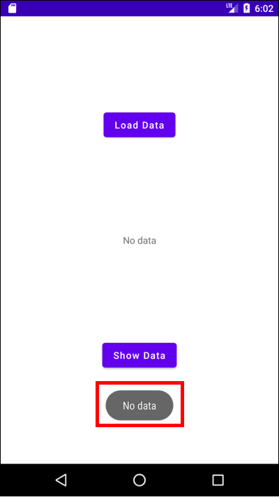
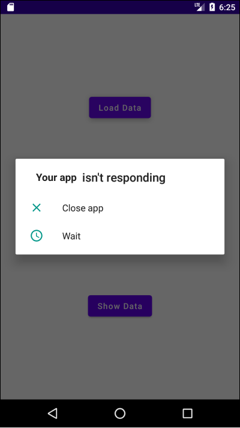
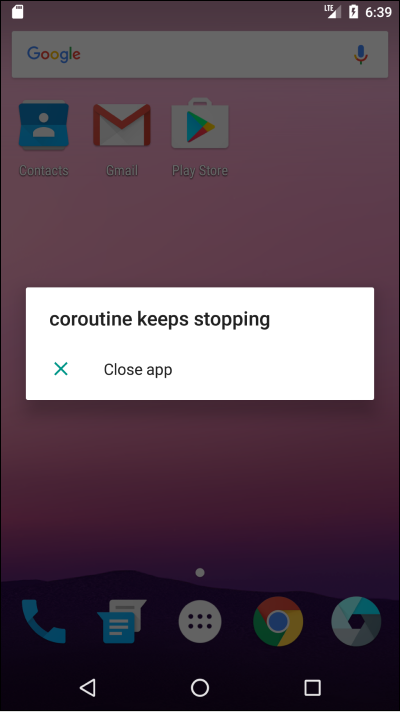
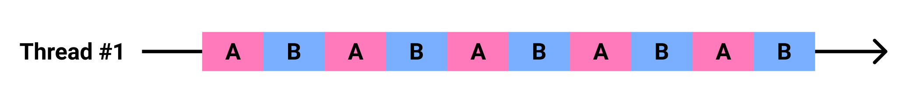
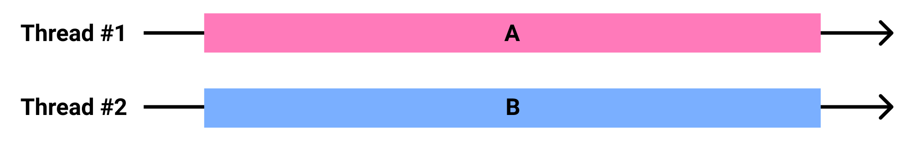

# Table of Contents
[[toc]]

# 코루틴
`코루틴(Coroutine)`을 사용하면 <u>비동기/논블로킹 프로그래밍</u>을 쉽게 구현할 수 있습니다.

## 왜 코루틴을 사용해야하는가
우리는 다음과 같은 간단한 앱을 만들면서 코루틴에 대해 알아볼 것입니다.


`Show Data`버튼을 누르면 현재 데이터를 토스트 메시지에 표시합니다.



`Load Data`버튼을 누르면 네트워크에서 데이터를 읽어와 화면 중앙에 보여줍니다.


레이아웃은 다음과 같습니다.
``` xml
// activity_main.xml
<?xml version="1.0" encoding="utf-8"?>
<androidx.constraintlayout.widget.ConstraintLayout xmlns:android="http://schemas.android.com/apk/res/android"
    xmlns:app="http://schemas.android.com/apk/res-auto"
    xmlns:tools="http://schemas.android.com/tools"
    android:layout_width="match_parent"
    android:layout_height="match_parent"
    tools:context=".MainActivity">

    <Button
        android:id="@+id/activity_main_button_load_data"
        android:layout_width="wrap_content"
        android:layout_height="wrap_content"
        android:text="Load Data"
        android:textAllCaps="false"
        app:layout_constraintTop_toTopOf="parent"
        app:layout_constraintStart_toStartOf="parent"
        app:layout_constraintEnd_toEndOf="parent"
        app:layout_constraintBottom_toTopOf="@+id/activity_main_textView_data"/>

    <TextView
        android:id="@+id/activity_main_textView_data"
        android:layout_width="wrap_content"
        android:layout_height="wrap_content"
        android:text="No data"
        app:layout_constraintTop_toBottomOf="@+id/activity_main_button_load_data"
        app:layout_constraintStart_toStartOf="parent"
        app:layout_constraintEnd_toEndOf="parent"
        app:layout_constraintBottom_toTopOf="@+id/activity_main_button_show_data"/>

    <Button
        android:id="@+id/activity_main_button_show_data"
        android:layout_width="wrap_content"
        android:layout_height="wrap_content"
        android:text="Show Data"
        android:textAllCaps="false"
        app:layout_constraintTop_toBottomOf="@+id/activity_main_textView_data"
        app:layout_constraintStart_toStartOf="parent"
        app:layout_constraintEnd_toEndOf="parent"
        app:layout_constraintBottom_toBottomOf="parent"/>

</androidx.constraintlayout.widget.ConstraintLayout>
```

`MainActivity.kt`는 다음과 같습니다.
``` kotlin
// MainActivity.kt
class MainActivity : AppCompatActivity() {

    private val buttonLoadData: Button by lazy { findViewById<Button>(R.id.activity_main_button_load_data) }
    private val textViewData: TextView by lazy { findViewById<TextView>(R.id.activity_main_textView_data) }
    private val buttonShowData: Button by lazy { findViewById<Button>(R.id.activity_main_button_show_data) }

    override fun onCreate(savedInstanceState: Bundle?) {
        super.onCreate(savedInstanceState)
        setContentView(R.layout.activity_main)

        buttonLoadData.setOnClickListener {
            // ..
        }

        buttonShowData.setOnClickListener {
            // ..
        }
    }
}
```

### 동기/블로킹 프로그래밍의 문제점
우선 동기/블로킹 프로그래밍으로 코드를 구현해보겠습니다.
``` kotlin
// MainActivity.kt
class MainActivity : AppCompatActivity() {

    private val buttonLoadData: Button by lazy { findViewById<Button>(R.id.activity_main_button_load_data) }
    private val textViewData: TextView by lazy { findViewById<TextView>(R.id.activity_main_textView_data) }
    private val buttonShowData: Button by lazy { findViewById<Button>(R.id.activity_main_button_show_data) }

    override fun onCreate(savedInstanceState: Bundle?) {
        super.onCreate(savedInstanceState)
        setContentView(R.layout.activity_main)

        buttonLoadData.setOnClickListener {
            loadData()
        }

        buttonShowData.setOnClickListener {
            Toast.makeText(this@MainActivity, "data: ${textViewData.text}", Toast.LENGTH_SHORT).show()
        }
    }

    fun loadData() {
        val result = networkRequest()
        updateUI(result)
    }

    fun networkRequest(): String {
        Thread.sleep(10 * 1000)     //  10 seconds
        return "This is data"
    }

    fun updateUI(text: String) {
        textViewData.text = text
    }
}
```

`Load Data`버튼을 누르면 `loadData()`가 호출됩니다.
``` kotlin
buttonLoadData.setOnClickListener {
    loadData()
} 
``` 
`loadData()`는 `networkRequest()`를 호출하고 반환받은 데이터를 `updateUI()`에 전달합니다.
``` kotlin
fun loadData() {
    val result = networkRequest()
    updateUI(result)
}
```
`updateUI()`는 `TextView`의 값을 전달받은 데이터로 업데이트합니다.
``` kotlin
fun updateUI(text: String) {
    textViewData.text = text
}
```
`networkRequest()`는 네트워크에서 데이터를 받아와서 반환하는 메소드입니다. 예제에서는 10초간 현재 스레드를 일시중지한 후 데이터를 반환하도록 하겠습니다. `Thread.sleep(10 * 1000)`는 현재 스레드를 10초 동안 정지하는 함수입니다.
``` kotlin
fun networkRequest(): String {
    Thread.sleep(10 * 1000)     //  10 seconds
    return "This is data"
}
```
앱을 실행하고 `Load Data`버튼을 누르면 앱 전체가 10초간 정지됩니다. 매인 스레드에서 오랜 시간이 걸리는 네트워크 작업을 수행하고 있기 때문입니다. 이 상태에서 `Show Data`버튼을 누르면 앱이 다운됩니다.



따라서 네트워크 통신처럼 시간이 오래 걸리는 작업은 별도의 스레드에서 비동기적으로 수행해야합니다.

### 비동기/논블로킹 프로그래밍 with 스레드
별도의 스레드에서 오래 걸리는 작업을 수행하도록 코드를 수정합시다. 또한 스레드에서 작업이 종료되었을 때 실행할 콜백 함수도 추가합니다.
``` kotlin
fun networkRequest(callback: (String) -> Unit) {
    val runnable = Runnable {
        Thread.sleep(5 * 1000)     //  10 seconds
        callback("This is data")
    }

    val thread = Thread(runnable)

    thread.start()
}
```
`loadData()`도 수정합니다.
``` kotlin
fun loadData() {
    networkRequest { result ->
        updateUI(result)
    }
}
```
다시 한번 앱을 실행하고 `Load Data`버튼을 눌러봅시다.



앱이 다시 다운됩니다. 비동기적으로 데이터는 잘 가져왔으나 매인 스레드가 아닌 스레드에서 UI를 수정하고있기 때문입니다. <u>안드로이드에서는 오직 매인 스레드만이 UI를 수정할 수 있습니다.</u> 매인 스레드가 아닌 스레드에서 UI를 수정하면 다음과 같은 에러가 발생하며 앱이 다운됩니다.

```
android.view.ViewRootImpl$CalledFromWrongThreadException: Only the original thread that created a view hierarchy can touch its views.
```
`updateUI()`를 수정합시다.
``` kotlin
fun updateUI(text: String) {
    runOnUiThread {
        textViewData.text = text    
    }
}
```
`AppCompatActivity`에 정의된 `runOnUiThread()`를 사용하면 코드 블록을 매인 스레드에서 실행하게 됩니다.

이제 `Load Data`버튼을 누르면 10초 뒤에 `TextView`가 잘 변경됩니다. 또한 데이터를 로드하는 동안 `Show Data`버튼을 눌러도 토스트 메시지가 잘 표시됩니다. 


### 비동기/논블로킹 프로그래밍 with 코루틴
이제 예제를 코루틴을 사용하여 구현해보겠습니다.

코루틴을 사용하려면 모듈 수준의 `build.gradle`에 의존성을 추가해야합니다.
``` kotlin
dependencies {
    // Coroutine
    implementation("org.jetbrains.kotlinx:kotlinx-coroutines-android:${coroutine_version}")
}
```

`loadData()`, `networkRequest()`, `updateUI()` 코드는 다음과 같습니다. 동기/블로킹 프로그래밍 예제와 동일합니다.
``` kotlin
fun loadData(): String {
    val result = networkRequest()
    return result
}
```
``` kotlin
fun networkRequest(): String {
    Thread.sleep(10 * 1000)     //  10 seconds
    return "This is data"
}
```
``` kotlin
fun updateUI(text: String) {
    textViewData.text = text
}
```
이제 코루틴을 적용해보겠습니다.
``` kotlin
// 버튼을 클릭했을 때
buttonLoadData.setOnClickListener {

    // 스코프 생성
    val scope = CoroutineScope(Dispatchers.IO)

    // 코루틴 생성
    scope.launch {
        val result = loadData()
        withContext(Dispatchers.Main) {
            updateUI(result)
        }
    }
}
```
수정된 코드에서 주목할 부분은 네 가지입니다.

첫째, `Dispatcher`는 <u>작업을 적절한 스레드에 배분</u>합니다. 코루틴에서 제공하는 `Dispatcher`는 세 가지가 있습니다.
- `Dispatchers.Default`: CPU 사용량이 많은 작업에 적합한 스레드를 제공합니다. 매인 스레드에서 처리하기에는 무거운 작업을 수행할 때 사용할 수 있습니다.
- `Dispatchers.IO`: 네트워크, 디스크 등 입출력에 적합한 스레드를 제공합니다. 네트워크 통신을 하거나, 파일을 읽고 쓰는데 사용할 수 있습니다.
- `Dispatchers.Main`: 코드 블록을 매인 스레드에서 수행합니다. 안드로이드에서는 UI를 변경할 때 사용할 수 있습니다.

둘째, `CoroutineScope`클래스의 정의된 `launch()`함수를 사용하면 코루틴이 생성됩니다. 이 코루틴 블록 안에 비동기/논블로킹 프로그래밍을 구현합니다. 코드 블록은 `Dispatcher`가 제공하는 스레드에서 실행됩니다.
``` kotlin
val scope: CoroutineScope = CoroutineScope(Dispatchers.IO)

scope.launch {
    // 코루틴 블록
    // 이 곳에 비동기/논블로킹 프로그래밍을 구현합니다.
    // Dispatchers.IO가 제공하는 스레드에서 실행됩니다.
}
```

셋째, `CoroutineScope`클래스의 인스턴스를 생성하고 있다는 점에 주목합시다. 
``` kotlin
// 스코프 생성
val scope: CoroutineScope = CoroutineScope(Dispatchers.IO)

// 스코프 내부에서 코루틴 생성
scope.launch {
    // 코루틴
}
```
<u>코루틴은 스코프 안에서 생성됩니다</u>. 그렇다면 왜 코루틴을 스코프 안에서 생성할까요? <u>스코프를 사용하면 코루틴을 쉽게 추적하고 제어할 수 있기 때문입니다</u>. 몇 가지 사례를 살펴보겠습니다.

우선 스코프 안에서 여러 코루틴이 생성될 수도 있습니다.
``` kotlin
val scope: CoroutineScope = CoroutineScope(Dispatchers.IO)

// 첫 번째 코루틴
scope.launch {
    println(Thread.currentThread().name)    // DefaultDispatcher-worker-1
    // ..
}

// 두 번째 코루틴
scope.launch {
    println(Thread.currentThread().name)    // DefaultDispatcher-worker-2
    // ..
}
``` 
`Thread.currentThread().name`는 현재 스레드의 이름을 반환합니다. 첫 번째 코루틴과 두 번째 코루틴이 다른 스레드에서 실행된다는 점에 주목합시다.

`스코프`를 사용하면 스코프 안에서 실행 중인 모든 코루틴을 취소할 수도 있습니다. 예를 들어 코루틴 블록이 실행 중일 때 액티비티가 종료될 수도 있습니다. 이 경우 코루틴을 계속 수행할 필요가 없기 때문에 스코프를 사용하여 모든 코루틴을 종료할 수 있습니다. 스코프를 종료할 때는 `cancel()`을 호출합니다.
``` kotlin
class MainActivity : AppCompatActivity() {

    val scope: CoroutineScope = CoroutineScope(Dispatchers.IO)

    ...

    override fun onDestroy() {
        super.onDestroy()
        // 액티비티가 사라질 때 스코프를 사용하여 코루틴 종료
        scope.cancel()
    }
}
```
스코프를 사용하면 스코프 안에서 실행되고 있는 작업들이 아직 실행 중인지, 정상적으로 실행 후 종료되었는지, 취소되었는지도 확인할 수 있습니다. 
``` kotlin
val scope: CoroutineScope = CoroutineScope(Dispatchers.IO)

if (scope.isActive) {
    // 작업 실행 중
} else {
    // 정상적으로 실행 후 종료되었거나 취소됨.
}
```

스코프를 생성할 때는 `Dispatcher`를 인자로 전달해야합니다. 아래 코드에서 스코프 내부의 코루틴들은 `Dispatchers.IO`가 제공하는 스레드에서 실행됩니다.
``` kotlin
val scope: CoroutineScope = CoroutineScope(Dispatchers.IO)
// ...
```

이처럼 스코프를 사용하면 스코프 내부의 코루틴들을 추적하고 효율적으로 관리할 수 있습니다. 

스코프는 생성할 수 있고, 상태를 확인할 수 있으며, 종료할 수 있습니다. 이를 <u>스코프는 생명주기가 있다</u>고 표현합니다. 스코프 내부의 코루틴들은 스코프의 생명주기를 따릅니다. 즉, 스코프가 종료되면 내부의 모든 자식 코루틴들도 종료됩니다.

넷째, `withContext()`는 코루틴에서 제공하는 함수입니다. 이 메소드는 인자로 전달한 `Dispatcher`가 제공하는 스레드에서 코드 블록을 실행합니다. UI를 변경하는 `updateUI()`메소드는 매인 스레드에서 실행되야하므로 이 함수를 사용하여 `Dispatcher`를 변경합니다.
``` kotlin
val scope = CoroutineScope(Dispatchers.IO)

scope.launch {
    val result = loadData()       
    // loadData()는 Dispatchers.IO가 제공하는 스레드에서 실행됩니다.
    withContext(Dispatchers.Main) {
        updateUI(result)      
        // updateUI()는 매인 스레드에서 실행됩니다.
    }
}
``` 
이제 앱을 실행해봅시다. `Load Data`버튼을 누르면 10초 뒤에 `TextView`가 잘 변경됩니다. 또한 데이터를 로드하는 동안 `Show Data`버튼을 눌러도 토스트 메시지가 잘 표시됩니다. 

## withContext()

아래 코드를 살펴봅시다. `loadData()`에서 <u>동기적으로</u> 시간이 오래 걸리는 작업을 수행하고 있습니다.
``` kotlin
fun onButtonClicked() {
    val result = loadData()
}

fun loadData(): Data {
    // 오래 걸리는 작업
}
```
위 코드를 코루틴을 사용하여 <u>비동기적으로</u> 구현해보겠습니다. 시간이 오래 걸리는 작업을 `withContext()`의 코드 블록에서 실행하면 됩니다.
``` kotlin
fun onButtonClicked() {
    val result = loadData()
}

fun loadData(): Data {
    withContext(Dispatchers.IO) {
        // 오래 걸리는 작업
    }
}
```
`withContext()`는 인자로 전달한 `Dispatcher`가 제공하는 스레드에서 코드 블록에서 실행합니다. 이 함수는 코루틴 블록이 실행되는 스레드를 변경할 때 주로 사용합니다.
``` kotlin
fun doSomething() {
    withContext(Dispatchers.Main) {
        // do something in main thread

        withContext(Dispatchers.IO) {
            // do something in another thread

            withContext(Dispatchers.Main) {
                // do something in main thread

                withContext(Dispatchers.IO) {
                    // do something in another thread
                    // ...
                }    
            }    
        }    
    }
}
```

## suspend 함수
위 샘플 코드를 다시 살펴봅시다.
``` kotlin
fun onButtonClicked() {
    val result = loadData()
}

fun loadData(): Data {
    withContext(Dispatchers.IO) {
        // 오래 걸리는 작업
    }
}
``` 
이 코드는 빌드에 실패하며, 다음과 같은 에러가 발생합니다.
```
Suspend function 'withContext' should be called only from a coroutine or another suspend function
```
`withContext()`는 코루틴 안에서 호출되거나 다른 `suspend 함수`에서 호출해야한다는 메시지입니다. 그럼 `loadData()`안에 새로운 코루틴을 생성하겠습니다.
``` kotlin
fun onButtonClicked() {
    val result = loadData()
}

fun loadData(): Data {
    val scope = CoroutineScope(Dispatchers.Main)
    scope.launch {
        withContext(Dispatchers.IO) {
            // 오래 걸리는 작업
        }
    }
}
```
그런데 위 코드는 아래와 같이 구현할 수도 있습니다. `loadData()` 앞에 키워드 `suspend`가 추가된 것에 주목합시다.
``` kotlin
fun onButtonClicked() {
    val scope = CoroutineScope(Dispatchers.Main)
    scope.launch {
        val result = loadData()
    }
}

suspend fun loadData(): Data {
    withContext(Dispatchers.IO) {
        // 오래 걸리는 작업
    }
}
```
원래라면 `withContext()`는 코루틴 안에서 실행되어야 하므로 `loadData()` 안에 코루틴을 생성해야합니다. 
``` kotlin
fun loadData(): Data {
    val scope = CoroutineScope(Dispatchers.Main)
    scope.launch {
        withContext(Dispatchers.IO) {
            // 오래 걸리는 작업
        }
    }
}
```
그러나 키워드`suspend`를 추가하면 코루틴 생성을 유예할 수 있습니다. 이처럼 키워드 `suspend`가 추가된 함수를 `suspend 함수`라고 합니다. 
``` kotlin
suspend fun loadData(): Data {
    withContext(Dispatchers.IO) {
        // 오래 걸리는 작업
    }
}
```
`suspend 함수`를 호출하는 곳에서는 결국 스코프를 생성하거나 키워드 `suspend`를 붙여 다시 한번 유예해야합니다.
``` kotlin 
fun onButtonClicked() {
    val scope = CoroutineScope(Dispatchers.Main)
    scope.launch {
        val result = loadData()
    }
}
```
이처럼 `suspend 함수`를 사용하면 스코프 생성을 유예할 수 있습니다.

## 스코프
### CoroutineScope
`CoroutineScope`는 코루틴 라이브러리에서 기본적으로 제공하는 스코프입니다. 
``` kotlin
// MainActivity.kt
class MainActivity : AppCompatActivity() {

    val button: Button by lazy { findViewById<Button>(R.id.activity_main_button) }

    lateinit var scope: Job

    override fun onCreate(savedInstanceState: Bundle?) {
        super.onCreate(savedInstanceState)
        setContentView(R.layout.activity_a)

        button.setOnClickListener {
            scope = CoroutineScope(Dispatchers.IO)
            scope.launch {
                // ...
            }
        }
    }

    override fun onDestroy() {
        super.onDestroy()
        scope.cancel()
    }
}
```

`CoroutineScope`는 액티비티가 종료되거나 클래스의 인스턴스가 사라지면 메모리에서 해제됩니다. 그렇다면 액티비티나 클래스가 아니라 앱 전체의 생명주기와 함께하며, 앱이 종료될 때까지는 매모리에서 사라지지 않는 스코프는 없을까요?

### GlobalScope
`GlobalScope`는 앱이 시작될 때 생성되며 앱이 종료되어야만 메모리에서 해제되는 스코프입니다. `GlobalScope`는 액티비티가 종료되거나 클래스의 인스턴스가 사라지더라도 해제되지 않습니다. `GlobalScope`는 싱글톤 객체며, 다음과 같이 사용합니다.
``` kotlin
GlobalScope.launch {
    // ...
} 
```
`GlobalScope`은 앱이 실행되는 동안 장시간, 혹은 주기적으로 실행되어야 하는 코루틴에 적합합니다.

### lifecycleScope
`CoroutineScope` 예제를 다시 살펴봅시다.
``` kotlin
// MainActivity.kt

class MainActivity : AppCompatActivity() {

    val button: Button by lazy { findViewById<Button>(R.id.activity_main_button) }

    lateinit var scope: Job

    // ..

    override fun onDestroy() {
        super.onDestroy()
        scope.cancel()
    }
}
```
코루틴 블록이 실행 중일 때 액티비티가 종료될 수도 있습니다. 이 경우 코루틴을 계속 수행할 필요가 없기 때문에 스코프를 사용하여 모든 코루틴을 종료할 수 있습니다. 이 때문에 `AppCompatActivity`클래스의 `onDestroy()`에서 `cancel()`을 호출하여 코루틴을 종료하고 있습니다.

액티비티나 프래그먼트처럼 `LifecycleOwner`의 구현체이며, 생명주기를 가지는 컴포넌트에서는 `CoroutineScope` 대신 `lifeCycleScope`를 사용할 수 있습니다.

우선 의존성을 추가합니다.
``` groovy
// 모듈 수준의 build.gradle
dependencies {
    implementation "androidx.lifecycle:lifecycle-runtime-ktx:2.4.0-alpha02"
}
```
추가된 의존성은 내부적으로 `LifecycleOwner`에 `lifeCycleScope` 속성을 추가합니다.
``` kotlin
public val LifecycleOwner.lifecycleScope: LifecycleCoroutineScope
    get() = lifecycle.coroutineScope
```
따라서 `LifecycleOwner`의 구현체에서는 `CoroutineScope` 대신 `lifeCycleScope`를 사용할 수 있습니다.
``` kotlin
class MainActivity : AppCompatActivity() {

    private val button: Button by lazy { findViewById<Button>(R.id.activity_main_button) }

    override fun onCreate(savedInstanceState: Bundle?) {
        super.onCreate(savedInstanceState)
        setContentView(R.layout.activity_main)

            lifecycleScope.launch {
                // ...
            }
    }
}
```
이제 `lifeCycleScope`는 액티비티의 생명주기를 따르게 됩니다. 따라서 귀찮게 `onDestroy()`에서 `cancel()`을 호출할 필요가 없어집니다. 

### ViewModelScope
앱이 `MVVM 아키텍처`를 채택하고 `ViewModel`을 사용한다면 `CoroutineScope` 대신 `ViewModelScope`을 사용할 수 있습니다.

우선 `CoroutineScope`을 사용해보겠습니다.
``` kotlin
class MainViewModel: ViewModel() {

    var scope: CoroutineScope

    init {
        scope = CoroutineScope(Dispatchers.Main)
    }

    override onCleared() {
        scope.cancel()
    }
}
```
이 경우 `ViewModel`이 메모리에서 해제될 때 호출되는 `onCleared()`에서 `cancel()`을 호출해야합니다.

그러나 `ViewModel`에서는 `CoroutineScope` 대신 `viewModelScope` 속성을 사용할 수 있습니다. 우선 의존성을 추가해야합니다.
``` groovy
// 모듈 수준의 build.gradle
dependencies {
    implementation "androidx.lifecycle:lifecycle-viewmodel-ktx:${lifecycle_viewmodel_ktx_version}"
}
```
추가한 라이브러리는 `ViewModel`클래스에 `viewModelScope`속성을 추가해줍니다.
``` kotlin
val ViewModel.viewModelScope: CoroutineScope 
    get() {
        val scope: CoroutineScope? = this.getTag(JOB_KEY)
        if (scope != null) {
            return scope
        }
        return setTagIfAbsent(JOB_KEY, CloseableCoroutineScope(SupervisorJob() + Dispatchers.Main))
    }
```

따라서 `ViewModel`에서 다음과 같이 `viewModelScope`속성을 사용하여 코루틴을 생성할 수 있습니다. 
``` kotlin
class MainViewModel: ViewModel() {
    init {
        viewModelScope.launch {
            // ...
        }
    }
}
```
이 덕분에 보일러 코드를 삭제할 수 있으며, 개발자가 번거롭게 `cancel()`을 호출할 필요가 없어졌습니다.

::: tip
viewModelScope 속성을 사용하여 생성한 코루틴은 기본적으로 <u>메인 스레드</u>에서 실행됩니다.
:::

## launch()
스코프에 정의된 `launch()`함수를 호출하여 코루틴을 생성할 수 있습니다.
``` kotlin
val scope: CoroutineScope = CoroutineScope(Dispatchers.IO)

scope.launch {
    // ...
}
```
만약 다음과 같이 여러 코루틴을 생성한다고 가정합시다.
``` kotlin
val scope: CoroutineScope = CoroutineScope(Dispatchers.IO)

scope.launch {
    // ...
}

scope.launch {
    // ...
}
```
위 코드는 스코프 함수 `with()`를 사용하여 다음과 같이 표현할 수 있습니다.

``` kotlin
val scope: CoroutineScope = CoroutineScope(Dispatchers.IO)

with(scope) {
    launch {
        // ...
    }

    launch {
        // ...
    }
}
```

##  Job 객체
`launch()`로 코루틴을 생성하면 `Job`클래스의 인스턴스를 반환합니다.
``` kotlin
val scope: CoroutineScope = CoroutineScope(Dispatchers.IO)

val job: Job = scope.launch {
    // ...
}
```
`Job`을 사용하면 스코프 내부의 개별 코루틴을 관리할 수 있습니다. 아래 코드를 살펴봅시다.
``` kotlin
var scope = CoroutineScope(Dispatchers.Main)

with(scope) {
    val jobA = launch {
        delay(5 * 1000)
        println("jobA() finished.")
    }

    val jobB = launch {
        delay(5 * 1000)
        println("jobB() finished.")
    }
}
```
위 코드는 두 코루틴을 동시에 실행합니다. 실행 후 5초 뒤에 로그에 다음과 같이 출력됩니다.
```
// 5초 뒤 두 줄이 동시에 출력됩니다.
jobA() finished.
jobB() finished.
```
`Job`클래스의 `cacnel()`을 사용하면 코루틴을 취소할 수 있습니다. 
``` kotlin
var scope = CoroutineScope(Dispatchers.Main)

with(scope) {
    val jobA = launch {
        delay(5 * 1000)
        println("jobA() finished.")
    }

    val jobB = launch {
        jobA.cancel()   // jobA 취소
        delay(5 * 1000)
        println("jobB() finished.")
    }
}
```
실행 후 5초 뒤에 한 줄만 출력됩니다. `jobB`에서 `jobA`를 취소했기 때문입니다.
```
jobB() finished.
```
또 다른 예제를 살펴봅시다.
``` kotlin
var scope = CoroutineScope(Dispatchers.Main)

with(scope) {
    val jobA = launch {
        delay(5 * 1000)
        println("jobA() finished.")
    }

    val jobB = launch {
        jobA.join()   // jobA가 끝날 때 까지 기다립니다.
        delay(5 * 1000)
        println("jobB() finished.")
    }
}
```
실행 후 5초 뒤에 한 줄만 출력됩니다. 다시 5초 뒤 다른 한 줄이 출력됩니다.
```
// 실행 후 5초 뒤 출력
jobA() finished.

// 실행 후 10초 뒤 출력
jobB() finished.
```
`join()`은 `Job`이 완료될 때 까지 현재 코루틴을 중지합니다. 위 예제에서는 `jobA`가 종료될 때까지 `jobB`가 실행되지 않고 기다리게 됩니다.

`joinAll()`을 사용하면 여러 `Job`이 완료될 때 까지 현재 코루틴을 중지할 수 있습니다.
``` kotlin
var scope = CoroutineScope(Dispatchers.Main)
with(scope) {
    val jobA = launch {
        delay(5 * 1000)
        println("jobA() finished.")
    }
    val jobB = launch {
        delay(10* 1000)
        println("jobB() finished.")
    }
    val jobC = launch {
        joinAll(jobA, jobB)
        println("jobC() finished.")
    }
}
```
결과는 다음과 같습니다.
```
// 5초 뒤 출력
jobA() finished.

// 10초 뒤 출력
jobB() finished.
jobC() finished.
```
이처럼 `Job`을 사용하면 스코프 내부의 개별 코루틴을 관리할 수 있습니다.

##  runBlocking()
우선 아래 코드를 살펴봅시다. `launch()`를 사용하여 코루틴을 생성하고 있습니다. 이 코루틴은 매인 스레드에서 실행됩니다. 
``` kotlin
class MainActivity : AppCompatActivity() {

    private val button: Button by lazy { findViewById<Button>(R.id.activity_main_button) }

    override fun onCreate(savedInstanceState: Bundle?) {
        button.setOnClickListener {
            val scope = CoroutineScope(Dispatchers.Main)
            scope.launch {
                // ...
            }
        }
    }
``` 
위 코드를 `runBlocking()`로 구현하면 다음과 같습니다.
``` kotlin
class MainActivity : AppCompatActivity() {

    private val button: Button by lazy { findViewById<Button>(R.id.activity_main_button) }

    override fun onCreate(savedInstanceState: Bundle?) {
        button.setOnClickListener {
            runBlocking {
                // ...
            }
        }
    }
``` 

`runBlocking()`은 <u>현재 스레드에서 실행</u>되는 새로운 코루틴 생성합니다. 이 함수의 결과 값이 `Job`객체인 것을 보면 알 수 있습니다.
``` kotlin
val job: Job = runBlocking {
    // ...
}
```
스코프와 `launch()`를 사용하여 코루틴을 생성할 땐, 코루틴이 실행될 스레드를 `Dispatcher`로 지정해주었습니다.
``` kotlin
val scope1 = CoroutineScope(Dispatchers.Main)
scope1.launch {
    // 매인 스레드에서 코루틴 블록 실행
}

val scope2 = CoroutineScope(Dispatchers.IO)
scope2.launch {
    // Dispatchers.IO가 제공하는 스레드에서 코루틴 블록 실행
}
```
그러나 `runBlocking()`은 <u>이 함수를 호출하는 코드가 실행되고 있는 스레드</u>에서 코루틴 블록을 실행합니다. 따라서 별도의 `Dispatcher`를 지정할 필요가 없습니다.
``` kotlin
runBlocking {
    // ...
}
```
또한 `launch()`와 `runBlocking()`에는 중요한 차이점이 있습니다. `runBlocking()`는 <u>코루틴이 끝날 때 까지 현재 스레드를 일지중지</u>합니다. `runBlocking()` 예제를 살펴봅시다.
``` kotlin
runBlocking {
    delay(5 * 1000)
    println("Coroutine Block")
}
println("Finished.")
```
위 코드를 실행하면 다음과 같은 로그가 출력됩니다.
```
// 5초 뒤 아래 두 줄 출력
Coroutine Block
Finished.
```
`runBlocking()`의 코루틴 블록이 끝날 때 까지 `println("Finished.")`가 호출되지 않고 현재 스레드가 중지된 것입니다. 따라서 `println("Finished.")`는 코루틴 블록이 끝나고 호출됩니다. 

이제 `launch()` 예제를 살펴봅시다.
``` kotlin
CoroutineScope(Dispatchers.Main).launch {
    delay(5 * 1000)
    println("Coroutine Block")
}
println("Finished.")
```
위 코드를 실행하면 다음과 같은 로그가 출력됩니다.
```
// 실행 시 바로 출력
Finished.

// 5초 뒤 아래 한 줄 출력
Coroutine Block
```
`launch()`의 코루틴 블록이 끝나든 말든 현재 스레드는 중지되지 않으며, 코루틴 블록과 별도로 실행되어 `println("Finished.")`가 즉시 호출된 것입니다.

이처럼 `runBlocking()` 새로운 코루틴을 생성하고 실행하며, 현재 스레드는 코루틴이 끝날 때 까지 중지시킵니다.

## 코루틴과 스레드의 차이점
아래 코드를 다시 한번 살펴봅시다. `println("Finished.")`는 매인 스레드에서 호출됩니다. 코루틴 블록도 역시 같은 매인 스레드에서 실행됩니다.
``` kotlin
class MainActivity : AppCompatActivity() {

    private val button: Button by lazy { findViewById<Button>(R.id.activity_main_button) }

    override fun onCreate(savedInstanceState: Bundle?) {
        button.setOnClickListener {
            val scope = CoroutineScope(Dispatchers.Main)
            scope.launch {
                delay(5 * 1000)
                println("Coroutine Block") 
            }
            println("Finished.") 
        }
    }
``` 
그런데 여기서 주목할 부분이 하나 있습니다. `delay(5 * 1000)`는 현재 코루틴을 5초 동안 중지시킵니다. 그런데 매인 스레드는 5초 동안 중지되지 않으며, `println("Finished.")`가 즉시 호출됩니다. 이는 코루틴과 스레드가 동일하지 않다는 것을 의미합니다. 

그렇다면 `println("Finished.")`와 코루틴 블록이 어떻게 하나의 스레드 안에서 동시에 실행될 수 있을까요? 이는 스레드가 코루틴을 `병행(Concurrency) 처리`하기 때문입니다.

## 동시처리, 병행과 병렬
우선 `병행(Concurrency) 처리`를 그림으로 표현하면 다음과 같습니다.

병행 처리는 하나의 스레드에서 두 작업을 사람이 인식하기 어려운 짧은 간격으로 번갈아가며 수행합니다. 따라서 사람이 보기에는 두 작업이 동시에 수행되는 것처럼 보입니다.

`병렬(Parallelism) 처리`를 그림으로 표현하며 다음과 같습니다.

병렬 처리는 말 그대로 두 개의 스레드에서 두 작업을 동시에 수행합니다. 진정한 의미의 병렬 처리는 멀티 코어 CPU같은 하드웨어 레벨의 지원과 운영체제 레벨에서의 지원이 필요합니다.

코루틴은 스레드에서 `병행(Concurrency)`적으로 처리됩니다. 따라서 바로 위 예제에서 `println("Finished.")`와 코루틴이 같은 스레드에서 호출되었음에도 동시에 실행되는 것입니다.

## async(), await(), Deferred
코루틴은 `async()`를 호출하여 생성할 수도 있습니다. 그렇다면 `launch()`와 `async()`의 차이점은 무엇일까요? 차이점은 바로 코루틴의 값 반환 유무입니다. 

`launch()`으로 생성한 코루틴은 값을 반환하지 않습니다.
``` kotlin
val scope: CoroutineScope = CoroutineScope(Dispatchers.IO)

scope.launch {
    // 반환값이 없음
}
```
반면 `async()`로 생성한 코루틴은 값을 반환합니다.
``` kotlin
val scope: CoroutineScope = CoroutineScope(Dispatchers.IO)

scope.async {
    // ...

    // 반환값이 있음
    return something
}
```
또한 `launch()`는 `Job`을 반환하지만 `async()`는 `Deferred`객체를 반환합니다. 
``` kotlin
val scope: CoroutineScope = CoroutineScope(Dispatchers.IO)

var deferred: Deferred = scope.async {
    // ...
    return something
}
// 이 단계에서는 코루틴이 정의만 되어있을 뿐 아직 실행되진 않습니다.
```
`Deferred`객체에는 `await()`가 정의되어있습니다. 이 메소드를 호출하기 전까지 코루틴 블록은 실행되지 않고 대기합니다. `await()`를 호출하면 코루틴 블록이 실행되고 값을 반환합니다.
``` kotlin
val scope: CoroutineScope = CoroutineScope(Dispatchers.IO)

var deferred: Deferred = scope.async {
    // ...
    return something
}
// 이 단계에서는 코루틴이 정의만 되어있을 뿐 아직 실행되진 않습니다.

val result = deferred.await()   // 이 단계에서 코루틴이 실행되고 값이 반환됩니다.
```

`async()`, `await()`는 서로 다른 시간이 걸리는 두 작업이 모두 끝나길 기다렸다가 한꺼번에 종료하는데 사용할 수도 있습니다.
``` kotlin
suspend fun loadData(): String {
    val scope = CoroutineScope(Dispatchers.IO)

    with(scope) {
        val deferred1 = async { getFirstData() }
        val deferred2 = async { getSecondData() }

        val result1 = deferred1.await()
        val result2 = deferred2.await()

        return "$result1 & $result2"
    }
}

fun getFirstData(): String {
    Thread.sleep(5 * 1000)     //  5 seconds
    return "First Data"
}

fun getSecondData(): String {
    Thread.sleep(10 * 1000)     //  10 seconds
    return "Second Data"
}
```

이제 `launch()`를 통해 구현한 아래 코드를 `async()`, `await()` 메소드로 구현해보겠습니다.
``` kotlin
class MainActivity : AppCompatActivity() {

    private val buttonLoadData: Button by lazy { findViewById<Button>(R.id.activity_main_button_load_data) }
    private val textViewData: TextView by lazy { findViewById<TextView>(R.id.activity_main_textView_data) }
    private val buttonShowData: Button by lazy { findViewById<Button>(R.id.activity_main_button_show_data) }

    override fun onCreate(savedInstanceState: Bundle?) {
        super.onCreate(savedInstanceState)
        setContentView(R.layout.activity_main)

        buttonLoadData.setOnClickListener {
            val scope = CoroutineScope(Dispatchers.IO)
            scope.launch {
                val result = loadData()
                withContext(Dispatchers.Main) {
                    updateUI(result)
                }
            }
        }

        buttonShowData.setOnClickListener {
            Toast.makeText(this@MainActivity, "${textViewData.text}", Toast.LENGTH_SHORT).show()
        }
    }


    fun loadData(): String {
        val result = networkRequest()
        return result
    }

    fun networkRequest(): String {
        Thread.sleep(10 * 1000)     //  10 seconds
        return "This is data"
    }

    fun updateUI(text: String) {
        textViewData.text = text
    }
}
```
이 예제를 `async()`를 사용하여 구현하면 다음과 같습니다.
``` kotlin
class MainActivity : AppCompatActivity() {

    private val buttonLoadData: Button by lazy { findViewById<Button>(R.id.activity_main_button_load_data) }
    private val textViewData: TextView by lazy { findViewById<TextView>(R.id.activity_main_textView_data) }
    private val buttonShowData: Button by lazy { findViewById<Button>(R.id.activity_main_button_show_data) }

    override fun onCreate(savedInstanceState: Bundle?) {
        super.onCreate(savedInstanceState)
        setContentView(R.layout.activity_main)

        buttonLoadData.setOnClickListener {
            val scope = CoroutineScope(Dispatchers.Main)
            scope.launch {
                val result = loadData()
                updateUI(result)
            }
        }

        buttonShowData.setOnClickListener {
            Toast.makeText(this@MainActivity, "${textViewData.text}", Toast.LENGTH_SHORT).show()
        }
    }


    suspend fun loadData(): String {
        val scope = CoroutineScope(Dispatchers.IO)
        val deferred = scope.async {
            networkRequest()
        }
        val result = deferred.await()
        return result
    }

    fun networkRequest(): String {
        Thread.sleep(10 * 1000)     //  10 seconds
        return "This is data"
    }

    fun updateUI(data: String) {
        textViewData.text = data
    }
}
```

## Job
스코프를 생성할 때 다음과 같이 `Job`을 전달할 수 있습니다.
``` kotlin
val scope = CoroutineScope(Dispatchers.Main + Job())

fun loadData() {    
    scope.launch {
        val data = networkRequest()
        updateUI(data)
    }
}
```
`CoroutineScope` 코드를 살펴봅시다. `Job`을 전달하지 않으면 기본 값으로 `Job()`을 생성하여 사용합니다.
``` kotlin
public fun CoroutineScope(context: CoroutineContext): CoroutineScope =
    ContextScope(if (context[Job] != null) context else context + Job())
```
따라서 아래 두 코드는 동일합니다.
``` kotlin
val scope = CoroutineScope(Dispatchers.Main)
```
``` kotlin
val scope = CoroutineScope(Dispatchers.Main + Job())
```
`Job`은 자식 `Job`을 가질 수 있습니다.
``` kotlin
val parentJob = CoroutineScope(Dispatchers.Main).launch {
    // ...

    val childJob = CoroutineScope(Dispatchers.IO).launch {
        // ...

        val grandChildJob = CoroutineScope(Dispatchers.Default).launch {
            // ...
        }
    }
}
```

## SupervisorJob
`Job()`을 전달하면 스코프 내에서 어떤 코루틴에서 예외가 발생할 때 <u>다른 모든 코루틴을 중지</u>시킵니다.

반면 `SupervisorJob()`을 전달하면 스코프 내에서 어떤 코루틴에서 예외가 발생할 때 <u>그 코루틴만 중지</u>시킵니다.
``` kotlin
val scope = CoroutineScope(Dispatchers.Main + SupervisorJob())

fun loadData() {    
    scope.launch {
        val data = networkRequest()
        updateUI(data)
    }
}
```

## 코루틴의 예외 처리
### launch()의 에러 처리
우선 `updateData()`라는 suspend 함수를 정의해봅시다. 이 함수는 10초 후 예외를 발생합니다.
``` kotlin
suspend fun updateData() {
    withContext(Dispatchers.IO) {
        Thread.sleep(10 * 1000)
        throw Exception("exception")
    }
}
```
`launch()` 함수로 코루틴을 생성했다면 다음과 같이 에러를 처리할 수 있습니다.
``` kotlin
// 스코프 생성
val scope = CoroutineScope(Dispatchers.IO)

// 코루틴 생성
scope.launch {
    try {
        updateData()
    } catch (e: Exception) {
        println(e.localizedMessage)
    }
}
```
`suspend 함수`를 호출하는 부분을 `try-catch 구문`으로 감싸주면 됩니다.

###  async(), await()의 에러처리
`async()`와 `await()` 함수를 사용한다면 다음과 같이 에러를 처리할 수 있습니다. 
``` kotlin
val scope = CoroutineScope(Dispatchers.IO)

val deferred = scope.async {
    updateData()
}

scope.launch {
    try {
        deferred.await()
    } catch (e: Exception) {
        println(e.localizedMessage)
    }
}
```
`Deferred`객체의 `await()` 함수를 호출하는 부분을 `try-catch 구문`으로 감싸주면 됩니다.

### CoroutineExceptionHandler 
`try-catch 구문` 대신 `CoroutineExceptionHandler`를 사용하여 예외를 처리할 수도 있습니다.
``` kotlin
val scope = CoroutineScope(Dispatchers.IO)

val handler = CoroutineExceptionHandler { coroutineContext, throwable ->
    println(throwable.localizedMessage)
}

scope.launch(handler) {
    updateData()
}
```


## Flow
코루틴의 `Flow`는 순차적으로 값을 방출하고 정상적으로 또는 예외로 완료되는 비동기적인 `스트림`입니다. `RxJava`나 `RxKotlin`의 `Observable`과 유사합니다.

`Flow`는 다음과 같이 생성합니다.
``` kotlin
val flow = flow {
    // ..
}
```
이제 `Flow`에서 정수 1, 2, 3을 방출해보겠습니다.
``` kotlin
val flow = flow {
    emit(1)
    emit(2)
    emit(3)
}
```
이렇게 방출된 데이터는 `collect()`메소드를 통해 수신할 수 있습니다.
``` kotlin
val flow = flow {
    emit(1)
    emit(2)
    emit(3)
}

flow
    .collect { value ->
        println(value)
    }
```
그러나 위 코드를 실행하면 다음과 같은 에러가 발생합니다.
```
Suspend function 'collect' should be called only from a coroutine or another suspend function
```
`collect()`함수는 코루틴에서 호출해야하기 때문입니다. 따라서 코루틴 내에서 `collect()`를 호출하도록 수정합시다.
``` kotlin
val flow = flow {
    emit(1)
    emit(2)
    emit(3)
}

// 스코프 생성
val scope = CoroutineScope(Dispatchers.IO)

// 코루틴 생성
scope.launch {
    flow
        .collect {
            println(it)
        }
}
```
위 코드는 `Flow`의 <u>데이터 방출</u>과 <u>데이터 수신</u>을 모두 `Dispatchers.IO`가 제공하는 스레드에서 처리합니다. 만약 <u>데이터 수신</u>만 매인 스레드에서 수행하려면 다음과 같이 코드를 수정합니다.
``` kotlin
val flow = flow {
    emit(1)
    emit(2)
    emit(3)
}

// 스코프 생성
val scope = CoroutineScope(Dispatchers.IO)

// 코루틴 생성
scope.launch {
    flow
        .collect {
            withContext(Dispatchers.Main) {
                println(it)
            }
        }
}
```
`delay()`함수를 사용하면 데이터 방출 주기를 조절할 수 있습니다. 1초에 한 번씩 한 개의 데이터를 방출하는 코드는 다음과 같습니다.
``` kotlin
val flow = flow {
    for (i: Int in 1..10) {
        emit(i)
        delay(1000)
    }
}
``` 

`Flow` 내부에서 `Exception`을 방출할 수도 있습니다.
``` kotlin
val flow = flow {
    for (i: Int in 1..10) {
        emit(i)
        delay(1000)
        if (i == 5) {
            throw Exception("This is error")
        }
    }
}
``` 
이러한 경우 `try-catch`구문으로 에러를 처리할 수 있습니다.
``` kotlin
val flow = flow {
    for (i: Int in 1..10) {
        emit(i)
        delay(1000)
        if (i == 5) {
            throw Exception("This is error")
        }
    }
}

val scope = CoroutineScope(Dispatchers.IO)

scope.launch {
    try {
        flow
            .collect {
                withContext(Dispatchers.Main) {
                    println(it)
                }
            }
    } catch (e: Exception) {
        println("error: ${e.localizedMessage}")
    }
}
```
다음과 같이 `catch()`를 사용하여 에러를 처리할 수도 있습니다.
``` kotlin
scope.launch {
    flow
        .catch { e ->
            println("error: ${e.localizedMessage}")
        }
        .collect {
            withContext(Dispatchers.Main) {
                println(it)
            }
        }
}
```

## Channel
`Flow`가 `콜드 스트림`이면 `Channel`은 `핫 스트림`입니다. 구독자의 관찰 여부와 상관없이 데이터를 방출합니다. `RxJava`의 `Subject`와 유사합니다. 

버튼을 누르면 `Channel`로 데이터를 한 개 배출하고, 이를 수신하여 로그에 출력하는 예제를 살펴봅시다.
``` kotlin
class MainActivity : AppCompatActivity() {

    private val button: Button by lazy { findViewById(R.id.activity_main_button) }

    override fun onCreate(savedInstanceState: Bundle?) {
        super.onCreate(savedInstanceState)
        setContentView(R.layout.activity_main)

        // 버튼을 눌렀을 때
        button.setOnClickListener {

        }
    }
}    
```
`Channel`은 다음과 같이 생성합니다.
``` kotlin
class MainActivity : AppCompatActivity() {

    private val button: Button by lazy { findViewById(R.id.activity_main_button) }

    // 채널 생성
    val channel = Channel<String>()

    override fun onCreate(savedInstanceState: Bundle?) {
        super.onCreate(savedInstanceState)
        setContentView(R.layout.activity_main)

        button.setOnClickListener {

        }
    }
}    
```
`Channel`클래스의 `send()`함수를 사용하여 채널에 데이터를 방출할 수 있습니다. `send()`함수는 `suspend`함수이므로 코루틴 내에서 호출되어야 합니다.
``` kotlin
class MainActivity : AppCompatActivity() {

    private val button: Button by lazy { findViewById(R.id.activity_main_button) }

    // 채널 생성
    val channel = Channel<String>()

    // 스코프 생성
    private val scope = CoroutineScope(Dispatchers.Main)

    override fun onCreate(savedInstanceState: Bundle?) {
        super.onCreate(savedInstanceState)
        setContentView(R.layout.activity_main)

        button.setOnClickListener {
            // 코루틴 생성
            scope.launch(Dispatchers.IO) {
                // 데이터 방출
                channel.send("Data")
            }
        }
    }
}    
```
이제 데이터가 방출될 때 마다 수신하도록 관찰자를 등록합니다. `Channel`클래스의 `consumeEach()`를 사용하면 됩니다. `consumeEach()`또한 `suspend`함수이므로 코루틴 내에서 호출되어야합니다.
``` kotlin
class MainActivity : AppCompatActivity() {

    private val button: Button by lazy { findViewById(R.id.activity_main_button) }

    // 채널 생성
    val channel = Channel<String>()

    // 스코프 생성
    private val scope = CoroutineScope(Dispatchers.Main)

    override fun onCreate(savedInstanceState: Bundle?) {
        super.onCreate(savedInstanceState)
        setContentView(R.layout.activity_main)

        button.setOnClickListener {
        
            scope.launch(Dispatchers.IO) {
                channel.send("Data")
            }

            scope.launch {
                // 채널 관찰
                channel.consumeEach {
                    println(it)
                }
            }
        }
    }
}    
```
이제 앱을 실행합시다. 버튼을 클릭할 때 마다 로그에 아래와 같이 출력됩니다.
```
Data    // 첫 번째 클릭
Data    // 두 번째 클릭
Data    // 세 번째 클릭
...
```
`Channel`을 다 사용하면 `Channel`클래스의 `close()`를 호출하여 자원을 해제해야합니다. `Activity`의 `onDestroy()`에서 이 함수를 호출해줍니다.


``` kotlin
class MainActivity : AppCompatActivity() {

    private val button: Button by lazy { findViewById(R.id.activity_main_button) }

    val channel = Channel<String>()

    private val scope = CoroutineScope(Dispatchers.Main)

    override fun onCreate(savedInstanceState: Bundle?) {
        super.onCreate(savedInstanceState)
        setContentView(R.layout.activity_main)

        button.setOnClickListener {
        
            scope.launch(Dispatchers.IO) {
                channel.send("Data")
            }

            scope.launch {
                channel.consumeEach {
                    println(it)
                }
            }
        }
    }

    override fun onDestroy() {
        super.onDestroy()
        // 액티비티가 메모리에서 사라질 때 자원 해제
        channel.close()
    }
}    
```

## StateFlow
코루틴의 `Flow`나 `Channel`은 <u>이벤트 기반의 스트림</u>입니다. 상태를 유지하지 않으며, 이벤트 방출과 함께 값을 수신자에게 전달합니다.

반면 코루틴의 `StateFlow`는 <u>상태 기반의 스트림</u>입니다. 상태가 변하면 수신자에게 이 사실을 통보하게 됩니다. `상태 기반의 스트림`은 상태가 변한 후에도 값을 유지합니다. 따라서 상태가 변한 후에도 값에 계속 접근할 수 있습니다. 이러한 점에서 `StateFlow`은 `LiveData`와 유사합니다.

|Coroutine|설명|
|------|---|
|Flow|RxJava의 Observable과 유사|
|Channel|RxJava의 Subject와 유사|
|LiveData|ACC의 LiveData와 유사|

버튼을 누르면 `StateFlow`의 상태를 변화시키고, 이를 탐지하여 로그에 출력하는 예제를 살펴봅시다.
``` kotlin
class MainActivity : AppCompatActivity() {

    private val button: Button by lazy { findViewById(R.id.activity_main_button) }

    override fun onCreate(savedInstanceState: Bundle?) {
        super.onCreate(savedInstanceState)
        setContentView(R.layout.activity_main)

        // 버튼을 눌렀을 때
        button.setOnClickListener {

        }
    }
}    
```
`StateFlow`는 상태를 변화시킬 수 없으며 `MutableStateFlow`는 상태를 변화시킬 수 있습니다. 보통 캡슐화를 위해 다음과 같이 `StateFlow`를 생성합니다.
``` kotlin
class MainActivity : AppCompatActivity() {

    private val button: Button by lazy { findViewById(R.id.activity_main_button) }

    // StateFlow 생성
    val _stateFlow = MutableStateFlow(1)    //  초기값 1
    val stateFlow = _stateFlow

    override fun onCreate(savedInstanceState: Bundle?) {
        super.onCreate(savedInstanceState)
        setContentView(R.layout.activity_main)

        button.setOnClickListener {

        }
    }
}    
```
이제 버튼을 클릭할 때 마다 상태에 저장된 값을 1씩 증가시키겠습니다.
``` kotlin
class MainActivity : AppCompatActivity() {

    private val button: Button by lazy { findViewById(R.id.activity_main_button) }

    val _stateFlow = MutableStateFlow(1)
    val stateFlow = _stateFlow

    override fun onCreate(savedInstanceState: Bundle?) {
        super.onCreate(savedInstanceState)
        setContentView(R.layout.activity_main)

        button.setOnClickListener {
            // 값을 1씩 증가
            _stateFlow.value = _stateFlow.value + 1
        }
    }
}    
```
`StateFlow`의 상태변화는 `collect()`함수를 사용하여 관찰합니다. `collect()`는 `suspend()`함수이므로 코루틴 내에서 호출합니다.
``` kotlin
class MainActivity : AppCompatActivity() {

    // 스코프 생성
    val scope = CoroutineScope(Dispatchers.Main)

    private val button: Button by lazy { findViewById(R.id.activity_main_button) }

    val _stateFlow = MutableStateFlow(1)
    val stateFlow = _stateFlow

    override fun onCreate(savedInstanceState: Bundle?) {
        super.onCreate(savedInstanceState)
        setContentView(R.layout.activity_main)

        button.setOnClickListener {
            _stateFlow.value = _stateFlow.value + 1
        }

        scope.launch {
            // StateFlow 관찰
            stateFlow.collect {
                print(it)
            }
        }
    }
}    
```