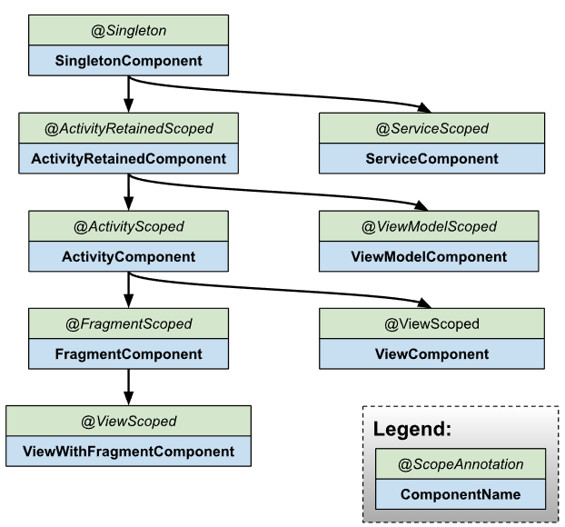

# Table of Contents
[[toc]]

# 안드로이드 의존성 주입 라이브러리들
안드로이드에서 사용하는 대표적인 의존성 주입 라이브러리는 세 가지 입니다.
- `Koin`
- `Dagger 2`
- `Hilt`

`Koin`은 코틀린 환경에서 사용할 수 있는 의존성 주입 라이브러리 입니다. 다른 의존성 주입 라이브러리에 비해 상대적으로 배우고 쉽습니다. 그러나 `Koin`은 런타임에 리플렉션을 통해 의존성을 주입해주므로 성능이 저하될 수 있습니다.

`Dagger`나 `Hilt`는 의존성 주입에 어노테이션을 사용합니다. 어노테이션은 컴파일 타임에 코드로 변환되므로 컴파일 타임은 길어질 수 있으나 런타임에 성능이 저하되지 않습니다. 따라서 큰 규모의 프로젝트에서는 `Dagger`나 `Hilt`가 권장됩니다.


## 설정
먼저 `hilt-android-gradle-plugin` 플러그인을 프로젝트 수준의 `build.gradle` 파일에 추가합니다.
``` groovy
// 프로젝트 수준의 build.gradle

buildscript {
    ...
    dependencies {
        ...
        classpath 'com.google.dagger:hilt-android-gradle-plugin:$hilt_version'
    }
}
```
그 다음 모듈 수준의 `build.gradle` 파일 상단에 `hilt-android-gradle-plugin` 플러그인을 적용합니다.
``` groovy
// 모듈 수준의 build.gradle
apply plugin: 'dagger.hilt.android.plugin'

android { 
    // ..
}
```
마지막으로 다음 종속성을 추가합니다.
``` groovy
// 모듈 수준의 build.gradle
dependencies {
    implementation "com.google.dagger:hilt-android:$hilt_version"
    kapt "com.google.dagger:hilt-android-compiler:$hilt_version"
}
``` 

`Hilt`는 `자바 8`를 사용하므로 `자바 8` 사용을 설정합니다.
``` groovy
// 모듈 수준의 build.gradle
android { 
    compileOptions {
        sourceCompatibility JavaVersion.VERSION_1_8
        targetCompatibility JavaVersion.VERSION_1_8
    }   
    // ... 
}
```

## 사용 방법
### @HiltAndroidApp
`Hilt`를 사용하려면 `Application`를 정의하고 `@HiltAndroidApp` 어노테이션을 추가해야합니다.
``` kotlin
// YourApp.kt

@HiltAndroidApp
class YourApp : Application() {
    // ...
}
```
`@HiltAndroidApp`을 추가하면 `Singleton Component`가 생성됩니다. `Component`는 스프링의 `IoC Container`와 유사하며, 주입할 객체를 관리하고 필요한 곳에 주입하는 역할을 합니다. `Singleton Component`는 앱 전체의 생명주기와 함께하며 단일 객체로 유지되는 `Component`입니다. `Singleton Component`에 설치한 의존성은 앱 어디에서든 주입받을 수 있게됩니다. 참고로 `Component`는 의존성을 주입해준다는 점에서 `Injector`라고도 불립니다.

### @AndroidEntryPoint
`Hilt`는 여러 의존성을 관리하고 적절하게 주입해줍니다. `Hilt`로 부터 의존성 주입을 받으려면 `@AndroidEntryPoint` 어노테이션을 추가해야합니다.

`@AndroidEntryPoint`는 다음과 같은 안드로이드 클래스에 추가할 수 있습니다.
- `Application`
- `Activity`
- `Fragment`
- `View`
- `Service`
- `BroadcaseReceiver`

예제를 살펴보겠습니다. `YourActivity`에 `@AndroidEntryPoint`를 추가합시다.
``` kotlin
// YourActivity.kt

@AndroidEntryPoint
class YourActivity : AppCompatActivity() {
    // ...
}
```
액티비티에 `@AndroidEntryPoint`를 추가하면 `ActivityComponent`가 생성됩니다. 

참고로 생성된 `Component`들은 아래와 같은 계층구조를 갖습니다. 

따라서 `SingletonComponent`의 하위에 `ActivityComponent`가 그래프의 형태로 생성됩니다. 또한 `SingletonComponent`에 설치한 모듈에 포함된 의존성은 `ActivityComponent`에서도 사용할 수 있습니다. (즉, 부모 `Component`에 설치한 의존성은 자식 `Component`에서 사용할 수 있습니다.)

###  의존성 주입
이제 `ThemeManager` 객체를 `YourActivity`에 주입하려고 합니다.
``` kotlin
// ThemeManager.kt

class ThemeManager constructor(
    // ..
) {
    fun isCurrentThemeDark(): Boolean {
        // ..
    }

    fun applyDarkTheme() {
        // ..
    }

    fun applyLightTheme() {
        // ..
    }
}
``` 

``` kotlin
// YourActivity.kt

@AndroidEntryPoint
class YourActivity : AppCompatActivity() {

    // 이 곳에 ThemeManager의 객체를 주입하려고 한다.
    lateinit var themeManager: ThemeManager

    // ..
}
```
의존성을 주입하려면 주입할 객체를 `Hilt`에 등록해야합니다. 이를 위해 `ThemeManager`의 생성자 앞에 `@Inject` 어노테이션을 추가하면 됩니다. 이 객체는 `Component`에 설치됩니다.
``` kotlin
// ThemeManager.kt

import javax.inject.Inject

class ThemeManager @Inject constructor(
    // ..
) {
    fun isCurrentThemeDark(): Boolean {
        // ..
    }

    fun applyDarkTheme() {
        // ..
    }

    fun applyLightTheme() {
        // ..
    }
}
```
의존성을 주입받는 곳에도 `@Inject` 어노테이션을 추가합니다.
``` kotlin
// YourActivity.kt

import javax.inject.Inject

@AndroidEntryPoint
class YourActivity : AppCompatActivity() {

    @Inject lateinit var themeManager: ThemeManager

    // ..
}
```
이제 다음과 같이 주입된 객체에 접근할 수 있습니다.
``` kotlin
// YourActivity.kt

import javax.inject.Inject

@AndroidEntryPoint
class YourActivity : AppCompatActivity() {

    @Inject lateinit var themeManager: ThemeManager

    override fun onCreate(savedInstanceState: Bundle?) {
        super.onCreate(savedInstanceState)
        setContentView(R.layout.activity_main)

        // 버튼을 눌렀을 때
        toggleButton.setOnClickListener {
            if (themeManager.isCurrentThemeDark()) {
                themeManager.applyLightTheme()
            } else {
                themeManager.applyDarkTheme()
            }
        }
    }
}
```

## ViewModel 주입
`Hilt`는 `ViewModel` 주입도 지원합니다. 예를 들어 `SettingsActivity`에 `SettingsViewModel`을 주입한다고 가정합시다. 
``` kotlin
// SettingsActivity.kt

@AndroidEntryPoint
class SettingsActivity : AppCompatActivity() {

    // 뷰모델을 주입하려고 한다.
    private val settingsViewModel: SettingsViewModel = null
}
```

``` kotlin
// SettingsViewModel.kt
import javax.inject.Inject

class SettingsViewModel constructor(

): ViewModel() {
    
    fun logOut() {
        // ..
    }

    fun updateAvatarImage() {
        // ..
    }
}
```
`ViewModel`객체를 `Hilt`에 등록할 때는 `@HiltViewModel`과 `@Inject`를 사용합니다.
``` kotlin
// SettingsViewModel.kt

import dagger.hilt.android.lifecycle.HiltViewModel
import javax.inject.Inject

@HiltViewModel
class SettingsViewModel @Inject constructor(

): ViewModel() {
    
    fun logOut() {
        // ..
    }

    fun updateAvatarImage() {
        // ..
    }
}
```
액티비티에서는 다음과 같이 의존성을 주입받을 수 있습니다.
``` kotlin
// SettingsActivity.kt

import androidx.activity.viewModels

@AndroidEntryPoint
class SettingsActivity : AppCompatActivity() {

    private val settingsViewModel: SettingsViewModel by viewModels()

    // ..
}
```
`by viewModels()`를 사용하면 `ViewModelProvider`를 사용하지 않고도 뷰모델을 지연 생성할 수 있습니다. 다만 `by viewModels()`를 사용하려면 다음과 같이 [`Android KTX`](https://developer.android.com/kotlin/ktx?hl=ko) 의존성을 추가해야합니다.

``` groovy
// 모둘 수준의 build.gradle
<!-- tab groovy -->
dependencies {
    implementation 'androidx.activity:activity-ktx:$activity_ktx_version'
    implementation 'androidx.fragment:fragment-ktx:$fragment_ktx_version'
}
```

##  모듈
때로는 주입하려는 클래스의 생성자 앞에 `@Inject`를 붙일 수 없는 경우가 있습니다. 이러한 경우 `모듈(Module)`을 사용할 수 있습니다.

### 외부 라이브러리의 객체를 주입
외부 라이브러리에서 제공하는 클래스는 직접 코드를 수정할 수 없습니다. 따라서 필요한 생성자 앞에 `@Inject`를 붙일 수도 없습니다. 이러한 경우 모듈을 사용할 수 있습니다.

우선 모듈은 `@Module` 어노테이션을 통해 정의합니다.
``` kotlin
// RepositoryModule.kt

@Module
object AnalyticsModule {
    // ..
}
```

그 다음은 `@InstallIn()`을 통해 의존성을 주입할 안드로이드 클래스를 지정합니다. `@InstallIn(SingletonComponent::class)`로 설정하면 `SingletonComponent`에 모듈을 설치하므로 앱 어디에서는 의존성을 주입받을 수 있습니다.
``` kotlin
// RepositoryModule.kt
@Module
@InstallIn(SingletonComponent::class)
object AnalyticsModule {
    // ..
}
```
이제 `@Provides`를 붙인 `provides 함수`를 정의합니다. `provides 함수`에는 의존성을 어떻게 제공할지를 명시합니다.
``` kotlin
// RepositoryModule.kt

@Module
@InstallIn(SingletonComponent::class)
object AnalyticsModule {

    @Provides
    fun provideAnalyticsService(
        // Potential dependencies of this type
    ): AnalyticsService {
        return Retrofit.Builder()
            .baseUrl("https://example.com")
            .build()
            .create(AnalyticsService::class.java)
    }
}
```


### 인터페이스에 구현체 주입
모듈은 인터페이스에 구현체를 삽입하는 때도 유용하게 사용됩니다. 다음과 같이 `SessionRepository`인터페이스와 구현체 `SessionRepositoryImpl`클래스가 있다고 가정합시다.
``` kotlin
// SessionRepository.kt

interface SessionRepository {
    fun logIn(): LogInResult
}
```
``` kotlin
// SessionRepositoryImpl.kt
class SessionRepositoryImpl @Inject constructor(

) {
    override fun logIn(): LogInResult {
        // ..
    }
}
```
이제 `LogInUseCase`의 생성자에 `SessionRepositoryImpl`객체를 주입하려고 합니다.
``` kotlin
// LogInUseCase.kt
class LogInUseCase constructor(
    // SessionRepository 타입의 변수에 SessionRepositoryImpl 객체를 주입하려고 합니다.
    private val sessionRepository: SessionRepository
) {
    fun execute() {
        // ..
    }
}
```

이 경우에도 모듈을 사용할 수 있습니다.
``` kotlin
// RepositoryModule.kt
@Module
@InstallIn(SingletonComponent::class)
abstract class RepositoryModule {
    // ...
}
```
인터페이스에 구현체를 제공할 때는 `@Provides` 대신 `@Binds`를 사용하는 `binds 함수`를 정의합니다.
``` kotlin
// RepositoryModule.kt
@Module
@InstallIn(SingletonComponent::class)
abstract class RepositoryModule {

    @Binds
    abstract fun bindSessionRepository(sessionRepositoryImpl: SessionRepositoryImpl): SessionRepository
    // SessionRepository 인터페이스 타입의 변수에 SessionRepositoryImpl 객체를 주입한다.
}
```
참고로 `@Singleton`어노테이션을 추가하면 객체를 싱글톤으로 유지할 수 있습니다.
``` kotlin
// RepositoryModule.kt
@Module
@InstallIn(SingletonComponent::class)
abstract class RepositoryModule {

    @Binds
    @Singleton
    abstract fun bindSessionRepository(sessionRepositoryImpl: SessionRepositoryImpl): SessionRepository
}
```

### UseCase 객체 주입
`Clean Architecture`에서는 `UseCase`를 `ViewModel`에 주입합니다.
``` kotlin
// SettingsViewModel.kt
@HiltViewModel
class SettingsViewModel @Inject constructor(
    private val logoutUseCase: LogoutUseCase,
    private val changePasswordUseCase: ChangePasswordUseCase
): ViewModel() {
    fun logout() {
        logoutUseCase.execute()
    }

    fun changePassword() {
        changePasswordUseCase.execute()
    }
}
```
`UseCase`는 `@Inject` 어노테이션으로 컴포넌트에 등록할 수 있습니다.
``` kotlin
// LogoutUseCase.kt
class LogoutUseCase @Inject constructor(
) {
    fun execute() {
        // logout ..
    }
}
```
반면 `@Inject` 어노테이션을 사용하지않고 직접 모듈을 정의하여 컴포넌트에 등록할 수도 있습니다.
``` kotlin
// ChangePasswordUseCase.kt
class ChangePasswordUseCase constructor(
) {
    fun execute() {
        // logout ..
    }
}
```
``` kotlin
// ChangePasswordUseCase.kt
@Module
@InstallIn(ViewModelComponent::class)
object UseCaseModule {

    @Provides
    fun provideChangePasswordUseCase(sessionRepository: SessionRepository): ChangePasswordUseCase {
        return ChangePasswordUseCase(sessionRepository)
    }
}
```
모듈을 `ViewModelComponent`에 설치했으므로 `ChangePasswordUseCase`객체는 `ViewModel`에서만 주입받을 수 있게됩니다.
