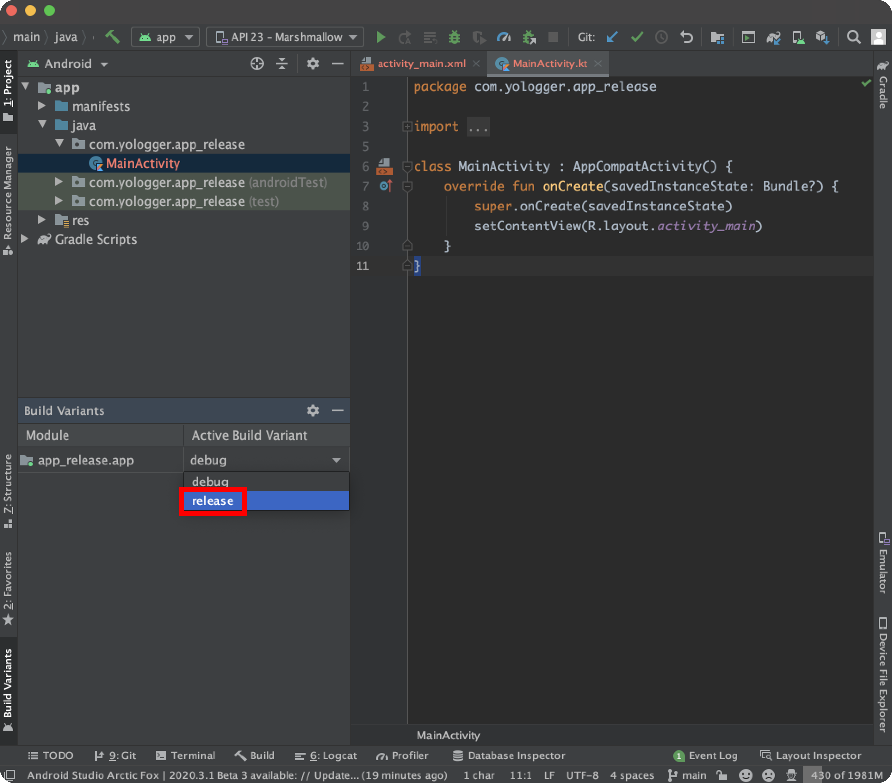
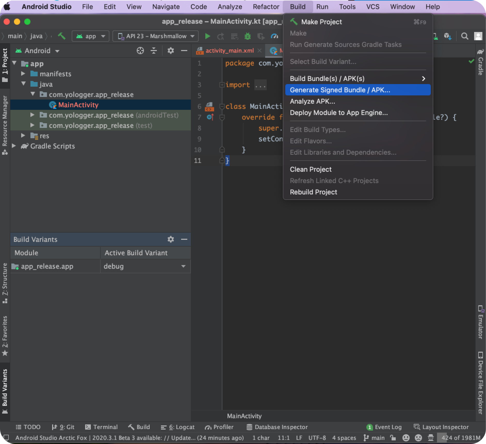
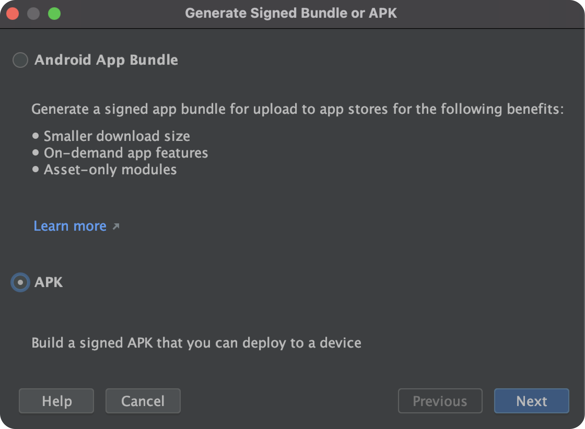
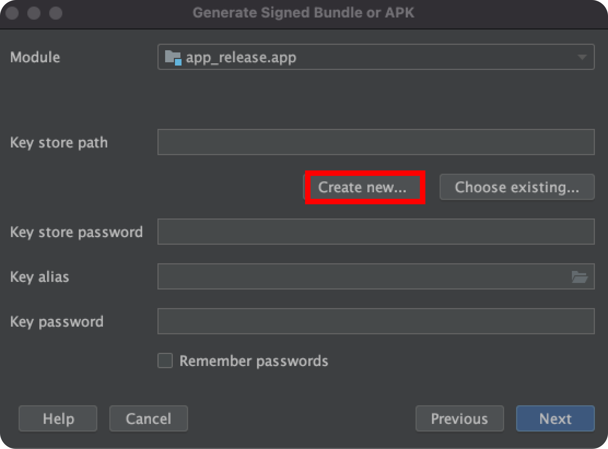
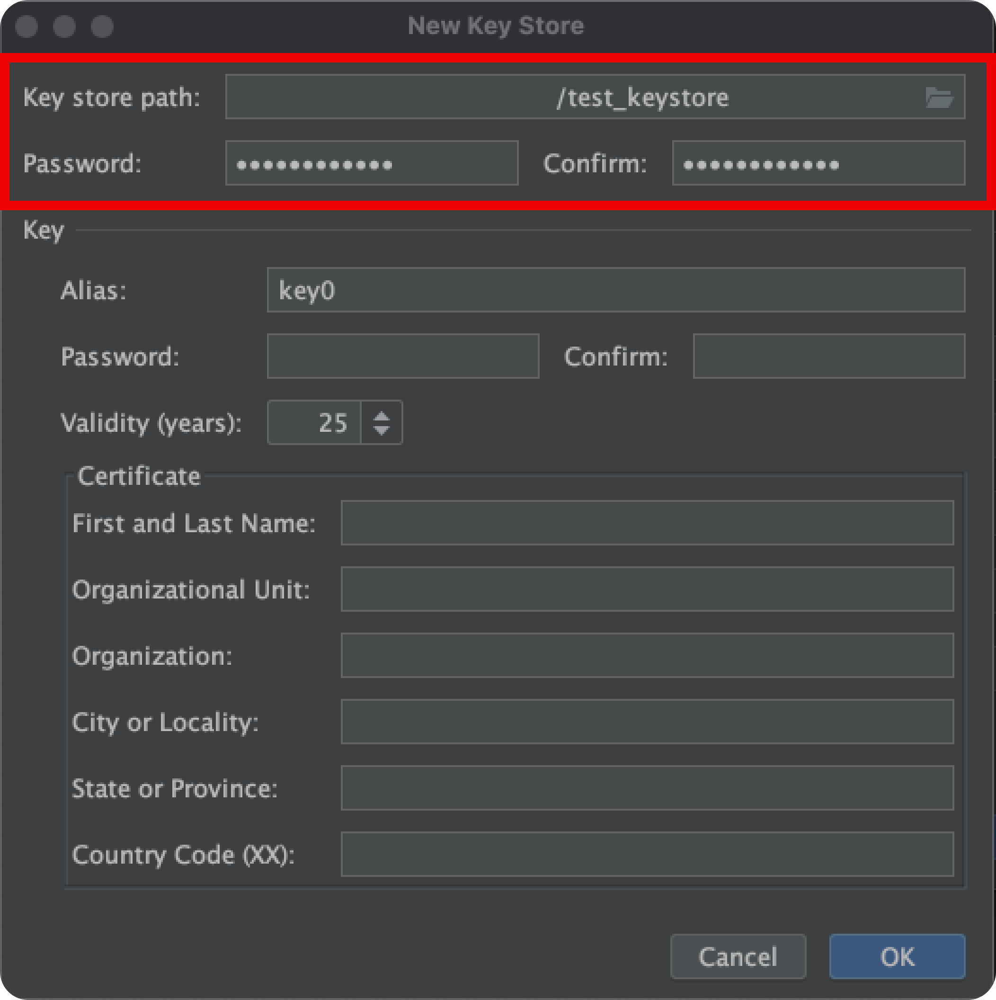
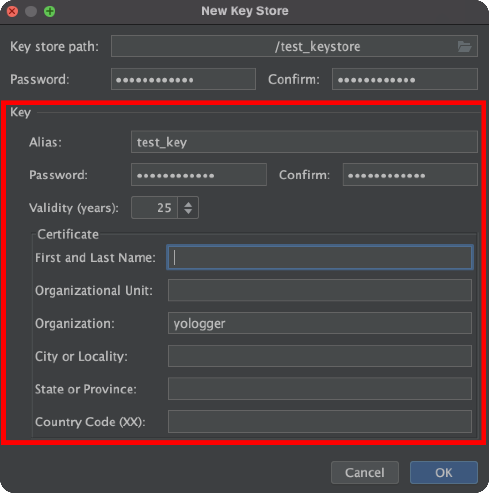
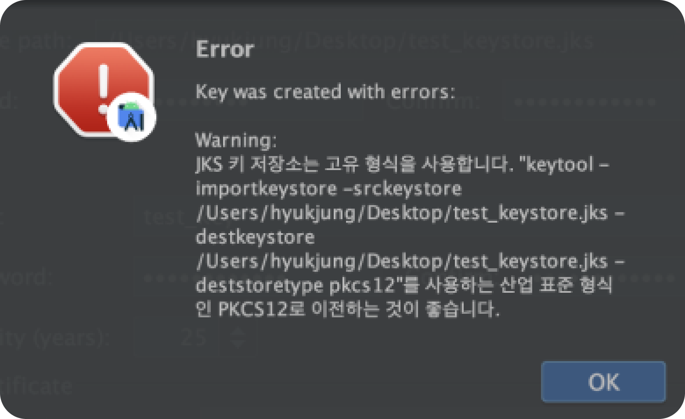
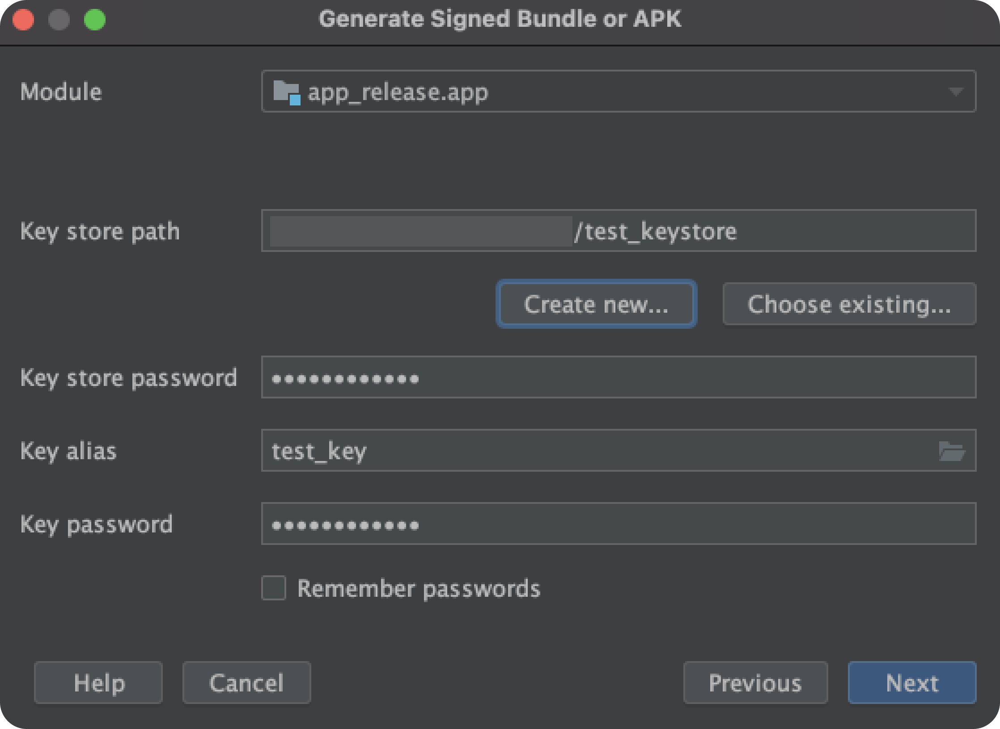
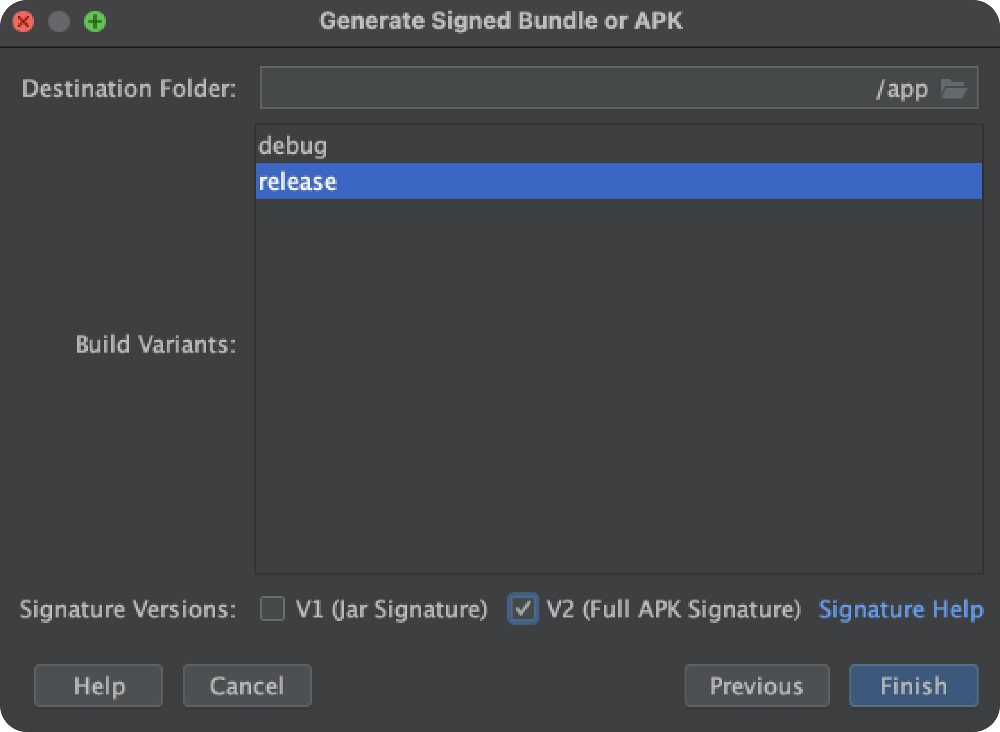
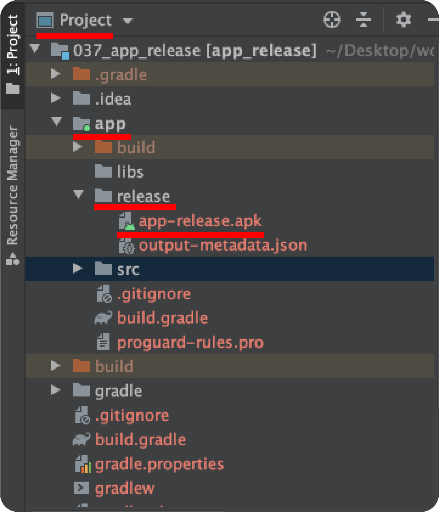

# Table of Contents
[[toc]]

---

# 서명된 릴리즈 APK 파일
구글 플레이스토어에 앱을 출시하는 과정은 보통 다음과 같습니다.
1. 디버그 모드 대신 릴리스 모드로 변경
1. 개인 키를 사용하여 앱에 서명하고 빌드하여 APK 파일 생성
1. 구글 플레이스토어에 서명된 APK 파일 업로드


### 디버그 모드
애플리캐이션 개발 단계에서는 보통 `디버그 모드`로 앱을 빌드하고 실행합니다. 

안드로이드 스튜디오는 디버그 모드일 때 디버그용 키를 사용하여 자동으로 앱에 서명합니다. 따라서 에뮬레이터나 연결된 실제 기기에 앱을 설치하고 실행할 때 별도의 서명 정보를 입력할 필요가 없습니다.

::: tip
안드로이드 스튜디오는 프로젝트를 처음 실행하면 디버그용 키를 자동으로 생성합니다. 이 키가 저장된 <b>키 스토어</b>의 위치는 `$HOME/.android/debug.keystore`입니다.
:::

``` 
$ cd ~/.android

$ ls
debug.keystore
...
```
디버그용 키는 설계상 보안이 유지되지 않습니다. 따라서 구글 플레이스토어를 포함한 대부분의 앱 스토어는 디버그용 키로 서명한 앱을 게시하는 것을 허용하지 않습니다.

## 릴리즈 모드
플레이스토어에 앱을 출시하려면 서명된 APK 파일을 업로드 해야합니다. 서명된 APK 파일을 생성하려면 `빌드 타입`를 릴리즈 모드로 변경해야합니다.


## 키스토어 및 키 생성
앱을 빌드하고 `개인 키`로 서명하면 서명된 APK 파일이 생성됩니다. 이 개인 키가 저장되는 곳은 `키 스토어(Key Store)`라고 합니다.

`Build > Generate Signed APK` 메뉴로 들어갑니다.


대화 상자에서 APK를 선택합니다.


먼저 `키 스토어(Key Store)`를 생성합시다. `Create new`버튼을 클릭합니다. 만약 이전에 키 스토어를 만들었다면 `Choose existing`버튼을 클릭하여 기존의 키 스토어를 사용합니다.

`New Key Store` 대화상자는 두 개의 섹션으로 나뉘어 있습니다. 첫 번째 섹션은 키 스토어 파일과 관련있습니다. 키 스토어를 생성한 적이 없다면 키 스토어 파일의 위치와 비밀번호를 입력하여 생성합니다.

두 번째 섹션은 키 스토어에 저장될 `개인 키`와 관련있습니다. 별칭(Alias), 비밀번호, 유효기간은 필수로 입력해야합니다. 나머지 필드는 최소 하나의 필드에 정보를 입력합니다. 

간혹 다음과 같은 경고 문구가 발생합니다. 특정 형식의 사용을 권장하는 경고문인데 서명하는데 아무 지장없으므로 무시합니다.

정보가 제대로 입력되었는지 확인하고 `Next`버튼을 누릅니다.

`Destination Folder`에서는 APK 파일이 생성될 경로를 지정합니다. 기본값은 프로젝트의 `app`폴더입니다. `Build Variants`는 `release`를 선택합니다. `Signature Version`은 `V2`를 선택하고 `Finish`버튼을 누릅니다.

이제 `app`폴더를 확인해봅시다. `[your_project]/app/release` 폴더 안에 서명된 APK 파일이 생성되었습니다.
