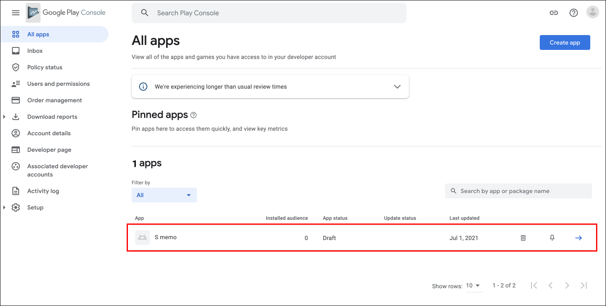

# Table of Contents
[[toc]]

## 소프트웨어 출시 과정
소프트웨어는 출시되기 전 많은 테스트를 거칩니다.

### 알파 테스트
알파 테스트는 회사 <u>내부</u>에서 진행하는 테스트입니다. `내부 테스트`라고도 하며 보통 개발팀이나 품질관리팀에서 실시합니다. 

### 베타 테스트
베타 테스트는 회사 <u>외부</u>에서 진행하는 테스트입니다. 베타 테스트에는 두 종류가 있습니다.
- `클로스드 베타 테스트`: 회사가 <u>특정 테스터</u>들만 선발해서 진행하는 테스트입니다. `비공개 테스트`라고도 합니다.
- `오픈 베타 테스트`: 정식 출시 이전에 <u>모든 테스터</u>에게 진행하는 테스트입니다. `공개 테스트`라고도 합니다.

### 출시
소프트웨어가 모든 테스트를 통과하면 구글 플레이스토어에 출시합니다.

## 개발자 계정 만들기
앱을 테스트하거나 구글 플레이스토어에 출시하려면 `구글 개발자 계정`을 만들어야 합니다. [이 곳](http://play.google.com/apps/publish/signup)에 방문하여 구글 개발자 계정을 생성합니다. (현재는 미화로 25달러를 결제해야하며, 한번 결제 시 평생 이용할 수 있습니다.)

## 안드로이드 내부 테스트
안드로이드에서는 알파 테스트보다 `내부 테스트`라는 용어를 더 많이 사용합니다. 내부 테스트는 최대 <u>100</u>명의 테스터에게 앱을 배포할 수 있습니다. 보통 회사 내부의 개발팀이나 품질관리팀 등 <u>회사 내부</u> 인원에게 앱을 배포합니다.

이제 `내부 테스트` 절차에 대해 알아보겠습니다.

### 구글 플레이 콘솔에 앱 생성하기

`구글 플레이 콘솔 > All apps > Create app`을 선택합니다.

`App details`의 하위 항목을 입력합니다.

- `App name`: 플레이 스토어에 출시되는 앱 이름
- `Default launguage`: 기본 언어
- `App or game`: 게임 앱인 경우 game, 그 외에는 App 
- `Free or paid`: 무료 앱인 경우 free, 유료 앱인 경우 paid (무료 선택 시 추후에 유료로 변경할 수 없습니다.)

`Declarations`의 하위 항목을 모두 체크합니다.

- `Developer Program Policies`: 개발자 프로그램 정책에 동의
- `US export laws`: 미국 수출법규에 동의

`구글 플레이 콘솔 > All apps`을 선택하면 생성한 앱을 확인할 수 있습니다.

### 진행상황 확인
앱을 테스트하거나 출시하려면 앱에 대한 정보를 입력해야합니다. `구글 플레이 콘솔 > All apps`에서 생성한 앱을 선택합니다.

왼쪽 사이드 바 메뉴에서 `Dashboard`를 선택합니다. `Dashboard`에서는 앱을 테스트하거나 출시하기위해 입력해야하는 항목들을 확인할 수 있습니다. 항목은 크게 세 가지로 구성되어있습니다.
- Start testing now
- Set up your app
- Release your app

`View tasks`를 누르면 아래 사진처럼 더 자세한 업무들을 확인할 수 있습니다.

완료된 업무는 옆에서 초록색 완료 아이콘을 확인할 수 있습니다.

::: tip
내부 테스트 용 앱은 App access, Ads, Content rating 같은 앱 정보를 입력하지 않아도 출시할 수 있습니다. 그러나 <b>비공개 테스트</b>, <b>공개 테스트</b>, <b>정식 출시</b>는 앱 정보를 입력해야만 출시할 수 있습니다.
:::

### 테스터 선택
`Start testing now`항목에서 `Select testers`를 선택합니다.

내부 테스트는 최대 100명의 테스터를 선택할 수 있습니다. `Feedback URL or email address`에는 테스터로부터 피드백 받을 이메일을 입력합니다. 이후 `Create email list`을 클릭하여 테스터의 이메일을 입력합니다.

테스터의 이메일을 추가하고 `Save changes`를 선택합니다.

::: tip
테스터의 이메일은 구글 계정만 가능합니다.
:::

### 새로운 릴리즈 생성
`Dashboard`로 돌아와서 `Start testing now > Create a new release`를 선택합니다.

다시 한번 `Create a new release`를 선택합니다.

이전 포스트에서 생성한 서명된 APK 파일을 업로드합니다.

`Release name`과 `Release notes`를 입력하고 `Save`버튼과 `Review release`버튼을 순서대로 클릭합니다.

항목이 제대로 입력되었는지 확인하고 `Start rollout to internal testing`버튼을 클릭합니다.

### 테스트 참여 URL
구글의 심사는 몇 시간에서 며칠이 소요될 수 있습니다. 앱이 심사 중이면 다음과 같이 `In review`로 표시됩니다.

심사가 끝나면 `Available to internal testers`로 상태가 변합니다.

심사가 끝나면 테스터 참여 URL이 발급되며 이를 테스터에게 전달할 수 있습니다. `구글 플레이 콘솔 > 왼쪽 메뉴 바 > All app`에서 본인이 알파 출시한 앱을 선택합니다.

`왼쪽 메뉴 바 > Testing > Internal testing`으로 이동합니다.

`Testers`탭에서 `Join on the web`의 `Copy link`를 클릭하여 앱 설치 주소를 복사할 수 있습니다.

### 앱 설치
복사한 링크를 테스터에게 전달하면 테스터는 앱을 설치하고 테스트할 수 있습니다. `ACCEPT INVITATION`을 클릭합니다.

`download it on Google Play`를 클릭합니다.

`Install`버튼을 클릭하면 내부 테스트용 앱이 설치됩니다.

테스터 선택에서 추가하지 않은 구글 계정은 앱을 설치하고 테스트할 수 없습니다.

### 내부 테스트 일시중지
`왼쪽 사이드바 메뉴 > Testing > Internal testing`으로 이동하여 `Pause track`을 클릭하면 내부 테스트를 일시중지할 수 있습니다. 내부 테스트를 일시중지하면 테스터들은 더 이상 앱을 테스트할 수 없습니다.

`Resume track`을 클릭하면 알파 테스트를 재개할 수 있습니다.
