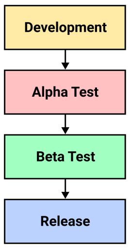
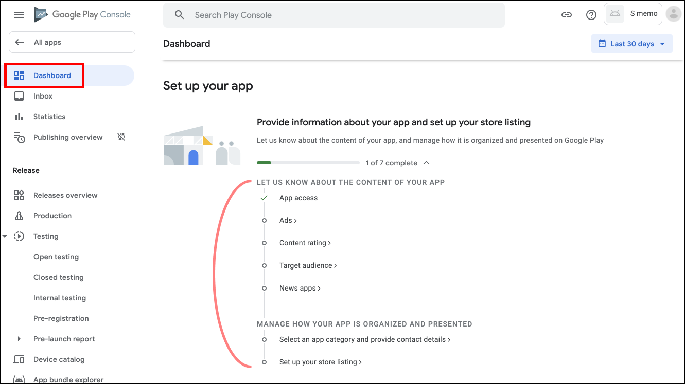
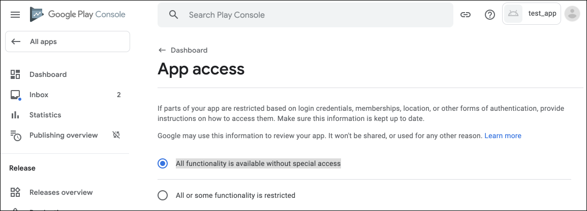

[[toc]]

## 소프트웨어 출시 과정
소프트웨어는 출시되기 전 많은 테스트를 거칩니다.

### 알파 테스트
알파 테스트는 회사 <u>내부</u>에서 진행하는 테스트입니다. `내부 테스트`라고도 하며 보통 개발팀이나 품질관리팀에서 실시합니다. 

### 베타 테스트
베타 테스트는 회사 <u>외부</u>에서 진행하는 테스트입니다. 베타 테스트에는 두 종류가 있습니다.

- `클로스드 베타 테스트`: 회사가 <u>특정 사용자</u>들만 선발해서 진행하는 테스트입니다. `비공개 테스트`라고도 합니다.

- `오픈 베타 테스트`: 정식 출시 이전에 <u>모든 사용자</u>에게 진행하는 테스트입니다. `공개 테스트`라고도 합니다.

### 출시
소프트웨어가 모든 테스트를 통과하면 시장에 출시합니다.

## 개발자 계정 만들기
앱을 테스트하거나 구글 플레이스토어에 출시하려면 `구글 개발자 계정`을 만들어야 합니다. [이 곳](http://play.google.com/apps/publish/signup)에 방문하여 구글 개발자 계정을 생성합니다. (현재는 미화로 25달러를 결제해야하며, 한번 결제 시 평생 이용할 수 있습니다.)

## 안드로이드 비공개 테스트
안드로이드에서는 클로스드 베타 테스트보다 `비공개 테스트`라는 용어를 더 많이 사용합니다. 회사 <u>외부</u>에서 신뢰할 만한 테스터를 선정하여 앱을 배포합니다. 내부 테스트보다 더 많은 테스터를 선발할 수 있습니다.

이제 `비공개 테스트` 절차에 대해 알아보겠습니다.

### 기존의 내부 테스트를 비공개 테스트로 업그레이드
만약 `내부 테스트` 중인 앱이 있다면 비공개 테스트로 업그레이드할 수 있습니다. 

::: tip
내부 테스트 중인 앱이 없다면 <b>`구글 플레이 콘솔에 앱 생성하기`</b>로 넘어가시면 됩니다.
:::

내부 테스트 중인 앱은 `All apps > 앱 선택 > Testing > Internal testing`에서 확인할 수 있습니다.

`View release details`를 클릭합니다.

오른쪽 상단의 `Promote release`를 눌러 `비공개 테스트`로 전환할 수 있습니다. 뿐만 아니라 `공개 테스트`나 `출시`로 전환할 수도 있습니다.

### 구글 플레이 콘솔에 앱 생성하기

내부 테스트나 비공개 테스트 중인 앱이 없다면 구글 플레이 콘솔에 앱을 생성합시다. `구글 플레이 콘솔 > All apps > Create app`을 선택합니다.

`App details`의 하위 항목을 입력합니다.

- `App name`: 플레이 스토어에 출시되는 앱 이름
- `Default launguage`: 기본 언어
- `App or game`: 게임 앱인 경우 game, 그 외에는 App 
- `Free or paid`: 무료 앱인 경우 free, 유료 앱인 경우 paid (무료 선택 시 추후에 유료로 변경할 수 없습니다.)

`Declarations`의 하위 항목을 모두 체크합니다.

- `Developer Program Policies`: 개발자 프로그램 정책에 동의
- `US export laws`: 미국 수출법규에 동의

`구글 플레이 콘솔 > All apps`을 선택하면 생성한 앱을 확인할 수 있습니다.

### 비공개 테스트용 APK 업로드
`All apps > 앱 선택 > Testing > Closed testing`로 이동합니다.

`Alpha`트랙은 구글 플레이 콘솔에서 앱을 만들면 기본으로 제공되는 트랙입니다. 이 트랙을 비공개 테스트 용도로 사용할 수 있으며, 필요하다면 추가 트랙을 생성할 수 있습니다. 

추가 트랙을 생성하기 위해 `Create Track`을 클릭합니다.

트랙 이름을 입력하고 `Create Track`을 클릭합니다.

추가된 트랙을 확인한 후 오른쪽 `Manager track`을 클릭합니다.

`Create new release`를 클릭합니다.

`Upload`를 클릭하고 서명된 출시용 APK 파일을 업로드합니다.

::: tip
과거에 APK를 업로드한 적이 있다면, <b>versionCode</b> 값을 증가시켜 새롭게 빌드한 APK를 업로드해야합니다. <b>versionCode</b>는 모듈 수준의 <b>build.gradle</b>에서 수정할 수 있습니다.
:::

`Release details`항목의 `Release name`과 `Release notes`를 적절하게 입력합니다.

`Save`와 `Review Release`버튼을 순서대로 누릅니다.

### 출시할 나라 및 지역 선택
`왼쪽 사이드바 메뉴 > Testing > Closed testing`으로 이동하여 트랙을 선택합니다.

상단에서는 비공개 테스트를 위한 진행 단계를 확인할 수 있습니다.

상단의 `Select countries`나 하단의 `Countries/regions`탭을 선택합니다.

`Add countries/regions`를 선택하여 나라와 지역을 선택합니다.

### 테스터 설정하기
상단의 `Select testers`나 하단의 `Testers`탭을 클릭합니다. 그리고 `Create email list`를 클릭하여 테스터의 이메일을 추가합니다. 또한 테스터로부터 피드백 받을 이메일을 등록합니다.

### 앱 정보 입력
내부 테스트에서는 앱 정보를 입력하지 않아도 출시할 수 있습니다. 그러나 비공개 테스트부터는 앱 정보를 입력해야만 출시할 수 있습니다. `왼쪽 사이드바 메뉴 > Dashboard`로 이동하여 해야할 업무를 확인할 수 있습니다.

`App access`에서는 `All functionality is available without special access`를 체크하고 저장합니다. 특별한 접근 권한 없이 모든 이용이 가능하다는 뜻입니다.

`Ads`에서는 광고 여부를 체크합니다. 앱 내에 광고가 있으면 `Yes, my app contains adds`를, 광고가 없으면 `No, my app does not contain ads`를 선택합니다.

`Content ratings`에서는 콘텐츠의 등급을 설정합니다. `Start new questionaire`를 클릭하여 설문을 시작합니다. 

설문에서는 앱 카테고리, 앱 적합성 등을 조사합니다.

설문이 끝나면 각 국가에서의 콘텐츠 등급을 확인할 수 있습니다.

`Target audience and content`에서는 앱을 사용할 연령층과 어린이 관심 유도 여부 등을 확인합니다. 설문을 모두 완료합시다.

`News Apps`에서는 뉴스 앱인지를 체크합니다.

`App category & Contact Details`에서는 다음 항목들을 입력합니다.

- `App or Game`: 게임 앱인지 아닌지를 선택합니다.
- `Category`: 앱의 카테고리를 선택합니다.
- `Tag`: 앱의 태그를 선택합니다. 

- `Email address`: 구글 플레이스토어에 표시될 이메일 주소를 입력합니다.
- `Phone number`: 구글 플레이스토어에 표시될 전화번호를 입력합니다.
- `Website`: 구글 플레이스토어에 표시될 웹사이트 주소를 입력합니다.
- `External marketing`: 외부 마케팅 여부를 선택합니다.

`Main store listing`에서는 다음 항목들을 입력합니다.

- `App name`: 구글 플레이스토어에 표시되는 앱 이름입니다.
- `Short description`: 짧은 앱 설명문입니다.
- `Full description`: 긴 앱 설명문입니다.
- `App icon`: 구글 플레이스토어에 표시되는 앱 아이콘 이미지 (512x512px)
- `Feature graphic`: 앱을 공유했을 때 표시되는 섬네일 이미지 (1024x500px)

`Main store listing`에서는 다음 항목들도 입력합니다.

- `Phone screenshots`: 모바일 환경에서 실행한 스크린샷 이미지 2~8장 (16:9 또는 9:6 비율) 
- `7-inch Tablet screenshots`: 7인치 태블릿 환경에서 실행한 스크린샷 이미지 2~8장 (16:9 또는 9:6 비율) 
- `10-inch Tablet screenshots`: 10인치 태블릿 환경에서 실행한 스크린샷 이미지 2~8장 (16:9 또는 9:6 비율) 

### 비공개 테스트용 앱 출시
`Testing > Closed testing`으로 이동하여 트랙을 선택합니다. 

입력사항을 확인하고 `Review and roll out release`를 선택합니다.

에러나 경고가 없으면 `Start rollout to [your track name]` 버튼을 누릅니다.

### 테스트 참여 URL
구글의 심사는 몇 시간에서 며칠이 소요될 수 있습니다. 앱이 심사 중이면 다음과 같이 `In review`로 표시됩니다.

심사가 끝나면 `Available to selected testers`로 상태가 변합니다.

심사가 끝나면 테스터 참여 URL이 발급되고 이를 전달할 수 있습니다. `왼쪽 메뉴 바 > All app`에서 본인이 알파 출시한 앱을 선택합니다.

`Testing > Closed testing`으로 이동하여 트랙을 선택합니다.

`Testers`탭 하단에서 `Join on Web`의 `Copy link`를 클릭하여 테스트 참여 URL을 복사할 수 있습니다.

### 앱 설치
복사한 링크를 테스터에게 전달하면 테스터는 앱을 설치하고 테스트할 수 있습니다.

테스터 선택에서 추가하지 않은 구글 계정은 앱을 설치하고 테스트할 수 없습니다.

### 비공개 테스트 일시중지
`왼쪽 사이드바 메뉴 > Testing > Closed testing`으로 이동하여 트랙을 선택합니다.

`Pause track`을 클릭하면 비공개 테스트를 일시중지할 수 있습니다. 비공개 테스트를 일시중지하면 테스터들은 더 이상 앱을 테스트할 수 없습니다.

`Resume track`을 클릭하면 비공개 테스트를 재개할 수 있습니다.

