# Table of Contents
[[toc]]

---

# 구글 플레이스토어 앱 출시
플레이스토어에 앱을 출시하는 방법에 대해 알아보겠습니다.

## 개발자 계정 만들기
앱을 테스트하거나 구글 플레이스토어에 출시하려면 `구글 개발자 계정`을 만들어야 합니다. [이 곳](http://play.google.com/apps/publish/signup)에 방문하여 구글 개발자 계정을 생성합니다. (현재는 미화로 25달러를 결제해야하며, 한번 결제 시 평생 이용할 수 있습니다.)

## 기존 테스트를 출시하기
만약 내부 테스트, 비공개 테스트, 공개 테스트 중인 앱이 있다면 바로 출시 단계로 업그레이드할 수 있습니다.

공개 테스트에서 앱을 바로 출시하는 방법은 다음과 같습니다. `Testing > Open testing`으로 이동한 후 `View release details`를 클릭합니다.
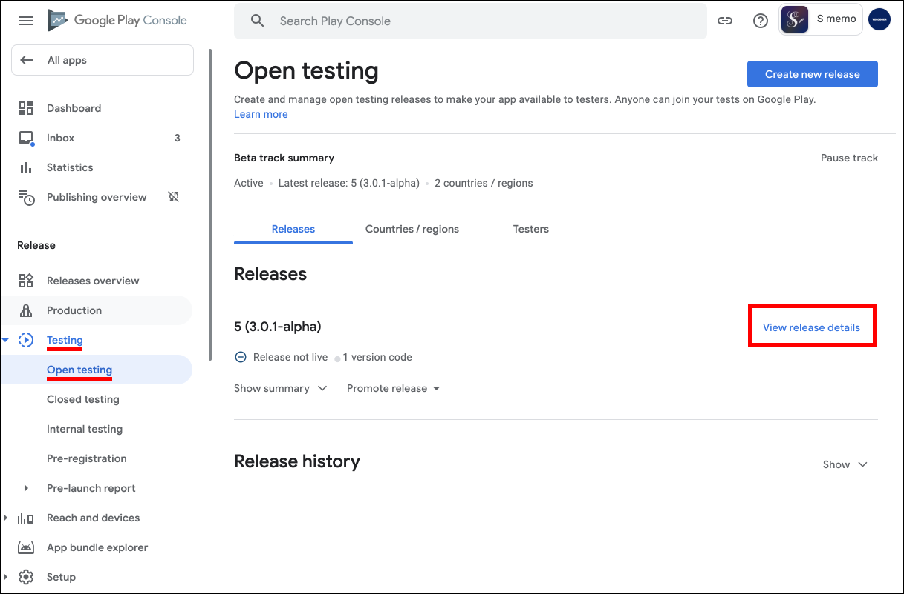
`Promote release`를 선택하고 `Production`을 클릭하면 공개 테스트에서 앱을 바로 출시할 수 있습니다.
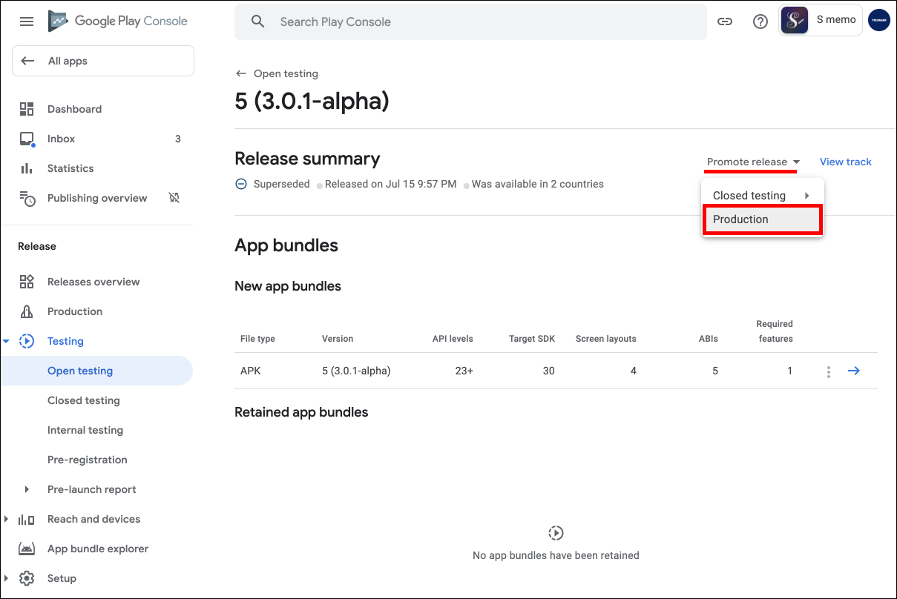

## 구글 플레이 콘솔에 앱 생성하기
내부 테스트, 비공개 테스트, 공개 테스트 중인 앱이 없다면 구글 플레이 콘솔에 앱을 생성합시다. `구글 플레이 콘솔 > All apps > Create app`을 선택합니다.

`App details`의 하위 항목을 입력합니다.

- `App name`: 플레이 스토어에 출시되는 앱 이름
- `Default launguage`: 기본 언어
- `App or game`: 게임 앱인 경우 game, 그 외에는 App 
- `Free or paid`: 무료 앱인 경우 free, 유료 앱인 경우 paid (무료 선택 시 추후에 유료로 변경할 수 없습니다.)

`Declarations`의 하위 항목을 모두 체크합니다.

- `Developer Program Policies`: 개발자 프로그램 정책에 동의
- `US export laws`: 미국 수출법규에 동의

`구글 플레이 콘솔 > All apps`을 선택하면 생성한 앱을 확인할 수 있습니다.

### 출시용 APK 업로드
`All apps > 앱 선택 > Production`로 이동합니다. 그리고 `Release dashboard`탭에서 `Create new release`를 클릭합니다.

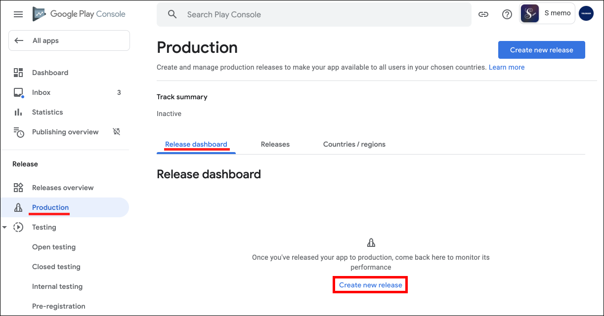

`App bundles` 항목에서 `Upload`를 클릭하여 서명된 출시용 APK를 업로드합니다.

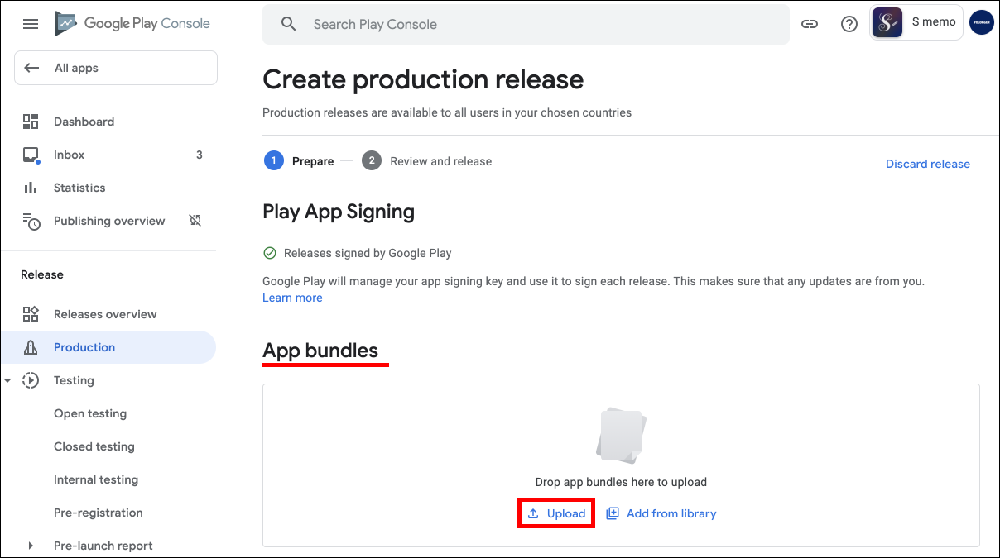

::: tip
과거에 APK를 업로드한 적이 있다면, <b>versionCode</b> 값을 증가시켜 새롭게 빌드한 APK를 업로드해야합니다. <b>versionCode</b>는 모듈 수준의 <b>build.gradle</b>에서 수정할 수 있습니다.
:::

업로드가 완료되면 다음과 같이 APK를 확인할 수 있습니다.

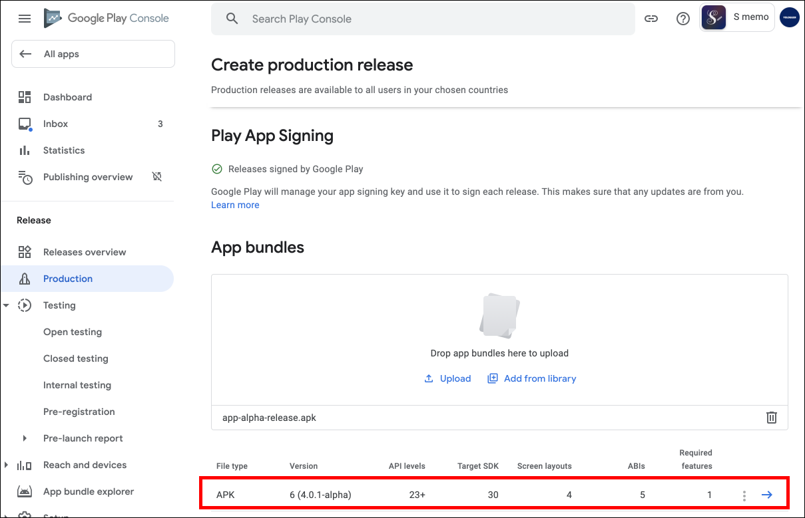

`Release details`항목의 `Release name`과 `Release notes`를 적절하게 입력하고 `Save`와 `Review Release`버튼을 순서대로 누릅니다.

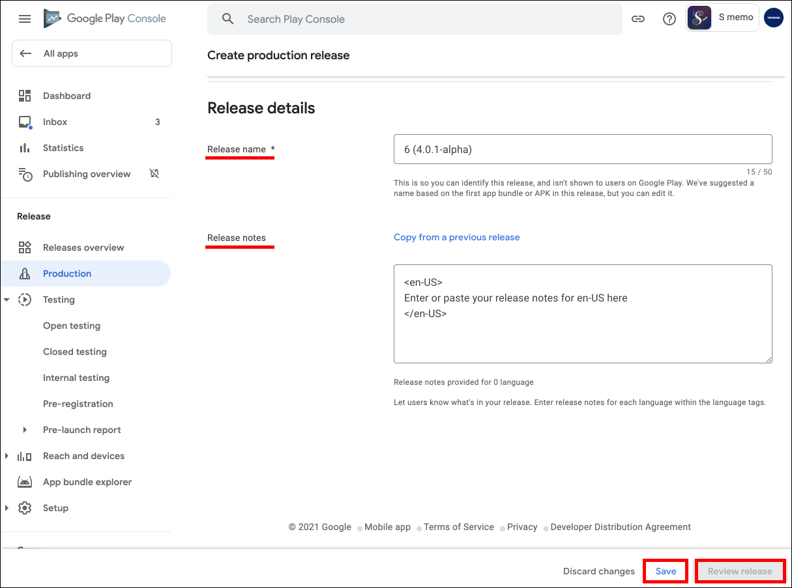

### 출시할 나라 및 지역 선택
`왼쪽 사이드바 메뉴 > Testing > Production`으로 이동한 후 `Countries/regions`탭을 선택하고 `Add countires/regions`를 클릭하여 출시할 국가를 선택합니다.

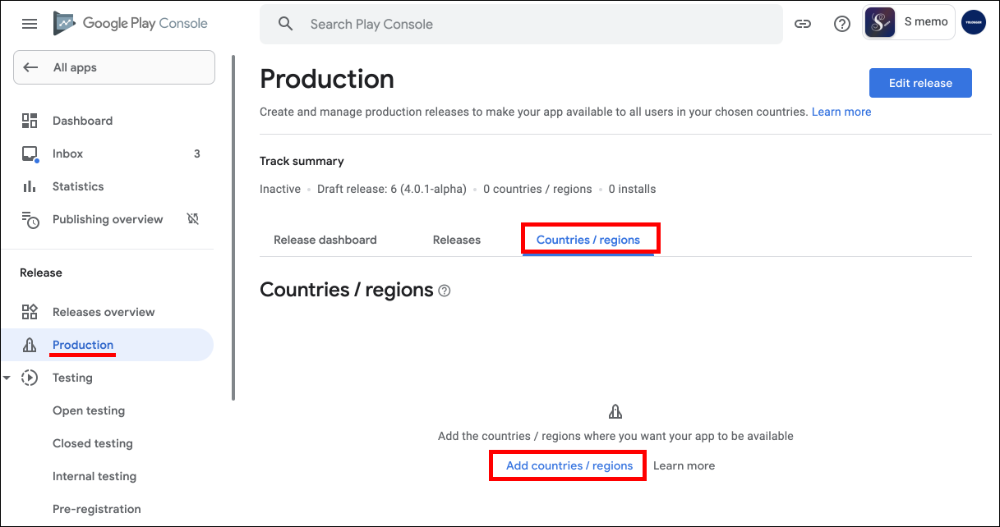

### 앱 정보 입력
내부 테스트에서는 앱 정보를 입력하지 않아도 출시할 수 있습니다. 그러나 비공개 테스트, 공개 테스트, 앱 출시는 앱 정보를 입력해야합니다. `왼쪽 사이드바 메뉴 > Dashboard`로 이동하여 해야할 업무를 확인할 수 있습니다.

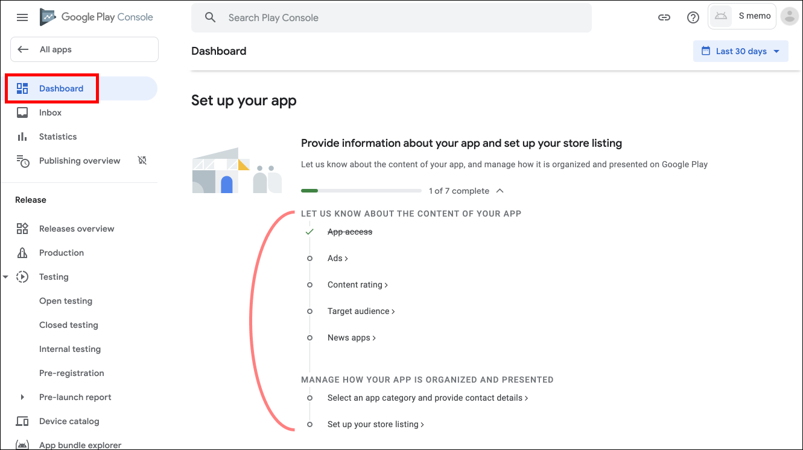

`App access`에서는 `All functionality is available without special access`를 체크하고 저장합니다. 특별한 접근 권한 없이 모든 이용이 가능하다는 뜻입니다.

`Ads`에서는 광고 여부를 체크합니다. 앱 내에 광고가 있으면 `Yes, my app contains adds`를, 광고가 없으면 `No, my app does not contain ads`를 선택합니다.
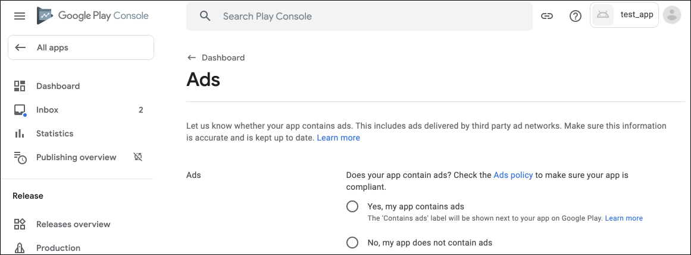

`Content ratings`에서는 콘텐츠의 등급을 설정합니다. `Start new questionaire`를 클릭하여 설문을 시작합니다. 

설문에서는 앱 카테고리, 앱 적합성 등을 조사합니다.

설문이 끝나면 각 국가에서의 콘텐츠 등급을 확인할 수 있습니다.

`Target audience and content`에서는 앱을 사용할 연령층과 어린이 관심 유도 여부 등을 확인합니다. 설문을 모두 완료합시다.

`News Apps`에서는 뉴스 앱인지를 체크합니다.

`App category & Contact Details`에서는 다음 항목들을 입력합니다.

- `App or Game`: 게임 앱인지 아닌지를 선택합니다.
- `Category`: 앱의 카테고리를 선택합니다.
- `Tag`: 앱의 태그를 선택합니다. 

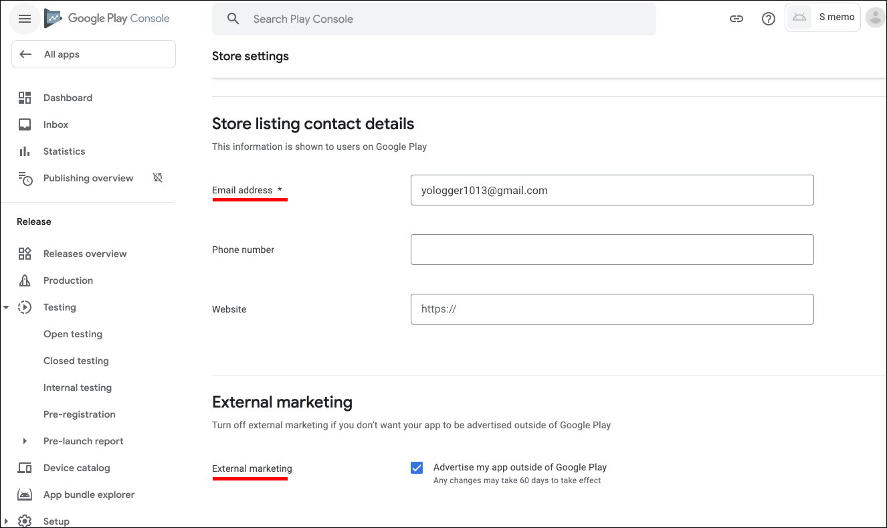

- `Email address`: 구글 플레이스토어에 표시될 이메일 주소를 입력합니다.
- `Phone number`: 구글 플레이스토어에 표시될 전화번호를 입력합니다.
- `Website`: 구글 플레이스토어에 표시될 웹사이트 주소를 입력합니다.
- `External marketing`: 외부 마케팅 여부를 선택합니다.

`Main store listing`에서는 다음 항목들을 입력합니다.

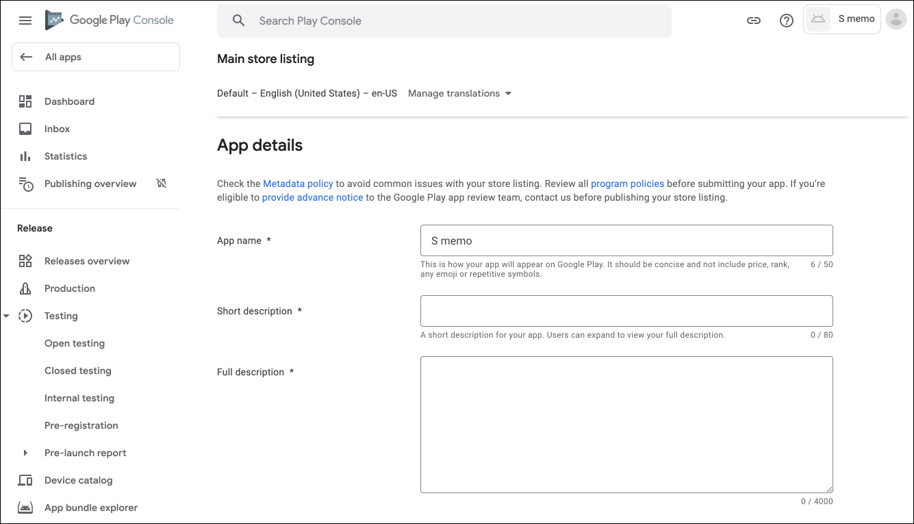

- `App name`: 구글 플레이스토어에 표시되는 앱 이름입니다.
- `Short description`: 짧은 앱 설명문입니다.
- `Full description`: 긴 앱 설명문입니다.
- `App icon`: 구글 플레이스토어에 표시되는 앱 아이콘 이미지 (512x512px)
- `Feature graphic`: 앱을 공유했을 때 표시되는 섬네일 이미지 (1024x500px)

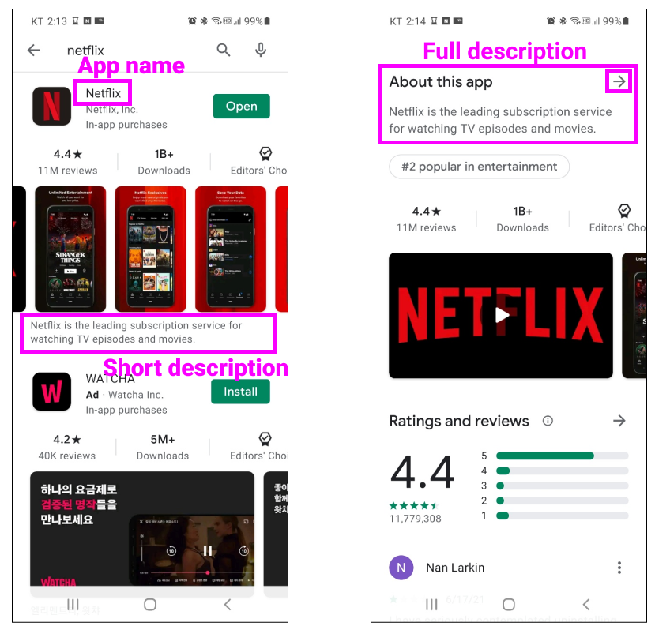

`Main store listing`에서는 다음 항목들도 입력합니다.

- `Phone screenshots`: 모바일 환경에서 실행한 스크린샷 이미지 2~8장 (16:9 또는 9:6 비율) 
- `7-inch Tablet screenshots`: 7인치 태블릿 환경에서 실행한 스크린샷 이미지 2~8장 (16:9 또는 9:6 비율) 
- `10-inch Tablet screenshots`: 10인치 태블릿 환경에서 실행한 스크린샷 이미지 2~8장 (16:9 또는 9:6 비율) 

### 앱 출시
`Production`으로 이동하여 `Edit release`를 클릭합니다.

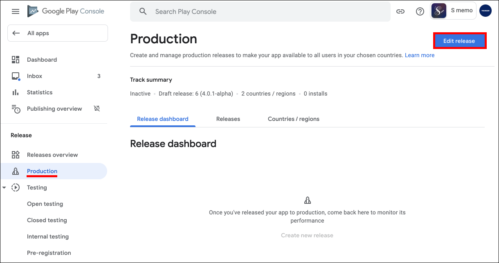

`Review release`를 클릭합니다.

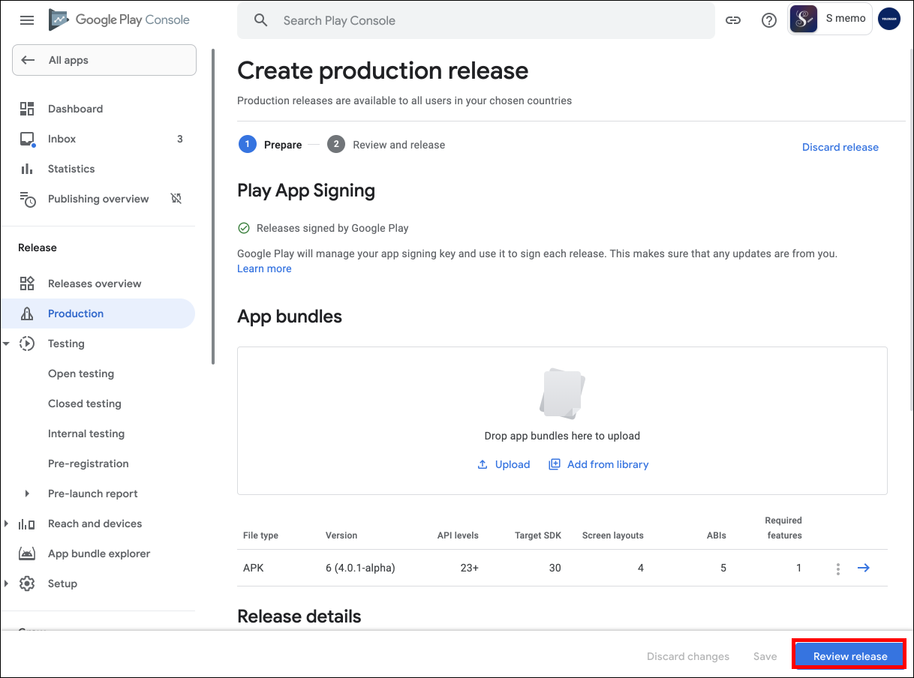

에러나 경고가 없는지 확인하고 `Start rollout to Production` 버튼을 누르면 앱이 출시됩니다.

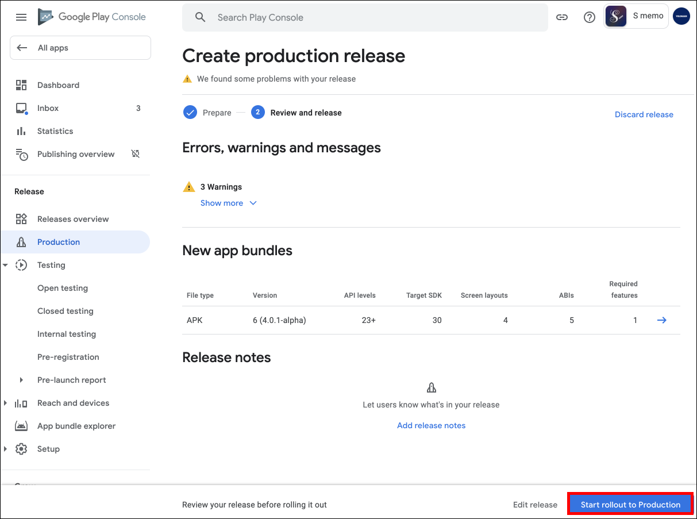

구글의 심사는 몇 시간에서 며칠이 소요될 수 있습니다. 앱이 심사 중이면 다음과 같이 `In review`로 표시됩니다.

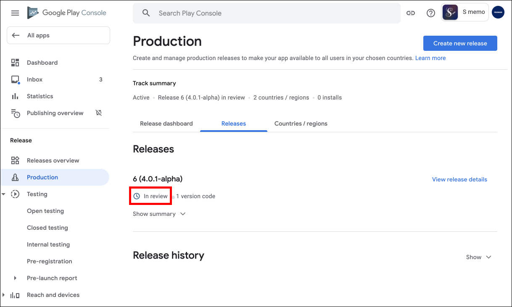

심사가 끝나면 `Available on Google Play`로 상태가 변합니다.

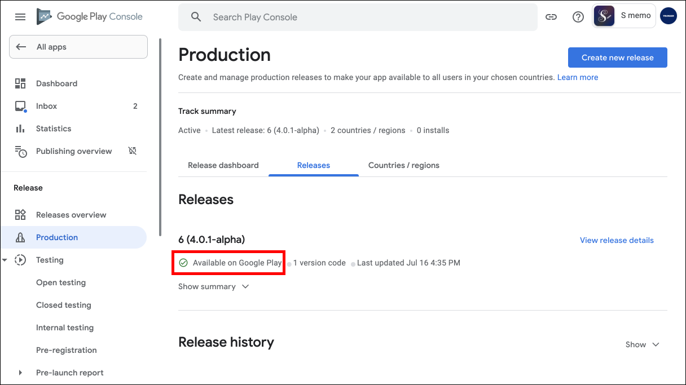

이제 구글 플레이스토어에서 앱을 다운받을 수 있습니다.

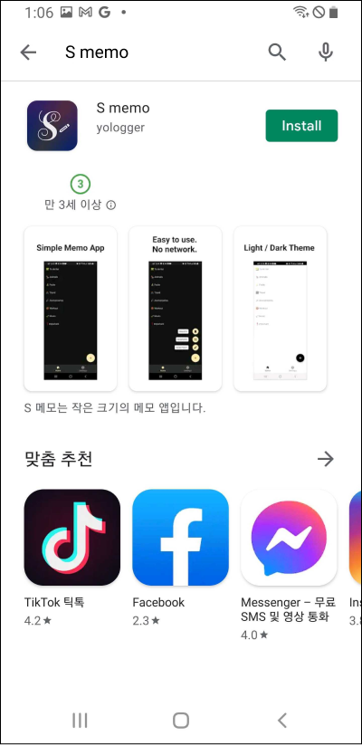

### 앱 설치 URL
출시한지 얼마되지 않거나 다운로드 수가 낮은 앱은 구글 플레이스토어에 노출되지 않을 수도 있습니다. 이 경우 앱 설치 URL을 제공할 수 있습니다.

`Google Play Console > All apps`로 이동하여 출시한 앱을 선택합니다.

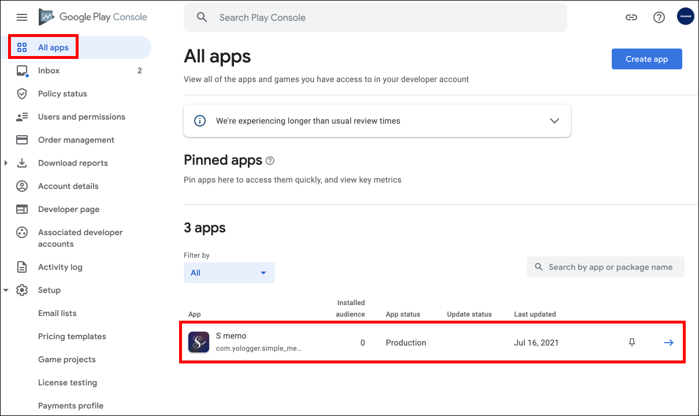

`View on Google Play`를 클릭합니다.

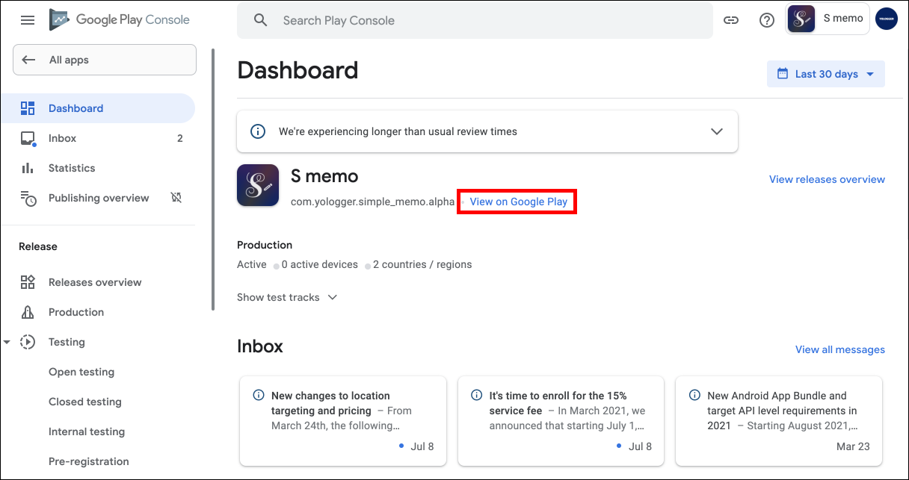

구글 플레이스토어 앱 설치 페이지로 이동합니다. 이 페이지의 URL을 제공하면 됩니다.

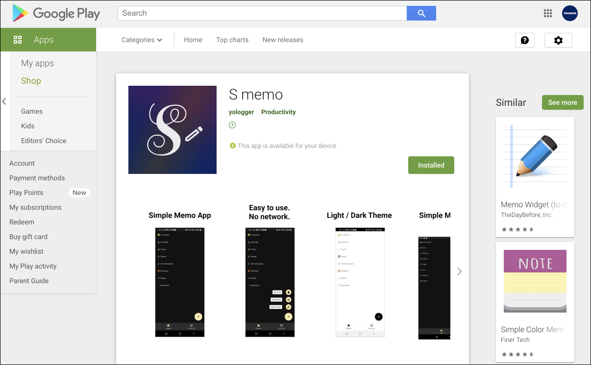