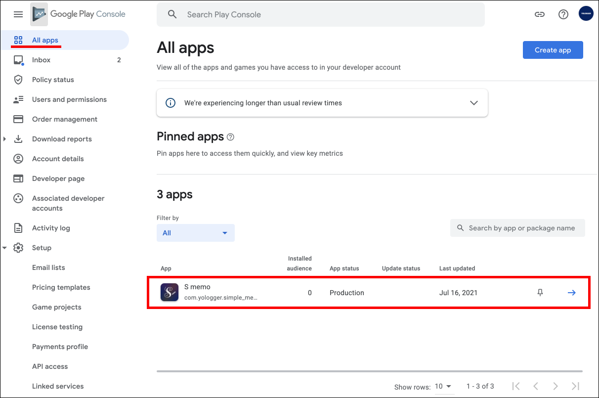
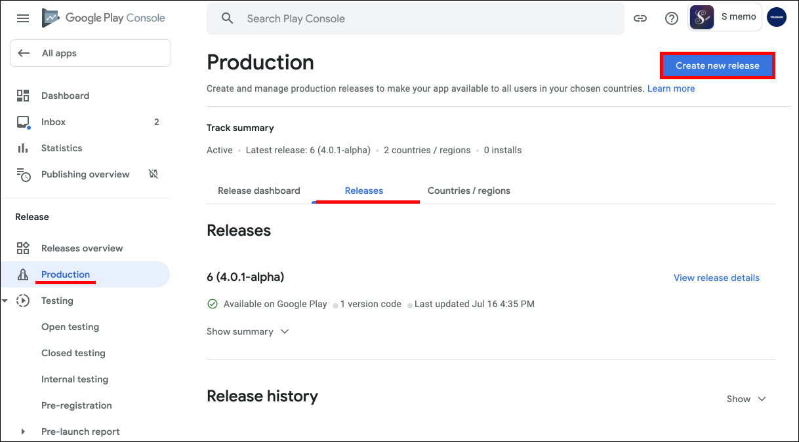
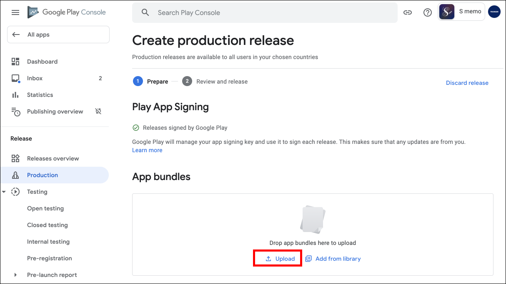
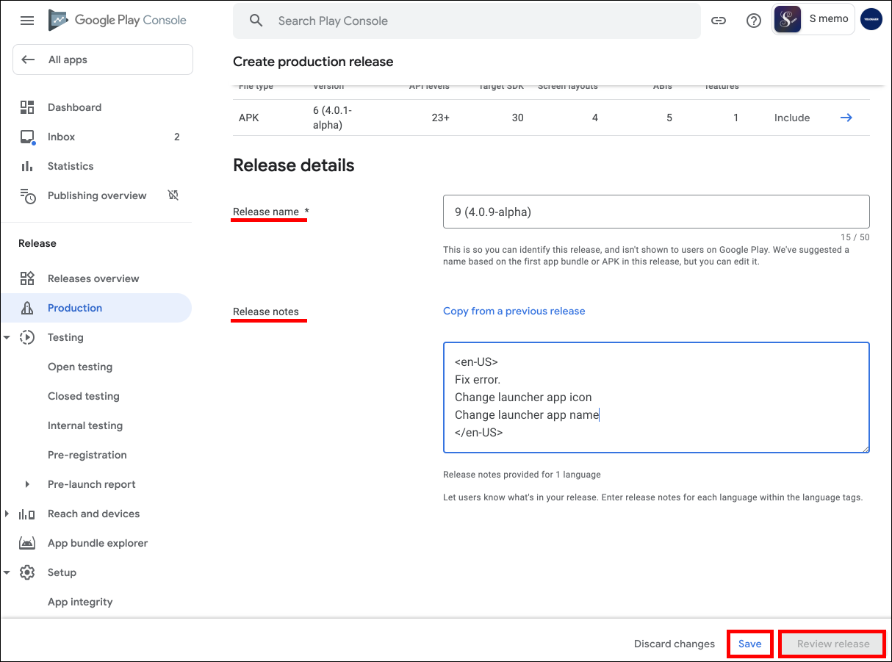
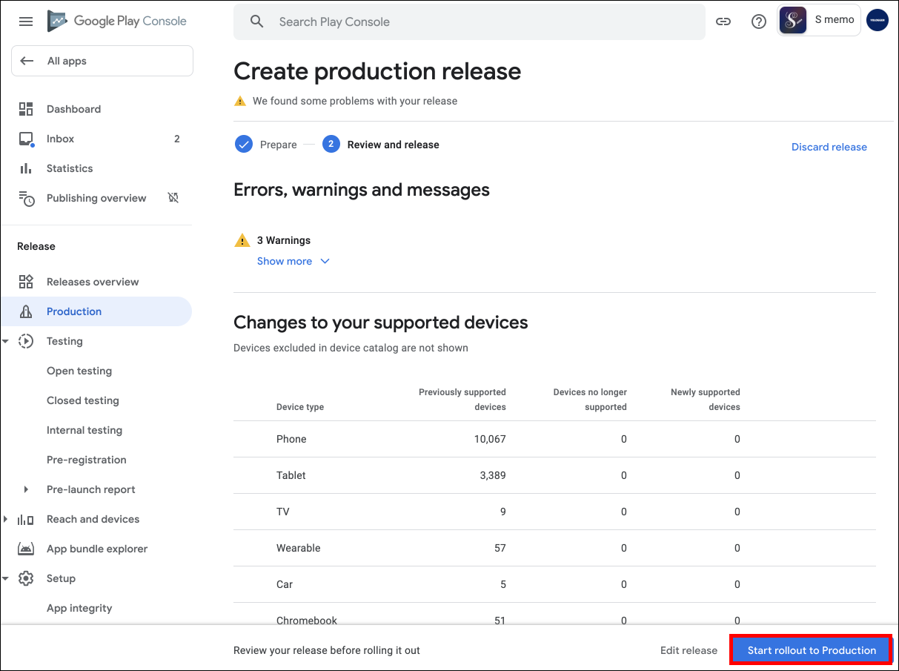
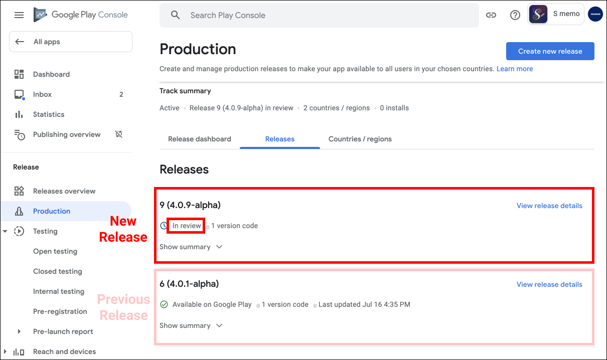
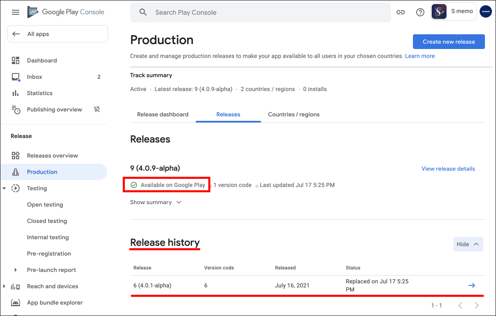
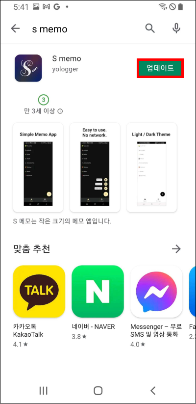

# 앱 업데이트
기능이 추가되거나 버그를 수정하는 등 앱에 변경사항이 발생하면 구글 플레이 콘솔에 새로운 APK 파일을 업로드 해야합니다.

`구글 플레이 콘솔 > All apps`에서 업데이트할 앱을 선택합니다.

`Production > Release`로 이동한 후 `Create new release`를 선택합니다.

`Upload`를 클릭하여 새로운 APK 파일을 업로드합니다.

::: tip
과거에 APK를 업로드한 적이 있다면, <b>versionCode</b> 값을 증가시켜 새롭게 빌드한 APK를 업로드해야합니다. <b>versionCode</b>는 모듈 수준의 <b>build.gradle</b>에서 수정할 수 있습니다.
:::

페이지 하단의 `Release name`과 `Release notes`를 적절하게 입력합니다. `Release notes`에는 이번 버전에서 추가되거나 변경된 사항을 작성합니다. 그리고 `Save`와 `Review release`를 순서대로 클릭합니다.

에러나 경고가 없는지 확인하고 `Start rollout to Production` 버튼을 누르면 앱이 출시됩니다.

새로운 릴리즈가 추가되었습니다. 새로운 릴리즈가 심사 중이면 `In review`로 표시됩니다. 심사는 몇 시간에서 며칠이 소요될 수 있습니다.

심사를 통과하면 새로운 릴리즈의 상태가 `Available on Google Play`로 변경됩니다. 이전 릴리즈는 `Release history`에서 확인할 수 있습니다.

고객은 구글 플레이스토어에서 새로운 릴리즈로 앱을 업데이트할 수 있습니다. 

