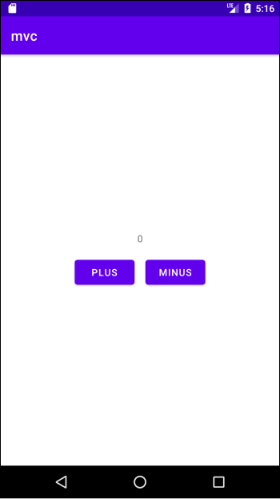
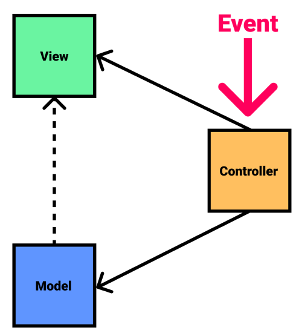
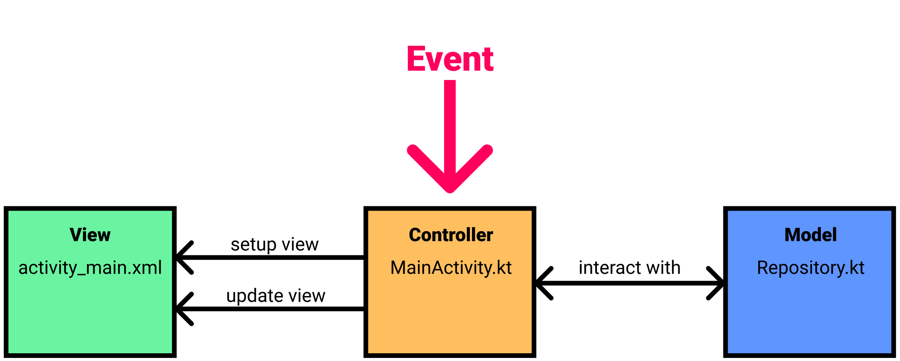
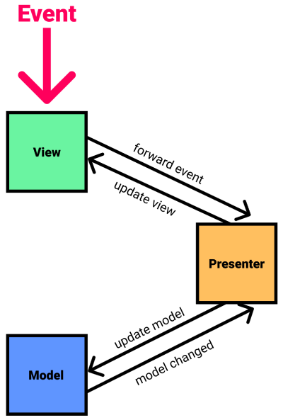
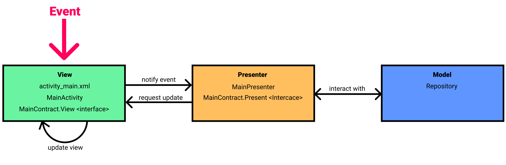
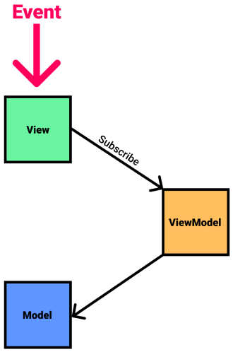
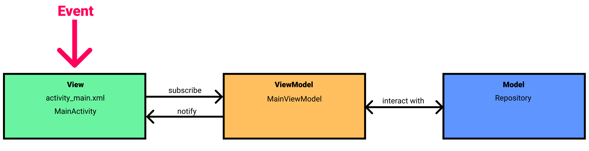

# Table of Contents

[[toc]]

## 아키텍처 패턴
소프트웨어는 수많은 요소로 구성됩니다. 그러나 대부분의 소프트웨어는 시간이 지날수록 복잡성이 증가합니다. 기능을 추가하거나 변경하는 일이 빈번하기 때문입니다. 이에 따라 기능을 추가하거나 테스트하거나 유지보수하는데 많은 문제가 발생합니다.

`아키텍처 패턴(Architecture Pattern)`은 이러한 문제를 해결하기 위해 등장했습니다. 아키텍처 패턴은 <u>소프트웨어를 구성하는 요소를 어떻게 체계적으로 설계하고 구성할지에 대한 방법론</u>입니다.

## 안드로이드의 아키텍처 패턴
안드로이드에는 무수히 많은 아키텍처 패턴이 존재합니다. 안드로이드에서 자주 사용되는 아키텍처 패턴은 다음과 같습니다.
- MVC (Model-View-Controller)
- MVP (Model-View-Presenter)
- MVVM (Model-View-ViewModel)
- MVI (Model-View-Intent))
- Clean Architecture

다음과 같이 `카운터 앱`을 만들며 아키택처 패턴에 대해 알아보겠습니다. `PLUS`버튼을 누르면 값이 1만큼 증가합니다. `MINUS`버튼을 누르면 값이 1만큼 감소합니다.



## MVC
MVC는 `Model`, `View`, `Controller`로 구성되어있습니다. 



### 모델(Model)
데이터, 데이터의 상태, 데이터 조작과 관련된 로직입니다. 
### 뷰(View)
모델을 보여주는 UI입니다. 사용자 화면을 담당합니다.
### 컨트롤러(Controller)
모델과 뷰를 연결하고 제어하는 접착체입니다. 컨트롤러의 가장 큰 역할은 앱에서 발생하는 이벤트를 수신하는 것입니다. 이벤트에 따라 모델의 데이터를 수정하기도, 뷰를 업데이트하기도 합니다.

MVC는 다음과 같이 진행됩니다.
1. 컨트롤러는 사용자 이벤트를 수신합니다.
1. 컨트롤러는 모델을 업데이트할 필요가 있는 경우, 모델을 업데이트 합니다.
1. 컨트롤러는 뷰를 업데이트할 필요가 있는 경우, 뷰를 업데이트 합니다.

### 안드로이드에서의 MVC
그럼 카운터 앱을 만들면서 안드로이드에서의 `MVC`에 대해 알아보겠습니다.

안드로이드 앱에서 뷰는 `XML 레이아웃 파일`입니다. 화면은 다음과 같습니다.


레이아웃 파일은 다음과 같습니다.
``` xml activity_main.xml
<?xml version="1.0" encoding="utf-8"?>
<androidx.constraintlayout.widget.ConstraintLayout xmlns:android="http://schemas.android.com/apk/res/android"
    xmlns:app="http://schemas.android.com/apk/res-auto"
    xmlns:tools="http://schemas.android.com/tools"
    android:layout_width="match_parent"
    android:layout_height="match_parent"
    tools:context=".MainActivity">

    <LinearLayout
        android:layout_width="wrap_content"
        android:layout_height="wrap_content"
        app:layout_constraintTop_toTopOf="parent"
        app:layout_constraintBottom_toBottomOf="parent"
        app:layout_constraintStart_toStartOf="parent"
        app:layout_constraintEnd_toEndOf="parent"
        android:orientation="vertical">

        <TextView
            android:id="@+id/activity_main_textView_result"
            android:layout_width="match_parent"
            android:layout_height="wrap_content"
            android:textAlignment="center"
            android:layout_margin="8dp"
            android:text="0" />

        <LinearLayout
            android:layout_width="match_parent"
            android:layout_height="match_parent"
            android:orientation="horizontal">

            <Button
                android:id="@+id/activity_main_button_plus"
                android:layout_width="wrap_content"
                android:layout_height="wrap_content"
                android:layout_margin="8dp"
                android:text="Plus" />

            <Button
                android:id="@+id/activity_main_button_minus"
                android:layout_width="wrap_content"
                android:layout_height="wrap_content"
                android:layout_margin="8dp"
                android:text="Minus" />

        </LinearLayout>
    </LinearLayout>

</androidx.constraintlayout.widget.ConstraintLayout>
```

모델은 앱을 어떻게 설계하는지에 따라 달라집니다. 이 앱에서는 모델을 담당하는 `Repository`클래스를 만들겠습니다. `Repository`클래스에는 카운터의 값을 더하거나 빼는 로직, 값을 `SharedPreferences`에 저장하는 로직이 구현되어있습니다.
``` kotlin Repository.kt
class Repository {

    private val SHARED_PREFERENCE_FILE_KEY = "shared_preference_file_key"
    private val SHARED_PREFERENCE_VALUE_COUNTER_KEY = "shared_preference_value_counter_key"

    private val sharedPreference = App.newInstance().getSharedPreferences(SHARED_PREFERENCE_FILE_KEY, Context.MODE_PRIVATE)

    fun get(): Int {
        val value = sharedPreference.getInt(SHARED_PREFERENCE_VALUE_COUNTER_KEY, 0)
        return value
    }

    fun plus() {
        val value = sharedPreference.getInt(SHARED_PREFERENCE_VALUE_COUNTER_KEY, 0)
        val newValue = value + 1
        save(newValue)
    }

    fun minus() {
        val value = sharedPreference.getInt(SHARED_PREFERENCE_VALUE_COUNTER_KEY, 0)
        val newValue = value - 1
        save(newValue)
    }

    private fun save(value: Int) {
        val editor = sharedPreference.edit()
        editor.putInt(SHARED_PREFERENCE_VALUE_COUNTER_KEY, value)
        editor.commit()
    }
}
```


컨트롤러 역할을 하는 것은 `액티비티`나 `프래그먼트`입니다.
``` kotlin MainActivity.kt
class MainActivity : AppCompatActivity() {

    private val repository by lazy { Repository() }

    private lateinit var textViewResult: TextView
    private lateinit var buttonPlus: Button
    private lateinit var buttonMinus: Button

    override fun onCreate(savedInstanceState: Bundle?) {
        super.onCreate(savedInstanceState)
        setContentView(R.layout.activity_main)
        findViewsById()
        setup()
    }

    private fun findViewsById(){
        textViewResult = findViewById(R.id.activity_main_textView_result)
        buttonPlus = findViewById(R.id.activity_main_button_plus)
        buttonMinus = findViewById(R.id.activity_main_button_minus)
    }

    private fun setup() {

        val initialValue = repository.get()
        textViewResult.text = initialValue.toString()

        buttonPlus.setOnClickListener {
            repository.plus()
            val newValue = repository.get()
            textViewResult.text = newValue.toString()
        }

        buttonMinus.setOnClickListener {
            repository.minus()
            val newValue = repository.get()
            textViewResult.text = newValue.toString()
        }
    }
}
```

`뷰(View)`, `모델(Model)`, `컨트롤러(Controller)`를 담당하는 클래스 파일과 리소스 파일은 다음과 같습니다.



### MVC의 문제점
MVC에서 `컨트롤러(Controller)`의 역할은 크게 세 가지 입니다.
1. 사용자 이벤트 수신
1. 뷰(View) 업데이트
1. 모델(Model)과 상호작용

이렇게 컨트롤러의 역할이 많기 때문에 앱이 커질수록 컨트롤러가 비대해집니다. 이처럼 한 모듈에 많은 기능이 들어가는 것은 `"소프트웨어의 결합도(Coupling)은 낮추고 응집도(Cohension)은 높인다"`라는 소프트웨어 개발 원칙에 위배되며, 유지보수와 테스트를 어렵게 합니다. MVP는 이러한 문제를 해결하기 위해 등장했습니다.

## MVP
MVP은 `모델(Model)`, `뷰(View)`, `프레젠터(Presenter)`로 구성되어있습니다.



### 모델(Model)
MVC 패턴의 모델과 동일합니다. 데이터, 데이터의 상태, 데이터 조작과 관련된 로직입니다. 
### 뷰(View)
UI 화면을 담당할 뿐만 아니라 사용자 이벤트 수신과 뷰 업데이트를 담당합니다.
### 프레젠터(Presenter)
뷰에게 업데이트를 요청하며, 모델과 상호작용합니다.

MVP는 다음과 같이 진행됩니다.
1. 뷰는 사용자 이벤트를 수신합니다.
2. 뷰는 사용자 이벤트를 프레젠터에 전달합니다.
3. 프레젠트는 비즈니스 로직을 수행합니다.
4. 프레젠터는 모델을 업데이트할 필요가 있는 경우, 모델을 업데이트 합니다.
5. 프레젠터는 뷰에게 뷰 업데이트를 요청합니다.
6. 뷰는 뷰를 업데이트합니다.

프레젠터에서 뷰를 직접 변경하는게 아니라는 것에 주의합시다. 프레젠터는 뷰의 참조를 가지고 있으며 뷰 업데이트는 뷰에 구현합니다.

### 안드로이드에서의 MVP
MVC에서는 `액티비티`나 `프래그먼트`가 `컨트롤러`에 해당되었습니다. 그러나 MVP에서는 `액티비티`나 `프래그먼트`가 `뷰`에 포함이 됩니다.

MVP를 구현하는 방법은 여러가지가 있습니다. 우리는 [구글 공식 샘플](https://github.com/android/architecture-samples/tree/todo-mvp-kotlin)을 참고하여 카운터 앱을 만들어보겠습니다.

레이아웃 파일은 다음과 같습니다.
``` xml activity_main.xml
<?xml version="1.0" encoding="utf-8"?>
<androidx.constraintlayout.widget.ConstraintLayout xmlns:android="http://schemas.android.com/apk/res/android"
    xmlns:app="http://schemas.android.com/apk/res-auto"
    xmlns:tools="http://schemas.android.com/tools"
    android:layout_width="match_parent"
    android:layout_height="match_parent"
    tools:context=".MainActivity">

    <LinearLayout
        android:layout_width="wrap_content"
        android:layout_height="wrap_content"
        app:layout_constraintTop_toTopOf="parent"
        app:layout_constraintBottom_toBottomOf="parent"
        app:layout_constraintStart_toStartOf="parent"
        app:layout_constraintEnd_toEndOf="parent"
        android:orientation="vertical">

        <TextView
            android:id="@+id/activity_main_textView_result"
            android:layout_width="match_parent"
            android:layout_height="wrap_content"
            android:textAlignment="center"
            android:layout_margin="8dp"
            android:text="0" />

        <LinearLayout
            android:layout_width="match_parent"
            android:layout_height="match_parent"
            android:orientation="horizontal">

            <Button
                android:id="@+id/activity_main_button_plus"
                android:layout_width="wrap_content"
                android:layout_height="wrap_content"
                android:layout_margin="8dp"
                android:text="Plus" />

            <Button
                android:id="@+id/activity_main_button_minus"
                android:layout_width="wrap_content"
                android:layout_height="wrap_content"
                android:layout_margin="8dp"
                android:text="Minus" />

        </LinearLayout>
    </LinearLayout>

</androidx.constraintlayout.widget.ConstraintLayout>
```

모든 뷰가 구현하는 `BaseView`인터페이스는 다음과 같습니다. `BaseView`를 구현하는 클래스에서는 변수 `present`를 프레젠터에 접근할 수 있습니다.
``` kotlin BaseView.kt
interface BaseView<T> {

    val presenter: T

}
```
모든 프레젠터가 구현하는 `BasePresenter`인터페이스는 다음과 같습니다.
``` kotlin BasePresenter.kt
interface BasePresenter {

    fun start()
}
```
구글 공식 샘플에서는 `Contract`인터페이스를 만들어 MVP를 구현하고 있습니다.
``` kotlin Contract.kt
interface MainContract {

    interface View: BaseView<Presenter> {
        fun showResult(result: Int)
    }

    interface Presenter: BasePresenter {
        fun plus()
        fun minus()
    }
}
```
`MainActivity`의 프레젠터를 담당할 `MainPresenter`를 만듭니다. `MainPresenter`는 `MainContract.Presenter`를 구현하며, 생성자로 뷰를 전달받습니다.
``` kotlin MainPresenter.kt
class MainPresenter(private val view: MainContract.View) : MainContract.Presenter {

    private val repository = Repository()

    override fun start() {
        val result = repository.get()
        view.showResult(result)
    }

    override fun plus() {
        repository.plus()
        view.showResult(repository.get())
    }

    override fun minus() {
        repository.minus()
        view.showResult(repository.get())
    }
}
```
이제 `MainActivity`를 다음과 같이 구현합니다. 핵심은 `MainActivity`에서 `MainContract.View`를 구현하는 것입니다.
``` kotlin MainActivity.kt
class MainActivity : AppCompatActivity(), MainContract.View {

    override val presenter: MainContract.Presenter by lazy { MainPresenter(this) }

    private lateinit var textViewResult: TextView
    private lateinit var buttonPlus: Button
    private lateinit var buttonMinus: Button

    override fun onCreate(savedInstanceState: Bundle?) {
        super.onCreate(savedInstanceState)
        setContentView(R.layout.activity_main)
        findViewsById()
        setup()
    }

    private fun findViewsById(){
        textViewResult = findViewById(R.id.activity_main_textView_result)
        buttonPlus = findViewById(R.id.activity_main_button_plus)
        buttonMinus = findViewById(R.id.activity_main_button_minus)
    }

    private fun setup() {
        presenter.start()

        buttonPlus.setOnClickListener {
            presenter.plus()
        }

        buttonMinus.setOnClickListener {
            presenter.minus()
        }
    }

    override fun showResult(result: Int) {
        textViewResult.text = result.toString()
    }
}
```
모델은 앱을 어떻게 설계하는지에 따라 달라집니다. 이 앱에서는 모델을 담당하는 `Repository`클래스를 만들겠습니다. `Repository`클래스에는 카운터의 값을 더하거나 빼는 로직, 값을 `SharedPreferences`에 저장하는 로직이 구현되어있습니다.
``` kotlin Repository.kt
class Repository {
    private val SHARED_PREFERENCE_FILE_KEY = "shared_preference_file_key"
    private val SHARED_PREFERENCE_VALUE_COUNTER_KEY = "shared_preference_value_counter_key"

    private val sharedPreference = App.newInstance().getSharedPreferences(SHARED_PREFERENCE_FILE_KEY, Context.MODE_PRIVATE)

    fun get(): Int {
        val value = sharedPreference.getInt(SHARED_PREFERENCE_VALUE_COUNTER_KEY, 0)
        return value
    }

    fun plus() {
        val value = sharedPreference.getInt(SHARED_PREFERENCE_VALUE_COUNTER_KEY, 0)
        val newValue = value + 1
        save(newValue)
    }

    fun minus() {
        val value = sharedPreference.getInt(SHARED_PREFERENCE_VALUE_COUNTER_KEY, 0)
        val newValue = value - 1
        save(newValue)
    }

    private fun save(value: Int) {
        val editor = sharedPreference.edit()
        editor.putInt(SHARED_PREFERENCE_VALUE_COUNTER_KEY, value)
        editor.commit()
    }
}
```
`뷰(View)`, `모델(Model)`, `프레젠터(Presenter)`를 담당하는 클래스 파일과 리소스 파일은 다음과 같습니다.



### MVP의 문제점
MVP에서 사용자 이벤트 수신과 뷰 업데이트는 뷰에서 이루어집니다. 그러나 프레젠터는 여전히 뷰에 대한 참조를 가지고 있으므로 뷰에 종속적인 구조를 가질 수 밖에 없습니다. MVVM 패턴은 이러한 프레젠터와 뷰를 분리하고 결합도를 낮추기 위해 등장했습니다.

### MVP의 문제점
MVP에서 사용자 이벤트 수신과 뷰 업데이트는 뷰에서 이루어집니다. 그러나 프레젠터는 여전히 뷰에 대한 참조를 가지고 있으므로 뷰에 종속적인 구조를 가질 수 밖에 없습니다. MVVM 패턴은 이러한 프레젠터와 뷰를 분리하고 결합도를 낮추기 위해 등장했습니다.

## MVVM
MVVM은 `모델(Model)`, `뷰(View)`, `뷰모델(ViewModel)`로 구성되어있습니다.



### 모델(Model)
MVC 패턴의 모델과 동일합니다. 데이터, 데이터의 상태, 데이터 조작과 관련된 로직입니다. 

### 뷰(View)
뷰는 사용자 이벤트 수신과 뷰 업데이트를 담당합니다. 이와 더불어 뷰모델의 데이터를 구독하고, 데이터가 변경되면 뷰를 업데이트 합니다.

### 뷰모델(ViewModel)
뷰모델은 모델의 데이터 일부 또는 전부를 구독 가능한 형태로 유지합니다. 뷰모델은 데이터가 변경되면 구독 중인 뷰에게 통지합니다. 뷰모델이 모델과 상호작용하는 것은 동일합니다.

### 바인딩
뷰에서 뷰모델의 데이터의 변화를 지켜보고 있는 것을 `구독(Subscribe)` 또는 `관찰(Observe)`이라고 합니다. 구독 또는 관찰 가능한 데이터는 `Observable`하다고 합니다. 이렇게 데이터를 구독 또는 관찰할 수 있도록 셋업하는 작업을 `바인딩(Binding)`이라고 합니다.

::: tip
MVVM의 핵심은 바인딩입니다.
:::

보통 관찰 가능한 데이터는 ACC의 `LiveData` 또는 RxJava의 `Observable`로 구현합니다.

### 안드로이드에서의 MVVM
안드로이드는 MVVM을 구현하기 위해 `Android Architecture Component`를 제공합니다.
- Android Architecture Component - LiveData
- Android Architecture Component - ViewModel
- Android Architecture Component - Data Binding

이 외에도 `ReactiveX`를 사용하여 MVVM를 구현할 수도 있습니다. 우리는 `Android Architecture Component`을 사용하여 카운터 앱을 만들어보겠습니다.


`뷰 모델`에 대한 의존성을 모듈 수준의 `build.gradle`에 추가합니다.

``` groovy
def lifecycle_version = "2.3.1"
// ViewModel
implementation "androidx.lifecycle:lifecycle-viewmodel-ktx:$lifecycle_version"
```

`LiveData`에 대한 의존성을 모듈 수준의 `build.gradle`에 추가합니다.

``` groovy
def lifecycle_version = "2.3.1"
// LiveData
implementation "androidx.lifecycle:lifecycle-livedata-ktx:$lifecycle_version"
```

`데이터 바인딩`에 대한 의존성을 모듈 후준의 `build.gradle`에 추가합니다.

``` groovy
plugins {
    id 'kotlin-kapt'
}
android {
    dataBinding {
        enabled = true
    }
}
dependencies {
    kapt 'com.android.databinding:compiler:3.1.4'
}
```

모델은 앱을 어떻게 설계하는지에 따라 달라집니다. 이 앱에서는 모델을 담당하는 `Repository`클래스를 만들겠습니다. `Repository`클래스에는 카운터의 값을 더하거나 빼는 로직, 값을 `SharedPreferences`에 저장하는 로직이 구현되어있습니다.

``` kotlin Repository.kt
class Repository {
    private val SHARED_PREFERENCE_FILE_KEY = "shared_preference_file_key"
    private val SHARED_PREFERENCE_VALUE_COUNTER_KEY = "shared_preference_value_counter_key"

    private val sharedPreference = App.newInstance().getSharedPreferences(SHARED_PREFERENCE_FILE_KEY, Context.MODE_PRIVATE)

    fun get(): Int {
        val value = sharedPreference.getInt(SHARED_PREFERENCE_VALUE_COUNTER_KEY, 0)
        return value
    }

    fun plus() {
        val value = sharedPreference.getInt(SHARED_PREFERENCE_VALUE_COUNTER_KEY, 0)
        val newValue = value + 1
        save(newValue)
    }

    fun minus() {
        val value = sharedPreference.getInt(SHARED_PREFERENCE_VALUE_COUNTER_KEY, 0)
        val newValue = value - 1
        save(newValue)
    }

    private fun save(value: Int) {
        val editor = sharedPreference.edit()
        editor.putInt(SHARED_PREFERENCE_VALUE_COUNTER_KEY, value)
        editor.commit()
    }
}
```

뷰 모델을 정의합니다.

``` kotlin MainViewModel.kt
import androidx.lifecycle.ViewModel

class MainViewModel: ViewModel() {
    // ...
}
```

뷰 모델에 관찰가능한 데이터와 비즈니스 로직을 구현합니다.

``` kotlin MainViewModel.kt
import androidx.lifecycle.ViewModel
import androidx.lifecycle.MutableLiveData

class MainViewModel: ViewModel() {

    val repository = Repository()
    var counter: MutableLiveData<String> = MutableLiveData()

    init {
        var initValue = repository.get()
        counter.value = initValue.toString()
    }

    fun plus() {
        repository.plus()
        var newValue = repository.get()
        counter.value = newValue.toString()
    }

    fun minus() {
        repository.minus()
        var newValue = repository.get()
        counter.value = newValue.toString()
    }
}
```

뷰모델의 인스턴스는 `ViewModelProvider`를 통해 생성할 수 있습니다.

``` kotlin MainActivity.kt
import androidx.lifecycle.ViewModelProvider

class MainActivity : AppCompatActivity() {

    lateinit var viewModel: MainViewModel

    override fun onCreate(savedInstanceState: Bundle?) {
        super.onCreate(savedInstanceState)
        // setContentView(R.layout.activity_main)
        setupViewModel()
    }

    private fun setupViewModel() {
        viewModel = ViewModelProvider(this).get(MainViewModel::class.java)
    }
}
```

레이아웃 파일 전체를 `<layout>` 태그로 감싸줍니다.

``` xml activity_main.xml
<?xml version="1.0" encoding="utf-8"?>
<layout xmlns:android="http://schemas.android.com/apk/res/android"
    xmlns:app="http://schemas.android.com/apk/res-auto"
    xmlns:tools="http://schemas.android.com/tools">

    <data>
        <variable
            name="viewModel"
            type="com.yologger.mvvm.MainViewModel" />
    </data>

    <androidx.constraintlayout.widget.ConstraintLayout
        android:layout_width="match_parent"
        android:layout_height="match_parent"
        tools:context=".MainActivity">

        <LinearLayout
            android:layout_width="wrap_content"
            android:layout_height="wrap_content"
            android:orientation="vertical"
            app:layout_constraintBottom_toBottomOf="parent"
            app:layout_constraintEnd_toEndOf="parent"
            app:layout_constraintStart_toStartOf="parent"
            app:layout_constraintTop_toTopOf="parent">

            <TextView
                android:id="@+id/activity_main_textView_result"
                android:layout_width="match_parent"
                android:layout_height="wrap_content"
                android:layout_margin="8dp"
                android:text="@={viewModel.counter}"
                android:textAlignment="center" />

            <LinearLayout
                android:layout_width="match_parent"
                android:layout_height="match_parent"
                android:orientation="horizontal">

                <Button
                    android:id="@+id/activity_main_button_plus"
                    android:layout_width="wrap_content"
                    android:layout_height="wrap_content"
                    android:layout_margin="8dp"
                    android:onClick="@{() -> viewModel.plus()}"
                    android:text="Plus" />

                <Button
                    android:id="@+id/activity_main_button_minus"
                    android:layout_width="wrap_content"
                    android:layout_height="wrap_content"
                    android:layout_margin="8dp"
                    android:onClick="@{() -> viewModel.minus()}"
                    android:text="Minus" />

            </LinearLayout>
        </LinearLayout>

    </androidx.constraintlayout.widget.ConstraintLayout>
</layout>
```

`Android Studio > Build > Rebuild Project`를 선택하면 `ActivityMainBinding`클래스가 생성됩니다. 
> 액티비티 이름이 `SubActivity`라면 `ActivitySubBinding`클래스가 생성됩니다. 프래그먼트 이름이 `TopFragment`라면 `FragmentTopBinding`클래스가 생성됩니다.

아래와 같이 바인딩 클래스를 초기화합니다.
``` kotlin
import com.yologger.mvvm.databinding.ActivityMainBinding
import androidx.databinding.DataBindingUtil

class MainActivity : AppCompatActivity() {

    lateinit var viewModel: MainViewModel
    private lateinit var binding: ActivityMainBinding

    override fun onCreate(savedInstanceState: Bundle?) {
        super.onCreate(savedInstanceState)
        // setContentView(R.layout.activity_main)
        setupViewModel()
        setupBinding()
    }

    private fun setupViewModel() {
        viewModel = ViewModelProvider(this).get(MainViewModel::class.java)
    }

    private fun setupBinding() {
        binding = DataBindingUtil.setContentView(this, R.layout.activity_main)
        binding.lifecycleOwner = this
        binding.viewModel = viewModel
    }
}
```

`뷰(View)`, `모델(Model)`, `뷰모델(ViewModel)`를 담당하는 클래스 파일과 리소스 파일은 다음과 같습니다.



