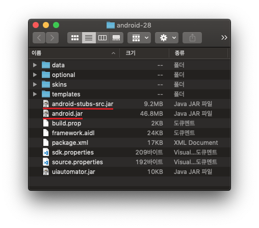

# Table of Contents
[[toc]]

# 안드로이드 테스트 코드 입문

안드로이드 스튜디오에서 프로젝트를 만들면 다음과 같은 구조로 디렉토리가 생성된다.


여기서 `test`와 `androidTest`디렉토리가 테스트를 위해 사용하는 폴더다.


두 디렉토리는 다음과 같은 특징이 있다.
- `test`
    - 이 디렉토리에서 진행되는 테스트는 `로컬 단위 테스트(Local unit test)`라고 한다.
    - 이 디렉토리의 테스트 코드는 컴파일 후 로컬 PC의 <u>JVM</u>에서 실행된다.
    - 로컬 PC에서 실행하기 때문에 테스트 속도가 빠르다.
    - 보통 Android Framework(android.jar)와 관련없는 순수한 Java 코드만 테스트한다.
    - Android Framework에 의존적인 

- `androidTest`
    - 이 디렉토리에서 진행하는 테스트는 `계측 테스트(Instrumented test)`라고 한다.
    - 이 디렉토리의 테스트 코드는 프로젝트 빌드 후 <u>에뮬레이터</u>나 <u>실제 기기</u>에서 실행된다.
    - 로컬 PC에서 빌드 후 에뮬레이터나 실제 기기에 설치해야하므로 테스트 속도가 느리다.
    - Android Framework(android.jar)와 


## 로컬 단위 테스트
`JUnit`을 사용하면 로컬 단위 테스르를 진행할 수 있다. 로컬 단위 테스트에 다음과 같이 의존성을 추가하자.
``` groovy 모듈 수준의 buiild.gradle
dependencies {
    // junit 라이브러리를 로컬 단위 테스트에서 사용할 수 있다.
    testImplementation 'junit:junit:4.+'
}
```

이제 예제를 통해 로컬 단위 테스트를 살펴보자. 다음 경로에 `Calculator.kt`를 생성하자.


프로젝트를 생성할 때 함께 생성되는 `Calculator.kt`를 살펴보자.
``` kotlin Calculator.kt
package com.yologger.app

class Calculator {
    fun plus(a: Int, b: Int): Int {
        return a+b
    }
    fun minus(a: Int, b: Int): Int {
        return a-b
    }
}
```

이제 이 클래스가 제대로 구현되었는지 확인해보자. `test`디렉토리의 `ExampleUnitTest.kt`를 다음과 같이 작성하자. `JUnit`을 사용하여 3과 7을 더한 값이 10인지를 테스트하는 코드다. 

``` kotlin ExampleUnitTest.kt
import org.junit.Test
import org.junit.Assert.*

class ExampleUnitTest {
    
    @Test
    fun test_add() {
        val calculator = Calculator()
        assertEquals(10, calculator.plus(3, 7))
    }
}
```

화면 왼쪽의 화살표를 클릭하면 테스트를 시작한다.


테스트가 성공하면 다음과 같이 출력된다.


만약 테스트가 실패하면 다음과 같이 출력된다.


## 로컬 단위 테스트의 한계
로컬 단위 테스트에서는 `Android Framework`의 컴포넌트를 테스트할 수 없다. 로컬 단위 테스트는 에뮬레이터나 실제 기기가 아닌 JVM 위에서 실행되기 때문이다. 

예제를 살펴보자. 다음과 같은 `MainActivity`클래스가 있다.
``` kotlin MainActivity.kt
class MainActivity : AppCompatActivity() {
    override fun onCreate(savedInstanceState: Bundle?) {
        super.onCreate(savedInstanceState)
        setContentView(R.layout.activity_main)
    }
}
```
로컬 단위 테스트에서 `MainActivity.onCreate()`를 테스트해보자.
``` kotlin MainActivityTest.kt
class MainActivityTest {
    @Test
    fun test_MainActivity_onCreate() {
        val mainActivity = MainActivity()
        mainActivity.onCreate(null, null)
    }
}
```
테스트를 실행하면 다음과 같은 에러가 발생한다.
```
Method getMainLooper in android.os.Looper not mocked. See http://g.co/androidstudio/not-mocked for details.
java.lang.RuntimeException: Method getMainLooper in android.os.Looper not mocked. See http://g.co/androidstudio/not-mocked for details.
	at android.os.Looper.getMainLooper(Looper.java)
	at androidx.arch.core.executor.DefaultTaskExecutor.isMainThread(DefaultTaskExecutor.java:77)
	at androidx.arch.core.executor.ArchTaskExecutor.isMainThread(ArchTaskExecutor.java:116)
	at androidx.lifecycle.LifecycleRegistry.enforceMainThreadIfNeeded(LifecycleRegistry.java:316)
	at androidx.lifecycle.LifecycleRegistry.addObserver(LifecycleRegistry.java:172)
    ...
```
이유는 로컬 단위 테스트에서는 `Android Framework`와 관련된 컴포넌트에 접근할 때 `android.jar`가 아닌 `android-stubs-src.jar`를 사용하기 때문이다.


`android-stubs-src.jar`는 실제 구현부가 없는 빈 껍데기이기 때문에 단위테스트가 제대로 동작하지 않는다. 따라서 Android Framework에 의존성이 있는 코드를 테스트할 때는 다음과 같은 방법을 사용할 수 있다.
- 계측 테스트
- Mocking 라이브러리 (Mockito, Mockk 등)
- Robolectric
- Espresso

## 계측 테스트
코드에서 `Context`객체에 접근하거나 UI를 테스트하는 경우 로컬 단위테스트를 사용할 수 없다. 이러한 경우 `계측 테스트(Instrumented Test)`를 사용한다.

`Espresso`를 사용하면 쉽게 UI를 테스트할 수 있다. UI 요소는 `Android Framework(android.jar)`에 포함되기 때문에 계측 테스트 환경에서 진행해야한다. 이를 위해 우선 의존성을 추가해보자.
``` groovy 
// 모듈 수준의 buiid.gradle
dependencies {
    // espresso-core 라이브러리를 계측 테스트에서 사용할 수 있다.
    androidTestImplementation 'androidx.test.espresso:espresso-core:3.3.0'
}
```
이제 화면을 다음과 같이 구현하자.
``` xml activity_main.xml
<?xml version="1.0" encoding="utf-8"?>
<LinearLayout xmlns:android="http://schemas.android.com/apk/res/android"
    xmlns:tools="http://schemas.android.com/tools"
    android:layout_width="match_parent"
    android:layout_height="match_parent"
    android:orientation="vertical"
    android:gravity="center"
    tools:context=".MainActivity">

    <EditText
        android:id="@+id/activity_main_editText"
        android:layout_width="300dp"
        android:layout_height="wrap_content"
        android:inputType="text"
        android:hint="Enter input" />

    <Button
        android:id="@+id/activity_main_button"
        android:layout_width="wrap_content"
        android:layout_height="wrap_content"
        android:text="Button" />

    <TextView
        android:id="@+id/activity_main_textView"
        android:layout_width="wrap_content"
        android:layout_height="wrap_content"/>

</LinearLayout>
```
``` kotlin MainActivity.kt
class MainActivity : AppCompatActivity() {

    private val editText: EditText by lazy { findViewById(R.id.activity_main_editText) }
    private val button: Button by lazy { findViewById(R.id.activity_main_button) }
    private val textView: TextView by lazy { findViewById(R.id.activity_main_textView) }

    override fun onCreate(savedInstanceState: Bundle?) {
        super.onCreate(savedInstanceState)
        setContentView(R.layout.activity_main)

        button.setOnClickListener {
            textView.text = editText.text
        }
    }
}
```
`androidTest`디렉토리의 `ExampleInstrumentedTest.kt`을 다음과 같이 작성한다.
``` kotlin ExampleInstrumentedTest.kt
import androidx.test.espresso.Espresso.onView
import androidx.test.espresso.action.ViewActions.*
import androidx.test.espresso.assertion.ViewAssertions.matches
import androidx.test.espresso.matcher.ViewMatchers.*
import androidx.test.ext.junit.runners.AndroidJUnit4
import org.junit.Test
import org.junit.runner.RunWith
import androidx.test.rule.ActivityTestRule
import org.junit.Rule

@RunWith(AndroidJUnit4::class)
class ExampleInstrumentedTest {

    @get:Rule
    val activityRule = ActivityTestRule(MainActivity::class.java)

    @Test
    fun test_onClick() {
        // EditText에 "Hello World!" 입력
        onView(withId(R.id.activity_main_editText)).perform(typeText("Hello World!"))

        // 버튼을 클릭하고 키보드 닫음
        onView(withId(R.id.activity_main_button)).perform(click(), closeSoftKeyboard())

        // TextView의 text 속성이 "Hello World!"인지 확인
        onView(withId(R.id.activity_main_textView)).check(matches(withText("Hello World!")))
    }
}
```
이제 테스트를 시작하면 자동으로 문자열을 입력한 후 버튼을 클릭한다.


테스트가 성공하면 로그에 다음과 같이 출력된다.
