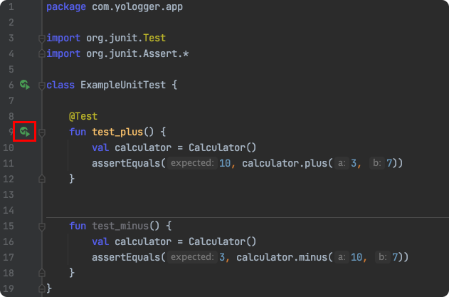
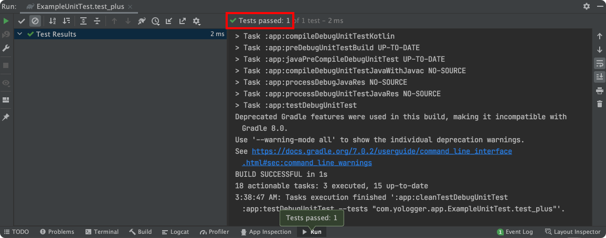
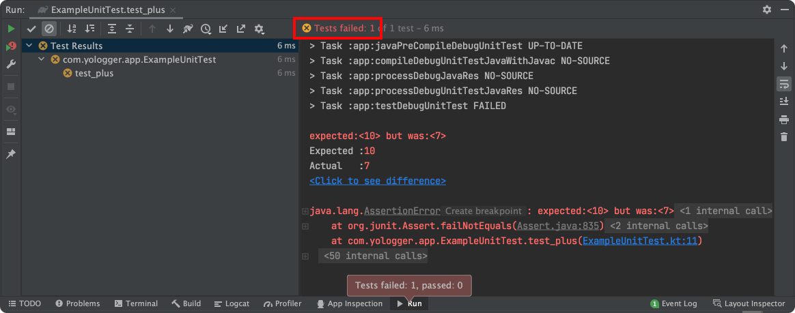

# Table of Contents
[[toc]]

# JUnit
`JUnit`은 단위테스트 도구다. JUnit을 사용하면 디버깅을 위해 앱을 매번 빌드하고 `System.out.println()`으로 로그를 찍을 필요가 없어진다.

## 설정
보통 안드로이드 프로젝트를 생성하면 JUnit과 관련된 의존성이 자동으로 포함된다.
``` groovy 모듈 수준의 buiid.gradle
dependencies {
    // 로컬 단위 테스트에서의 JUnit
    testImplementation 'junit:junit:4.+'

    // 계측 테스트에서의 JUnit
    androidTestImplementation 'androidx.test.ext:junit:1.1.3'
}
```

## 사용법
합과 차를 계산해주는 `Calculator`클래스가 있다.
``` kotlin Calculator.kt
class Calculator {
    fun plus(a: Int, b: Int): Int {
        return a+b
    }
    
    fun minus(a: Int, b: Int): Int {
        return a-b
    }
}
```
이 클래스를 JUnit으로 테스트해보자. `test`디렉토리에 `ExampleUnitTest.kt`을 생성하고 다음과 같이 작성하자.
``` kotlin ExampleUnitTest.kt
import org.junit.Test
import org.junit.Assert.*

class ExampleUnitTest {

    @Test
    fun test_plus() {
        val calculator = Calculator()
        assertEquals(10, calculator.plus(3, 7))
    }

    @Test
    fun test_minus() {
        val calculator = Calculator()
        assertEquals(3, calculator.minus(10, 7))
    }
}
```
`test_plus()`에는 `Calculator.plus()`메소드를 테스트하는 코드를 작성한다. 또한 `@Test`어노테이션을 붙이면 테스트 실행 버튼이 생성된다.



JUnit의 `org.junit.Assert`패키지에는 테스트를 위한 다양한 함수가 존재한다. `assertEquals()`의 첫 번째 인자는 기대값, 두 번째 인자는 실제값을 전달한다. 

이 함수는 두 값이 동일하면 테스트를 성공시킨다.



두 값이 다르면 실패시킨다.




다음은 자주 사용하는 메소드다.

### assertEqual()

두 값이 동일한지 비교한다.
``` kotlin
@Test
fun test_equal() {
    assertEquals(10, 3+7)   // SUCCESS
    assertEquals(10, 1+3)   // FAILURE
}
```

### assertArrayEquals()

두 배열이 동일한지 비교한다.
``` kotlin
@Test
fun test_compare_arrays() {
    val arr1 = arrayOf(1, 2, 3)
    val arr2 = arrayOf(1, 2, 3)
    val arr3 = arrayOf(4, 5, 6)
    assertArrayEquals(arr1, arr2)   // Success
    assertArrayEquals(arr1, arr3)   // Failure
}
```

### assertSame()
두 객체가 동일한지 비교한다.
``` kotlin
@Test
fun test_object() {
    val p1 = Person("Paul", "USA")
    val p2 = p1
    assertSame(p1, p2)  // SUCCESS
}
```

### assertTrue()
값이 `true`인지 확인한다.
``` kotlin
@Test
fun test_isMarried() {
    val isMarried = true
    assertTrue(isMarried) // SUCCESS
}
```
### assertNotNull()
값이 `null`인지 확인한다.
``` kotlin
@Test
fun test_notNull() {
    val person: Person? = Person("Paul", "USA")
    assertNotNull(person)   // SUCCESS
}
```
```
@Test
fun test_notNull() {
    val person: Person? = null
    assertNotNull(person)   // FAILURE
}
```
[이 곳](http://junit.sourceforge.net/javadoc/org/junit/Assert.html)에서 모든 Assert 메소드를 확인할 수 있다.


## @Before, @After
`ExampleUnitTest.kt`는 다음 코드가 중복되고있다.
``` kotlin
val calculator = Calculator()
assertEquals(10, calculator.plus(3, 7))
```
`@Before`, `@After` 어노테이션을 사용하면 코드의 중복을 제거할 수 있다.

`@Before`가 붙은 메소드는 클래스 내부의 테스트 메소드들이 실행되기 전에 호출된다. 보통 초기화 작업을 수행한다.
``` kotlin ExampleUnitTest.kt
import org.junit.After
import org.junit.Test
import org.junit.Assert.*
import org.junit.Before

class ExampleUnitTest {

    lateinit var calculator: Calculator

    @Before
    fun setup() {
        calculator = Calculator()
    }

    @Test
    fun test_plus() {
        assertEquals(10, calculator.plus(3, 7))
    }

    @Test
    fun test_minus() {
        assertEquals(3, calculator.minus(10, 7))
    }

    @After
    fun tearDown() {

    }
}
```
`@After`가 붙은 메소드는 클래스 내부의 테스트 메소드들이 실행된 후에 호출된다. 보통 테스트에 사용한 자원을 해제하는데 사용한다.

## Test Runner
`Test Runner`는 테스트 클래스를 초기화하고, 테스트 메소드를 실행하고, 테스트 결과를 로그에 알려준다. 모든 Test Runner는 `org.junit.runner.Runner`클래스를 상속한다.

커스텀 Test Runner를 `@RunWith`어노테이션으로 지정할 수 있다. Test Runner를 지정하지 않으면 기본 Test Runner인 `BlockJUnit4ClassRunner`를 사용한다. 예를 들어 다음 코드는 
``` kotlin ExampleUnitTest.kt
import org.junit.Test
import org.junit.Assert.*

class ExampleUnitTest {
    
    @Test
    fun test_add() {
        val calculator = Calculator()
        assertEquals(10, calculator.plus(3, 7))
    }
}
```
다음 코드와 동일하다.
``` kotlin ExampleUnitTest.kt
import org.junit.runners.BlockJUnit4ClassRunner

@RunWith(BlockJUnit4ClassRunner::class)
class ExampleUnitTest {

    @Test
    fun localUnitTest() {
        // ...
    }
}
```
안드로이드 어플리케이션을 개발할 때에는 주로 `androidx.test.ext:junit:1.1.3'`가 제공하는 `AndroidJUnit4`를 사용한다.
``` kotlin ExampleInstrumentedTest
import androidx.test.ext.junit.runners.AndroidJUnit4
import org.junit.runner.RunWith

@RunWith(AndroidJUnit4::class)
class ExampleInstrumentedTest {

    @Test
    fun instrumentedTest() {
        // ...
    }
}
```
스프링 부트 어플리케이션을 개발할 때에는 스프링 프레임워크가 제공하는 `SpringRunner`를 사용한다.
``` kotlin ExampleControllerTest
import org.springframework.test.context.junit4.SpringRunner
import org.junit.runner.RunWith

@RunWith(SpringRunner::class)
class ExampleControllerTest {

    @Test
    fun apiTest() {
        // ...
    }
}
```