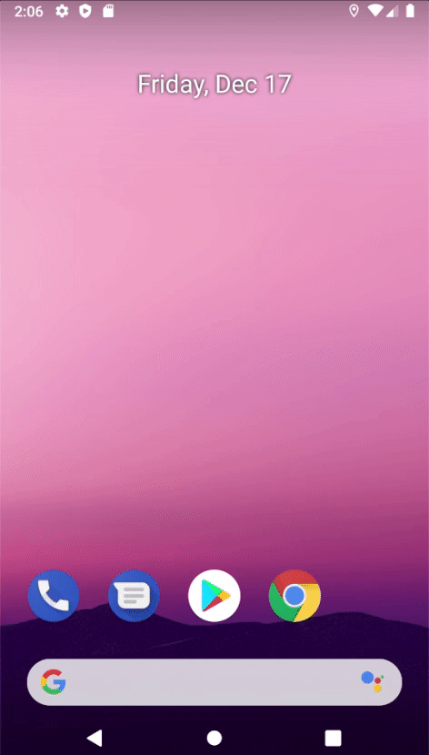

# Table of Contents
[[toc]]

# Espresso
[`Espresso`](https://developer.android.com/training/testing/espresso)를 사용하면 UI를 테스트할 수 있다. `UI Test`는 에뮬레이터나 실제 기기에서 수행해야하므로 `androidTest`디렉토리에 테스트 코드를 작성해야한다.

이제 본격적으로 Espresso에 대해 알아보자.

## 설정
`Espresso`를 사용하려면 다음 의존성을 추가해야한다.
``` groovy 모듈 수준의 build.gradle
android {
    defaultConfig {
        testInstrumentationRunner "androidx.test.runner.AndroidJUnitRunner"
    }
}

dependencies {
    androidTestImplementation 'androidx.test.espresso:espresso-core:3.1.0'
    androidTestImplementation 'androidx.test:runner:1.1.0'
    androidTestImplementation 'androidx.test:rules:1.1.0'
}
```

## 사용법
간단한 Espresso 예제를 살펴보자. EditText에 문자열을 입력하고 Button을 클릭하면 TextView에 반영된다.
``` xml activity_main.xml
<?xml version="1.0" encoding="utf-8"?>
<LinearLayout xmlns:android="http://schemas.android.com/apk/res/android"
    xmlns:tools="http://schemas.android.com/tools"
    android:layout_width="match_parent"
    android:layout_height="match_parent"
    android:orientation="vertical"
    android:gravity="center"
    tools:context=".MainActivity">

    <EditText
        android:id="@+id/activity_main_editText"
        android:layout_width="300dp"
        android:layout_height="wrap_content"
        android:inputType="text"
        android:hint="Enter input" />

    <Button
        android:id="@+id/activity_main_button"
        android:layout_width="wrap_content"
        android:layout_height="wrap_content"
        android:text="Button" />

    <TextView
        android:id="@+id/activity_main_textView"
        android:layout_width="wrap_content"
        android:layout_height="wrap_content"/>

</LinearLayout>
```
``` kotlin MainActivity.kt
class MainActivity : AppCompatActivity() {

    private val editText: EditText by lazy { findViewById(R.id.activity_main_editText) }
    private val button: Button by lazy { findViewById(R.id.activity_main_button) }
    private val textView: TextView by lazy { findViewById(R.id.activity_main_textView) }

    override fun onCreate(savedInstanceState: Bundle?) {
        super.onCreate(savedInstanceState)
        setContentView(R.layout.activity_main)

        button.setOnClickListener {
            textView.text = editText.text
        }
    }
}
```
이제 테스트 코드를 작성해보자
``` kotlin InputInstrumentedTest.kt
import androidx.test.espresso.Espresso.onView
import androidx.test.espresso.action.ViewActions.*
import androidx.test.espresso.assertion.ViewAssertions.matches
import androidx.test.espresso.matcher.ViewMatchers.*
import androidx.test.ext.junit.runners.AndroidJUnit4
import org.junit.Test
import org.junit.runner.RunWith
import androidx.test.rule.ActivityTestRule
import org.junit.Rule

@RunWith(AndroidJUnit4::class)
class InputInstrumentedTest {

    @get:Rule
    val activityRule = ActivityTestRule(MainActivity::class.java)

    @Test
    fun test_onClick() {
        // EditText에 "Hello World!" 입력
        onView(withId(R.id.activity_main_editText)).perform(typeText("Hello World!"))

        // 버튼을 클릭하고 키보드 닫음
        onView(withId(R.id.activity_main_button)).perform(click(), closeSoftKeyboard())

        // TextView의 text 속성이 "Hello World!"인지 확인
        onView(withId(R.id.activity_main_textView)).check(matches(withText("Hello World!")))
    }
}
```
위 테스트 코드를 실행하면
1. EditText에 "Hello World!" 입력한다.
2. 버튼을 클릭하고 키보드 닫는다.
3. TextView의 text 속성이 "Hello World!"인지 확인한다.



### View 찾기
`onView(withId(R.id.view))`은 특정 뷰를 탐색하는데 사용한다. 다음과 같은 `Button`은
``` xml
<Button
    android:id="@+id/activity_main_button"
    android:layout_width="wrap_content"
    android:layout_height="wrap_content"
    android:text="Button" />
```
다음과 같이 뷰 계층 구조 내에서 뷰를 찾을 수 있다.
``` kotlin
onView(withId(R.id.activity_main_button))
```
### 액션 수행하기
`perform()`메소드로 특정 액션을 수행할 수 있다. 예를 들어 다음 코드는 Button을 클릭한다.
``` kotlin
onView(withId(R.id.activity_main_button))
.perform(click())
```
다음 코드는 Button을 클릭하고 키보드를 닫는다.
``` kotlin
onView(withId(R.id.activity_main_button))
.perform(click(), closeSoftKeyboard())
```
다음 코드는 EditText에 문자열을 입력한다.
``` kotlin
onView(withId(R.id.activity_main_editText))
.perform(typeText("Hello World!"))
```
Espresso가 지원하는 액션은 [이 곳](https://developer.android.com/reference/androidx/test/espresso/action/ViewActions)에서 확인할 수 있다.

### Assertion
`check()`메서드를 사용하여 현재 선택된 뷰를 검증할 수 있다.

다음 코드는 EditText의 `text`속성의 값이 "Hello"인지를 검증한다. 값이 "Hello"면 테스트에 통과하고 아니면 테스트에 실패한다.
``` kotlin 
onView(withId(R.id.activity_main_textView))
.check(matches(withText("Hello")))
```
검증에 사용되는 모든 메소드는 [이 곳](https://developer.android.com/reference/androidx/test/espresso/assertion/ViewAssertions)에서 확인할 수 있다.


