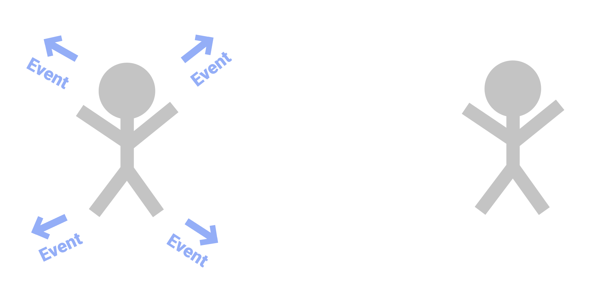
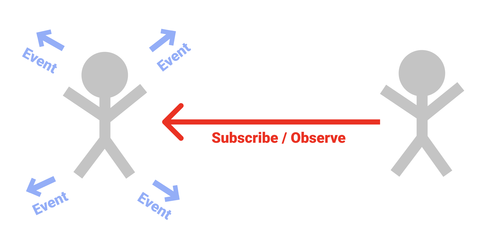
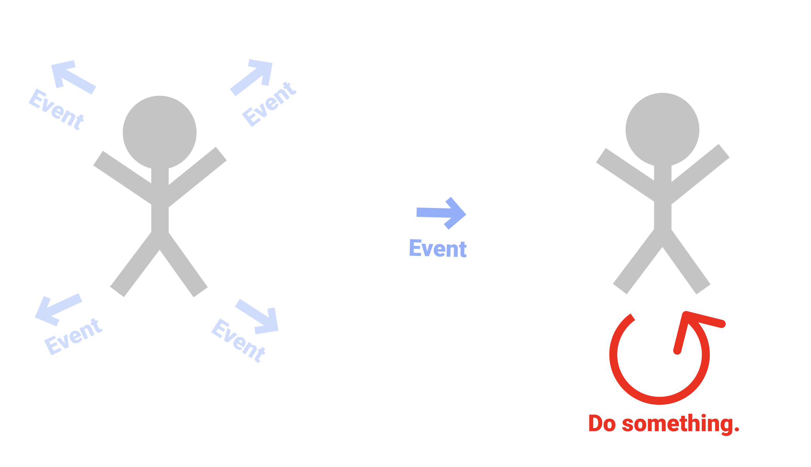
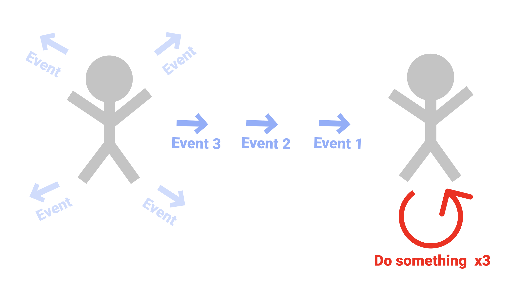
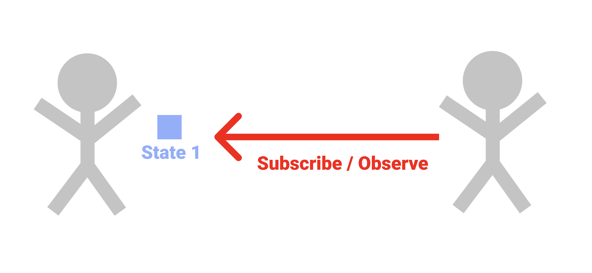
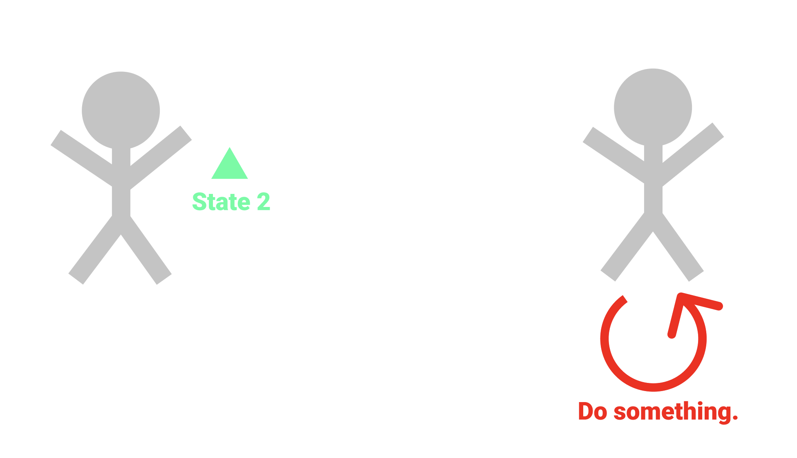
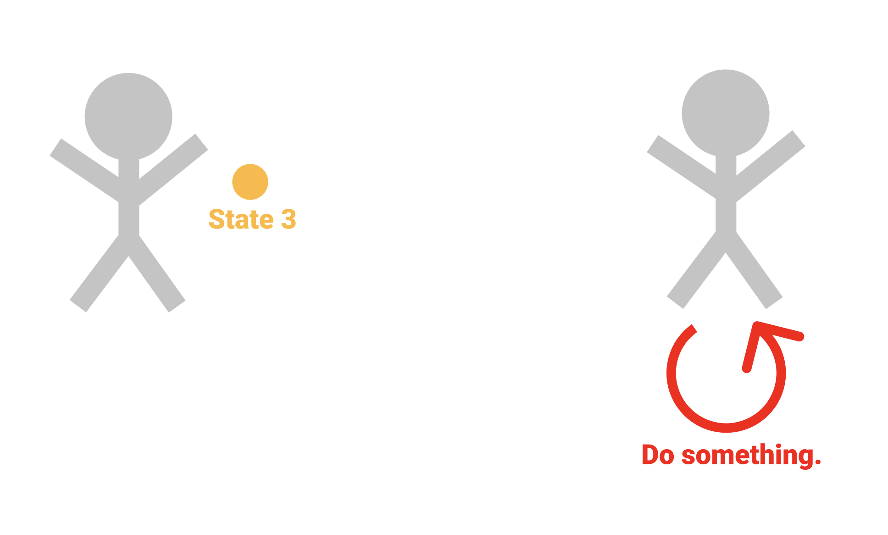

# Table of Contents
[[toc]]

## 반응형 프로그래밍
우리는 상대방의 말이나 행동에 잘 반응하는 사람을 `리액션(Reaction)`이 좋다고 합니다. `반응형(Reactive)`는 이 리액션의 형용사 형태입니다.

`반응형 프로그래밍(Reactive Programming)`은 어떤 <u>이벤트</u>나 <u>상태</u> 변화에 반응하는 것에 초점을 둔 프로그래밍 패러다임입니다. 

### 이벤트(Event) 기반의 반응형 프로그래밍
반응형 프로그래밍은 프로그래밍 언어나 라이브러리에 따라 구현하는 방법이 조금씩 다릅니다. 그러나 기본 구조는 비슷하며, 크게 두 가지 요소가 필요합니다.
- 이벤트를 발생시키는 주체
- 이벤트에 반응하는 주체

또한 이벤트에 반응하는 주체가 이벤트에 반응하겠다고 선언하는 작업이 필요합니다. 이를 보통 `구독(Subscribe)` 또는 `관찰(Observe)`이라고 합니다.

이제 이벤트를 발생시키는 주체가 이벤트를 발생하면 이에 반응하게 됩니다.

이벤트에 반응하는 주체는 이벤트가 발생할 때 마다 특정 작업을 수행하게 됩니다.

### 상태(State) 기반의 반응형 프로그래밍
반응형 프로그래밍은 `이벤트(Event)`가 아니라 `상태(State)의 변화`에 반응하도록 구현하기도 합니다.

상태를 가지고 있는 주체의 `상태(State)`가 변하면 이에 반응하게 됩니다.

또한 `상태(State)`가 변할 때 마다 이에 반응합니다.

## ReactiveX
[`ReactiveX`](http://reactivex.io/)는 이벤트 기반의 반응형 프로그래밍을 지원하는 라이브러리입니다. `ReactiveX`는 프로그래밍 언어에 따른 이름을 가지고 있습니다.
- `RxJava`: Java의 ReactiveX 라이브러리
- `RxKotlin`: Kotlin의 ReactiveX 라이브러리
- `RxSwift`: Swift의 ReactiveX 라이브러리
- `RxJS`: JavaScript의 ReactiveX 라이브러리