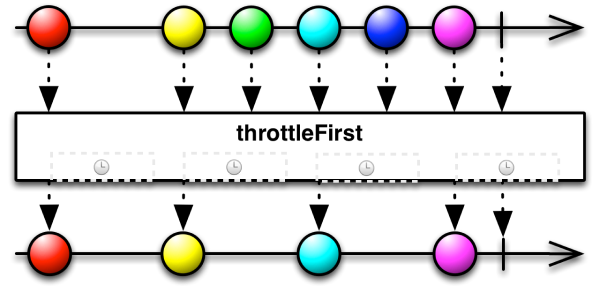
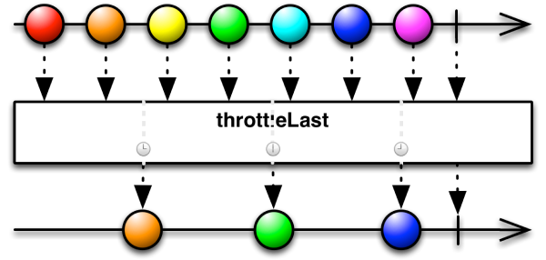
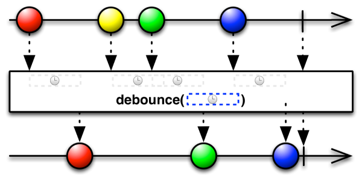
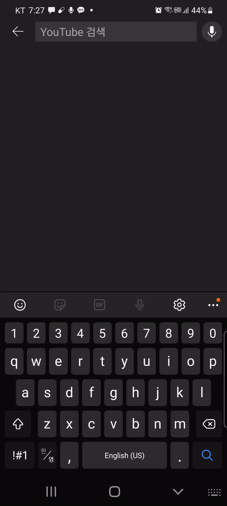

# Table of Contents

[[toc]]

# Observable 변형하기
`Observable`이 방출하는 데이터를 다양한 방식으로 변형할 수 있습니다.

## filter()
`filter()`는 방출되는 값을 필터링하는데 사용합니다. 방출되는 값에서 짝수만 출력해보겠습니다.
``` kotlin
val observable = Observable.fromArray(1, 2, 3, 4, 5, 6)

observable
    .filter {
        it % 2 == 0
    }
    .subscribe {
        println(it)
    }
```
결과는 다음과 같습니다.
```
2
4
6
```

## distinct()
`distinct()`는 방출되는 값 중 같은 값을 구분하는데 사용합니다.
``` kotlin
val observable = Observable.fromArray(1, 1, 2, 2, 3, 3, 1, 1, 2, 2, 3, 3)

observable
    .distinct()
    .subscribe {
        println(it)
    }
```
결과는 다음과 같습니다.
```
1
2
3
```

## distinctUntilChange()
`distinctUntilChange()`는 `distinct()`와 유사합니다. 다만 `distinct()`와는 다르게 중복을 허용합니다.
``` kotlin
val observable = Observable.fromArray(1, 1, 2, 2, 3, 3, 1, 1, 2, 2, 3, 3)

observable
    .distinctUntilChanged()
    .subscribe {
        println(it)
    }
```
```
1
2
3
1
2
3
```

## take()
`take()`는 먼저 발생한 이벤트를 기준으로 인자로 전달된 수 만큼의 이벤트만 수신합니다.
``` kotlin
val observable = Observable.fromArray(1, 2, 3, 4, 5)

observable
    .take(3)
    .subscribe {
        println(it)
    }
```
```
1
2
3
```

## takeLast()
`takeLast()`는 나중에 발생한 이벤트를 기준으로 인자로 전달된 수 만큼의 이벤트만 수신합니다.
``` kotlin
val observable = Observable.fromArray(1, 2, 3, 4, 5)

observable
    .takeLast(3)
    .subscribe {
        println(it)
    }
```
```
3
4
5
```

## skip()
`skip()`는 인자로 전달된 수 만큼의 이벤트를 먼저 발생한 순서대로 건너뜁니다.
``` kotlin
val observable = Observable.fromArray(1, 2, 3, 4, 5)

observable
    .skip(3)
    .subscribe {
        println(it)
    }
```
```
4
5
```

## skipLast()
`skipLast()`는 인자로 전달된 수 만큼의 이벤트를 나중에 발생한 순서대로 건너뜁니다.
``` kotlin
val observable = Observable.fromArray(1, 2, 3, 4, 5)

observable
    .skipLast(3)
    .subscribe {
        println(it)
    }
```
```
1
2
```

## throttle()
`RxBinding`을 사용하여 로그인 버튼을 클릭하면 서버와 통신하여 로그인 처리를 한다고 가정합시다.
``` kotlin
private val logInButton: Button by lazy { findViewById(R.id.activity_main_button) }

logInButton.clicks()
    .subscribe {
        api.logIn() // 서버와 통신하여 로그인 처리, 최대 2초가 소요된다고 가정
    }
```
만약 서버와의 통신이 끝나지 않았는데 또 다시 로그인 버튼을 클릭하면 문제가 발생할 수 있습니다. 이러한 문제를 `다중 터치`라고 합니다. `throttle()`를 사용하면 이 문제를 해결할 수 있습니다. `throttle()`함수에는 `throttleFirst()`와 `throttleLast()`가 있습니다.
### throttleFirst()
`throttleFirst()`는 일정 기간 동안 발생한 이벤트 중 첫 번째로 발생한 이벤트만 통과시키고, 나머지 이벤트를 무시합니다.



이제 첫 번째 클릭 이벤트가 발생한 후 3초 동안 클릭 이벤트를 무시할 수 있습니다.
``` kotlin
private val logInButton: Button by lazy { findViewById(R.id.activity_main_button) }

logInButton.clicks()
    .throttleFirst(3, TimeUnit.SECONDS)
    .subscribe {
        api.logIn() // 서버와 통신하여 로그인 처리, 최대 2초가 소요된다고 가정
    }
```
버튼을 짧은 시간 여러 번 클릭해도 3초 동안은 첫 이벤트 한번만 발생하는 것을 확인할 수 있습니다.

### throttleLast()
`throttleLast()`는 `throttleFirst()`와 유사합니다. 다만 첫 번째 이벤트가 아니라 마지막 이벤트만 방출합니다.



## debounce()
이번엔 검색창을 구현하다고 가정합시다.



`RxBinding`과 `EditText`의 텍스트 변화는 다음과 같이 탐지할 수 있습니다.
``` kotlin
private val editText: EditText by lazy { findViewById(R.id.activity_main_editText) }

// ...

editText
    .textChanges()
    .subscribe { text ->
        api.getSearchResults(text)  // 서버에 검색 결과 요청, 최대 1초 소요
    }
```
이 경우 글자 하나 바뀔 때 마다 서버에 데이터를 요청하는 것이 비효율적일 수 있습니다. 이러한 상황에서 `Observable`의 `debounce()`를 사용할 수 있습니다.

`debounce()`는 특정 시간이 지난 후에 마지막으로 들어온 이벤트만 수신합니다.



이제 2초가 지난 후 마지막으로 발생한 텍스트 변화 이벤트만 감지하도록 코드를 수정합니다.
``` kotlin
private val editText: EditText by lazy { findViewById(R.id.activity_main_editText) }

// ...

editText
    .textChanges()
    .debounce(2, TimeUnit.SECONDS)
    .subscribe { text ->
        api.getSearchResults(text)  // 서버에 검색 결과 요청, 최대 1초 소요
    }
```