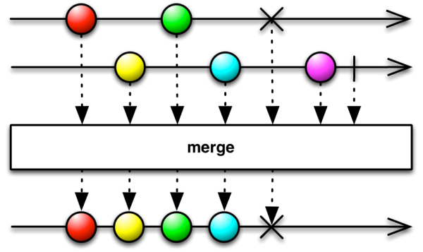
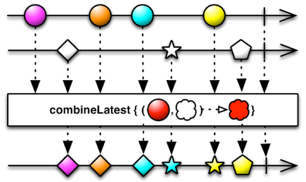
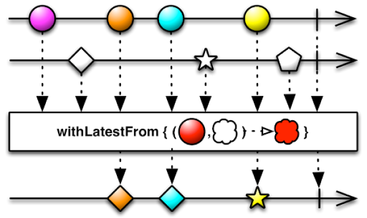
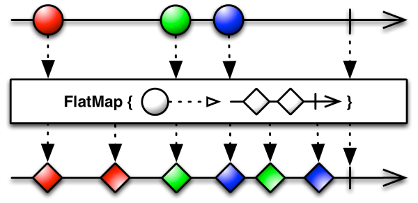
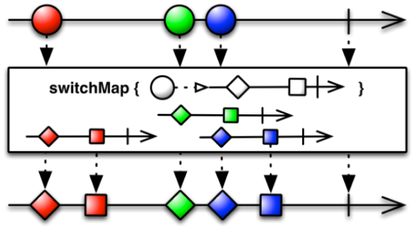
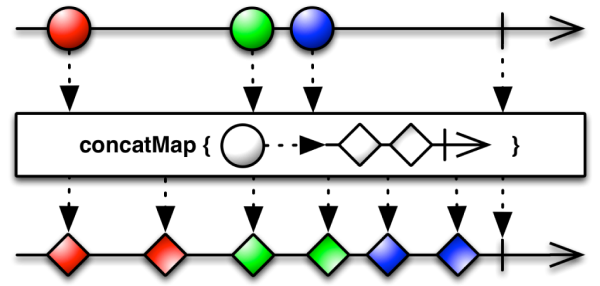

# Table of Contents

[[toc]]

# Observable 결합하기
`Observable`은 여러 Observable을 결합하는 다양한 메소드를 제공합니다.

## merge()
`merge()`을 사용하면 여러 개의 `Observable`을 하나의 `Observable`로 병합할 수 있습니다.



``` kotlin
val subject1 = BehaviorSubject.createDefault("A")
val subject2 = BehaviorSubject.createDefault(1)

Observable
    .merge(subject1, subject2)
    .subscribe {
        println(it)
    }

subject1.onNext("B")
subject2.onNext(2)
subject1.onNext("C")
subject2.onNext(3)
subject1.onNext("D")
```
결과는 다음과 같습니다.
```
A
1
B
2
C
3
D
```

## combineLatest()
`combineLatest()`는 두 개 이상의 `Observable` 각각에서 이벤트가 발생했을 때 이를 갱신해주는 함수입니다.



예제는 다음과 같습니다.
``` kotlin
val subject1 = BehaviorSubject.createDefault("Paul")
val subject2 = BehaviorSubject.createDefault(1)

Observable
    .combineLatest(subject1, subject2) { a, b ->
        "${a}, ${b}"
    }
    .subscribe {
        println(it)
    }

subject1.onNext("Joey")   

subject2.onNext(2)
subject1.onNext("Chandler")    
subject2.onNext(3)
subject1.onNext("Ross") 
``` 
결과는 다음과 같습니다.
``` 
Paul, 1
Joey, 1
Joey, 2
Chandler, 2
Chandler, 3
Ross, 3
``` 

## withLatestFrom()
`withLatestFrom()`는 두 개의 `Observable`을 결합하는데 사용합니다. 이 때 첫 번째 `Observable`에서 이벤트를 방출할 때 마다 두 번째 `Observable`의 최신 값을 함께 방출합니다.



예제는 다음과 같습니다.
``` kotlin
val subject1 = BehaviorSubject.createDefault("Paul")
val subject2 = BehaviorSubject.createDefault(1)

subject1
    .withLatestFrom(subject2) { name, number ->
        "${name}: ${number}"
    }
    .subscribe {
        println(it)
    }
// Paul: 1

subject1.onNext("Joey")     // Joey: 1

subject2.onNext(2)
subject1.onNext("Chandler")     // Chandler: 2

subject2.onNext(3)
subject1.onNext("Ross")     // Chandler: 3
```
결과는 다음과 같습니다.
```
Paul: 1
Joey: 1
Chandler: 2
Ross: 3
```

# map()
`map()`을 사용하면 `Observable`이 방출하는 이벤트를 변형할 수 있습니다.

예제 코드는 다음과 같습니다.

``` kotlin
val observable = Observable.create {
    it.onNext(1)
    it.onNext(2)
    it.onNext(3)
    it.onNext(4)
    it.onNext(5)
}

observable
    .map { 
        "Value: ${it}"
    }
    .subscribe {
        println(it)
    }
```
결과는 다음과 같습니다.
```
Value: 1
Value: 2
Value: 3
Value: 4
Value: 5
```

## flatMap()
`flatMap()`는 `Observable`에서 방출하는 이벤트 각각을 `Observable`로 변형합니다. 그리고 각각의 `Observable`을 합쳐 하나의 `Observable`을 생성합니다. 


예제 코드를 살펴봅시다.
``` kotlin
val observable = Observable.fromArray("Monica", "Rachel", "Phoebe")

observable
    .flatMap {
        Observable.create<String> { emitter ->
            emitter.onNext("Her name is ${it}")
            emitter.onNext("${it} lives in New York.")
        }
    }
    .subscribe {
        println(it)
    }.addTo(disposables)
```
결과는 다음과 같습니다.
```
Her name is Monica
Monica lives in New York.
Her name is Rachel
Rachel lives in New York.
Her name is Phoebe
Phoebe lives in New York.
```

## switchMap
`switchMap()`은 `flatMap()`과 유사합니다. 다만 아직 진행 중인 이전 이벤트가 있다면 이를 취소합니다. 


## concatMap
`switchMap()`도 `flatMap()`과 유사합니다. 다만 아직 진행 중인 이전 이벤트가 있다면 이를 취소하지않고 끝날 때 까지 기다린 후 방출합니다.
