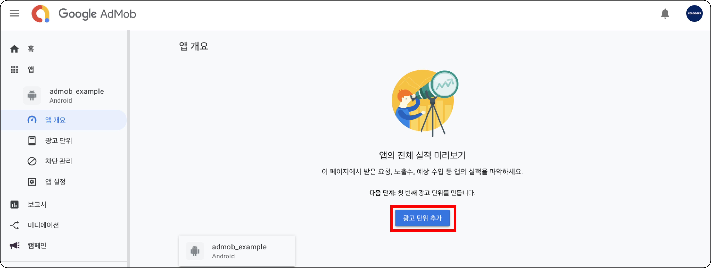

# Table of Contents
[[toc]]

# 구글 애드몹
`구글 애드몹(Google AdMob)`을 사용하면 안드로이드 어플리케이션에 광고를 추가할 수 있습니다.

## 회원가입 및 로그인
우선 [구글 애드몹](https://admob.google.com/intl/ko/home/)에 접속합니다. 계정이 없으면 회원가입을 하고 로그인합니다.


## 앱 추가
이제 첫 화면에서 `앱 > 앱 추가`로 이동합니다.


우선 `플랫폼`은 `Android`로 선택합니다. 


그리고 `지원되는 앱 스토어에 앱이 등록되어있나요?`는 `아니요`로 선택합니다. 

::: tip
앱이 구글 플레이스토어에 출시되었고 애드몹을 통해 수익을 창출할 예정이라면, 플레이스토어의 앱과 애드몹을 연결해야합니다. 이번 포스트에서는 테스트용 광고를 게재할 것이므로 '아니요'로 선택합니다. (만약 이미 플레이스토어에 앱을 출시한 상태라면 '예'를 선택합니다.)
:::


`앱 이름`을 입력하고 `앱 추가` 버튼을 클릭합니다.


다음 화면이 나오면 정상적으로 앱이 추가된 것입니다.


왼쪽 사이드 바 메뉴에서 `홈 > 모든 앱 보기`로 이동합니다.


이 곳에서 `앱 ID`를 확인할 수 있습니다. `앱 ID`는 `ca-app-pub-xxxxxxxxxxxx~yyyyyyyy`와 같은 형식입니다.


## 광고 단위 추가
앱 안에는 여러가지의 광고가 있을 수도 있습니다. 이 광고 각각을 `광고 단위`라고 합니다. 각 광고를 구분하기 위해 광고 단위에는 `광고 단위 ID`가 부여됩니다.

`앱 > 모든 앱 보기`에서 생성된 앱을 클릭합니다.


`광고 단위 추가`를 클릭합니다.



생성할 광고의 종류를 선택할 수 있습니다. `배너` 광고를 생성해보겠습니다.


`광고 단위 이름`을 입력합니다.


다음과 같은 화면이 나오면 정상적으로 광고 단위가 생성된 것입니다.


왼쪽 사이드 바 메뉴에서 `앱 > 광고 단위`로 이동하면 생성된 `광고 단위`와 `광고 단위 ID`를 확인할 수 있습니다.


## 의존성 추가
모듈 수준의 `build.gradle` 파일에 의존성을 추가해줍니다.
``` groovy
dependencies {
    // ...
    implementation 'com.google.android.gms:play-services-ads:19.1.0'
}
```
이제 `AndroidManifest.xml`을 수정합시다. `<meta-data>`태그를 사용하여 위에서 발급받은 `앱 ID`를 추가합니다.
``` xml
// AndroidManifest.xml
<?xml version="1.0" encoding="utf-8"?>
<manifest xmlns:android="http://schemas.android.com/apk/res/android"
    package="com.yologger.google_admob">

    <application
        android:allowBackup="true"
        android:icon="@mipmap/ic_launcher"
        android:label="@string/app_name"
        android:roundIcon="@mipmap/ic_launcher_round"
        android:supportsRtl="true"
        android:theme="@style/Theme.Googleadmob">
        <meta-data
            android:name="com.google.android.gms.ads.APPLICATION_ID"
            android:value="your_app_id"/>
        <!-- .. -->
    </application>

</manifest>
```

## 코드 작성
가장 먼저 `MobileAds`클래스의 `initialize()`메소드를 통해 에드몹 관련 초기화를 해야합니다. `onCreate()` 메서드에서 이 메소드를 호출합시다.
``` kotlin
// MainActivity.kt 
class MainActivity : AppCompatActivity() {
    override fun onCreate(savedInstanceState: Bundle?) {
        super.onCreate(savedInstanceState)
        setContentView(R.layout.activity_main)

        MobileAds.initialize(this, object : OnInitializationCompleteListener {
            override fun onInitializationComplete(p0: InitializationStatus?) {
                // 초기화가 완료되었을 때 수행할 코드
            }
        })
    }
}
```

이제 `MainActivity`의 레이아웃 파일에 `AdView`를 추가합니다.
``` xml
// activity_main.xml
<?xml version="1.0" encoding="utf-8"?>
<androidx.constraintlayout.widget.ConstraintLayout xmlns:android="http://schemas.android.com/apk/res/android"
    xmlns:app="http://schemas.android.com/apk/res-auto"
    xmlns:tools="http://schemas.android.com/tools"
    android:layout_width="match_parent"
    android:layout_height="match_parent"
    tools:context=".MainActivity">
    
    <com.google.android.gms.ads.AdView
        android:id="@+id/activity_main_adview"
        xmlns:ads="http://schemas.android.com/apk/res-auto"
        android:layout_width="wrap_content"
        android:layout_height="wrap_content"
        ads:adSize="BANNER"
        ads:adUnitId="ca-app-pub-3940256099942544/6300978111"
        ads:layout_constraintStart_toStartOf="parent"
        ads:layout_constraintEnd_toEndOf="parent"
        app:layout_constraintBottom_toBottomOf="parent">

    </com.google.android.gms.ads.AdView>

</androidx.constraintlayout.widget.ConstraintLayout>
```

`adSize`속성을 사용하면 광고의 크기를 설정할 수 있습니다. `adSize`속성 값은 다음과 같습니다.

|크기|설명|사용 가능 여부|AdSize 상수|
|------|---|---|---|
|320x50|배너|휴대전화 및 태블릿|BANNER|
|320x100|대형 배너|휴대전화 및 태블릿|LAEGE_BANNER|
|300x250|IAB 중간 직사각형|휴대전화 및 태블릿|MEDIUM_RECTANGLE|
|468x60|IAB 전체 크기 배너|태블릿|FULL_BANNER|
|728x90|IAB 리더보드|태블릿|LEADERBOARD|

물론 코드에서도 다음과 같이 배너 크기를 설정할 수 있습니다.
``` kotlin
val adSize = AdSize(300, 50)
```
`adUnitId속성`에는 `광고 유닛 ID`를 입력하면 됩니다.

::: tip
광고는 앱이 플레이스토어에 출시된 후에만 표시됩니다. 따라서 테스트 단계에서는 <u>테스트용 광고 유닛 ID</u>를 사용해야합니다. <u>테스트용 광고 유닛의 ID</u>는 [이 곳](https://developers.google.com/admob/android/test-ads?hl=ko)에서 확인할 수 있습니다.
:::

이제 광고를 읽어와 `AdView` 영역에 표시합니다. 이때 `AdRequest`클래스와 `AdView`클래스의 `loadAd()`메소드를 사용합니다.
``` kotlin
class MainActivity : AppCompatActivity() {

    lateinit var adView: AdView

    override fun onCreate(savedInstanceState: Bundle?) {
        super.onCreate(savedInstanceState)
        setContentView(R.layout.activity_main)

        MobileAds.initialize(this, object: OnInitializationCompleteListener {
            override fun onInitializationComplete(p0: InitializationStatus?) {
                // 초기화가 완료되었을 때 수행할 코드
            }
        })

        adView = findViewById(R.id.activity_main_adview)
        var adRequest = AdRequest.Builder().build()
        adView.loadAd(adRequest)
    }
}
```

이제 앱을 실행하면 하단에서 광고 배너를 확인할 수 있습니다.


`AdView` 객체에는 광고의 생명 주기 리스너도 붙여줄 수 있습니다.
``` kotlin
adView.adListener = object: AdListener() {
    override fun onAdLoaded() {
        // Code to be executed when an ad finishes loading.
    }

    override fun onAdFailedToLoad(adError : LoadAdError) {
        // Code to be executed when an ad request fails.
    }

    override fun onAdOpened() {
        // Code to be executed when an ad opens an overlay that
        // covers the screen.
    }

    override fun onAdClicked() {
        // Code to be executed when the user clicks on an ad.
    }

    override fun onAdClosed() {
        // Code to be executed when the user is about to return
        // to the app after tapping on an ad.
    }
}
```