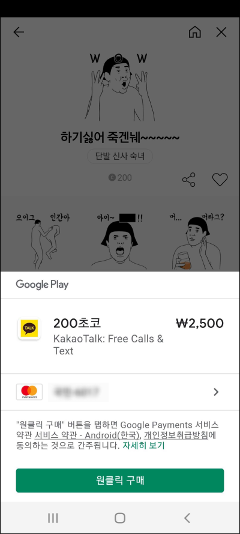
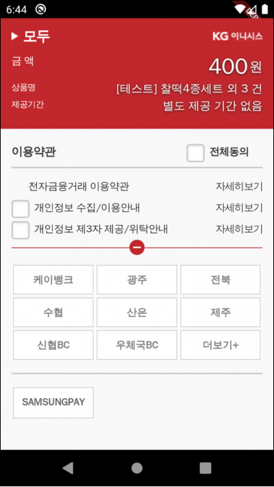

# Table of Contents
[[toc]]

# 결제
안드로이드 앱에서 결제를 구현하는 방식에는 크게 두 가지가 있습니다.

### 인앱 결제
`인앱 결제`는 [구글 결제 API(Google Play Billing API)](https://developers.google.com/pay/api/android/overview?hl=ko)를 사용하여 앱 내부에서 결제를 진행합니다. 인앱 결제를 사용하면 화면 하단에 다음과 같이 결제 구매 화면이 나타납니다.

인앱 결제의 거래 수수료는 고객이 결제하는 가격의 30%입니다. 즉, 개발자는 결제 금액의 70%만 수령하고 나머지 30%는 구글이 가져가게 됩니다.

### PG 결제
`PG(Payment Gateway)사`는 KG이니시스, 다날, LG유플러스 같이 결제창을 제공하는 회사입니다. PG 결제를 사용하면 다음과 같이 PG사가 제공하는 결제 화면으로 이동하게 됩니다.

PG 결제는 인앱 결제에 비해 훨씬 낮은 수수료를 부과합니다. (PG사에 따라 수수료는 달라질 수 있으며 보통 3% 내외입니다.)

# 무엇을 사용해야하는가
구글은 2020년 인앱결제 의무화 정책을 시행했습니다. 따라서 앱이 `디지털 제품`을 거래하면서 앱 내부 결제를 할 때는 무조건 구글 결제 API를 사용해야합니다. 여기서 말하는 `디지털 제품`는 게임 아이템, 게임 머니, 이모티콘, 웹툰 같은 온라인 제품을 의미합니다. 

이케아, 아마존, 쿠팡 같은 `실물 제품`은 구글 결제 API를 사용하지 않아도 됩니다. 또한 에어비엔비, 우버, 카카오 택시, 배달의 민족 같은 `실제 서비스`도 구글 결제 API를 사용하지 않아도 됩니다.