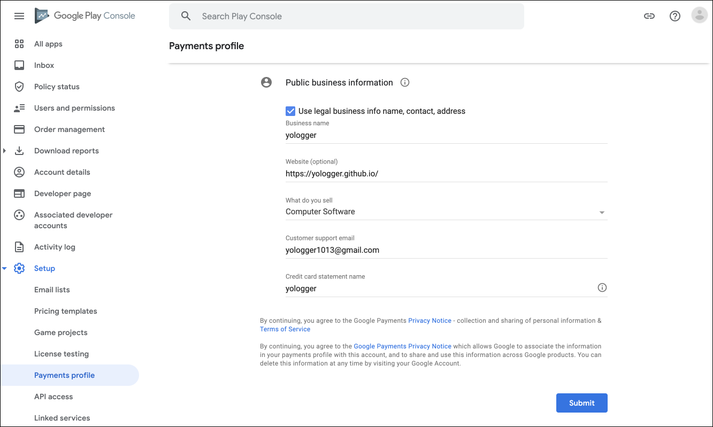

# Table of Contents
[[toc]]

## 디지털 제품
`구글 결제 API(Google Play Billing API)`를 사용하면 `디지털 제품`을 판매할 수 있습니다. 디지털 제품에는 두 종류가 있습니다.

### 일회성 제품
`일회성 제품(One-time product)`은 사용자가 한번만 결제하여 구매할 수 있는 제품입니다. 일회성 제품에는 두 종류가 있습니다.

- `소모품`: 게임 머니, 게임 화폐 같이 소비할 수 있는 제품입니다. 제품은 소비하면 다시 구매할 수 있습니다.
- `비소모품`: 한 번 구매하면 영구적으로 사용할 수 있는 제품입니다. 예를 들어 광고 제거, 프리미엄 버전 업그레이드가 있습니다.

### 정기 결제(구독)
`정기 결제(구독)`는 반복적으로 청구되는 제품입니다. 유튜브 프리미엄, 음악 스트리밍 서비스, 뉴스 구독이 대표적인 정기 결제입니다. 정기 결제는 사용자가 직접 취소할 때까지 자동으로 갱신 및 결제됩니다.

## 비소모품 결제 구현하기
다음과 같은 앱을 만들면서 비소모품 결제를 구현해보겠습니다.


### 개발자 계정 생성
앱을 테스트하거나 구글 플레이스토어에 출시하려면 `구글 개발자 계정`을 만들어야 합니다. [이 곳](http://play.google.com/apps/publish/signup)에 방문하여 구글 개발자 계정을 생성합니다. (현재는 미화로 25달러를 결제해야하며, 한번 결제 시 평생 이용할 수 있습니다.)

### 결제 프로필 작성
이전에 작성한 적이 없다면 `결제 프로필`을 새롭게 작성해야합니다. `왼쪽 사이드바 메뉴 > Setup > Payment profile`로 이동하여 `Create payments profile`을 클릭합니다.


다음 항목이 제대로 입력되어있는지 확인합니다.


- `Account type`: 계정 유형입니다. 개인과 기업으로 구분됩니다.
- `Tax information`: 세금 정보입니다. 개인 사업자와 법인 사업자로 구분됩니다.
- `Name and address`: 사업장 이름과 주소입니다.



- `Business name`: 사업장 이름 입니다.
- `Website`: 사업장 웹 사이트입니다.
- `What do you sell`: 판매할 상품입니다.
- `Customer support email`: 고객 지원 메일입니다.
- `Credit card statement name`: 신용카드 명세서 이름입니다.

### 구글 플레이 콘솔에 앱 생성하기

`구글 플레이 콘솔 > All apps > Create app`을 선택합니다.


`App details`의 하위 항목을 입력합니다.


- `App name`: 플레이 스토어에 출시되는 앱 이름
- `Default launguage`: 기본 언어
- `App or game`: 게임 앱인 경우 game, 그 외에는 App 
- `Free or paid`: 무료 앱인 경우 free, 유료 앱인 경우 paid

`Declarations`의 하위 항목을 모두 체크합니다.


- `Developer Program Policies`: 개발자 프로그램 정책에 동의
- `US export laws`: 미국 수출법규에 동의

`구글 플레이 콘솔 > All apps`을 선택하면 생성한 앱을 확인할 수 있습니다.


### 의존성 설정
안드로이드 스튜디오에서 새로운 프로젝트를 생성하고 모듈 수준의 `build.gradle`에 의존성을 추가합니다.

``` groovy
// 모듈 수준의 build.gradle

def billing_version = "4.0.0"
implementation "com.android.billingclient:billing:$billing_version"
```

코틀린을 사용한다면 다음 의존성도 추가합니다.
``` groovy
// 모듈 수준의 build.gradle

implementation "com.android.billingclient:billing-ktx:$billing_version"
```

코루틴을 사용한다면 다음 의존성을 추가합니다.
``` groovy
// 모듈 수준의 build.gradle

def lifecycle_version = '2.2.0' 
implementation "androidx.lifecycle:lifecycle-runtime-ktx:$lifecycle_version"
```

### 권한 추가
`AndroidManifest.xml`에 인터넷 권한과 결제 권한을 추가합니다.
``` xml
// AndroidManifest.xml

<?xml version="1.0" encoding="utf-8"?>
<manifest xmlns:android="http://schemas.android.com/apk/res/android"
    package="com.yologger.inapp_payment_consumable_product">

    <uses-permission android:name="android.permission.INTERNET"/>
    <uses-permission android:name="com.android.vending.BILLING"/>

</manifest>
```

### APK 파일 업로드
앱에서 판매할 상품은 구글 플레이 콘솔의 `Monetize > Products > In-app products`에서 추가합니다. 그러나 APK 파일을 업로드하지 않으면 이 페이지가 활성화되지 않습니다.


따라서 의존성과 권한만을 추가한 APK 파일을 업로드 하겠습니다. 실제 결제 로직은 다음 단계에서 구현합니다. 

::: tip
구글 결제 API는 디버그 모드에서 테스트할 수 없습니다. 내부 테스트, 비공개 테스트, 공개 테스트, 정식 출시 중 어떤 형태로든 구글 플레이스토어에 출시가 되어야합니다. 이 포스트에서는 내부 테스트에 APK 파일을 업로드합니다.
:::
::: tip
결제 테스트 시 구글 개발자 계정이 아닌 <u>다른 구글 계정</u>이 필요합니다. 구글 개발자 계정으로는 테스트할 수 없습니다.
:::

`Testing > Internal Testing`으로 이동한 후 `Create new release`를 선택합니다.


`Upload`를 클릭하고 APK 파일을 업로드합니다. 그리고 `Save`와 `Review release`를 순서대로 클릭합니다.


### 판매할 상품 등록하기
다시 구글 플레이 콘솔의 `Monetize > Products > In-app products`로 이동합니다. 이제 아이템을 추가할 수 있게 되었습니다. `Create product` 버튼을 클릭합니다.


상품 정보를 입력합니다.


- `Product ID`: 코드에서 판매 가능한 아이템을 조회할 때 사용하는 ID 
- `Name`: 판매할 상품의 이름
- `Description`: 판매할 상품의 자세한 설명

가격 정보를 입력하기 위해 `Set price`를 클릭합니다.


가격을 입력하고 `Apply prices`을 클릭합니다.


`Save`버튼을 눌러 저장합니다.


마지막으로 `Active`버튼을 눌러 상품을 활성화합니다.


상품이 정상적으로 추가되었습니다.


### 라이선스 테스트에 계정 등록
라이선스 테스트에 등록한 계정은 결제를 해도 실제로 청구가 이루어지지 않습니다.


`Setup > License testing`으로 이동하여 이메일을 추가하면 됩니다.


라이선스 테스트에서 계정을 등록하지 않으면 구글 계정에 등록한 카드로 실제 결제됩니다.


실제로 결제되면 구매자 Gmail 계정으로 영수증이 전송됩니다.


만약 카드사에서 문자서비스를 신청했다면 결제 내역이 문자 메시지로 전송되기도 합니다.


판매자는 `Google Play Console > Order managerment`에서 판매 내역을 확인할 수 있습니다.


오른쪽 화살표를 누르면 상세한 구매 내역도 확인할 수 있습니다. 인앱 결제 수수료를 제외한 금액도 확인할 수 있으며, 환불도 가능합니다.


### 레아아웃 디자인하기
화면 레이아웃은 다음과 같습니다.


``` xml
// activity_main.xml
<LinearLayout xmlns:android="http://schemas.android.com/apk/res/android"
    xmlns:tools="http://schemas.android.com/tools"
    xmlns:app="http://schemas.android.com/apk/res-auto"
    android:layout_width="match_parent"
    android:layout_height="match_parent"
    android:orientation="vertical"
    tools:context=".MainActivity">

    <androidx.constraintlayout.widget.ConstraintLayout
        android:id="@+id/activity_main_constraintLayout_ad"
        android:layout_width="match_parent"
        android:layout_height="100dp"
        android:background="#FFB9B9">
        <TextView
            android:layout_width="wrap_content"
            android:layout_height="wrap_content"
            app:layout_constraintTop_toTopOf="parent"
            app:layout_constraintBottom_toBottomOf="parent"
            app:layout_constraintStart_toStartOf="parent"
            app:layout_constraintEnd_toEndOf="parent"
            android:text="This is advertisement"/>
    </androidx.constraintlayout.widget.ConstraintLayout>

    <androidx.constraintlayout.widget.ConstraintLayout
        android:layout_width="match_parent"
        android:layout_height="0dp"
        android:layout_weight="1"
        android:background="#FFFFFF">

        <TextView
            android:id="@+id/activity_main_textview"
            android:layout_width="wrap_content"
            android:layout_height="wrap_content"
            android:text="This is MainActivity"
            app:layout_constraintTop_toTopOf="parent"
            app:layout_constraintStart_toStartOf="parent"
            app:layout_constraintEnd_toEndOf="parent"
            app:layout_constraintBottom_toTopOf="@+id/activity_main_button_remove_ad"/>
        <Button
            android:enabled="false"
            android:id="@+id/activity_main_button_remove_ad"
            android:layout_width="wrap_content"
            android:layout_height="wrap_content"
            android:textAllCaps="false"
            android:text="Remove Advertisement"
            app:layout_constraintTop_toBottomOf="@+id/activity_main_textview"
            app:layout_constraintBottom_toBottomOf="parent"
            app:layout_constraintStart_toStartOf="parent"
            app:layout_constraintEnd_toEndOf="parent"/>

    </androidx.constraintlayout.widget.ConstraintLayout>

</LinearLayout>
```
``` kotlin
class MainActivity : AppCompatActivity() {

    private val viewAdvertisement: ConstraintLayout by lazy { findViewById<ConstraintLayout>(R.id.activity_main_constraintLayout_ad) }
    private val buttonRemoveAdvertisement: Button by lazy { findViewById<Button>(R.id.activity_main_button_remove_ad) }

    override fun onCreate(savedInstanceState: Bundle?) {
        super.onCreate(savedInstanceState)
        setContentView(R.layout.activity_main)
    }
}
```

### BillingManager 클래스 정의
결제 관련 작업을 담당하는 `BillingManager`클래스를 정의하겠습니다. 또한 결제 관련 작업이 완료되었을 때 호출할 콜백을 인터페이스 형태로 정의합시다. `BillingManager`는 생성자의 인자로 액티비티와 콜백을 전달받습니다.

``` kotlin
// BillingMananger.kt
class BillingManager(
    private val activity: Activity,
    private val callback: Callback
) {
    interface Callback {
        fun onBillingManagerReady()
        fun onSuccess(purchase: Purchase)
        fun onFailure(errorCode: Int)
    }
}
```

- `onBillingManagerReady()`: 결제 준비가 완료되었을 때 호출되는 메소드
- `onSuccess(purchase: Purchase)`: 결제가 성공되었을 때 호출되는 메소드
- `onFailure(errorCode: Int)`: 결제가 실패했을 때 호출되는 메소드

`MainActivity`에서 `BillingManager`의 인스턴스를 생성합시다.

``` kotlin
// MainActivity.kt
class MainActivity : AppCompatActivity() {

    private val viewAdvertisement: ConstraintLayout by lazy { findViewById<ConstraintLayout>(R.id.activity_main_constraintLayout_ad) }
    private val buttonRemoveAdvertisement: Button by lazy { findViewById<Button>(R.id.activity_main_button_remove_ad) }

    private lateinit var billingManager: BillingManager

    override fun onCreate(savedInstanceState: Bundle?) {
        super.onCreate(savedInstanceState)
        setContentView(R.layout.activity_main)
        setupBilling()
    }

    private fun setupBilling() {
        billingManager = BillingManager(this, object : BillingManager.Callback {

            override fun onBillingManagerReady() {
                // ...
            }

            override fun onSuccess(purchase: Purchase) {
                // ...
            }

            override fun onFailure(errorCode: Int) {
                // ...
            }
        })
    }
}
```

### BillingClient 객체 초기화
구글 결제 API는 결제 관련 작업을 위해 `BillingClient`클래스를 제공합니다. `BillingManager`에서 클래스의 인스턴스를 생성합니다.

``` kotlin
// BillingMananger.kt
class BillingManager(
    private val activity: Activity,
    private val callback: Callback
) {
    // ...
    private val purchasesUpdatedListener = PurchasesUpdatedListener { billingResult, purchases ->
        // ...
    }

    private val billingClient = BillingClient.newBuilder(activity)
        .setListener(purchasesUpdatedListener)
        .enablePendingPurchases()
        .build()
}
```

`BillingClient`객체를 생성할 때 `setListener()`함수에 `PurchasesUpdatedListener`의 구현체를 전달합니다. 이 구현체의 메소드는 결제를 요청한 후 호출됩니다. 이 메소드 안에서 결제 성공여부를 확인할 수 있습니다.

``` kotlin
// BillingMananger.kt
class BillingManager(
    private val activity: Activity,
    private val callback: Callback
) {
    // ...
    private val purchasesUpdatedListener = PurchasesUpdatedListener { billingResult, purchases ->
        if (billingResult.responseCode == BillingClient.BillingResponseCode.OK && purchases != null) {
            // 구매 성공 시
        } else {
            // 구매 실패 시
        }
    }

    private val billingClient = BillingClient.newBuilder(activity)
        .setListener(purchasesUpdatedListener)
        .enablePendingPurchases()
        .build()
}
```

### 앱과 Google Play 연결하기 
이제 앱과 Google Play를 연결해야합니다. `BillingClient`클래스의 `startConnection()`을 호출하면 됩니다. `BillingMananger`클래스의 인스턴스를 생성할 때 가장 먼저 호출되는 `init`구문에서 이 메소드를 호출합시다.

``` kotlin
// BillingMananger.kt
class BillingManager(
    private val activity: Activity,
    private val callback: Callback
) {
    // ...

    init {
        billingClient.startConnection(object : BillingClientStateListener {

            override fun onBillingSetupFinished(billingResult: BillingResult) {
                when (billingResult.responseCode) {
                    BillingClient.BillingResponseCode.OK -> {
                        // Google Play와의 연결이 성공했을 때
                        callback.onBillingManagerReady()
                    }
                    else -> {
                        // Google Play와의 연결이 실패했을 때
                        callback.onFailure(billingResult.responseCode)
                    }
                }
            }

            override fun onBillingServiceDisconnected() {
                // Google Play와 연결이 끊어졌을 때 재시도하는 로직
            }
        })
    }
}
```
- `onBillingSetupFinished()`: 앱과 Google Play의 연결되었을 때 호출됩니다. 이 안에서 연결 성공 또는 실패에 따라 분기처리를 합니다.
- `onBillingServiceDisconnected()`: 앱과 Google Play의 연결이 끊어졌을 때 호출됩니다. 이 안에는 보통 연결을 재시도하는 로직이 포함됩니다.

`MainActivity`에서 `BillingManager`클래스의 인스턴스를 생성합니다. 그리고 앱과 구글 플레이가 연결되면 구매 버튼을 활성화 합니다.
``` kotlin
// MainActivity.kt
class MainActivity : AppCompatActivity() {

    private val viewAdvertisement: ConstraintLayout by lazy { findViewById<ConstraintLayout>(R.id.activity_main_constraintLayout_ad) }
    private val buttonRemoveAdvertisement: Button by lazy { findViewById<Button>(R.id.activity_main_button_remove_ad) }

    private lateinit var billingManager: BillingManager

    override fun onCreate(savedInstanceState: Bundle?) {
        super.onCreate(savedInstanceState)
        setContentView(R.layout.activity_main)
        setupBilling()
    }

    private fun setupBilling() {
        billingManager = BillingManager(this, object : BillingManager.Callback {

            override fun onBillingManagerReady() {
                // 구매 버튼 활성화
                enableButtonUpgrade()
            }

            override fun onSuccess(purchase: Purchase) {
                // ...
            }

            override fun onFailure(errorCode: Int) {
                // ...
            }
        })
    }

    private fun enableUpgradeButton () {
        buttonRemoveAdvertisement.isEnabled = true
    }
}
```

구글 결제 API는 [`BillingResult`](https://developer.android.com/reference/com/android/billingclient/api/BillingResult?hl=ko) 형식으로 오류를 반환합니다. `BillingResult`에는 [`BillingResponseCode`](https://developer.android.com/reference/com/android/billingclient/api/BillingClient.BillingResponseCode?hl=ko)가 포함되어 있어 앱에서 발생할 수 있는 결제 관련 오류를 구분할 수 있습니다. 또한 `BillingResult`에는 개발 중에 오류를 진단하는 데 유용한 [디버그 메시지](https://developer.android.com/reference/com/android/billingclient/api/BillingResult?hl=ko#getDebugMessage())도 포함되어 있습니다.

``` kotlin
// MainActivity.kt 
class MainActivity : AppCompatActivity() {

    // ...

    private fun setupBilling() {

        billingManager = BillingManager(this, object : BillingManager.Callback {

            // ...

            override fun onFailure(errorCode: Int) {
                when (errorCode) {
                    BillingClient.BillingResponseCode.ITEM_ALREADY_OWNED -> {
                        Toast.makeText(this@MainActivity, "Cannot find item.", Toast.LENGTH_LONG).show()
                    }
                    BillingClient.BillingResponseCode.USER_CANCELED -> {
                        Toast.makeText(this@MainActivity, "Purchase cancelled.", Toast.LENGTH_SHORT).show()
                    }
                    else -> {
                        Toast.makeText(applicationContext, "Error: $errorCode", Toast.LENGTH_SHORT).show()
                    }
                }
            }
        })
    }
}
```

### 상품정보 불러오기
이제 판매할 상품(구글 플레이에서 등록한 상품)의 정보를 불러와야합니다. `BillingManager`클래스에 상품 정보를 불러오는 `querySkuDetails()`을 정의합니다.

``` kotlin
// BillingMananger.kt
class BillingManager(
    private val activity: Activity,
    private val callback: Callback
) {
    // ...

    fun querySkuDetails(
        type: String = BillingClient.SkuType.INAPP,
        vararg skuIDs: String,
        querySkuDetailsCallback: (List<SkuDetails>) -> Unit
    ) {
        // ...
    }
}
```

상품 정보를 불러올 때는 `BillingClient`클래스의 `querySkuDetailsAsync()`를 호출합니다. 이 메소드는 `SkuDetailsParam`클래스의 인스턴스를 인자로 전달받습니다.

``` kotlin
// BillingMananger.kt
class BillingManager(
    private val activity: Activity,
    private val callback: Callback
) {
    // ...

    fun querySkuDetails(
        type: String = BillingClient.SkuType.INAPP,
        vararg skuIDs: String,
        onResult: (List<SkuDetails>) -> Unit
    ) {

        val params = SkuDetailsParams.newBuilder()
            .setSkusList(skuIDs.toList())
            .setType(type)
            .build()

        billingClient.querySkuDetailsAsync(params) { billingResult: BillingResult, skuDetailsList: List<SkuDetails>? ->
            if (billingResult.responseCode == BillingClient.BillingResponseCode.OK) {
                onResult(skuDetailsList ?: emptyList())
            } else {
                callback.onFailure(billingResult.responseCode)
            }
        }
    }
}
```
`setSkusList()`의 인자로 조회할 제품들의 id를 리스트 형태로 전달합니다. 또한 `setType()`의 인자로 제품의 타입을 전달합니다. 제품의 타입은 다음과 같습니다.
- `BillingClient.SkuType.INAPP`: 일회성 제품(소모품, 비소모품)
- `BillingClient.SkuType.SUBB`: 정기 결제(구독)

`MainActivity`에서 앱과 구글 플레이가 연결되었을 때 상품 목록을 조회하도록 구현합시다.
``` kotlin
// BillingMananger.kt
class MainActivity : AppCompatActivity() {

    // ...

    private var skuId = "non_consumable_product_id"

    private lateinit var billingManager: BillingManager

    private var mSkuDetailsList = listOf<SkuDetails>()

    override fun onCreate(savedInstanceState: Bundle?) {
        super.onCreate(savedInstanceState)
        setContentView(R.layout.activity_main)
        setupBilling()
    }

    private fun setupBilling() {
        billingManager = BillingManager(this, object : BillingManager.Callback {

            override fun onBillingManagerReady() {
                // 구매 버튼 활성화
                enableButtonPurchase()

                // 구매 가능한 제품 목록 조회
                billingManager.querySkuDetails(BillingClient.SkuType.INAPP, skuId) { skuDetailsList: List<SkuDetails> ->
                    // 조회한 제품 목록 저장
                    mSkuDetailsList = skuDetailsList
                }
            }

            override fun onSuccess(purchase: Purchase) {
                // ...
            }

            override fun onFailure(errorCode: Int) {
                // ...
            }
        })
    }
}
```
[`SkuDetails`](https://developer.android.com/reference/com/android/billingclient/api/SkuDetails?hl=ko)클래스에는 판매 가능한 제품의 세부정보가 포함되어있습니다. 자주 사용하는 메소드는 다음과 같습니다.
- `getTitle()`: 상품 이름
- `getDescription()`: 상품 상세 정보
- `getPrice()`: 상품 가격
- `getType()`: 상품 타입

보통 `SkuDetails`를 사용하여 판매할 상품의 정보를 화면에 보여줍니다.

### 상품 구매하기
상품을 구매하고 결제하는 `purchase()`를 `BillingManager`클래스에 구현합니다. 

``` kotlin
// BillingMananger.kt
class BillingManager(
    private val activity: Activity,
    private val callback: Callback
) {
    // ...

    fun purchase(skuDetails: SkuDetails) {

        val flowParams = BillingFlowParams.newBuilder()
            .setSkuDetails(skuDetails)
            .build()

        // 구매화면 표시
        val responseCode = billingClient.launchBillingFlow(activity, flowParams).responseCode
        // Go to PurchasesUpdatedListener
    }
}
```

`BillingClient`클래스의 `launchBillingFlow()`를 호출하면 다음과 같이 결제 화면이 표시되며 결제 프로세스를 시작합니다.


이 메서드는 [`BillingClient.BillingResponseCode`](https://developer.android.com/reference/com/android/billingclient/api/BillingClient.BillingResponseCode?hl=ko)에 나열된 몇 가지 응답 코드 중 하나를 반환합니다. 이 값을 체크하여 결제 프로세스가 성공적으로 시작되었는지 확인할 수 있습니다. 결제 프로세스가 성공적으로 시작되면 `BillingClient.BillingResponseCode.OK`를 반환합니다.

``` kotlin
// BillingMananger.kt
class BillingManager(
    private val activity: Activity,
    private val callback: Callback
) {
    // ...
    fun purchase(skuDetails: SkuDetails) {

        val flowParams = BillingFlowParams.newBuilder()
            .setSkuDetails(skuDetails)
            .build()

        // 구매화면 표시
        val responseCode = billingClient.launchBillingFlow(activity, flowParams).responseCode
        // Go to PurchasesUpdatedListener

        if (responseCode != BillingClient.BillingResponseCode.OK) {
            // 구매 화면을 여는데 실패하면 이 부분이 호출
            callback.onFailure(responseCode)
        }
    }
}
```

`launchBillingFlow()`는 결제 프로세스가 끝나면 결제가 성공적으로 완료되든, 사용자가 결제를 취소하든, 결제 프로세스에서 에러가 발생하든 상관없이 `BillingClient`클래스의 인스턴스를 초기화할 때 지정한 리스너로 이동하게 됩니다. 이 리스너에서 결제 프로세스의 결과를 처리할 수 있습니다.
``` kotlin
// BillingMananger.kt
class BillingManager(
    private val activity: Activity,
    private val callback: Callback
) {
    // ...
    private val purchasesUpdatedListener = PurchasesUpdatedListener { billingResult, purchases ->
        if (billingResult.responseCode == BillingClient.BillingResponseCode.OK && purchases != null) {
            // 구매 성공 시 
        } else {
            // 구매 실패 시
            callback.onFailure(billingResult.responseCode)
        }
    }

    private val billingClient = BillingClient.newBuilder(activity)
        .setListener(purchasesUpdatedListener)
        .enablePendingPurchases()
        .build()

    // ...
}
```

버튼을 눌렀을 때 `purchase()`를 호출합니다.
``` kotlin
// MainActivity.kt
class MainActivity : AppCompatActivity() {

    private val viewAdvertisement: ConstraintLayout by lazy { findViewById<ConstraintLayout>(R.id.activity_main_constraintLayout_ad) }
    private val buttonRemoveAdvertisement: Button by lazy { findViewById<Button>(R.id.activity_main_button_remove_ad) }

    private lateinit var billingManager: BillingManager

    private var skuId = "non_consumable_product_id"

    private var mSkuDetailsList = listOf<SkuDetails>()
    
    override fun onCreate(savedInstanceState: Bundle?) {
        setupUI()
        // ...
    }

    private fun setupUI() {
        buttonRemoveAdvertisement.setOnClickListener {
            purchase()
        }
    }

    private fun purchase() {
        for (skuDetail in mSkuDetailsList) {
            if (skuDetail.sku == skuId) {
                billingManager.purchase(skuDetail)
            } else {
                Toast.makeText(this@MainActivity, "Cannot find item.", Toast.LENGTH_LONG).show()
            }
        }
    }
}
```

### 구매 처리
소모품은 정상적으로 구매 완료 시 `소비(Consume)`를 했습니다. 비소모품은 정상적으로 구매 완료 시 `구매 인정(Acknowledge)`을 해야합니다.

::: tip
3일 이내 <u>구매 인정(Acknowledge)</u>을 하지 않으면 자동으로 환불됩니다.
:::

`BillingManager` 클래스에 구매 완료 시 `구매 인정(Acknowledge)`하는 `handlePurchase()`를 구현합시다. 이 메소드 안에서 `BillingClient`클래스의 `acknowledgePurchase()`를 호출하면 비동기적으로 구매를 `구매 인정(Acknowledge)`합니다. 

``` kotlin
// BillingMananger.kt
class BillingManager(
    private val activity: Activity,
    private val callback: Callback
) {
    // ...
    private fun handlePurchase(purchase: Purchase) {

        if (purchase.purchaseState == Purchase.PurchaseState.PURCHASED) {
            if (!purchase.isAcknowledged) {

                val acknowledgePurchaseParams = AcknowledgePurchaseParams.newBuilder()
                    .setPurchaseToken(purchase.purchaseToken)
                    .build()

                var runnable = Runnable {
                    billingClient.acknowledgePurchase(acknowledgePurchaseParams) { billingResult ->
                        if (billingResult.responseCode == BillingClient.BillingResponseCode.OK) {
                            // 구매 인정(Acknowledge)에 성공했을 때
                            callback.onSuccess(purchase)
                        } else {
                            // 구매 인정(Acknowledge)에 실패했을 때
                            callback.onFailure(billingResult.responseCode)
                        }
                    }
                }

                var thread = Thread(runnable)
                thread.start()
            } 
        }
    }
}
```

구매가 성공했을 때 `handlePurchase()`를 호출해서 비소비품을 `구매 인정(Acknowledge)`합니다.

``` kotlin
// BillingMananger.kt
class BillingManager(
    private val activity: Activity,
    private val callback: Callback
) {
    // ...
    private val purchasesUpdatedListener = PurchasesUpdatedListener { billingResult, purchases ->
        if (billingResult.responseCode == BillingClient.BillingResponseCode.OK && purchases != null) {
            // 구매 성공
            for (purchase in purchases) {
                // 비소모품은 정상적으로 구매 완료 시 인정(Acknowledge)해야합니다.
                // 3일 이내 인정(Acknowledge)하지 않으면 자동으로 환불됩니다.
                handlePurchase(purchase)
            }

        } else {
            // 구매 실패
            callback.onFailure(billingResult.responseCode)
        }
    }

    private val billingClient = BillingClient.newBuilder(activity)
        .setListener(purchasesUpdatedListener)
        .enablePendingPurchases()
        .build()

    private fun handlePurchase() {
        // ...
    }
}
```

### 구매 가져오기
구매를 했으나 네트워크 문제 같은 외부적인 이유로 `구매 인정(Acknowledge)`가 되지 않을 수도 있습니다. 따라서 구매는 되었으나 `구매 인정(Acknowledge)`되지 않은 구매를 `구매 인정(Acknowledge)`하는 코드를 추가합시다.

``` kotlin
// BillingMananger.kt
class BillingManager(
    private val activity: Activity,
    private val callback: Callback
) {
    // ...

    fun checkIfPurchasedButNotAcknowledged(type: String = BillingClient.SkuType.INAPP) {
        if (billingClient.isReady) {
            // 모든 구매 조회하기
            billingClient.queryPurchasesAsync(type) { _: BillingResult, purchases: List<Purchase> ->
                if (purchases.isNotEmpty()) {
                    for (purchase in purchases) {
                        // 구매되었다면
                        if (purchase.purchaseState == Purchase.PurchaseState.PURCHASED) {
                            // 구매되었으나 인정되지 않았다면
                            if (!purchase.isAcknowledged) {
                                handlePurchase(purchase)
                            }
                        }
                    }
                } 
            }
        } 
    }
}
```

`BillingClient`객체의 `queryPurchaseAsync()`를 호출하면 모든 구매를 조회할 수 있습니다. 또한 조회한 `Purchase`객체의 `isAcknowledged`속성을 확인하면 구매했으나 `인정(Acknowledge)`하지 않은 구매를 확인할 수 있습니다.

`MainActivity`의 `onResume()`에서 위 함수를 호출합니다.

``` kotlin
// MainActivity.kt
class MainActivity : AppCompatActivity() {

    // ...

    override fun onResume() {
        super.onResume()
        billingManager.checkIfPurchasedButNotAcknowledged()
    }
}
```

### 자원 해제
`BillingClient`객체를 다 사용하면 연결을 끊어 자원을 해제해줍니다. `BillingClient`클래스의 `endConnection()`를 호출하면 구글 콘솔 플레이와의 연결이 해제됩니다.
``` kotlin
// BillingMananger.kt
class BillingManager(
    private val activity: Activity,
    private val callback: Callback
) {
    // ...

    fun endConnection() {
        billingClient.endConnection()
    }
}
``` 

`MainActivity`의 `onDestroy()`에서 이 함수를 호출합니다.
``` kotlin
// MainActivity.kt
class MainActivity : AppCompatActivity() {

    // ...

    override fun onDestroy() {
        super.onDestroy()
        billingManager.endConnection()
    }
}
```

### 비소모품을 이미 구매했는지 확인하기
비소모품은 앱에서 한 번만 구매할 수 있습니다. 그런데 이 앱에는 문제가 있습니다. 앱을 재시작하면 비소모품을 구매했음에도 여전히 광고가 보입니다. 또한 앱을 삭제 후 재설치해도 광고가 계속 보입니다. 따라서 앱을 시작할 때 비소모품을 이미 구매했는지 확인해야합니다.

`BillingManager`클래스에 `checkIfAlreadyPurchased()`함수를 추가합시다.
``` kotlin
// BillingManager.kt
class BillingManager(
    private val activity: Activity,
    private val callback: Callback
) {
    // ...

    fun checkIfAlreadyPurchased(
        sku: String,
        type: String = BillingClient.SkuType.INAPP,
        onResult: (isAlreadyPurchased: Boolean) -> Unit
    ) {
        // ...
    } 
}
```

환불된 상품은 `queryPurchaseAsych()`에서 조회되지 않습니다. 이 특징을 사용하여 이미 구매했는지 확인할 수 있습니다.
``` kotlin
// BillingManager.kt
class BillingManager(
    private val activity: Activity,
    private val callback: Callback
) {
    // ...

    fun checkIfAlreadyPurchased(
        sku: String,
        type: String = BillingClient.SkuType.INAPP,
        onResult: (isAlreadyPurchased: Boolean) -> Unit
    ) {
        // queryPurchaseAsync()는 이전에 샀던 구매를 반환
        // 구매하지 않았거나 환불된 제품은 queryPurchasesAsync()에서 조회되지 않습니다.
        billingClient.queryPurchasesAsync(type) { billingResult, purchasesList ->
            if (billingResult.responseCode == BillingClient.BillingResponseCode.OK) {
                if (purchasesList.isNotEmpty()) {
                    for (purchase in purchasesList) {
                        purchase.skus.forEach { it ->
                            if (it == sku) {
                                return@forEach onResult(true)
                            }
                            return@forEach onResult(false)
                        }
                    }
                } else {
                    return@queryPurchasesAsync onResult(false)
                }
            } else {
                onResult(false)
            }
        }
    } 
}
``` 

`MainActivity`에서 `BillingClient`가 준비되었을 때 이 함수를 호출합니다.

``` kotlin
MainActivity.kt
class MainActivity : AppCompatActivity() {

    // ...

    private fun setupBilling() {
        billingManager = BillingManager(this, object : BillingManager.Callback {

            override fun onBillingManagerReady() {

                // ...

                // 이미 구매했는지 확인
                billingManager.checkIfAlreadyPurchased(skuId) { isAlreadyPurchased ->
                    if (isAlreadyPurchased) {
                        runOnUiThread {
                            removeAdvertisement()
                        }
                    } else {
                        runOnUiThread {
                            showAdvertisement()
                        }
                    }
                }
            }

        // ...
    }

    private fun removeAdvertisement() {
        viewAdvertisement.visibility = View.GONE
        buttonRemoveAdvertisement.visibility = View.GONE
        buttonRemoveAdvertisement.isEnabled = false
    }

    private fun showAdvertisement() {
        viewAdvertisement.visibility = View.VISIBLE
        buttonRemoveAdvertisement.visibility = View.VISIBLE
        buttonRemoveAdvertisement.isEnabled = true
    }
}
```

### 비동기 처리와 UI 업데이트
`BillingClient`클래스의 `startConnection()`, `querySkuDetailsAsync()`, `launchBillingFlow()`, `consumeAsync()`는 비동기적으로 작업을 수행합니다. 따라서 작업 종료 후 UI를 변경한다면, 이를 메인 스레드에서 수행해야합니다. UI를 변경하는 코드를 `runOnUiThread()`에서 수행하도록 코드를 수정하겠습니다.

`MainActivity`의 전체 코드는 다음과 같습니다.
``` kotlin
// MainActivity.kt
class MainActivity : AppCompatActivity() {

    private val viewAdvertisement: ConstraintLayout by lazy { findViewById<ConstraintLayout>(R.id.activity_main_constraintLayout_ad) }
    private val buttonRemoveAdvertisement: Button by lazy { findViewById<Button>(R.id.activity_main_button_remove_ad) }

    private lateinit var billingManager: BillingManager

    private var skuId = "non_consumable_product_id"

    private var mSkuDetailsList = listOf<SkuDetails>()

    override fun onCreate(savedInstanceState: Bundle?) {
        super.onCreate(savedInstanceState)
        setContentView(R.layout.activity_main)
        setupUI()
        setupBilling()
    }

    override fun onResume() {
        super.onResume()
        billingManager.checkIfPurchasedButNotAcknowledged()
    }

    private fun setupUI() {
        buttonRemoveAdvertisement.setOnClickListener {
            purchase()
        }
    }

    private fun setupBilling() {
        billingManager = BillingManager(this, object : BillingManager.Callback {

            override fun onBillingManagerReady() {

                runOnUiThread {
                    enableUpgradeButton()
                }

                // 구매 가능한 제품 목록 조회
                billingManager.querySkuDetails(BillingClient.SkuType.INAPP, skuId) { skuDetailsList: List<SkuDetails> ->
                    runOnUiThread {
                        // 조회한 제품 목록 저장
                        mSkuDetailsList = skuDetailsList
                    }
                }

                // 이미 구매했는지 확인
                billingManager.checkIfAlreadyPurchased(skuId) { isAlreadyPurchased ->
                    if (isAlreadyPurchased) {
                        runOnUiThread {
                            removeAdvertisement()
                        }
                    } else {
                        runOnUiThread {
                            showAdvertisement()
                        }
                    }
                }
            }

            override fun onSuccess(purchase: Purchase) {
                runOnUiThread {
                    Toast.makeText(this@MainActivity, "Successfully purchased.", Toast.LENGTH_SHORT).show()
                    removeAdvertisement()
                }
            }

            override fun onFailure(errorCode: Int) {
                when (errorCode) {
                    BillingClient.BillingResponseCode.ITEM_ALREADY_OWNED -> {
                        runOnUiThread {
                            Toast.makeText(this@MainActivity, "Already purchased.", Toast.LENGTH_SHORT).show()
                        }
                    }
                    BillingClient.BillingResponseCode.USER_CANCELED -> {
                        runOnUiThread {
                            Toast.makeText(this@MainActivity, "Purchase cancelled.", Toast.LENGTH_SHORT).show()
                        }
                    }
                    else -> {
                        runOnUiThread {
                            Toast.makeText(this@MainActivity, "Error: $errorCode", Toast.LENGTH_SHORT).show()
                        }
                    }
                }
            }
        })
    }

    private fun purchase() {
        for (skuDetail in mSkuDetailsList) {
            if (skuDetail.sku == skuId) {
                billingManager.purchase(skuDetail)
            } else {
                Toast.makeText(this@MainActivity, "Cannot find item.", Toast.LENGTH_LONG).show()
            }
        }
    }

    private fun enableUpgradeButton () {
        buttonRemoveAdvertisement.isEnabled = true
    }

    private fun removeAdvertisement() {
        viewAdvertisement.visibility = View.GONE
        buttonRemoveAdvertisement.visibility = View.GONE
        buttonRemoveAdvertisement.isEnabled = false
    }

    private fun showAdvertisement() {
        viewAdvertisement.visibility = View.VISIBLE
        buttonRemoveAdvertisement.visibility = View.VISIBLE
        buttonRemoveAdvertisement.isEnabled = true
    }

    override fun onDestroy() {
        super.onDestroy()
        billingManager.endConnection()
    }
}
```

`BillingMananger`의 전체 코드는 다음과 같습니다.
``` kotlin
// BillingMananger.kt
class BillingManager(
    private val activity: Activity,
    private val callback: Callback
) {
    interface Callback {
        fun onBillingManagerReady()
        fun onSuccess(purchase: Purchase)
        fun onFailure(errorCode: Int)
    }

    private val purchasesUpdatedListener = PurchasesUpdatedListener { billingResult, purchases ->

        if (billingResult.responseCode == BillingClient.BillingResponseCode.OK && purchases != null) {
            // 구매 성공
            for (purchase in purchases) {
                // 비소모품은 정상적으로 구매 완료 시 인정(Acknowledge)해야합니다.
                // 3일 이내 인정(Acknowledge)하지 않으면 자동으로 환불됩니다.
                handlePurchase(purchase)
            }

        } else {
            // 구매 실패
            callback.onFailure(billingResult.responseCode)
        }
    }

    private val billingClient = BillingClient.newBuilder(activity)
        .setListener(purchasesUpdatedListener)
        .enablePendingPurchases()
        .build()

    init {
        billingClient.startConnection(object : BillingClientStateListener {

            override fun onBillingSetupFinished(billingResult: BillingResult) {

                when (billingResult.responseCode) {
                    BillingClient.BillingResponseCode.OK -> {
                        callback.onBillingManagerReady()
                    }
                    else -> {
                        callback.onFailure(billingResult.responseCode)
                    }
                }
            }

            override fun onBillingServiceDisconnected() {

            }
        })
    }

    fun querySkuDetails(
        type: String = BillingClient.SkuType.INAPP,
        vararg skuIDs: String,
        onResult: (List<SkuDetails>) -> Unit
    ) {
        val params = SkuDetailsParams.newBuilder()
            .setSkusList(skuIDs.toList())
            .setType(type)
            .build()

        billingClient.querySkuDetailsAsync(params) { billingResult: BillingResult, skuDetailsList: List<SkuDetails>? ->
            if (billingResult.responseCode == BillingClient.BillingResponseCode.OK) {
                onResult(skuDetailsList ?: emptyList())
            } else {
                callback.onFailure(billingResult.responseCode)
            }
        }
    }

    fun purchase(skuDetails: SkuDetails) {

        val flowParams = BillingFlowParams.newBuilder()
            .setSkuDetails(skuDetails)
            .build()

        // 구매화면 표시
        val responseCode = billingClient.launchBillingFlow(activity, flowParams).responseCode
        // Go to PurchasesUpdatedListener

        if (responseCode != BillingClient.BillingResponseCode.OK) {
            // 구매 화면을 여는데 실패하면 이 부분이 호출
            callback.onFailure(responseCode)
        }
    }

    private fun handlePurchase(purchase: Purchase) {

        if (purchase.purchaseState == Purchase.PurchaseState.PURCHASED) {
            if (!purchase.isAcknowledged) {
                val acknowledgePurchaseParams = AcknowledgePurchaseParams.newBuilder()
                    .setPurchaseToken(purchase.purchaseToken)
                    .build()

                billingClient.acknowledgePurchase(acknowledgePurchaseParams) { billingResult ->
                    if (billingResult.responseCode == BillingClient.BillingResponseCode.OK) {
                        callback.onSuccess(purchase)
                    } else {
                        callback.onFailure(billingResult.responseCode)
                    }
                }
            } 
        } 
    }

    fun checkIfPurchasedButNotAcknowledged(type: String = BillingClient.SkuType.INAPP) {

        if (billingClient.isReady) {
            billingClient.queryPurchasesAsync(type) { _: BillingResult, purchases: List<Purchase> ->
                if (purchases.isNotEmpty()) {
                    for (purchase in purchases) {
                        if (purchase.purchaseState == Purchase.PurchaseState.PURCHASED) {
                            if (!purchase.isAcknowledged) {
                                handlePurchase(purchase)
                            } 
                        } 
                    }
                } 
            }
        } 
    }

    fun checkIfAlreadyPurchased(
        sku: String,
        type: String = BillingClient.SkuType.INAPP,
        onResult: (isAlreadyPurchased: Boolean) -> Unit
    ) {
        billingClient.queryPurchasesAsync(type) { billingResult, purchasesList ->
            if (billingResult.responseCode == BillingClient.BillingResponseCode.OK) {
                if (purchasesList.isNotEmpty()) {
                    for (purchase in purchasesList) {
                        purchase.skus.forEach { it ->
                            if (it == sku) {
                                return@forEach onResult(true)
                            }
                            return@forEach onResult(false)
                        }
                    }
                } else {
                    return@queryPurchasesAsync onResult(false)
                }
            } else {
                onResult(false)
            }
        }
    }

    fun endConnection() {
        billingClient.endConnection()
    }
}
```

### 환불하기
판매자는 구글 플레이 콘솔에서 판매 내역을 확인할 수 있습니다. `구글 플레이 콘솔 > Order Managerment`로 이동하면 됩니다.


오른쪽 화살표를 누르면 상세 내역을 확인할 수 있습니다. 


`Refund` 버튼을 누르면 환불할 수도 있습니다.


환불 시 `Remove entitlement(자격 삭제)`에 반드시 체크해야합니다. 그렇지 않으면 결제만 취소될 뿐 상품은 그대로 구매자가 가지고 있게 됩니다. 예제에서는 환불이 되어도 광고가 계속 안보이게 됩니다.


구매자도 구매 내역을 확인할 수 있습니다. `구글 플레이스토어 앱 > 아바타 이미지`를 클릭합니다.


`Payment & Subscriptions`를 클릭합니다.


`Budget & history`를 클릭합니다.


이 곳에서 `소모품`, `비소모품` 구매 내역을 확인할 수 있습니다.


회사의 환불 정책에 따라 앱의 환불 방식이 달라질 수 있습니다. 보통 디지털 상품은 앱 내부에 환불을 구현하기보단 고객이 회사 고객센터에 직접 환불을 요청하는 식으로 구현합니다. 판매자는 구글 플레이 콘솔에서 환불을 처리할 수 있습니다. 이때는 구매자의 `주문 ID(Order Id)`가 필요합니다.
