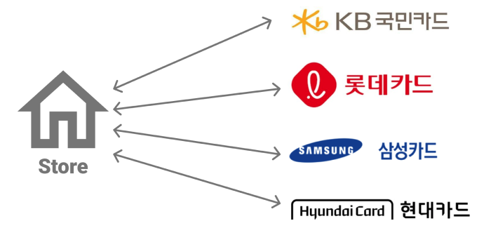
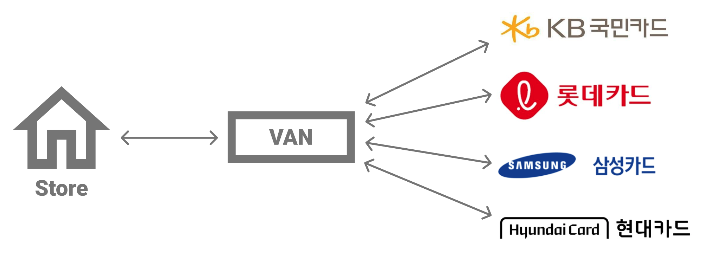
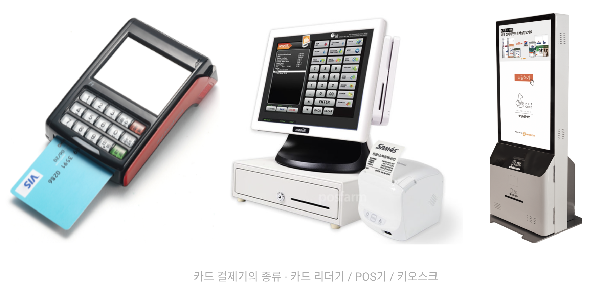
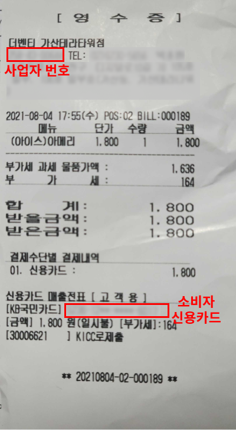
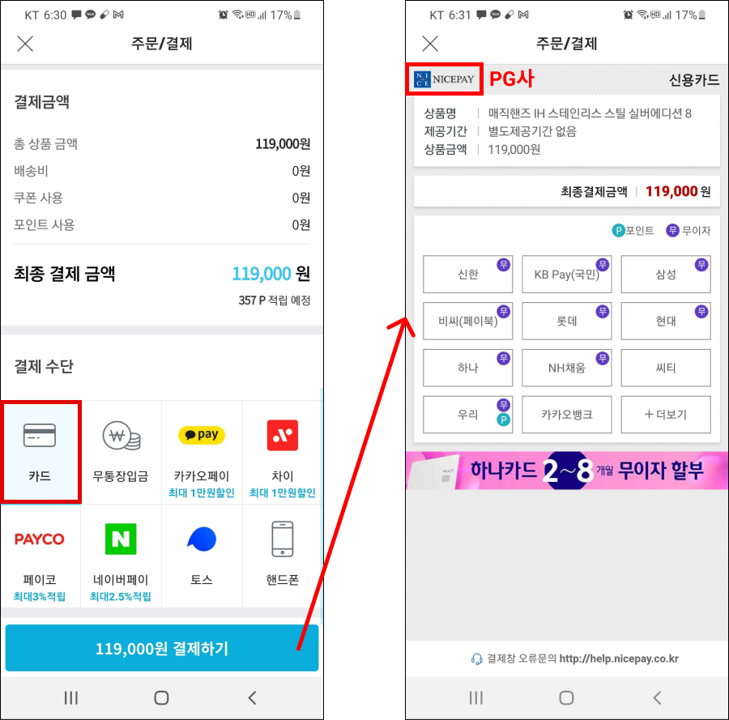
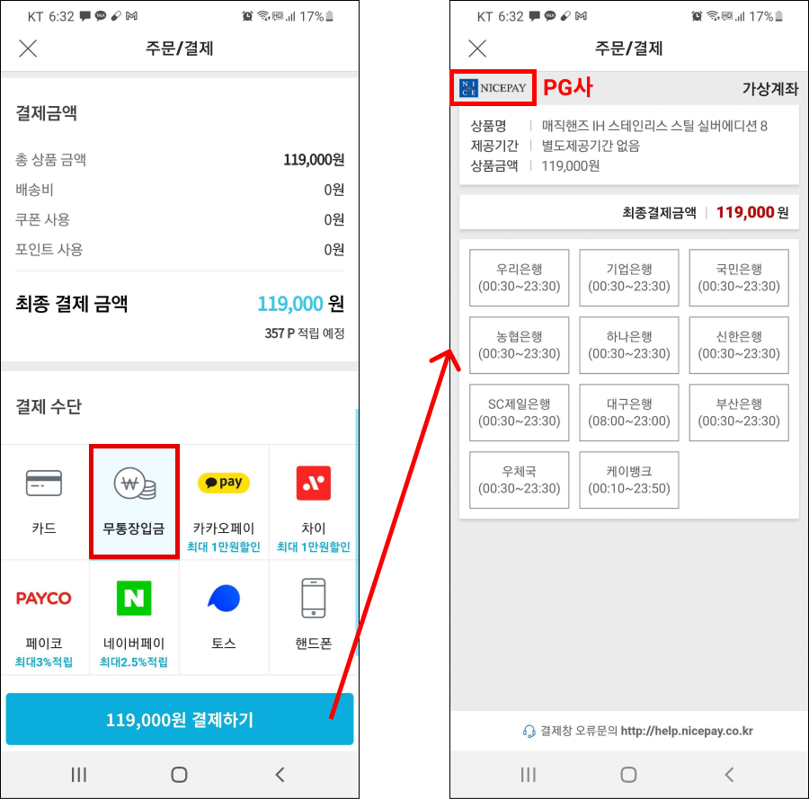
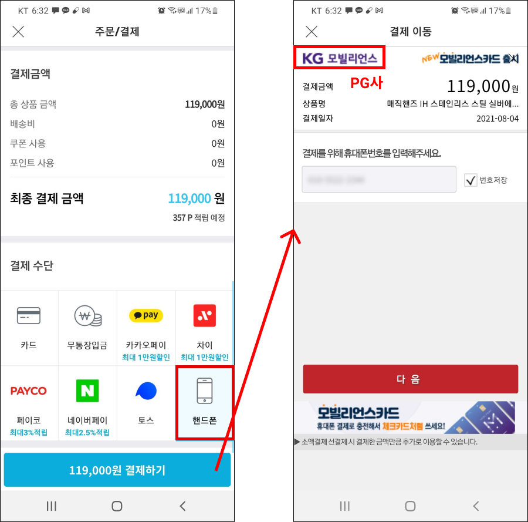
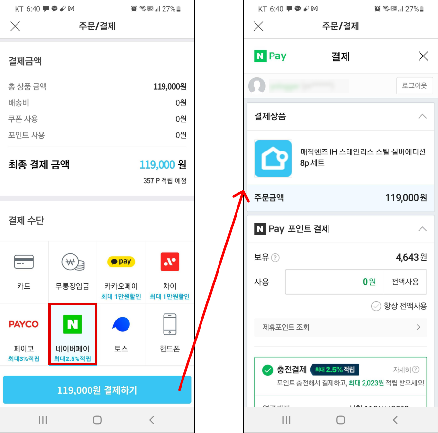
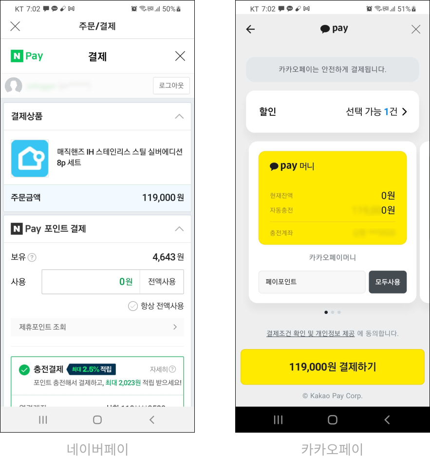
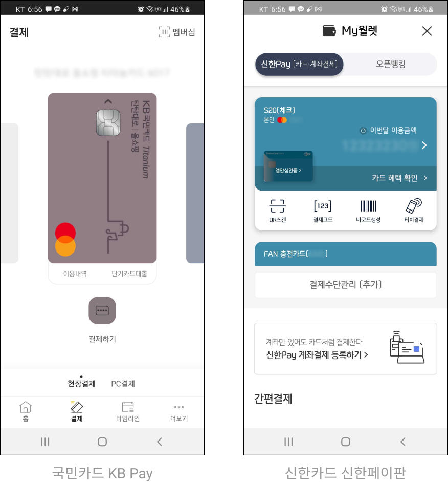

# Table of Contents
[[toc]]

## VAN

음식점을 운영한다고 가정합시다. 음식점 사장 입장에서는 손님이 어떤 카드로 결제할지 알 수 없습니다. 그렇다면 모든 카드사와 일일이 계약하고 카드사 별로 카드결제기를 설치해야할까요?

그렇지 않습니다. 바로 중개인 역할을 하는 VAN사가 있기 때문입니다. `VAN(Value-Added Network)`사는 가맹점이 모든 카드사와 일일이 계약을 하는 번거로움을 없애줍니다.

::: tip
음식점처럼 카드사와 가맹계약을 맺는 주체를 <b>가맹점</b>이라고 합니다.
:::

VAN사 덕분에 가맹점은 모든 카드사와 직접 가맹계약할 필요가 없습니다. VAN사와 계약하면 VAN사가 카드 결제기를 공급하며, 카드사와의 가맹계약을 대행합니다. 

VAN사의 또 다른 중요한 역할은 `전표 매입`을 대행해준다는 것입니다. `전표`는 <u>신용카드 결제에 의해 발생한 영수증</u>입니다.

고객이 가맹점에서 신용카드로 결제하면 돈이 가맹점에게 바로 들어오지 않습니다. 그럼에도 가맹점은 카드 결제기에서 출력된 전표를 고객에게 발급하고, 고객이 돈을 지불한 것으로 신용합니다.

고객 뿐만 아니라 가맹점도 전표를 챙깁니다. <u>가맹점은 전표를 모아 카드사에 제출</u>하며, 이를 `매입`이라고 합니다. 카드사는 전표를 이상이 없는지 확인하고 거래 확정 후 가맹점에 대금을 지급합니다.

VAN사는 이러한 전표 매입을 대행해줍니다. 뿐만 아니라 전표 매입을 전산 시스템적으로 구축하여 가맹점이 실물 전표를 번거롭게 제출하지 않도록 합니다.

가맹점은 카드사에 가맹점 수수료를 지급합니다. 카드사는 VAN사에게 가맹점 수수료의 일부를 VAN 수수료로 지급합니다.

국내 VAN사에는 한국정보통신(KICC), 나이스정보통신(NICE), KIS정보통신(KIS), 한국신용카드결제(KOCES) 등이 있습니다.

## PG
오프라인에 VAN사가 있다면 온라인에는 `PG(Payment Gateway)`사가 있습니다. 

온라인 쇼핑몰을 운영한다고 가정합시다. 온라인 쇼핑몰 사장 입장에서는 고객이 어떠한 신용카드로 결제할지 알 수 없습니다. 뿐만 아니라 전자상거래에서는 체크카드, 계좌이체, 휴대폰 소액결제 등 다양한 결제 수단이 존재합니다. 이때 PG사와 계약하면 가맹점은 모든 카드사, 은행사, 휴대폰 소액결제 회사와 직접 계약할 필요가 없습니다.

일반적으로 PG사는 신용카드 결제대행 서비스를 제공합니다.

계좌이체를 대행하는 PG사도 있습니다.

휴대폰 소액결제를 대행하는 PG사도 있습니다.

간편 결제를 대행하는 PG사도 있습니다.

국내 PG사에는 KG이니시스, 토스페이먼츠(LG U+), NHN한국사이버결제(KCP) 등이 있습니다.

# 간편 결제
기존 카드사나 은행사를 통한 결제는 공인인증서, ActiveX, 보안 프로그램 설치 등 복잡한 절차가 필요했습니다. `간편 결제`는 이러한 복잡한 절차를 생략하고 결제 과정을 간소화하여 쉽게 결제를 할 수 있도록 등장한 서비스입니다.

PayPal, 애플 페이, 삼성 페이 등이 대표적인 간편 결제 서비스입니다. 국내에는 카카오페이, 네이버페이, 토스페이 등이 있습니다. 

기존 카드사나 은행사도 간편 결제를 도입하기 위해 위해 앱 카드 같은 서비스를 제공하고 있습니다.

