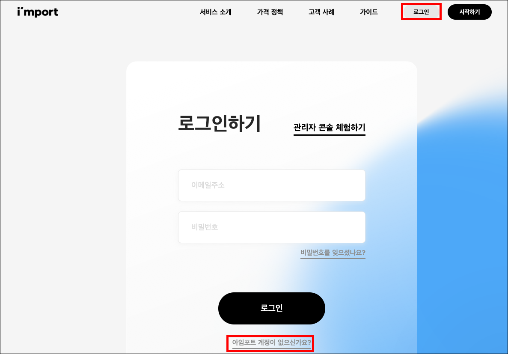
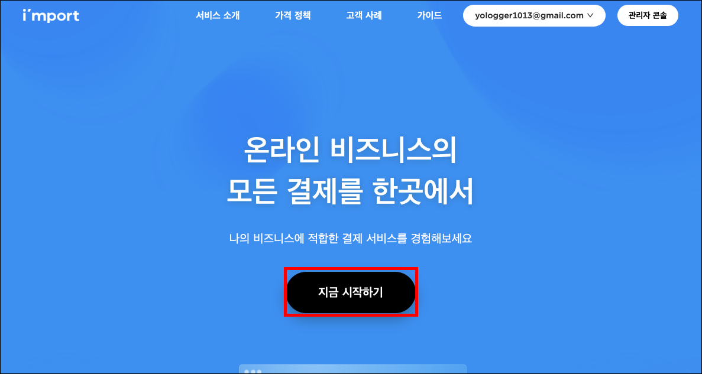
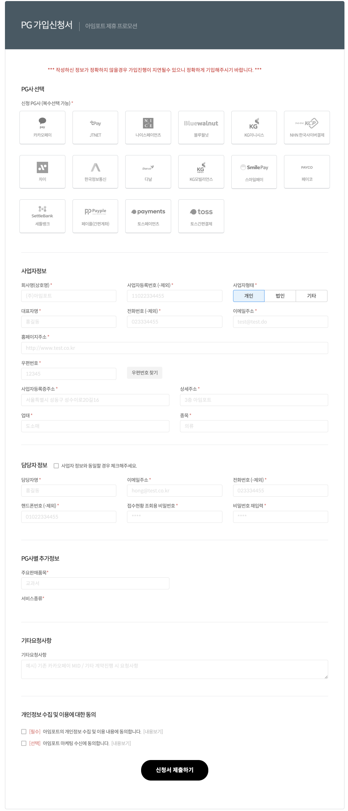
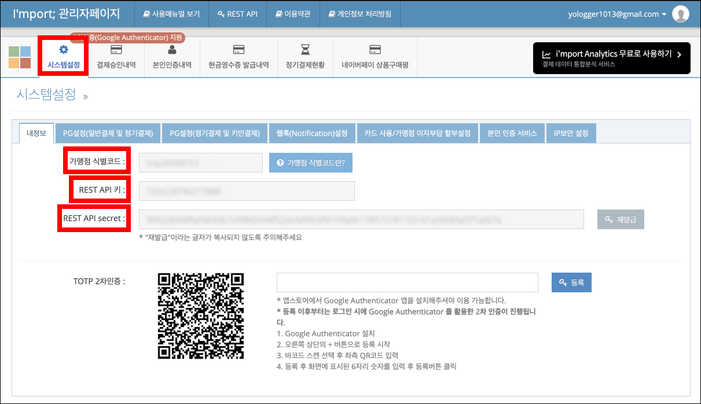
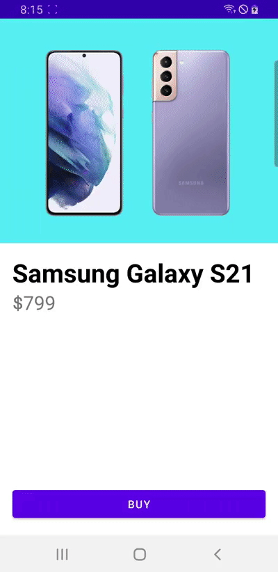
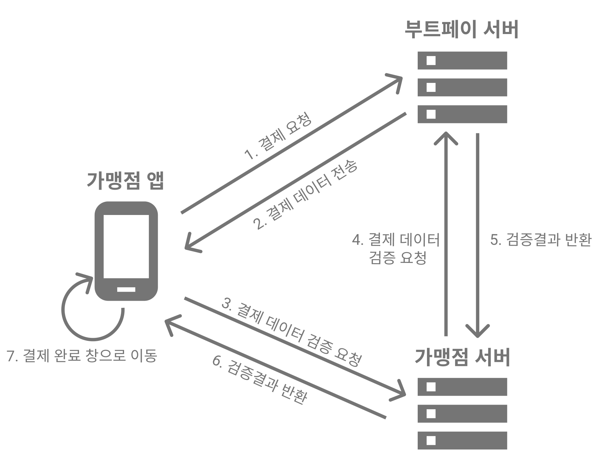
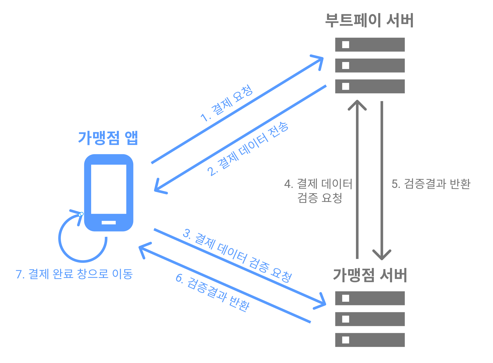

# Table of Contents
[[toc]]

# PG 연동 서비스
`PG 연동 서비스`를 사용하면 안드로이드에서 PG 결제를 쉽게 구현할 수 있습니다. `PG 연동 서비스`는 `결제 모듈`, `결제 API 서비스` 등으로도 불립니다. 국내에서 `PG 연동 서비스`를 제공하는 회사에는 [`아임포트`](https://www.iamport.kr/), [`부트페이`](https://www.bootpay.co.kr/) 등이 있습니다.

아임포트나 부트페이는 `PG 연동 서비스` 외에도 비즈니스에 도움이 되는 `통계분석 정보`, `관리자 페이지` 등을 제공합니다.

이번 포스트에서는 아임포트의 `PG 연동 서비스`를 사용하여 PG결제를 구현해보겠습니다.

## PG사 선택 및 가입
가맹점은 PG사에 가입해야합니다. 다만 아임포트나 부트페이는 PG사 가입을 대행해줍니다. PG사별로 수수료, 고객지원 서비스 등을 참고하여 PG사를 선택합니다.  

## 아임포트 회원가입 및 PG 가입
[아임포트](https://www.iamport.kr/)에 접속하여 회원가입을 합니다. 



로그인 후 `지금 시작하기` 버튼을 선택합니다.



PG 가입신청서를 작성합니다.



## 가맹점 식별코드, REST API키, REST API secret
PG 가입신청이 완료되면 `가맹점 식별코드`, `REST API키`, `REST API secret`이 발급됩니다. 

아임포트 홈페이지에서 `관리자 콘솔`로 이동합니다.


`시스템 설정`탭에서 `가맹점 식별코드`, `REST API키`, `REST API secret`을 확인할 수 있습니다.



## 의존성 추가
안드로이드 스튜디오 프로젝트를 생성하고 의존성을 추가합니다.
``` groovy
// 프로젝트 수준의 build.gradle
allprojects {
    repositories {
        // ...
        maven {
            url 'https://jitpack.io'
        }
    }
}
```

``` groovy
// 모듈 수준의 build.gradle
android {
    ..
    buildFeatures {
            viewBinding true
            dataBinding true
    }
}

dependencies {
    // iamport
    implementation "com.github.iamport:iamport-android:$iamport_version"
}
```

## 아임포트 초기화
`Application` 클래스를 정의하고 아임포트를 다음과 같이 초기화합니다.
``` kotlin
// App.kt
class App: Application() {
    override fun onCreate() {
        super.onCreate()

        // 아임포트 초기화
        Iamport.create(this)
    }
}
```

`AndroidManifest.xml`에 어플리케이션 클래스를 추가합니다.
``` xml
//  AndroidManifest.xml
<?xml version="1.0" encoding="utf-8"?>
<manifest .. >
    <application
        android:name=".App"
        ..>
    </application>
</manifest>
```

## 레이아웃 구성
다음과 같은 앱을 만들어보겠습니다.



레이아웃은 다음과 같습니다.
``` xml
// activity_main.xml
<?xml version="1.0" encoding="utf-8"?>
<LinearLayout xmlns:android="http://schemas.android.com/apk/res/android"
    xmlns:app="http://schemas.android.com/apk/res-auto"
    xmlns:tools="http://schemas.android.com/tools"
    android:layout_width="match_parent"
    android:layout_height="match_parent"
    android:orientation="vertical"
    tools:context=".MainActivity">

    <ImageView
        android:id="@+id/activity_main_imageView"
        android:layout_width="match_parent"
        android:layout_height="wrap_content"
        app:srcCompat="@drawable/galaxy"
        android:adjustViewBounds="true"
        />

    <androidx.constraintlayout.widget.ConstraintLayout
        android:layout_width="match_parent"
        android:layout_height="0dp"
        android:padding="16dp"
        android:layout_weight="1">

        <TextView
            android:id="@+id/activity_main_textView_product_name"
            android:layout_width="match_parent"
            android:layout_height="wrap_content"
            app:layout_constraintTop_toTopOf="parent"
            app:layout_constraintStart_toStartOf="parent"
            app:layout_constraintEnd_toEndOf="parent"
            android:textSize="33sp"
            android:textStyle="bold"
            android:textColor="@color/black"
            android:text="Samsung Galaxy S21"/>

        <TextView
            android:id="@+id/activity_main_textView_product_price"
            android:layout_width="match_parent"
            android:layout_height="wrap_content"
            app:layout_constraintTop_toBottomOf="@+id/activity_main_textView_product_name"
            app:layout_constraintStart_toStartOf="parent"
            android:textSize="25sp"
            android:text="$799"/>

        <Button
            android:id="@+id/activity_main_button_buy"
            android:layout_width="match_parent"
            android:layout_height="wrap_content"
            app:layout_constraintStart_toStartOf="parent"
            app:layout_constraintEnd_toEndOf="parent"
            app:layout_constraintBottom_toBottomOf="parent"
            android:text="Buy"/>

    </androidx.constraintlayout.widget.ConstraintLayout>
</LinearLayout>
```

``` kotlin
// MainActivity.kt
class MainActivity : AppCompatActivity() {

    private val buttonBuy: Button by lazy { findViewById<Button>(R.id.activity_main_button_buy)}

    override fun onCreate(savedInstanceState: Bundle?) {
        super.onCreate(savedInstanceState)
        setContentView(R.layout.activity_main)
    }

    private fun setupUI() {
        buttonBuy.setOnClickListener {
            // 결제 시작
        }
    }
}
```

## 결제 구현하기
우선 `onCreate()`에서 아임포트 모듈을 초기화합니다.

``` kotlin
// MainActivity.kt
class MainActivity : AppCompatActivity() {

    private val buttonBuy: Button by lazy { findViewById<Button>(R.id.activity_main_button_buy)}

    override fun onCreate(savedInstanceState: Bundle?) {
        super.onCreate(savedInstanceState)
        setContentView(R.layout.activity_main)
        // 아임포트 모듈 초기화
        Iamport.init(this) 
    }

    private fun setupUI() {
        buttonBuy.setOnClickListener {
            // 결제 시작
        }
    }
}
```

버튼을 눌렀을 때 결제창으로 이동하는 코드는 다음과 같습니다.
``` kotlin
// MainActivity.kt
class MainActivity : AppCompatActivity() {

    private val buttonBuy: Button by lazy { findViewById<Button>(R.id.activity_main_button_buy)}

    override fun onCreate(savedInstanceState: Bundle?) {
        super.onCreate(savedInstanceState)
        setContentView(R.layout.activity_main)
        // 아임포트 모듈 초기화
        Iamport.init(this) 
    }

    private fun setupUI() {
        buttonBuy.setOnClickListener {
            pay()
        }
    }

    private fun pay() {

        val request = IamPortRequest(
            pg = PG.html5_inicis.makePgRawName(""),     // PG사
            pay_method = PayMethod.card,                // 신용카드
            name = "Test Order",                        // 주문명
            merchant_uid = "sample_aos_${Date().time}", // 주문 번호
            amount = "1000",                            // 결제 금액
            buyer_name = "yologger"                     // 주문자 이름
        )

        val userCode = "iamport"    // 가맹점 코드

        Iamport.payment(
            userCode = userCode, 
            iamPortRequest = request, 
            paymentResultCallback = { response: IamPortResponse? ->
            // 결제 완료 시.
        }) 
    }
}
```

우선 결제 요청을 생성하기 위해 `IamPortRequest`의 인스턴스를 생성합니다. `IamPortRequest`의 인스턴스를 생성할 때 사용할 PG사, 결제 방법, 주문명 등의 정보를 전달합니다.
``` kotlin
val request = IamPortRequest(
    pg = PG.html5_inicis.makePgRawName(""),     // PG사, 이니시스
    pay_method = PayMethod.card,                // 신용카드
    name = "Test Order",                        // 주문명
    merchant_uid = "sample_aos_${Date().time}", // 주문 번호
    amount = "1000",                            // 결제 금액
    buyer_name = "yologger"                     // 주문자 이름
)
```

`Iamport`클래스의 `payment()`를 호출하면 결제 페이지로 이동하게됩니다. 
``` kotlin
Iamport.payment(
    userCode = userCode, 
    iamPortRequest = request,
    paymentResultCallback = { response: IamPortResponse? ->
    // 결제 완료 시
    if (response != null) {
        if (response!!.success) {
            // 결제 성공
        } else {
            // 결제 실패
        }
    } else {
        // 결제 실패
    }
})
```
첫 번째 인자인 `userCode`는 아임포트 홈페이지에서 발급받은 가맹점 코드입니다. 문자열 "iamport"을 전달하면 테스트 결제가 이루어집니다.

두 번째 인자로는 `IamPortRequest`의 인스턴스를 전달합니다.

세 번째 인자로는 결제 완료 시 호출될 콜백함수를 전달합니다. 이 콜백 함수는 `IamPortResponse`의 인스턴스를 인자로 전달받는데 이 값을 확인하여 결제 성공, 결제 실패, 사용자 취소 등을 확인할 수 있습니다.

이제 앱을 실행하고 `Buy`버튼을 클릭하면 결제가 이루어집니다.

## 결제 데이터 검증
보통 클라이언트에서 결제가 성공하면 결제 데이터를 백엔드 서버에 전송합니다. 백엔드 서버는 결제 데이터가 올바른지 검증해야합니다.



아래 사진에서 안드로이드 개발자가 고려해야할 부분은 파란색 입니다. 남은 부분은 백엔드 서버 개발자가 구현합니다.



서버 검증을 요청하는 코드는 대략 다음과 같습니다.
``` kotlin
Iamport.payment(userCode = userCode, iamPortRequest = request) { response: IamPortResponse? ->
    // 결제 완료 시
    if (response != null) {
        if (response!!.success) {
            // 결제 성공 시
            serverApi.requestVerification(response) { result ->
                if (result.isSuccess) {
                    // 검증 성공 시 결제 완료창으로 이동
                    showPaymentCompletionWindow()
                } else {
                    // 검증 실패 시 에러 메시지
                    showErrorMessage()
                }
            }
        } else {
            // 결제 실패
        }
    } else {
        // 결제 실패
    }
}
```