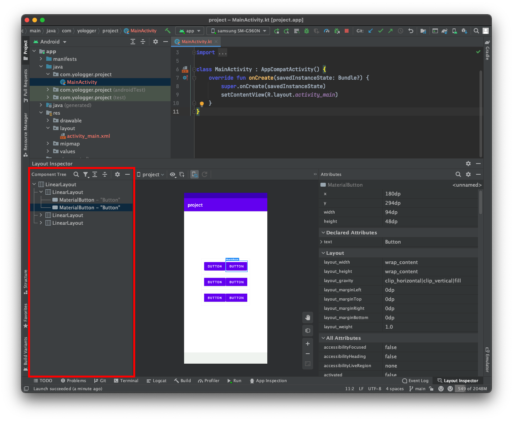

# Layout Inspector
`Layout Inspector`를 사용하면 레이아웃 XML 파일을 실시간으로 디버깅할 수 있습니다. `Layout Inspector`가 제공하는 기능은 다음과 같습니다.
- `Component Tree`: UI의 계층구조를 파악할 수 있습니다.
- `Attribute`: 선택한 UI 요소의 속성값들을 파악할 수 있습니다.

# 사용법
`Layout Inspector`는 다음 단계로 실행합니다.
1. 에뮬레이터나 연결된 기기에서 앱을 실행합니다.
2. Tools > Layout Inspector를 클릭합니다.

정상적으로 실행되면 화면 하단에 `Layout Inspector` 패널이 등장합니다.

상단 툴바에서 `Live Updates`를 활성화하면 실행 중인 앱의 상태가 `Layout Inspector`에 실시간 반영됩니다.

특정 위젯을 클릭하면 오른쪽 패널에서 선택된 위젯의 속성들을 확인할 수 있습니다.

왼쪽 위젯에서는 위젯의 계층구조를 확인할 수 있습니다.

