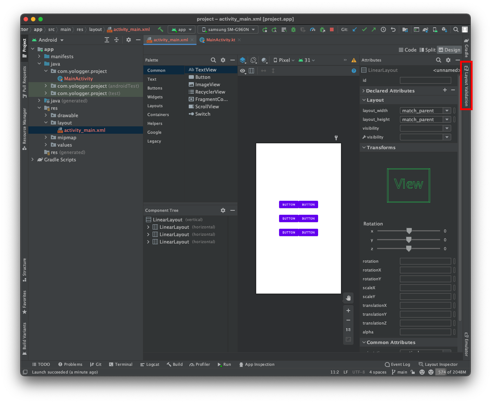
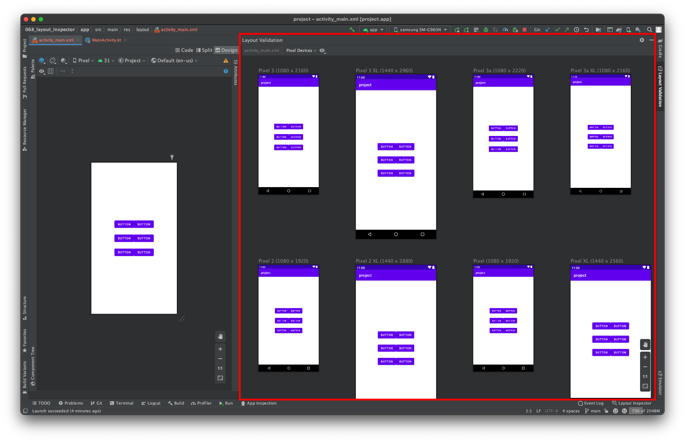

# Layout Validation
`Layout Validation`을 사용하면 기기 크기에 따른 UI 구성을 동시에 확인할 수 있습니다.

# 사용법
`Android Studio`에서 `레이아웃 XML`파일을 열면 오른쪽 상단에 `Layout Validation` 탭이 활성화됩니다. 이 탭을 선택합니다.

이제 `Layout Validation` 패널에서 기기 크기에 따른 UI 구성을 동시에 확인할 수 있습니다.

