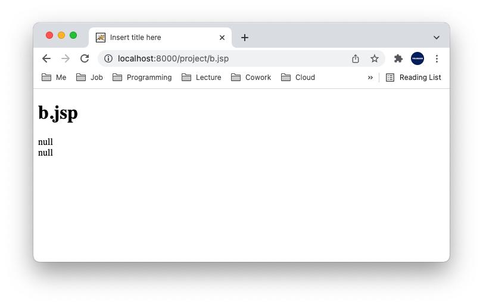

# Table of Contents
[[toc]]

# Forward, Redirect
`Forward`와 `Redirect`를 사용하면 페이지를 전환할 수 있다. 다만 동작에 있어서 차이점이 있다.

## Forward
`Forward`는 다음과 같이 동작한다.


아래 코드를 살펴보자.
``` xml {12}
// a.jsp

<%@ page language="java" contentType="text/html; charset=UTF-8" pageEncoding="UTF-8"%>
<!DOCTYPE html>
<html>
<head>
<meta charset="UTF-8">
<title>Insert title here</title>
</head>
<body>
    <!-- JSP Action Tag를 통한 포워딩-->
    <jsp:forward page="b.jsp"></jsp:forward>
</body>
</html>
```
``` xml
//  b.jsp

<%@ page language="java" contentType="text/html; charset=UTF-8" pageEncoding="UTF-8"%>
<!DOCTYPE html>
<html>
<head>
<meta charset="UTF-8">
<title>Insert title here</title>
</head>
<body>
    <h1>b.jsp</h1>
</body>
</html>
```
주목할 점은 웹 브라우저에는 최초의 호출한 URL인 `a.jsp`가 표시된다는 것이다. 그러나 화면에 실제 출력되는 페이지는 `b.jsp`다.


Servlet에서도 `RequestDispatcher`클래스의 `forward()` 메소드로 포워딩할 수 있다.
``` java {8,9}
// Controller.java
import javax.servlet.RequestDispatcher;

@WebServlet("/Controller")
public class Controller extends HttpServlet {

    protected void doGet(HttpServletRequest request, HttpServletResponse response) throws ServletException, IOException {
        RequestDispatcher dispatcher = request.getRequestDispatcher("/b.jsp");
        dispatcher.forward(request, response);
    }
}
```


`Controller` Servlet은 `doGet()`메소드로 수신한 `HttpServletRequest`를 `b.jsp`에 그대로 전달한다. 따라서 다음과 같이 `b.jsp`에서 `HttpServletRequest`에 접근할 수 있다.
``` java Controller.java
import javax.servlet.RequestDispatcher;

@WebServlet("/Controller")
public class Controller extends HttpServlet {

    protected void doGet(HttpServletRequest request, HttpServletResponse response) throws ServletException, IOException {

        request.setAttribute("name", "Paul");
        request.setAttribute("nation", "England");

        RequestDispatcher dispatcher = request.getRequestDispatcher("/b.jsp");
        dispatcher.forward(request, response);
    }
}
```
``` xml
//  b.jsp

<%@ page language="java" contentType="text/html; charset=UTF-8" pageEncoding="UTF-8"%>
<!DOCTYPE html>
<html>
<head>
<meta charset="UTF-8">
<title>Insert title here</title>
</head>
<body>
    <h1>b.jsp</h1>
    <div><%= request.getAttribute("name")%></div>
    <div><%= request.getAttribute("nation")%></div>
</body>
</html>
```


## Redirect
`Redirect`는 다음과 같이 동작한다.


예제를 살펴보자.
``` java {10}
// Controller.java

import javax.servlet.RequestDispatcher;

@WebServlet("/Controller")
public class Controller extends HttpServlet {

    protected void doGet(HttpServletRequest request, HttpServletResponse response) throws ServletException, IOException {
        // b.jsp로 리다이렉트
        response.sendRedirect("b.jsp");
    }
}
```
``` xml
//  b.jsp

<%@ page language="java" contentType="text/html; charset=UTF-8"  pageEncoding="UTF-8"%>
<!DOCTYPE html>
<html>
<head>
<meta charset="UTF-8">
<title>Insert title here</title>
</head>
<body>
    <h1>b.jsp</h1>
</body>
</html>
```
이제 웹 브라우저에서 `localhost:8000/project/Controller`로 접속하면 `localhost:8000/project/b.jsp`로 리다이렉트 된다.


`Forward`는 서버에서 전환되는 페이지로 이동하기 때문에 `HttpServletRequest`를 다시 생성하지 않고 그저 <u>전달</u>한다. 반면 `Redirect`는 클라이언트에게 특정 페이지로 재요청을 보내도록 한다. 따라서 `HttpServletRequest`가 다시 <u>생성</u>된다. 따라서 아래 예제의 `b.jsp`에서 `request.getAttribute("name")`, `request.getAttribute("nation")`값이 `null`이 된다.

``` java Controller.java
import javax.servlet.RequestDispatcher;

@WebServlet("/Controller")
public class Controller extends HttpServlet {

    protected void doGet(HttpServletRequest request, HttpServletResponse response) throws ServletException, IOException {
        request.setAttribute("name", "Paul");
        request.setAttribute("nation", "England");

        // b.jsp로 리다이렉트
        response.sendRedirect("b.jsp");
    }
}
```
``` xml
//  b.jsp

<%@ page language="java" contentType="text/html; charset=UTF-8" pageEncoding="UTF-8"%>
<!DOCTYPE html>
<html>
<head>
<meta charset="UTF-8">
<title>Insert title here</title>
</head>
<body>
    <h1>b.jsp</h1>
    <div><%= request.getAttribute("name")%></div>
    <div><%= request.getAttribute("nation")%></div>
</body>
</html>
```

