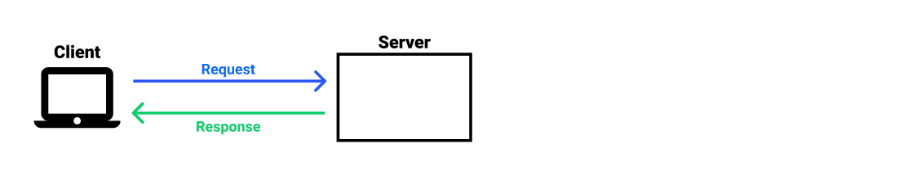
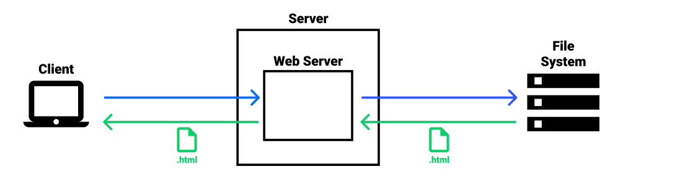
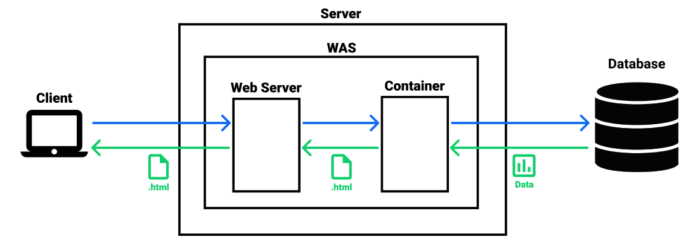

# Table of Contents
[[toc]]

# Server, Web Server, WAS 차이점

## Server
`Server`는 Client에 정보나 서비스를 제공하는 컴퓨터 시스템이다. 서버에는 보통 Linux, Unix, Windows 운영체제가 탑재된다.

## Web Server
- `Web Server`는 웹 브라우저 같은 클라이언트로부터 HTTP 요청을 받아들이고 HTML 문서와 같은 웹 페이지를 반환하는 프로그램이다. 
- Web Server의 대표적인 제품군에는 Apache, Nginx, IIS가 있다. 
- `Web Server`는 파일 시스템에 저장된 파일(HTML, CSS, JavaScript, 이미지, 파일 등)을 단순히 클라이언트에게 전달한다. 이를 <u>정적 컨텐츠</u>를 제공한다고 한다.

## WAS
`WAS(Web Application Server)`는 데이터베이스, 파일 시스템, 네트워크 등에서 데이터를 읽어와 다양한 로직을 수행한 후 적절한 HTML 파일을 생성하여 클라이언트에게 전달한다. 이를 <u>동적 컨텐츠</u>를 제공한다고 한다.

WAS의 대표적인 제품군에는 Apache Tomcat, Oracle WebLogic, IBM Websphere, Tmax JEUS, Red Hat Jboss가 있다. 제품군에 따라 다르지만 WAS는 크게 세 가지 요소로 구성된다.
- `Web Container`
    1. JSP파일을 Servlet으로 변환한다.
    2. Servlet의 생성, 소멸 등의 생명주기를 관리한다.
    3. HttpServletRequest, HttpServletResponse의 생성, 소멸 등의 생명주기를 관리한다.
    4. Web Container는 `Servlet Container`라고도 불린다.
- `Web Server`: Web Container가 동적으로 생성한 웹 페이지를 Client에게 제공한다.
- `EJB Container`: 
    1. EJB(Enterprise Java Bean)의 생명주기를 관리한다.
    2. EJB는 한국에서는 Spring Framework에 밀려서 잘 사용되지 않는다.

Oracle WebLogic, Red Hat Jboss 같은 제품군은 세 가지 요소를 모두 포함한다. 그러나 Apache Tomcat은 Web Server와 Web Container만을 포함한다.