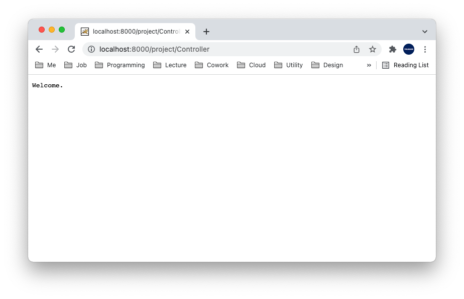
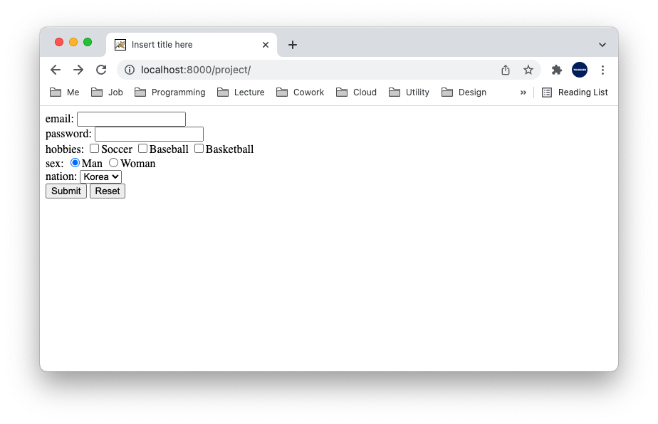

# Table of Contents
[[toc]]

## Servlet
`Servlet`은 Java를 사용하여 웹 페이지를 동적으로 생성하는 서버측 컴포넌트다. 모든 Servlet은 `HttpServlet`클래스를 상속한다.
``` java Controller.java
package com.yologger.app.controller;

import javax.servlet.http.HttpServlet;

public class Controller extends HttpServlet {

    // ..

}
```

## Servlet URL Mapping
Servlet은 두 가지 방법으로 URL Mapping을 할 수 있다.

### @WebServlet 어노테이션
``` java Controller.java
package com.yologger.app.controller;

import javax.servlet.http.HttpServlet;
import javax.servlet.annotation.WebServlet;

@WebServlet("/Controller")
public class Controller extends HttpServlet {

    // ..

}
```

### web.xml
``` xml web.xml
<?xml version="1.0" encoding="UTF-8"?>
<web-app xmlns:xsi="http://www.w3.org/2001/XMLSchema-instance"
    xmlns="http://xmlns.jcp.org/xml/ns/javaee"
    xsi:schemaLocation="http://xmlns.jcp.org/xml/ns/javaee http://xmlns.jcp.org/xml/ns/javaee/web-app_3_1.xsd"
    id="WebApp_ID" version="3.1">

    <!-- ... -->

    <servlet>
        <servlet-name>controller</servlet-name>
        <servlet-class>com.yologger.app.controller.Controller</servlet-class>
    </servlet>
    <servlet-mapping>
        <servlet-name>controller</servlet-name>
        <url-pattern>/controller</url-pattern>
    </servlet-mapping>

</web-app>
```


## Servlet의 동작 순서


<br />

1. Client로 부터 요청이 들어오면 WAS는 Web Container와 Context를 생성한다.
2. Web Container는 요청에 대한 HttpServletRequest, HttpServletResponse를 생성한다.
3. Web Container는 web.xml의 Servlet 매핑 정보를 확인하여 어떤 Servlet을 생성할지 결정한다.
4. Web Container는 Servlet이 한 번도 실행된 적이 없으면 Servlet의 인스턴스를 생성한다. 실행된 적이 있으면 Servlet을 재사용한다.
5. Web Container는 요청을 처리하기 위한 Thread를 생성한다.
6. Servlet의 `doGet()`, `doPost()`, `service()`가 호출되며 인자로 HttpServletRequest, HttpServletResponse 객체가 전달된다.
7. 로직이 수행되면 HttpServletRequest, HttpServletResponse 객체를 소멸시키고 Thread를 종료한다.


## Servlet의 생명주기
Web Container는 Client의 요청에 따라 Servlet을 생성, 관리, 소멸한다. 이때 Servlet 클래스에 정의된 생명주기 함수가 호출된다.

<br />
- `Constructor`: Servlet 인스턴스가 생성될 때 최초 한 번 호출되는 생성자
- `init()`: Servlet 인스턴스가 생성될 때 최초 한 번 호출되는 생명주기 함수
- `doGet()`, `doPost()`, `service()`: Client에서 요청할 때 마다 호출되는 생명주기 함수
    - `doGet()`: HTTP GET 방식으로 요청할 때 호출
    - `doPost()`: HTTP POST 방식으로 요청할 때 호출
    - `service()`: `doGet()`과 `doPost()`가 정의되지 않았을 때 호출
- `destroy()`: Servlet 인스턴스가 소멸될 때 한번 호출


``` java Controller.java
package com.yologger.com;

import java.io.IOException;

import javax.servlet.ServletConfig;
import javax.servlet.ServletException;
import javax.servlet.annotation.WebServlet;
import javax.servlet.http.HttpServlet;
import javax.servlet.http.HttpServletRequest;
import javax.servlet.http.HttpServletResponse;

@WebServlet("/Controller")
public class Controller extends HttpServlet {

    public Controller() {
        // ..
    }
    
    @Override
    public void init() throws ServletException {
        // ..
    }

    @Override
    protected void service(HttpServletRequest request, HttpServletResponse response) throws ServletException, IOException {
        // ..
    }

    @Override
    protected void doGet(HttpServletRequest request, HttpServletResponse response) throws ServletException, IOException {
        // ..
    }

    @Override
    protected void doPost(HttpServletRequest request, HttpServletResponse response) throws ServletException, IOException {
        // ..
    }

    @Override
    public void destroy() {
        // ..
    }
}
```

### Servlet 선처리, 후처리
`@PostConstruct`, `@PreDestroy` 어노테이션을 임의의 메서드에 추가하여 선처리, 후처리를 할 수 있다.


``` java Controller.java
import javax.annotation.PostConstruct;
import javax.annotation.PreDestroy;

@WebServlet("/Controller")
public class Controller extends HttpServlet {

    @PostConstruct
    public void postConstruct() {
        // ...
    }
    
    @PreDestroy
    public void preDestroy() {
        // ...
    }
}
```


### doGet()
HTTP GET 방식으로 요청을 하면 `doGet()`메소드가 호출된다.

``` java Controller.java
@WebServlet("/Controller")
public class Controller extends HttpServlet {

    @Override
    protected void doGet(HttpServletRequest request, HttpServletResponse response) throws ServletException, IOException {
        response.getWriter().write("Welcome.");
    }
}
```

----

### doPost()
HTTP POST 방식으로 요청하면 `doPost()`메소드가 호출된다.
``` html index.html
<!DOCTYPE html>
<html>
<head>
<meta charset="UTF-8">
<title>Insert title here</title>
</head>
<body>
<body>
	<form action="Controller" method="post">
		<div>email: <input type="text" name="email"></div>
		<div>password: <input type="text" name="password"></div>
		<div>
			hobbies: 
			<input type="checkbox" name="hobby" value="soccer"/>Soccer
			<input type="checkbox" name="hobby" value="baseball"/>Baseball
			<input type="checkbox" name="hobby" value="basketball"/>Basketball
		</div>
		<div>
			sex:
			<input type="radio" name="sex" value="man" checked/>Man
			<input type="radio" name="sex" value="woman"/>Woman
		</div>
		<div>
			nation:
			<select name="nation">
				<option value="Korea" selected>Korea</option>
				<option value="Japan">Japan</option>
				<option value="China">China</option>
			</select>
		</div>
		<div>
			<input type="submit" value="Submit">
			<input type="reset" value="Reset">
		</div>
	</form>
</body>
</body>
</html>
```


``` java Controller.java
@WebServlet("/Controller")
public class Controller extends HttpServlet {

    @Override
    protected void doPost(HttpServletRequest request, HttpServletResponse response) throws ServletException, IOException {
        String email = request.getParameter("email");
        System.out.println("email: " + email);

        String password = request.getParameter("password");
        System.out.println("password: " + password);

        String sex = request.getParameter("sex");
        System.out.println("sex: " + sex);

        String nation = request.getParameter("nation");
        System.out.println("nation: " + nation);

        String[] hobby = request.getParameterValues("hobby");

        for (int i=0; i<hobby.length; i++) {
            System.out.println(hobby[i]);
        }
    }
}
```