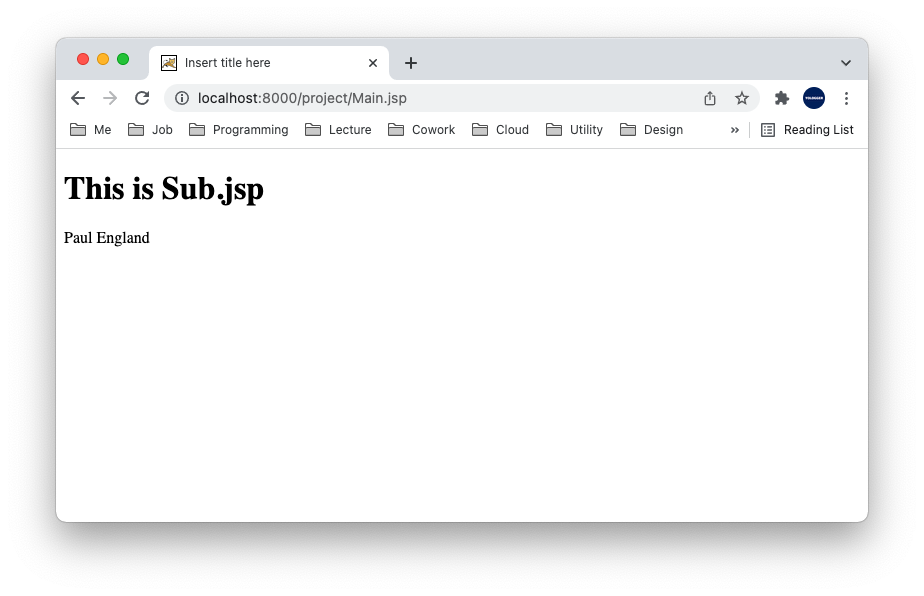

# Table of Contents
[[toc]]

## JSP
`JSP(Java Server Pages)`는 HTML에 Java 코드를 삽입하여 동적으로 웹 페이지를 생성하는 언어다. 아래는 JSP의 예제다.
``` xml
<%@ page language="java" contentType="text/html; charset=UTF-8" pageEncoding="UTF-8"%>
<!DOCTYPE html>
<html>
<head>
<meta charset="UTF-8">
<title>Insert title here</title>
</head>
<body>
	<%
		String name = "Paul";
		String nation = "England";
	%>
	<h1><%= name %></h1>
	<h1><%= nation %></h1>
</body>
</html>
```

## JSP의 동작 원리
JSP는 다음과 같은 과정으로 처리된다.
1. Web container는 JSP 파일을 Servlet으로 변환한다.
    - `MyPage.jsp` > `MyPage_jsp.java`

2. Servlet 내부에서 JSP 파일의 내용을 출력한다. 생성된 `MyPage_jsp.java`의 코드의 일부분을 살펴보자.
``` java MyPage_jsp.java
public final class MyPage_jsp {

    public void _jspService(final HttpServletRequest request, HttpServletResponse response)
        // ...
        out.write("\n");
        out.write("<!DOCTYPE html>\n");
        out.write("<html>\n");
        out.write("<head>\n");
        out.write("<meta charset=\"UTF-8\">\n");
        out.write("<title>Insert title here</title>\n");
        out.write("</head>\n");
        out.write("<body>\n");
        out.write("	");

        String name = "Paul";
        String nation = "England";
	
        out.write("\n");
        out.write("	<h1>");
        out.print( name );
        out.write("</h1>\n");
        out.write("	<h1>");
        out.print( nation );
        out.write("</h1>\n");
        out.write("</body>\n");
        out.write("</html>");    
    }
}
```

3. Web Container는 Servlet을 처리한다.

요약하자면 JSP는 `MyPage.js` > `MyPage_jsp.java` > `MyPage_jsp.class` > `HTML` 순서대로 처리된다.


## JSP tag
`JSP tag`는 JSP 문서 안에 Java 코드를 삽입할 때 사용한다.

### 자바 코드
`<% %>`를 사용하여 자바 코드를 추가할 수 있다.
``` xml
<%
    for (int i=0; i<10; i++) {
        out.println(i + "<br />");
    }
%>
```

### 주석
주석은 `<%-- -->` 형태로 사용한다.
``` xml
<%--
    for (int i=0; i<10; i++) {
        out.println(i + "<br />");
    }
--%>
```

### 메소드, 변수 선언
`<%! %>`는 변수를 선언하거나 함수를 정의할 때 사용한다.
``` xml
<%!
    int i = 0;
    String name = “ronaldo”;
%>
<%!
    public int sum(a, b){
        return a+b;
    }
%>
<%
    out.println(i+”< br/>”);
    out.println(sum(4, 6)+”< br/>”);
%>
```

### 표현식
JSP에서 무언가를 출력하려면 `out.println()`을 사용한다. `<%! %>`는 변수를 선언하거나 함수를 정의할 때 사용한다.
``` xml
<%!
    int i = 0;
%>
<%!
    public int sum(a, b){
        return a+b;
    }
%>
<%
    out.println(i);
    out.println(sum(4, 6));
%>
```
`<%= %>`를 사용하면 더 쉽게 출력할 수 있다.
``` xml
<%!
    int i = 0;
    String name = “ronaldo”;
%>
<%!
    public int sum(a, b){
        return a+b;
    }
%>
<%= i%>
<%= sum(4, 6)%>
```

### 지시자
지시자는 JSP 페이지의 속성을 지정할 때 사용한다. `<%@ %>` 형태로 사용한다.

#### page
`page` 속성은 해당 페이지의 속성을 지정할 때 사용한다.
``` xml
<%@ page language=“java” contentType=“/text/html”; charset=“EUC-KR” pageEncoding=“EUC-KR” %>
<%@ page import=“java.util.Arrays” %>

<%
    int arr[] = {10, 20, 30}
    out.println(Arrays.toString(arr));
%>
```
#### include
페이지에 다른 페이지를 삽입할 때 사용한다.
``` xml 
// Sub.jsp

<h1>This is Sub.jsp</h1>
```
``` xml 
// Main.jsp

<h1>This is Main.jsp</h1>
<%@ include file=“Sub.jsp” %>
<h1>This is Main.jsp</h1>
```

#### taglib
태그 라이브러리를 사용할 때 사용한다.

## JSP Action Tag
`JSP Action Tag`는 JSP 페이지 내에서 특정 동작을 하도록 지시하는 태그다.

### include 태그
현재 페이지에 다른 페이지를 삽입한다.
``` xml 
// Main.jsp

<%@ page language="java" contentType="text/html; charset=UTF-8"
    pageEncoding="UTF-8"%>
<!DOCTYPE html>
<html>
<head>
<meta charset="UTF-8">
<title>Insert title here</title>
</head>
<body>
    <h1>This is Main.jsp</h1>
    <jsp:include page="Sub.jsp" />
</body>
</html>
```
``` xml 
// Sub.jsp

<%@ page language="java" contentType="text/html; charset=UTF-8"
    pageEncoding="UTF-8"%>
<!DOCTYPE html>
<html>
<head>
<meta charset="UTF-8">
<title>Insert title here</title>
</head>
<body>
	<h1>This is Sub.jsp</h1>
</body>
</html>
```


### forward 태그
현재 페이지에서 다른 페이지로 전환한다.
``` xml {12}
// Main.jsp

<%@ page language="java" contentType="text/html; charset=UTF-8" pageEncoding="UTF-8"%>
<!DOCTYPE html>
<html>
<head>
<meta charset="UTF-8">
<title>Insert title here</title>
</head>
<body>
<h1>This is Main.jsp</h1>
<jsp:forward page="Sub.jsp" />
</body>
</html>
```


### param 태그
`forward 태그`나 `include 태그`를 사용할 때 데이터를 전달하기 위해 사용한다.
``` xml {13,14}
// Main.jsp

<%@ page language="java" contentType="text/html; charset=UTF-8" pageEncoding="UTF-8"%>
<!DOCTYPE html>
<html>
<head>
<meta charset="UTF-8">
<title>Insert title here</title>
</head>
<body>
<h1>This is Main.jsp</h1>
<jsp:forward page="Sub.jsp">
	<jsp:param name="name" value="Paul" />
	<jsp:param name="nation" value="England"/>
</jsp:forward>
</body>
</html>
```
``` xml {12,13}
// Sub.jsp

<%@ page language="java" contentType="text/html; charset=UTF-8" pageEncoding="UTF-8"%>
<!DOCTYPE html>
<html>
<head>
<meta charset="UTF-8">
<title>Insert title here</title>
</head>
<body>
	<h1>This is Sub.jsp</h1>
	<%= request.getParameter("name") %>
	<%= request.getParameter("nation") %>
</body>
</html>
```


## Bean 객체
JSP 페이지에서 사용할 Java 객체를 `Bean`이라고 한다. 다음 `Person`객체를 JSP 페이지에 만들어보자.
``` java Person.java
package com.yologger.project;

public class Person {
	private String name;
	private String nation;
	
	public String getName() {
		return name;
	}
	public void setName(String name) {
		this.name = name;
	}
	public String getNation() {
		return nation;
	}
	public void setNation(String nation) {
		this.nation = nation;
	}	
}
```
`<jsp:useBean>` 태그를 사용하면 JSP 페이지에서 사용할 객체를 생성할 수 있다.
``` xml {11}
// Main.jsp

<%@ page language="java" contentType="text/html; charset=UTF-8" pageEncoding="UTF-8"%>
<!DOCTYPE html>
<html>
<head>
<meta charset="UTF-8">
<title>Insert title here</title>
</head>
<body>
    <jsp:useBean id="person" class="com.yologger.project.Person"></jsp:useBean>
</body>
</html>
```
Bean은 생성되었으나 `name`, `nation` 속성이 초기화되지 않았다. 다음과 같이 초기화한다.
``` xml {12,13}
// Main.jsp

<%@ page language="java" contentType="text/html; charset=UTF-8" pageEncoding="UTF-8"%>
<!DOCTYPE html>
<html>
<head>
<meta charset="UTF-8">
<title>Insert title here</title>
</head>
<body>
    <jsp:useBean id="person" class="com.yologger.project.Person"></jsp:useBean>
    <jsp:setProperty name="person" property="name" value="Paul"/>
    <jsp:setProperty name="person" property="nation" value="Portugal"/>
</body>
</html>
```
Bean은 다음과 같이 접근할 수 있다.
``` xml {14,15}
// Main.jsp

<%@ page language="java" contentType="text/html; charset=UTF-8" pageEncoding="UTF-8"%>
<!DOCTYPE html>
<html>
<head>
<meta charset="UTF-8">
<title>Insert title here</title>
</head>
<body>
    <jsp:useBean id="person" class="com.yologger.project.Person"></jsp:useBean>
    <jsp:setProperty name="person" property="name" value="Paul"/>
    <jsp:setProperty name="person" property="nation" value="Portugal"/>
    <jsp:getProperty name="person" property="name" />
    <jsp:getProperty name="person" property="nation" />
</body>
</html>
```
다음과 같이 JSP Tag를 통해 접근할 수도 있다.
``` xml {14,15}
// Main.jsp

<%@ page language="java" contentType="text/html; charset=UTF-8" pageEncoding="UTF-8"%>
<!DOCTYPE html>
<html>
<head>
<meta charset="UTF-8">
<title>Insert title here</title>
</head>
<body>
    <jsp:useBean id="person" class="com.yologger.project.Person"></jsp:useBean>
    <jsp:setProperty name="person" property="name" value="Paul"/>
    <jsp:setProperty name="person" property="nation" value="Portugal"/>
    <%= person.getName() %>
    <%= person.getNation() %>
</body>
</html>
```
Bean을 생성할 때 `Scope`를 지정할 수 있다.
``` xml
<jsp:useBean id="person" class="com.yologger.project.Person" scope="page"></jsp:useBean>
```
|값|설명|
|------|---|
|scope|Bean을 생성한 현재 JSP 페이지에서만 접근 가능|
|request|`<jsp:forward>`를 통해 이동한 페이지에서도 접근 가능|
|session|세션이 종료되기 전까지 모든 페이지에서는 모두 접근 가능|
|application|어플리케이션이 종료되기 전까지 모든 페이지에서 접근 가능|


## EL(Expression Language)
JSP Tag의 표현식을 사용하여 값을 표현할 수 있다.
``` xml
<%= person.name %>
```
JSP Action Tag를 사용하여 값을 표현할 수도 있다.
``` htxmlml
<jsp:getProperty name="person" property="nation" />
```
`EL(Expression Language)`을 사용하면 더욱 쉽게 값을 표현할 수 있다. 
``` 
${person.name}
```
EL을 사용한 몇 가지 예제를 살펴보자.
``` xml 
// Main.jsp

<%@ page language="java" contentType="text/html; charset=UTF-8" pageEncoding="UTF-8"%>
<!DOCTYPE html>
<html>
<head>
<meta charset="UTF-8">
<title>Insert title here</title>
</head>
<body>
	<div>${10}</div>
	<div>${10+10}</div>
	<div>${"Paul"}</div>
	<div>${true}</div>
</body>
</html>
```
결과는 다음과 같다.


## JSP 예외 페이지
`예외(Exception)`이 발생하면 특정 페이지를 보여줄 수 있다. 다음과 같이 `<%@ page isErrorPage="true" %>` JSP Action Tag를 추가하여 예외 페이지를 지정할 수 있다.
``` xml {4}
// errorPage404.jsp

<%@ page language="java" contentType="text/html; charset=UTF-8" pageEncoding="UTF-8"%>
<%@ page isErrorPage="true" %>
<!DOCTYPE html>
<html>
<head>
<meta charset="UTF-8">
<title>404 Error page</title>
</head>
<body>
<h1>This is 404 Error page</h1>
</body>
</html>
```
이제 예외 페이지를 등록해야한다. 등록 방법에는 두 가지가 있다.

### web.xml에 예외 페이지 등록
``` xml {8-11}
<?xml version="1.0" encoding="UTF-8"?>
<web-app xmlns:xsi="http://www.w3.org/2001/XMLSchema-instance" xmlns="http://xmlns.jcp.org/xml/ns/javaee" xsi:schemaLocation="http://xmlns.jcp.org/xml/ns/javaee http://xmlns.jcp.org/xml/ns/javaee/web-app_3_1.xsd" id="WebApp_ID" version="3.1">
  
    <welcome-file-list>
        <!-- ... -->
    </welcome-file-list>
  
    <error-page>
        <error-code>404</error-code>
        <location>/errorPage404.jsp</location>
    </error-page>

</web-app>
```
다음과 같이 여러 에러 코드에 대한 예외 페이지를 등록할 수 있다.
``` xml {8-15}
<?xml version="1.0" encoding="UTF-8"?>
<web-app xmlns:xsi="http://www.w3.org/2001/XMLSchema-instance" xmlns="http://xmlns.jcp.org/xml/ns/javaee" xsi:schemaLocation="http://xmlns.jcp.org/xml/ns/javaee http://xmlns.jcp.org/xml/ns/javaee/web-app_3_1.xsd" id="WebApp_ID" version="3.1">
  
    <welcome-file-list>
        <!-- ... -->
    </welcome-file-list>
  
    <error-page>
        <error-code>404</error-code>
        <location>/errorPage404.jsp</location>
    </error-page>
    <error-page>
        <error-code>500</error-code>
        <location>/errorPage500.jsp</location>
    </error-page>

</web-app>
```

### JSP Action Tag를 통한 예외 페이지
페이지에서 에러가 발생할 때 특정 예외 페이지로 이동하도록 지정할 수 있다.
``` xml 
// Login.jsp

<%@ page errorPage=“errorPage.jsp” %>	
<!-- ... -->
```
`Login.jsp` 페이지에서 에러가 발생하면 `errorPage.jsp`로 이동한다. `errorPage.jsp`에는 `<%@ page isErrorPage="true" %>` JSP Action Tag를 추가하여 예외 페이지를 지정해야한다.
``` xml 
// errorPage.jsp

<%@ page isErrorPage=“true” %>
<!-- ... -->
```