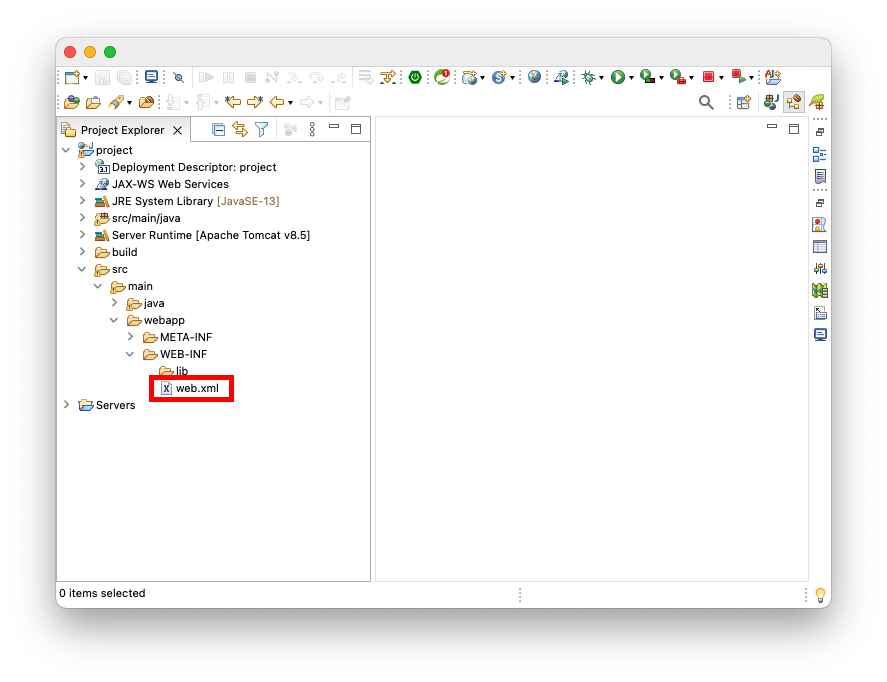

# Table of Contents
[[toc]]

# web.xml
WAS는 Java Web Application를 구동하면서 `web.xml`파일을 참고하여 Web Container와 Context를 구성한다. Eclipse로 생성한 Java Web Application 프로젝트에서는 보통 다음 경로에 위치한다.
 

`web.xml`에는 다음 정보가 포함된다.
## Welcome File
`Welcome File`은 Web Application의 기본 웹 페이지다. 클라이언트가 서블릿 이름을 생략하여 요청하면 웹 서버는 Welcome File을 찾아서 응답한다.
```xml web.xml
<?xml version="1.0" encoding="UTF-8"?>
<web-app xmlns:xsi="http://www.w3.org/2001/XMLSchema-instance" xmlns="http://xmlns.jcp.org/xml/ns/javaee" xsi:schemaLocation="http://xmlns.jcp.org/xml/ns/javaee http://xmlns.jcp.org/xml/ns/javaee/web-app_3_1.xsd" id="WebApp_ID" version="3.1">
  
    <welcome-file-list>
        <welcome-file>index.html</welcome-file>
        <welcome-file>index.htm</welcome-file>
        <welcome-file>index.jsp</welcome-file>
        <welcome-file>default.html</welcome-file>
        <welcome-file>default.htm</welcome-file>
        <welcome-file>default.jsp</welcome-file>
    </welcome-file-list>
  
</web-app>
```
## Servlet URL 매핑
``` xml web.xml
<?xml version="1.0" encoding="UTF-8"?>
<web-app xmlns:xsi="http://www.w3.org/2001/XMLSchema-instance"
    xmlns="http://xmlns.jcp.org/xml/ns/javaee"
    xsi:schemaLocation="http://xmlns.jcp.org/xml/ns/javaee http://xmlns.jcp.org/xml/ns/javaee/web-app_3_1.xsd"
    id="WebApp_ID" version="3.1">

    <!-- ... -->

    <servlet>
        <servlet-name>controller</servlet-name>
        <servlet-class>com.yologger.app.controller.Controller</servlet-class>
    </servlet>
    <servlet-mapping>
        <servlet-name>controller</servlet-name>
        <url-pattern>/controller</url-pattern>
    </servlet-mapping>

</web-app>
```

## Listener 정의
``` xml web.xml
<?xml version="1.0" encoding="UTF-8"?>
<web-app xmlns:xsi="http://www.w3.org/2001/XMLSchema-instance"
	xmlns="http://xmlns.jcp.org/xml/ns/javaee"
	xsi:schemaLocation="http://xmlns.jcp.org/xml/ns/javaee http://xmlns.jcp.org/xml/ns/javaee/web-app_3_1.xsd"
	id="WebApp_ID" version="3.1">

    <!-- Listener -->
    <listener>
        <listener-class>com.yologger.app.listener.AppListener</listener-class>
    </listener>
</web-app>
```

## Filter 정의
``` xml web.xml
<?xml version="1.0" encoding="UTF-8"?>
<web-app xmlns:xsi="http://www.w3.org/2001/XMLSchema-instance" xmlns="http://xmlns.jcp.org/xml/ns/javaee" xsi:schemaLocation="http://xmlns.jcp.org/xml/ns/javaee http://xmlns.jcp.org/xml/ns/javaee/web-app_3_1.xsd" id="WebApp_ID" version="3.1">

    <filter>
        <filter-name>MyFilter</filter-name>
        <filter-class>com.yologger.app.MyFilter</filter-class>
    </filter>
    <filter-mapping>
        <filter-name>MyFilter</filter-name>
        <url-pattern>/*</url-pattern>
    </filter-mapping>

</web-app> 
```

## ServletContext 정의
``` xml web.xml
<?xml version="1.0" encoding="UTF-8"?>
<web-app xmlns:xsi="http://www.w3.org/2001/XMLSchema-instance"
	xmlns="http://xmlns.jcp.org/xml/ns/javaee"
	xsi:schemaLocation="http://xmlns.jcp.org/xml/ns/javaee http://xmlns.jcp.org/xml/ns/javaee/web-app_3_1.xsd"
	id="WebApp_ID" version="3.1">
    <context-param>
        <param-name>name</param-name>
        <param-value>Paul</param-value>
    </context-param>

    <context-param>
        <param-name>nation</param-name>
        <param-value>England</param-value>
    </context-param>

</web-app>
```

## Error Page
``` xml web.xml
<?xml version="1.0" encoding="UTF-8"?>
<web-app xmlns:xsi="http://www.w3.org/2001/XMLSchema-instance" xmlns="http://xmlns.jcp.org/xml/ns/javaee" xsi:schemaLocation="http://xmlns.jcp.org/xml/ns/javaee http://xmlns.jcp.org/xml/ns/javaee/web-app_3_1.xsd" id="WebApp_ID" version="3.1">
  
    <error-page>
        <error-code>404</error-code>
        <location>/errorPage404.jsp</location>
    </error-page>

</web-app>
```