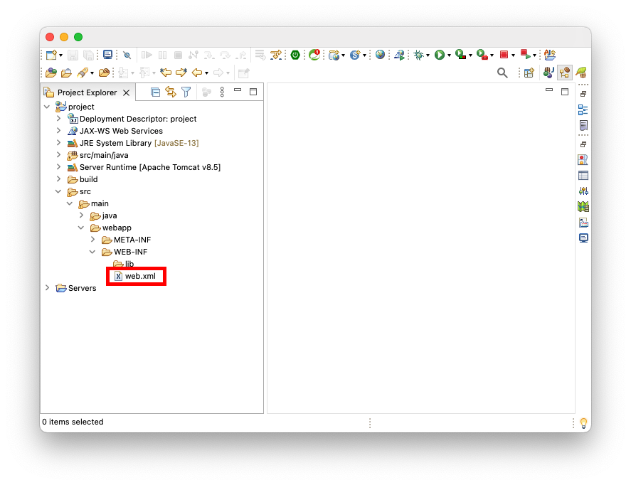

# Table of Contents
[[toc]]

## web.xml
WAS는 Java Web Application를 구동하면서 `web.xml`파일을 참고하여 Web Container와 Servlet Context를 구성한다. Eclipse로 생성한 Java Web Application 프로젝트에서는 보통 다음 경로에 위치한다.

 

`web.xml`에 포함되는 정보는 다음과 같다.

### Welcome File
`Welcome File`은 Web Application의 기본 웹 페이지다. 클라이언트가 서블릿 이름을 생략하여 요청하면 웹 서버는 Welcome File을 찾아서 응답한다.
```xml web.xml
<?xml version="1.0" encoding="UTF-8"?>
<web-app xmlns:xsi="http://www.w3.org/2001/XMLSchema-instance" xmlns="http://xmlns.jcp.org/xml/ns/javaee" xsi:schemaLocation="http://xmlns.jcp.org/xml/ns/javaee http://xmlns.jcp.org/xml/ns/javaee/web-app_3_1.xsd" id="WebApp_ID" version="3.1">
  
    <welcome-file-list>
        <welcome-file>index.html</welcome-file>
        <welcome-file>index.htm</welcome-file>
        <welcome-file>index.jsp</welcome-file>
        <welcome-file>default.html</welcome-file>
        <welcome-file>default.htm</welcome-file>
        <welcome-file>default.jsp</welcome-file>
    </welcome-file-list>
  
</web-app>
```
### Servlet URL 매핑
``` xml web.xml
<?xml version="1.0" encoding="UTF-8"?>
<web-app xmlns:xsi="http://www.w3.org/2001/XMLSchema-instance"
    xmlns="http://xmlns.jcp.org/xml/ns/javaee"
    xsi:schemaLocation="http://xmlns.jcp.org/xml/ns/javaee http://xmlns.jcp.org/xml/ns/javaee/web-app_3_1.xsd"
    id="WebApp_ID" version="3.1">

    <!-- ... -->

    <servlet>
        <servlet-name>controller</servlet-name>
        <servlet-class>com.yologger.app.controller.Controller</servlet-class>
    </servlet>
    <servlet-mapping>
        <servlet-name>controller</servlet-name>
        <url-pattern>/controller</url-pattern>
    </servlet-mapping>

</web-app>
```

### Listener 정의
``` xml web.xml
<?xml version="1.0" encoding="UTF-8"?>
<web-app xmlns:xsi="http://www.w3.org/2001/XMLSchema-instance"
	xmlns="http://xmlns.jcp.org/xml/ns/javaee"
	xsi:schemaLocation="http://xmlns.jcp.org/xml/ns/javaee http://xmlns.jcp.org/xml/ns/javaee/web-app_3_1.xsd"
	id="WebApp_ID" version="3.1">

    <!-- Listener -->
    <listener>
        <listener-class>com.yologger.app.listener.AppListener</listener-class>
    </listener>
</web-app>
```

### Filter 정의
``` xml web.xml
<?xml version="1.0" encoding="UTF-8"?>
<web-app xmlns:xsi="http://www.w3.org/2001/XMLSchema-instance" xmlns="http://xmlns.jcp.org/xml/ns/javaee" xsi:schemaLocation="http://xmlns.jcp.org/xml/ns/javaee http://xmlns.jcp.org/xml/ns/javaee/web-app_3_1.xsd" id="WebApp_ID" version="3.1">

    <filter>
        <filter-name>MyFilter</filter-name>
        <filter-class>com.yologger.app.MyFilter</filter-class>
    </filter>
    <filter-mapping>
        <filter-name>MyFilter</filter-name>
        <url-pattern>/*</url-pattern>
    </filter-mapping>

</web-app> 
```

### ServletContext 정의
``` xml web.xml
<?xml version="1.0" encoding="UTF-8"?>
<web-app xmlns:xsi="http://www.w3.org/2001/XMLSchema-instance"
	xmlns="http://xmlns.jcp.org/xml/ns/javaee"
	xsi:schemaLocation="http://xmlns.jcp.org/xml/ns/javaee http://xmlns.jcp.org/xml/ns/javaee/web-app_3_1.xsd"
	id="WebApp_ID" version="3.1">
    <context-param>
        <param-name>name</param-name>
        <param-value>Paul</param-value>
    </context-param>

    <context-param>
        <param-name>nation</param-name>
        <param-value>England</param-value>
    </context-param>

</web-app>
```

### Error Page
``` xml web.xml
<?xml version="1.0" encoding="UTF-8"?>
<web-app xmlns:xsi="http://www.w3.org/2001/XMLSchema-instance" xmlns="http://xmlns.jcp.org/xml/ns/javaee" xsi:schemaLocation="http://xmlns.jcp.org/xml/ns/javaee http://xmlns.jcp.org/xml/ns/javaee/web-app_3_1.xsd" id="WebApp_ID" version="3.1">
  
    <error-page>
        <error-code>404</error-code>
        <location>/errorPage404.jsp</location>
    </error-page>

</web-app>
```

## web.xml 파일 없애기
Servlet 3.0 부터는 `web.xml`없이 Servlet Context를 초기화할 수 있다.  `javax.servlet.ServletContainerInitializer`인터페이스의 구현체를 만들고 `META-INF/services/javax.servlet.ServletContainerInitializer`라는 텍스트 파일에 추가하면 된다.

### ServletContainerInitializer
우선 `web.xml`을 사용한 간단한 예제를 살펴보자. `Controller` 서블릿 클래스를 컨테이너에 등록하고 URL 매핑을 하고있다.
``` xml web.xml
<?xml version="1.0" encoding="UTF-8"?>
<web-app xmlns:xsi="http://www.w3.org/2001/XMLSchema-instance"
    xmlns="http://xmlns.jcp.org/xml/ns/javaee" xsi:schemaLocation="http://xmlns.jcp.org/xml/ns/javaee http://xmlns.jcp.org/xml/ns/javaee/web-app_3_1.xsd"
    id="WebApp_ID" version="3.1">

    <servlet>
        <servlet-name>controller</servlet-name>
        <servlet-class>com.yologger.app.controller.Controller</servlet-class>
    </servlet>
    <servlet-mapping>
        <servlet-name>controller</servlet-name>
        <url-pattern>/Controller</url-pattern>
    </servlet-mapping>

</web-app>
```

이제 `ServletContainerInitializer`인터페이스를 사용하여 위와 동일한 코드를 구현해보자. `web.xml`을 삭제하고 `ServletContainerInitializer`인터페이스의 구현체를 정의한다.
``` java AppInitializer.java
package com.yologger.app.config;

public class AppInitializer implements ServletContainerInitializer {

    @Override
    public void onStartup(Set<Class<?>> set, ServletContext servletContext) throws ServletException {	
        ServletRegistration.Dynamic servlet = servletContext.addServlet("controller", Controller.class);
        servlet.setLoadOnStartup(0);
        servlet.addMapping("/Controller");	
    }
}
```
그리고 `META-INFO/services` 디렉토리에 `javax.servlet.ServletContainerInitializer`라는 파일을 생성한다. 그 다음 `AppInitializer`클래스의 경로를 입력한다.
``` text javax.servlet.ServletContainerInitializer
com.yologger.app.config.AppInitializer
```
이제 웹 어플리케이션을 다시 시작해보자. 서블릿 컨테이너는 `ServletContainerInitializer`인터페이스의 구현체를 참조하여 컨텍스트를 생성하게된다.

### SpringServletContainerInitializer
스프링 프레임워크는 `ServletContainerInitializer`를 상속하는 <b>`SpringServletContainerInitializer`</b>를 사용한다. `SpringServletContainerInitializer`는 내부적으로 XML 파일 형태의 컨텍스트 파일을 읽어서 `Spring IoC Container`를 생성한 후 서블릿으로 등록한다. 