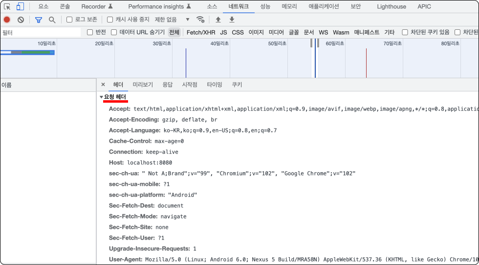
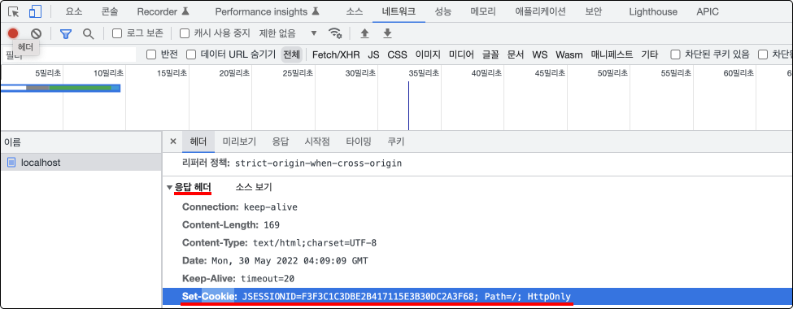
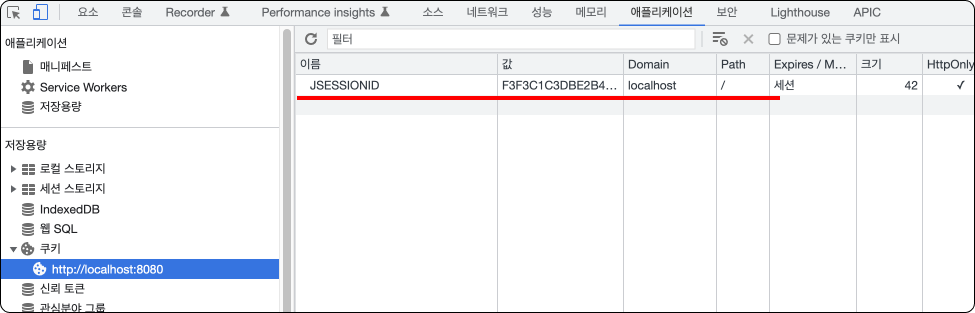
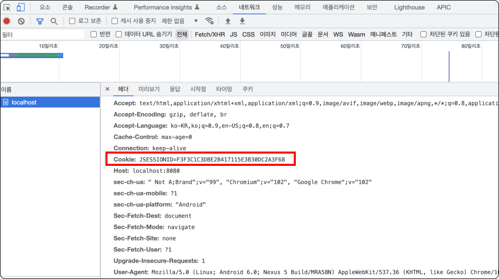
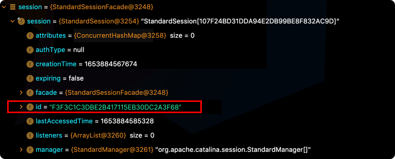

# Table of Contents
[[toc]]


## HTTP Connectionless, Stateless
HTTP는 `비연결성(Connectionless)`과 `무상태성(Stateless)`을 가진다. 즉 클라이언트가 요청을 보내고 서버가 적절한 응답을 하면 바로 HTTP 연결이 끊어진다. 

## Cookie, Session
`쿠키(Cookie)`와 `세션(Session)`을 사용하면 HTTP에 연결성과 상태를 부여할 수 있다. 쿠키와 세션의 동작 원리를 알아보자.

클라이언트는 첫 번째 요청을 쿠키 없이 보낸다.



서블릿 컨테이너는 첫 번째 요청이 들오면 세션과 쿠키를 생성한 후 세션은 서버에 저장하고 쿠키는 클라이언트에게 전송한다. 이때 `Set-Cookie` 응답 헤더로 쿠키를 담아 전송하며, `JSESSIONID`를 키 값으로 사용하게 된다.



클라이언트는 이 쿠키를 받아 브라우저에 저장한다.



클라이언트는 두 번째 요청부터 `Cookie` 요청 헤더에 쿠키를 포함시킨다.



세션의 `id` 속성에는 `JSESSIONID` 값이 저장되어있다.



서버는 클라이언트가 보낸 쿠키와 세션의 `id`를 비교하여 일치 여부를 확인한다. 이러한 방법으로 클라이언트와 서버 간 `연결성`과 `상태성`을 확보할 수 있다.

참고로 세션은 코드에서 다음과 같이 접근할 수 있다.
``` java {6}
import javax.servlet.http.HttpSession;

@WebServlet(name = "helloServlet", value = "/hello-servlet")
public class HelloServlet extends HttpServlet {

    public void doGet(HttpServletRequest request, HttpServletResponse response) throws IOException {

        HttpSession session = request.getSession();

        // ...
    }
}
```
