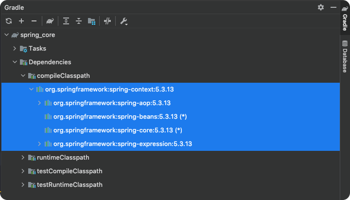

# Table of Contents
[[toc]]

# Spring Core
`Spring Core`는 `Spring Framework`의 핵심 컴포넌트다. `Spring Core`의 가장 중요한 기능은 `제어의 역전(Inversion of Control)`과 `의존성 주입(Dependency Injection)`이다.

## 설정
`Gradle`로 간단한 Java 애플리케이션을 생성하고 `Spring Core` 의존성을 추가해보자.

``` groovy 
// build.gradle
plugins {
    id 'java'
}

group 'com.yologger'
version '1.0-SNAPSHOT'

repositories {
    mavenCentral()
}

dependencies {
    // Spring Context
    implementation 'org.springframework:spring-context:5.3.13'
}

test {
    useJUnitPlatform()
}
```
참고로 `spring-context.jar`는 내부적으로 다음과 같은 의존성이 있다.




## 제어의 역전
`제어의 역전(Inversion of Control)`은 객체의 생성, 관리, 제거 등의 제어를 개발자가 직접 하지 않고 `Spring IoC Container`에 위임하는 것이다. 제어의 역전을 위해서는 `Spring IoC Contaier`에 객체를 등록해야한다. 


## 의존성 주입
`의존성 주입(Dependency Injection)`은 `Spring IoC Container`가 적절한 곳에 객체를 주입하는 것이다.

## Bean, POJO
`Spring IoC Container`에 등록된 객체를 `Bean` 또는 `POJO(Plain Old Java Object)`라고 한다.

## 마치며
객체 등록 방법에는 두 가지가 있다.

- XML 파일을 통한 객체 등록
- Annotation을 통한 객체 등록

다음 포스트에서 두 가지 방법에 대해 알아보겠다.