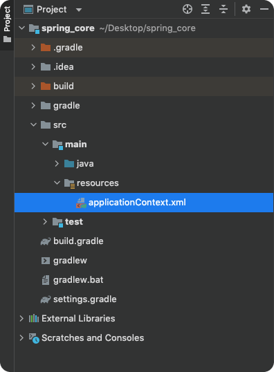
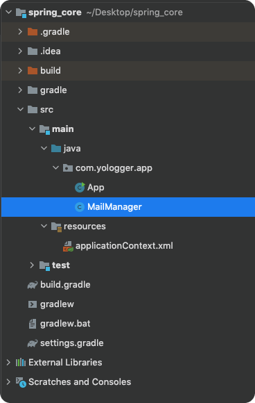

# Table of Contents
[[toc]]

`Spring IoC Container`에 객체를 등록하는 방법은 두 가지다.

- XML 파일을 통한 빈 등록
- Annotation을 통한 빈 등록

이번 포스트에서는 XML 파일을 통한 객체 등록 방법에 대해 정리한다.

## XML 파일을 통한 빈 등록
`Phone.java`이라는 클래스가 있다고 가정하자.
``` java
package com.yologger.app;

public class Phone {

    private String name;
    private String manufacturer;

    // 기본 생성자
    public Phone() {
        
    }
}
```
이제 빈을 정의할 `ApplicationContext.xml` 파일을 생성하자. `Phone.java`클래스는 다음과 같이 등록할 수 있다.
``` xml {8-9,11-12}
// applicationContext.xml

<?xml version="1.0" encoding="UTF-8"?>
<beans xmlns="http://www.springframework.org/schema/beans"
 xmlns:xsi="http://www.w3.org/2001/XMLSchema-instance"
 xsi:schemaLocation="http://www.springframework.org/schema/beans http://www.springframework.org/schema/beans/spring-beans.xsd">

    <bean id="myPhone" class="com.yologger.app.Phone">
    </bean>

    <bean id="yourPhone" class="com.yologger.app.Phone">
    </bean>

</beans>
```



`Phone.java` 클래스에 다음과 같이 생성자가 있다면
``` java {9-12}
package com.yologger.app;

public class Phone {

    private String name;
    private String manufacturer;
	
    // 생성자
    public Phone(String name, String manufacturer) {
        this.name = name;
        this.manufacturer = manufacturer;
    }
}
```
`<constructor-arg>` 태그로 멤버변수를 설정할 수 있다.
``` xml
// ApplicationContext.xml

<?xml version="1.0" encoding="UTF-8"?>
<beans xmlns="http://www.springframework.org/schema/beans"
 xmlns:xsi="http://www.w3.org/2001/XMLSchema-instance"
 xsi:schemaLocation="http://www.springframework.org/schema/beans http://www.springframework.org/schema/beans/spring-beans.xsd">

    <bean id="myPhone" class="com.yologger.app.Phone">
        <constructor-arg value="Galaxy S22"/>
        <constructor-arg value="Samsung"/>
    </bean>

    <bean id="yourPhone" class="com.yologger.app.Phone">
        <constructor-arg value="iPhone 13"/>
        <constructor-arg value="Apple"/>
    </bean>
	
</beans>
```

`Phone.java` 클래스에 다음과 같이 Setter 메소드가 있다면

``` java Phone.java
package com.yologger.app;

public class Phone {

    private String name;
    private String manufacturer;

    // Default Constructor
    public Phone() {
        
    }

    // Setter
    public void setName(String name) {
        this.name = name;
    }

    // Setter
    public void setManufacturer(String manufacturer) {
        this.manufacturer = manufacturer;
    }
}
```

`<property>` 태그로 멤버변수를 설정할 수 있다.

``` xml {8-11,13-16}
// applicationContext.xml

<?xml version="1.0" encoding="UTF-8"?>
<beans xmlns="http://www.springframework.org/schema/beans"
 xmlns:xsi="http://www.w3.org/2001/XMLSchema-instance"
 xsi:schemaLocation="http://www.springframework.org/schema/beans http://www.springframework.org/schema/beans/spring-beans.xsd">

    <bean id="myPhone" class="com.yologger.app.Phone">
        <property name="name" value="iPhone 11" />
        <property name="manufacturer" value="Apple" />
    </bean>

    <bean id="yourPhone" class="com.yologger.app.Phone">
        <property name="name" value="Galaxy S22" />
        <property name="manufacturer" value="Samsung" />
    </bean>

</beans>
```

만약 빈이 배열을 포함한다면
``` java Person.java
class Person {
    String name;
    String[] hobbies;
}
```
다음과 같이 정의할 수 있다.
``` xml 
// applicationContext.xml
<bean id="me" class=“com.company.app.Person”>
    <property name=“name”>
        <value>Paul</value>
    </property>
    <property name=“hobbies”>
        <list>
            <value>soccer</value>
            <value>basketball</value> 
            <value>swimming</value>
        </list>
    </property>
</bean>		
```
빈이 참조 타입을 포함한다면
``` java Person.java
class Person {
    String name;
    Car car;
}
```
다음과 같이 등록할 수 있다.
``` xml 
// applicationContext.xml
<bean id="myCar" class=“com.company.app.Car”>
    ... 
</bean>

<bean id="me" class=“com.company.app.Person”>
    <property name=“name”>
        <value>Paul</value>
    </property>
    <property name=“car”>
        <ref bean name=“myCar”>
    </property>
</bean>		
```


## c namespace, p namespace
`c namespace`와 `p namespace`를 사용하면 빈의 속성값을 더 쉽게 설정할 수 있다. `<beans>` 태그에 다음 네임스페이스를 등록하자.

### c namespace
`c namespace`를 사용하면 생성자를 통한 속성값 설정을 더 쉽게 할 수 있다. `c namespace`를 사용하려면 객체에 생성자를 정의해야한다.
``` java Family.java
class Family {

    String father;
    String mother;
    String brother;
    String sister;

    // 생성자 정의
    public Family(String father, String mother, String brother, String sister){
        this.father = father;
        this.mother = mother;
        this.brother = brother;
        this.sister = sister;
    }
}
```
그리고 XML 파일에 다음 네임스페이스를 추가한다.
``` xml {4}
<?xml version="1.0" encoding="UTF-8"?>
<beans xmlns="http://www.springframework.org/schema/beans"
 xmlns:xsi="http://www.w3.org/2001/XMLSchema-instance"
 xmlns:c="http://www.springframework.org/schema/c"
 xsi:schemaLocation="http://www.springframework.org/schema/beans http://www.springframework.org/schema/beans/spring-beans.xsd">

</beans>	
```

이제 다음과 같이 `c namespace`를 사용할 수 있다. 
``` xml {7}
<?xml version="1.0" encoding="UTF-8"?>
<beans xmlns="http://www.springframework.org/schema/beans"
 xmlns:xsi="http://www.w3.org/2001/XMLSchema-instance"
 xmlns:c="http://www.springframework.org/schema/c"
 xsi:schemaLocation="http://www.springframework.org/schema/beans http://www.springframework.org/schema/beans/spring-beans.xsd">

    <bean id=“samsungFamily” class=“com.company.app.Family” c:father="이건희" c:mother="홍라희" c:sister="이서현" c:brother="이재용" />

</beans>	
```

### p namespace
`p namespace`를 사용하면 Setter를 통한 속성값 설정을 더 쉽게 할 수 있다. `p namespace`를 사용하려면 기본생성자와 setter를 정의해야한다.

``` java Family.java
class Family {

    String father;
    String mother;
    String brother;
    String sister;

    public Family() {

    }

    public setFather(String name){
        this.father = name;
    }

    public setMother(String name){
        this.mother = name;
    }

    public setBrother(String name){
        this.brother = name;
    }

    public setSister(String name){
        this.sister = name;
    }
}
```
그리고 XML 파일에 다음 네임스페이스를 추가한다.
``` xml {4}
<?xml version="1.0" encoding="UTF-8"?>
<beans xmlns="http://www.springframework.org/schema/beans"
 xmlns:xsi="http://www.w3.org/2001/XMLSchema-instance"
 xmlns:p = "http://www.springframework.org/schema/p"
 xsi:schemaLocation="http://www.springframework.org/schema/beans http://www.springframework.org/schema/beans/spring-beans.xsd">

</beans>	
```


이제 다음과 같이 `p namespace`를 사용할 수 있다. 
``` xml {7}
<?xml version="1.0" encoding="UTF-8"?>
<beans xmlns="http://www.springframework.org/schema/beans"
 xmlns:xsi="http://www.w3.org/2001/XMLSchema-instance"
 xmlns:p = "http://www.springframework.org/schema/p"
 xsi:schemaLocation="http://www.springframework.org/schema/beans http://www.springframework.org/schema/beans/spring-beans.xsd">

    <bean id=“samsungFamily” class=“com.company.app.Family” p:father="이건희" p:mother="홍라희" p:sister="이서현" p:brother="이건희" />

</beans>	
```


## Component Scan
지금까지 `XML 파일`을 사용하여 빈을 등록했다.
``` xml {8-9}
// applicationContext.xml

<?xml version="1.0" encoding="UTF-8"?>
<beans xmlns="http://www.springframework.org/schema/beans"
 xmlns:xsi="http://www.w3.org/2001/XMLSchema-instance"
 xsi:schemaLocation="http://www.springframework.org/schema/beans http://www.springframework.org/schema/beans/spring-beans.xsd">

    <bean id="mailManager" class="com.yologger.app.MailManager">
    </bean>

</beans>
```
XML 파일 대신 `@Component`, `@Controller`, `@RestController`, `@Service`, `@Repository` 등의 어노테이션을 사용하여 빈을 등록할 수도 있다.

``` java {1,5}
package com.yologger.app;

import org.springframework.stereotype.Component;

@Component
public class MailManager {
    void sendEmail() {
        // ...
    }
}
```
이 기능을 사용하려면 해당 어노테이션이 붙은 클래스의 경로를 컨테이너에 알려줘야하며, 이를 `Component Scan`이라고 한다. 

프로젝트 구조가 다음과 같다고 가정해보자.



`Component Scan`은 XML 파일에 다음과 같이 추가한다.
``` xml {9}
// applicationContext.xml

<?xml version="1.0" encoding="UTF-8"?>
<beans xmlns="http://www.springframework.org/schema/beans"
       xmlns:xsi="http://www.w3.org/2001/XMLSchema-instance"
       xmlns:context="http://www.springframework.org/schema/context"
       xsi:schemaLocation="http://www.springframework.org/schema/beans http://www.springframework.org/schema/beans/spring-beans.xsd http://www.springframework.org/schema/context https://www.springframework.org/schema/context/spring-context.xsd">

    <context:component-scan base-package="com.yologger.app" />

</beans>
```

이제 컨테이너가 해당 패키지를 스캔하여 `@Component`, `@Controller`, `@RestController`, `@Service`, `@Repository`이 붙은 컴포넌트를 컨테이너에 빈으로 등록하게 된다.


## Scope
빈은 `스코프(Scope)`를 가진다. 기본값은 `singleton`이며, 빈은 컨테이너 내에서 오직 한 개만 존재한다.
```xml applicaionContext.xml
<bean id="student" class="com.company.app.domain.Student" scope="singleton">
    <constructor-arg value="Paul"> </constructor-arg>
    <constructor-arg value="USA"> </constructor-arg>
</bean>
```
``` java Main.java
class Main{
    public static void main(String[] args){
        // s1, s2는 같은 객체를 레퍼런스 한다.
        Student s1 = ctx.getBean("student", Student.class);
        Student s2 = ctx.getBean("student", Student.class);
        System.out.println(s1 === s2);      // true
    }
}
```

`prototype`는 빈을 주입할 때 마다 새로운 인스턴스가 생성된다.
```xml applicaionContext.xml
<bean id="student" class="com.company.app.domain.Student" scope="prototype">
    <constructor-arg value="Paul"> </constructor-arg>
    <constructor-arg value="USA"> </constructor-arg>
</bean>
```
``` java Main.java
class Main {
    public static void main(String[] args){
        // s1, s2는 다른 객체를 레퍼런스 한다.
        Student s1 = ctx.getBean("student", Student.class);
        Student s2 = ctx.getBean("student", Student.class);
        System.out.println(s1 === s2);      // false
    }
}
```


## 의존성 주입
빈을 컨테이너에 등록했다면 필요한 위치에서 빈을 주입받아 사용할 수 있다. 이를 `의존성 주입(Dependency Inject)`이라고 한다.

의존성 주입을 하려면 먼저 컨테이너를 인스턴스화 해야한다. XML 파일을 사용하는 경우 `GenericXmlApplicationContext`를 이용한다.
``` xml
// ApplicationContext.xml

<?xml version="1.0" encoding="UTF-8"?>
<beans xmlns="http://www.springframework.org/schema/beans"
 xmlns:xsi="http://www.w3.org/2001/XMLSchema-instance"
 xsi:schemaLocation="http://www.springframework.org/schema/beans http://www.springframework.org/schema/beans/spring-beans.xsd">

    <bean id="myPhone" class="com.yologger.app.Phone">
        <constructor-arg value="Galaxy S22"/>
        <constructor-arg value="Samsung"/>
    </bean>

    <bean id="yourPhone" class="com.yologger.app.Phone">
        <constructor-arg value="iPhone 13"/>
        <constructor-arg value="Apple"/>
    </bean>
	
</beans>
```
``` java
// Spring IoC Container 생성
String configLocation = "classpath:applicationContext.xml";
AbstractApplicationContext ctx = new GenericXmlApplicationContext(configLocation);
```
컨테이너를 인스턴스화 했다면 `getBean()` 메소드를 통해 빈을 가져올 수 있다.
``` java
Phone myPhone = ctx.getBean("myPhone", Phone.class);
Phone yourPhone = ctx.getBean("yourPhone", Phone.class);
```
전체 코드는 다음과 같다.
``` java App.java
import org.springframework.context.support.AbstractApplicationContext;
import org.springframework.context.support.GenericXmlApplicationContext;

public class App {
    public static void main(String[] args) {

        // Spring IoC Container 생성
        String configLocation = "classpath:applicationContext.xml";
        AbstractApplicationContext ctx = new GenericXmlApplicationContext(configLocation);
		
        // 의존성 주입
        Phone myPhone = ctx.getBean("myPhone", Phone.class);
        Phone yourPhone = ctx.getBean("yourPhone", Phone.class);
		
        System.out.println(myPhone.getName());  // iPhone 11
        System.out.println(myPhone.getManufacturer());  // Apple
        
        System.out.println(yourPhone.getName());  // Galaxy S22
        System.out.println(yourPhone.getManufacturer());  // Samsung
    }
}
```


### 다형성과 의존성 주입
다형성을 활용하여 인터페이스 타입의 변수에 여러 구현체를 주입할 수 있다. 다음과 같이 `Car.java` 인터페이스가 있다.
``` java Car.java
package com.yologger.app;

public interface Car {
    void drive();
}
```
그리고 `Car`인터페이스를 구현한 `Truck`, `SUV`, `Sedan`클래스가 있다.
``` java Truck.java
package com.yologger.app;

public class Truck implements Car {
    @Override
    public void drive() {
        System.out.println("drive truck");
    }
}
```
``` java SUV.java
package com.yologger.app;

public class SUV implements Car {
    @Override
    public void drive() {
        System.out.println("drive SUV");
    }
}
```
``` java Car.java
package com.yologger.app;

public class Sedan implements Car {
    @Override
    public void drive() {
        System.out.println("drive sedan");
    }
}
```
XML 파일에 각 구현체를 빈으로 등록하자.
``` xml applicationContext.xml
<?xml version="1.0" encoding="UTF-8"?>
<beans xmlns="http://www.springframework.org/schema/beans"
 :xsi="http://www.w3.org/2001/XMLSchema-instance"
 xsi:schemaLocation="http://www.springframework.org/schema/beans http://www.springframework.org/schema/beans/spring-beans.xsd">

    <bean id="myCar" class="com.yologger.app.Truck" />
    <bean id="hisCar" class="com.yologger.app.SUV" />
    <bean id="herCar" class="com.yologger.app.Sedan" />
	
</beans>
```
이제 다음과 같이 인터페이스에 구현체를 주입할 수 있다.
``` java App.java
import org.springframework.context.support.AbstractApplicationContext;
import org.springframework.context.support.GenericXmlApplicationContext;

public class App {
    public static void main(String[] args) {
        String configLocation = "classpath:ApplicationContext.xml";
        AbstractApplicationContext ctx = new GenericXmlApplicationContext(configLocation);
		
        Car myCar = ctx.getBean("myCar", Car.class);
        myCar.drive();		// drive truck
		
        Car hisCar = ctx.getBean("hisCar", Car.class);
        hisCar.drive();		// drive SUV
		
        Car herCar = ctx.getBean("herCar", Car.class);
        herCar.drive();		// drive sedan
    }
}
```