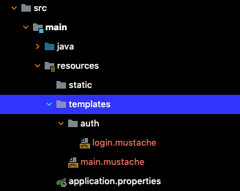

[[toc]]

## @Controller
`@Controller`는 사용자의 요청을 받고 뷰를 보여주는 스프링 컴포넌트다. 뷰를 보여주기 위해서는 템플릿 엔진 또는 뷰 리솔버를 설정해야한다.



``` java
import org.springframework.stereotype.Controller;

@Controller
public class MainController {

    @RequestMapping("/")
    public String showLogin() {
        return "main";      // main.mustache
    }
}
```

``` java
import org.springframework.stereotype.Controller;

@Controller
@RequestMapping("/auth")
public class AuthController {

    @RequestMapping("/login")
    public String showLogin() {
        return "auth/login";    // auth/login.mustache
    }
}
```

### Model
`Model`을 사용하여 뷰에 데이터를 전달할 수도 있다.
``` java
import org.springframework.stereotype.Controller;

@Controller
@RequestMapping("/test")
public class TestController {

    @RequestMapping("/test")
    public String test(Model model) {
        model.addAttribute("name", "Paul");
        model.addAttribute("age", 35);
        return "test";      // test.mustache
    }
}
```

뷰에서는 다음과 같이 받을 수 있다.
``` html
<html>
    <head>
    </head>
    <body>
        {{name}}
        {{age}}
    </body>
</html>
```

### ModelAndView
`ModelAndView`를 사용하여 뷰에 데이터를 전달할 수도 있다.
``` java
@Controller
@RequestMapping("/test")
public class TestController {

    @GetMapping("/test")
    public ModelAndView test() {
        ModelAndView modelAndView = new ModelAndView();
        modelAndView.setViewName("main");
        modelAndView.addObject("name", "John");
        modelAndView.addObject("age", 35);
        return modelAndView;
    }
}
```

### @ResponseBody
`@Controller`는 반환되는 경로의 뷰를 보여준다.
``` java
import org.springframework.stereotype.Controller;

@Controller
@RequestMapping("/test")
public class TestController {

    @RequestMapping("/test")
    public String test() {
        return "test";      // test.mustache 뷰를 보여준다.
    }
}
```

`@ResponseBody`를 사용하면 뷰 대신 데이터를 반환한다.
``` java
import org.springframework.stereotype.Controller;

@Controller
@RequestMapping("/test")
public class TestController {

    @RequestMapping("/test")
    @ResponseBody
    public String test() {
        return "test";      // test라는 문자열을 반환된다.
    }
}
```

객체의 경우 JSON 형태로 변환되어 반환된다.
``` java
import org.springframework.stereotype.Controller;

@Controller
@RequestMapping("/test")
public class TestController {

    @RequestMapping("/test")
    @ResponseBody
    public DataDTO test() {
        DataDTO data = new DataDTO();
        return data;      // DataDTO가 JSON으로 변환되어 반환된다.
    }
}
```

## @RestController
`@RestController`는 REST API 엔드포인트 컨트롤러를 만들기 위한 어노테이션으로 `@Controller`와 `@ResponseBody` 합친 것과 동일하다. 아래 두 코드는 동일하다.

``` java{1,6}
@Controller
@RequestMapping("/test")
public class TestController {

    @RequestMapping("/test")
    @ResponseBody
    public DataDTO test() {
        DataDTO data = new DataDTO();
        return data;
    }
}
```


``` java{1}
@RestController
@RequestMapping("/test")
public class TestController {

    @RequestMapping("/test")
    // @ResponseBody
    public DataDTO test() {
        DataDTO data = new DataDTO();
        return data;
    }
}
```

## @RequestMapping
`@RequestMapping`는 엔드 포인트 경로를 지정하는데 사용한다. `method` 속성을 정의하지 않으면 모든 HTTP 요청을 수신할 수 있다.
``` java
@RestController
public class Controller {

    @RequestMapping(value = "/test")
    public String test() {
        return "test";
    }
}
```
``` shellsession
$ curl -X GET -G `http://localhost:8080/test`
test
```
``` shellsession
$ curl -X POST -G `http://localhost:8080/test`
test
```
`method` 속성으로 특정 HTTP 메소드만 수신하도록 제한할 수 있다.
``` java
@RestController
public class Controller {

    @RequestMapping(value = "/get", method = RequestMethod.GET)
    public String get() {
        return "get";
    }
}
```
``` shellsession
$ curl -X GET -G `http://localhost:8080/test`
test
```
``` shellsession {2}
$ curl -X POST -G `http://localhost:8080/test`
{"timestamp":"2022-05-09T13:40:02.292+00:00","status":405,"error":"Method Not Allowed","path":"/test"}
```

### consumes
`@RequestMapping`의 `consumes` 속성을 사용하면 클라이언트로 부터 수신하려는 데이터 포맷을 제한할 수 있다.
``` java {4}
@RequestMapping(
    value = "/test", 
    method = RequestMethod.POST, 
    consumes = MediaType.APPLICATION_JSON_VALUE
)
public String test() {
    return "test";
}
```
이 경우 클라이언트가 요청을 보낼 때 `Content-Type` 헤더를 설정해야한다.
``` shellsession
$ curl -X POST -G 'http://localhost:8080/test'

{"timestamp":"2022-05-09T13:51:31.221+00:00","status":415,"error":"Unsupported Media Type","path":"/test"}
```
``` shellsession
$ curl -X POST -G 'http://localhost:8080/test' \
-H 'Content-Type: text/plain'

{"timestamp":"2022-05-09T13:51:14.675+00:00","status":415,"error":"Unsupported Media Type","path":"/test"}    
```
``` shellsession
$ curl -X POST -G 'http://localhost:8080/test' \
-H 'Content-Type: application/json'

test
```
배열 형태로 여러 타입을 받을 수도 있다.
``` java {4}
@RequestMapping(
    value = "/test", 
    method = RequestMethod.POST, 
    consumes = {MediaType.APPLICATION_JSON_VALUE, MediaType.TEXT_PLAIN_VALUE}
)
public String test() {
    return "test";
}
```

### produces
`@RequestMapping`의 `produces` 속성을 사용하면 서버가 응답하는 데이터의 타입을 지정할 수 있다.
``` java {4}
@RequestMapping(
    value = "/test", 
    method = RequestMethod.POST, 
    produces = MediaType.APPLICATION_JSON_VALUE
)
public String test() {
    return "test";
}
```
위와 같이 지정한 경우 클라이언트는 `Accept` 헤더를 설정해야한다.
``` shellsession{2,8,12}
$ curl -X POST -G 'http://localhost:8080/test' -v \
-H 'Accept: application/json'
*   Trying 127.0.0.1:8080...
* Connected to localhost (127.0.0.1) port 8080 (#0)
> POST /test HTTP/1.1
> Host: localhost:8080
> User-Agent: curl/7.79.1
> Accept: application/json
> 
* Mark bundle as not supporting multiuse
< HTTP/1.1 200 
< Content-Type: application/json
< Content-Length: 4
< Date: Mon, 09 May 2022 14:27:37 GMT
< 
* Connection #0 to host localhost left intact
```

### headers
사용자가 요청을 보낼 때 특정 헤더를 반드시 포함하도록 강제할 수 있다.
``` java{4}
@RequestMapping(
    value = "/test", 
    method = RequestMethod.POST, 
    headers = {HttpHeaders.FROM}
)
public String test() {
    return "test";
}
```
``` shellsession
$ curl -X POST -G 'http://localhost:8080/test' 

{"timestamp":"2022-05-09T14:31:40.101+00:00","status":404,"error":"Not Found","path":"/test"}
```
``` shellsession
$ curl -X POST -G 'http://localhost:8080/test' \
-H 'From: yologger'

test
```

다음과 같이 여러 엔드 포인트 경로를 등록할 수 있다.
``` java
import org.springframework.stereotype.Controller;

@Controller
public class AuthController {
    // ...
    @RequestMapping(value = {"member/remove", "member/delete"}), method = RequestMethod.DELETE)
    public String delete() {

    }
}
```

## @GetMapping
`RequestMapping(method = RequestMethod.GET)`은 다음과 같이 단축할 수 있다.
``` java
@GetMapping(value = "/")
public String get() {
    // ...
}
```
### @RequestParam
`Query Parameter`는 다음과 같이 바인딩할 수 있다.
``` java
@GetMapping(value = "/")
public String getInfo(
    @RequestParam(value="name") String name, 
    @RequestParam(value="age") int age
) {
    // ...
}
```
### @PathVariable
`Path Varible`은 다음과 같이 바인딩할 수 있다.
``` java
@GetMapping(value = "/post/{page}")
public ResponseEntity<List<Post>> getPost(@PathVariable("page") int page) {
    // ...
}
```

### @ModelAttribute
쿼리 파라미터를 자바 객체로 매핑할 수도 있다. `@ModelAttribute`를 사용하는 데이터 클래스는 모든 멤버변수를 포함하는 생성자를 정의해야한다.
``` java {5-8}
public class ModelAttributeDTO {
    private String name;
    private String age;

    public ModelAttributeDTO(String name, String age) {
        this.name = name;
        this.age = age;
    }

    public String getName() {
        return name;
    }

    public String getAge() {
        return age;
    }
}
```
``` java
@Controller
@RequestMapping("/test")
public class TestController {

    @GetMapping("/test")
    public String test(@ModelAttribute ModelAttributeDTO modelAttribute, Model model) {
        model.addAttribute("name", modelAttribute.getName());
        model.addAttribute("age", modelAttribute.getAge());
        return "main";
    }
}
```


## @PostMapping
`RequestMapping(method = RequestMethod.POST)`은 다음과 같이 단축할 수 있다. 
``` java
@PostMapping("/member/join")
public String join() {
    // ...
}
```

### @RequestBody
`@RequestBody`어노테이션으로 HTTP POST 요청의 JSON 바디를 객체에 매핑할 수 있다.
``` java
@PostMapping(value = "/member/join")
public ResponseEntity<JoinResponse> join(@RequestBody JoinRequest request) {
    // ..
}
```
`@RequestBody`을 사용하는 데이터 클래스는 JSON 값을 역직렬화한 후 리플렉션을 통해 멤버변수 값을 설정한다. 따라서 기본 생성자가 반드시 정의되어야한다.
``` java {5-7}
public class JoinRequest {
    private String email;
    private String password; 

    public JoinRequest() {

    }

    // ...
}
```