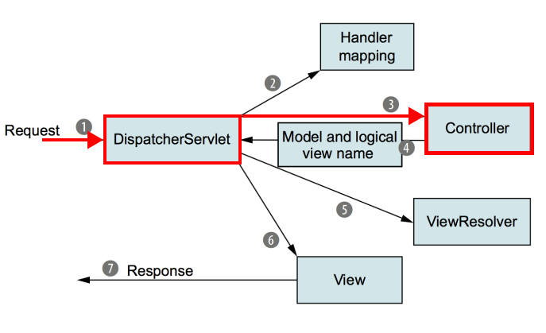
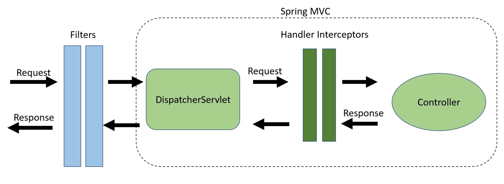

[[toc]]

## Spring Interceptor
Spring MVC는 `DispatcherServlet`이 모든 사용자의 요청을 받아 적절한 `Controller`에 위임한다. 



<b>`Interceptor`</b>를 사용하면 `DispatcherServlet`과 `Controller` 사이에서 요청이나 응답을 가로채 특정 작업을 수행할 수 있다. `Interceptor`는 보안, 인증, 에러 처리 등에 활용되며 특히 `Spring Security`에서 Servlet Filter와 함께 중요한 역할을 한다.


## Interceptor 정의하기
`Interceptor`는 두 가지 방법으로 정의할 수 있다.
- `org.springframework.web.servlet.HandlerInterceptor`인터페이스 구현
- `org.springframework.web.servlet.handler.HandlerInterceptorAdapter`추상클래스 상속

`HandlerInterceptor`를 사용하여 인터셉터를 정의해보자. 이 인터페이스의 선언은 다음과 같다.
``` java
public interface HandlerInterceptor {
	
	default boolean preHandle(HttpServletRequest request, HttpServletResponse response, Object handler) throws Exception {
		return true;
	}

	default void postHandle(HttpServletRequest request, HttpServletResponse response, Object handler, @Nullable ModelAndView modelAndView) throws Exception {
	}
	
	default void afterCompletion(HttpServletRequest request, HttpServletResponse response, Object handler, @Nullable Exception ex) throws Exception {
	}
}
```

`HandlerInterceptor`인터페이스를 구현할 때는 세 가지 메소드를 구현해야한다.
- `preHandle()`: 컨트롤러가 실행되기 전 호출된다. `true`를 반환하면 요청이 컨트롤러로 넘어간다. 반면  `false`를 반환하면 요청이 컨트롤러로 넘어가지 않고 인터셉터에서 블럭된다.
- `postHandle()`: 컨트롤러가 실행된 후 뷰를 렌더링하기 전 호출된다. `ModelAndView` 타입의 파라미터로 렌더링되는 데이터의 조작 등의 작업이 가능하다.
- `afterCompletion()`: 뷰가 렌더링된 후 호출된다.

이제 Interceptor를 구현해보자.
``` java
public class CustomInterceptor implements HandlerInterceptor {
 
    @Override
    public boolean preHandle(HttpServletRequest request, HttpServletResponse response, Object handler) throws Exception {        
        System.out.println("preHandle() called.");
        return true;
    }
 
    @Override
    public void postHandle(HttpServletRequest request, HttpServletResponse response, Object handler, ModelAndView modelAndView) throws Exception {
        System.out.println("postHandle() called.");
    }
 
    @Override
    public void afterCompletion(HttpServletRequest request, HttpServletResponse response, Object handler, Exception ex) throws Exception {
        System.out.println("afterCompletion() called.");        
    }       
}
```

## Interceptor 등록하기
스프링 컨텍스트를 정의하는 XML 파일에 다음과 같이 인터셉터를 등록할 수 있다. `<mvc:mapping>` 태그의  `path` 속성으로 인터셉트를 적용할 경로를 지정한다.
``` xml
<!-- applicationContext.xml -->
<mvc:interceptors>
    <mvc:interceptor>
        <mvc:mapping path="/**"/>
        <bean id="customInterceptor" class="com.yologger.CustomInterceptor"/>
    </mvc:interceptor>
</mvc:interceptors>
```
인터셉터는 어노테이션을 통해 등록할 수도 있다. `@Configuration`과 `@Bean`을 사용하면 된다.
``` java
@Configuration
public class MvcConfiguration implements WebMvcConfigurer {
	@Override
	public void addInterceptors(InterceptorRegistry registry) {
		registry
            .addInterceptor(new CustomInterceptor())
            .addPathPatterns("/*");
	}
}
```

## Servlet Filter vs. Spring Interceptor
`Servlet Filter`는 스프링 프레임워크 밖에서 실행되며, `ServletDispatcher` 이전에 호출된다. 반면 `Spring Interceptor`는 스프링 프레임워크 내부에서 실행되며, `ServletDispatcher`와 `Controller` 사이에서 동작한다.

