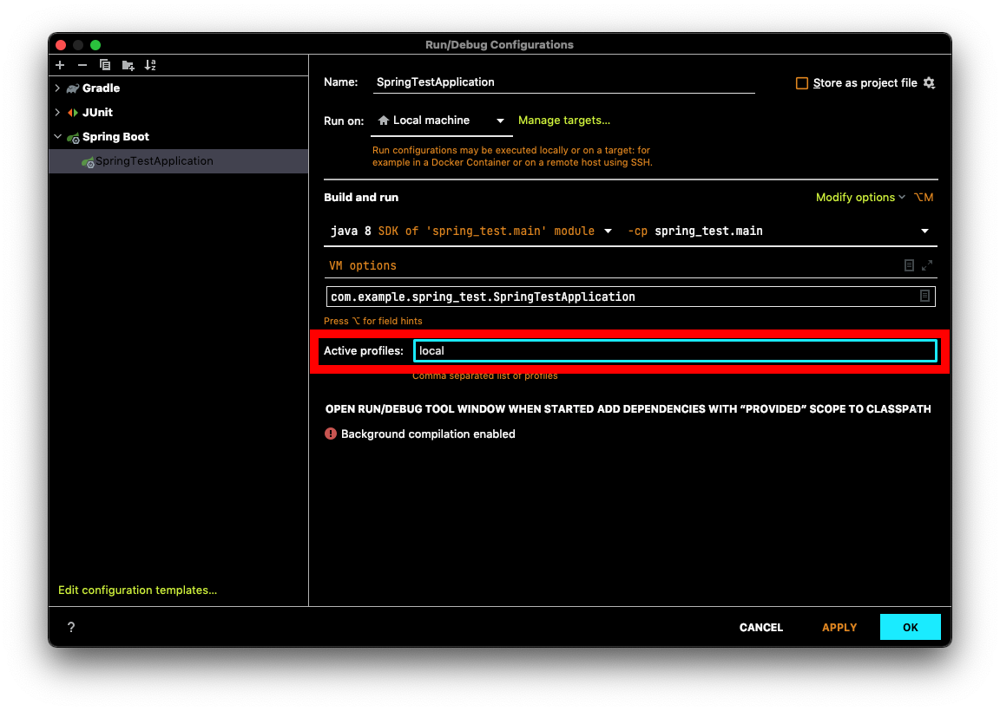

# Table of Contents
[[toc]]

# 스프링 외부 설정
스프링은 설정값을 소스코드에서 분리하여 외부에 위치시킬 수 있는 여러가지 방법을 제공한다. 이를 `외부 설정(Externalized Configuration)`이라고 한다.

스프링에서는 크게 세 가지의 외부 설정 방법을 제공한다.
- `@PropertySource`
- `application.properties` 또는 `application.yml` 파일
- `@Profile`


## @PropertySource
`@PropertySource`를 사용하여 외부 설정파일에 정의된 `Key-Value` 값을 설정값으로 읽어올 수 있다.

### 예제
`src/main/resources`에 `database.properties` 파일을 다음과 같이 정의하자.
``` properties
database.url=dbc:mysql://localhost:3306/test
database.username=root
database.password=1234
```

이 값은 컴포넌트에서 `@PropertySource`로 읽어올 수 있다. 어노테이션의 인자로 파일의 경로를 지정해야한다.
``` java
@Configuration
@PropertySource("classpath:database.properties")
public class DatabaseConfig {
    // ..
}
```
이 값들은 `ApplicationContext`의 `Environment`에 저장되며, 다음과 같이 사용할 수 있다.
``` java
@Configuration
@PropertySource("classpath:database.properties")
public class DatabaseConfig {

    @Autowired
    ApplicationContext applicationCtx;

    @Bean
    public DatabaseClient databaseClient() {
        Environment env = applicationCtx.getEnvironment();
        String databaseUrl = env.getProperty("database.url");
        String databaseUsername = env.getProperty("database.username");
        String databasePassword = env.getProperty("database.password");
        return new DatabaseClient(databaseUrl, databaseUsername, databasePassword);
    }
}
```

`PropertySourcesPlaceholderConfigurer`객체를 빈으로 등록하면 다음과 같이 `@Value` 어노테이션으로 속성값을 주입할 수 있다.
``` java{5,8,11,14-17}
@Configuration
@PropertySource("classpath:database.properties")
public class DatabaseConfig {

    @Value("${database.url}")
    private String url;

    @Value("${database.username}")
    private String username;

    @Value("${database.password}")
    private String password;

    @Bean
    public static PropertySourcesPlaceholderConfigurer propertySourcesPlaceholderConfigurer() {
        return new PropertySourcesPlaceholderConfigurer();
    }

    @Bean
    public DatabaseClient databaseClient() {
        return new DatabaseClient(url, username, password);
    }
}
```

### Profile과 함께 사용하기
활성화된 Profile에 따라 다른 설정파일을 로드할 수도 있다.
``` java
@Configuration
@PropertySource("classpath:database-${spring.profiles.active}.properties")
public class Config {
    // ...
}
```

### @TestPropertySource
테스트 환경에서는 `@TestPropertySource`을 사용하여 외부 설정파일을 읽어올 수 있다. `src/test/resources`에 `test.properties` 파일을 생성한다.
``` properties
test.test1=value1
test.test2=value2
```
이제 다음과 같이 사용할 수 있다.
``` java
@SpringBootTest
@TestPropertySource("classpath:test.properties")
class ApplicationTests {

    @Value("${test.test1}")
    String test1;

    @Value("${test.test2}")
    String test2;

    @Test
    public void test() {
        assertThat(test1).isEqualTo("value1");
        assertThat(test2).isEqualTo("value2");
    }
}
```

## application.properties 또는 application.yml 파일
스프링 부트는 어플리케이션을 구동할 때 `src/main/resources` 경로의 <b>`application.properties`</b> 또는 <b>`application.yml`</b>을 로딩한다. 이 파일에 `Key-Value` 형식으로 값을 정의하면 어플리케이션에서 참조하여 사용할 수 있다.  보통 어플리케이션의 다양한 설정값들을 이 파일에 정의한다.

### 예제
`src/main/resources`에 `application.properties` 생성한다.
``` properties
# application.properties
value.first=aaa
value.second=bbb
```

`.properties` 확장자 대신 `.yml` 확장자를 사용할 수도 있다. `application.yml` 파일은 다음과 같다.
``` yml
# application.yml
value:
  first: aaa
  second: bbb
```

이제 컴포넌트에서 다음과 같은 방식으로 값을 읽어올 수 있다.
``` java{6,7,9,10}
// TestController.java
@RestController
@RequestMapping("/test")
public class TestController {

    @Value("${value.first}")
    private String first;

    @Value("${value.second}")
    private String second;

    @GetMapping("/test")
    String main() {
        return first + " " + second;
    }
}
```


### application.properties 분리하기
보통 로컬, 개발, 운영 환경에 따라 다른 속성값을 사용한다. 이를 위해 별도의 `application.properties` 파일을 생성할 수 있다. 
- `application.properties`: 공통 속성값 정의
- `application-local.properties`: 로컬 환경에서 사용할 속성값 정의
- `application-dev.properties`: 개발 환경에서 사용할 속성값 정의
- `application-prod.properties`: 운영 환경에서 사용할 속성값 정의

``` properties
# application.properties
value.first=aaa
value.second=bbb
```

이때 `spring.config.activate.on-profile`에 어떤 파일을 사용할지 지정한다.

``` properties{2}
# application-local.properties
spring.config.activate.on-profile=local

value.second=local
value.thrid=local
```
``` properties{2}
# application-dev.properties
spring.config.activate.on-profile=dev

value.second=dev
value.thrid=dev
```
``` properties{2}
# application-prod.properties
spring.config.activate.on-profile=prod

value.second=third
value.thrid=third
```

이제 앱을 실행할 때 `-Dspring.profiles.active`로 활성화시킬 프로파일을 지정하면 된다.
``` shellsession
$ java -Dspring.profiles.active=dev -jar [app_name].jar
```
``` shellsession
$ java -Dspring.profiles.active=prod -jar [app_name].jar
```

IntelliJ에서는 어플리케이션의 `Edit Configurations`로 이동한 후 `spring.config.activate.on-profile`에다가 활성화시킬 프로파일을 지정하면 된다. 




보통 `application.properties`에는 공통 설정값을 작성한다. 그리고 `application-{profile}.properties`에는 환경에 따라 달라지는 설정값을 작성한다. 또한 `application.propeties`의 속성값을 `application-{profile}.properties`에도 정의하면 덮어쓰게 된다.

### 다른 application-{profile}.properties 포함하기
외부 설정파일은 다른 `application-{profile}.properties`를 포함할 수도 있다. `spring.profiles.include`를 사용하면 된다.

``` properties{2}
# application.properteis
spring.profiles.include=sub

origin.name1=originValue1
origin.name2=originValue2
```
``` properties
# application-sub.properties
origin.name2=subValue2
sub.name1=subValue1
```
``` java
@RestController
@RequestMapping("/test")
public class TestController {

    @Value("${origin.name1}")
    String originName1;     // originValue1

    @Value("${origin.name2}")
    String originName2;     // subValue2

    @Value("${sub.name1}")
    String subName1;        // subValue1

    // ...
}

```

### 단위 테스트
`test/java/resources`에 `application.properties`를 생성하면 `main/java/resources`의 `application.properties`를 덮어쓰게 된다. 테스트 환경에서 다른 설정값을 지정할 때 유용하게 사용할 수 있다.
``` properties
# main/java/resources/application.properties
value.first=aaa
```
``` properties
# test/java/resources/application.properties
value.first=bbb
```
``` java
@SpringBootTest
class Test {

    @Value("${value.first}")
    String first;    // bbb

    @Test
    void test() {
        assertThat(first).isEqualTo("bbb");     // Success
    }
}
```

테스트 환경에서도 `appication-xxx.properties`형태로 파일을 분리할 수 있으며, `@ActiveProfiles` 어노테이션으로 활성화시킬 프로파일을 지정할 수 있다.
``` properties
# src/main/resources/application.properties
value.first=aaa
value.second=aaa
```
``` properties
# src/test/resources/application.properties
value.first=testaaa
value.second=testaaa
```
``` properties
# src/test/resources/application-test.properties
spring.config.activate.on-profile=test

value.second=testbbb
value.third=testccc
```

``` java{2}
@SpringBootTest
@ActiveProfiles(profiles = {"test"})
class SpringTestApplicationTests {

    @Value("${value.first}")
    String first;

    @Value("${value.second}")
    String second;

    @Value("${value.third}")
    String third;

    @Test
    void test() {
        assertThat(first).isEqualTo("testaaa");
        assertThat(second).isEqualTo("testbbb");
        assertThat(third).isEqualTo("testccc");
    }
}
```

## @Profile
`@Profile`을 사용하면 프로파일에 따라 다른 설정 클래스를 사용할 수 있다.

### 예제
다음과 같은 클래스가 있다고 가정하자.
``` java
public class NetworkManager {

    private String endpoint;

    public NetworkManager(String endpoint) {
        this.endpoint = endpoint;
    }

    public String getEndpoint() {
        return endpoint;
    }

    public void setEndpoint(String endpoint) {
        this.endpoint = endpoint;
    }

    // ...
}
```
`NetworkManager`가 사용하는 `endpoint`를 개발환경과 운영환경에 따라 다르게 설정하고 싶다. 이를 위해 두 개의 설정클래스를 다음과 같이 정의할 수 있다.
``` java {2}
@Configuration
@Profile("dev")
public class DevConfig {

    @Bean
    public NetworkManager networkManager() {
        return new NetworkManager("dev.com");
    }
}
```
``` java {2}
@Configuration
@Profile("prod")
public class ProdConfig {

    @Bean
    public NetworkManager networkManager() {
        return new NetworkManager("prod.com");
    }
}
```
이제 프로파일을 `dev`로 설정하면 `endpoint`가 `dev.com`인 `NetworkManager`가 빈으로 등록된다.
``` shellsession
$ java -Dspring.profiles.active=dev -jar [app_name].jar
```
프로파일을 `prod`로 설정하면 `endpoint`가 `prod.com`인 `NetworkManager`가 빈으로 등록된다.
``` shellsession
$ java -Dspring.profiles.active=prod -jar [app_name].jar
```

다음과 같이 클래스 레벨이 아니라 메소드 레벨로도 설정할 수 있다.
``` java {2}
@Configuration
public class CommonConfig {

    @Bean(name = "networkManager")
    @Profile("local")
    public NetworkManager networkManagerLocal() {
        return new NetworkManager("local.com");
    }

    @Bean(name = "networkManager")
    @Profile("prod")
    public NetworkManager NetworkManagerProd() {
        return new NetworkManager("prod.com");
    }
}
```

### @ActiveProfies
테스트 환경에서는 `@ActiveProfies`어노테이션으로 활성화시킬 프로파일을 지정할 수 있다.
``` java {2}
@SpringBootTest
@ActiveProfiles(profiles = {"local"})
class Test {

    @Autowired
    NetworkManager networkManager;

    @Test
    public void test() {
        assertThat(networkManager.getEndpoint()).isEqualTo("local.com");
    }
}
```