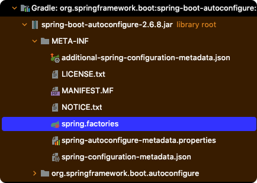
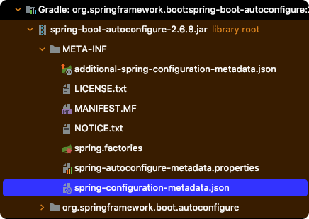

# Table of Contents
[[toc]]

## Auto Configuration
Spring Boot의 `Auto Configuration`은 프로젝트에 추가한 의존성을 바탕으로 필요한 설정들을 자동으로 구성해준다. 이 덕분에 Spring Boot는 Spring Legacy에 비해 설정이 매우 쉽다.

`Auto Configuration`은 `org.springframework.boot:spring-boot-autoconfiguration` 라이브러리에 포함되어있다.


## @EnableAutoConfiguration
`Auto Configuration` 기능은 `@EnableAutoConfiguration` 어노테이션을 추가하면 활성화된다.

``` java{1}
@EnableAutoConfiguration
@Configuration
public class SpringBootConfig {
    // ...
}
```
스프링부트 프로젝트는 기본적으로 `@SpringBootApplication` 어노테이션이 붙어있다. 
``` java {1}
@SpringBootApplication
public class Application {
    public static void main(String[] args) {
        SpringApplication.run(Application.class, args);
    }
}
```
이 어노테이션은 내부적으로 `@EnableAutoConfiguration`을 사용한다. 따라서 별도의 설정이 없다면 `Auto Configuration` 기능이 자동으로 활성화된다.
``` java {2}
@SpringBootConfiguration
@EnableAutoConfiguration
@ComponentScan(excludeFilters = { 
    @Filter(type = FilterType.CUSTOM, classes = TypeExcludeFilter.class),
    @Filter(type = FilterType.CUSTOM, classes = AutoConfigurationExcludeFilter.class) }
)
public @interface SpringBootApplication {
    // ...
}
```

## spring.factories
`org.springframework.boot:spring-boot-autoconfiguration.jar`의 `spring.factories`에는 `Auto Configuration` 기능이 활성화될 때 적용할 `Auto Configuration` 파일이 `XXXAutoConfiguration` 형태로 정의되어있다.



``` properties
## spring.factories

# 중략...

# Auto Configure
org.springframework.boot.autoconfigure.EnableAutoConfiguration=\
org.springframework.boot.autoconfigure.admin.SpringApplicationAdminJmxAutoConfiguration,\
org.springframework.boot.autoconfigure.aop.AopAutoConfiguration,\
org.springframework.boot.autoconfigure.amqp.RabbitAutoConfiguration,\
org.springframework.boot.autoconfigure.batch.BatchAutoConfiguration,\
org.springframework.boot.autoconfigure.cache.CacheAutoConfiguration,\
org.springframework.boot.autoconfigure.cassandra.CassandraAutoConfiguration,\
org.springframework.boot.autoconfigure.context.ConfigurationPropertiesAutoConfiguration,\
org.springframework.boot.autoconfigure.context.LifecycleAutoConfiguration,\
org.springframework.boot.autoconfigure.context.MessageSourceAutoConfiguration,\
org.springframework.boot.autoconfigure.context.PropertyPlaceholderAutoConfiguration,\
org.springframework.boot.autoconfigure.couchbase.CouchbaseAutoConfiguration,\
org.springframework.boot.autoconfigure.dao.PersistenceExceptionTranslationAutoConfiguration,\
org.springframework.boot.autoconfigure.data.cassandra.CassandraDataAutoConfiguration,\
org.springframework.boot.autoconfigure.data.cassandra.CassandraReactiveDataAutoConfiguration,\
org.springframework.boot.autoconfigure.data.cassandra.CassandraReactiveRepositoriesAutoConfiguration,\
org.springframework.boot.autoconfigure.data.cassandra.CassandraRepositoriesAutoConfiguration,\
org.springframework.boot.autoconfigure.data.couchbase.CouchbaseDataAutoConfiguration,\
org.springframework.boot.autoconfigure.data.couchbase.CouchbaseReactiveDataAutoConfiguration,\
org.springframework.boot.autoconfigure.data.couchbase.CouchbaseReactiveRepositoriesAutoConfiguration,\
org.springframework.boot.autoconfigure.data.couchbase.CouchbaseRepositoriesAutoConfiguration,\
org.springframework.boot.autoconfigure.data.elasticsearch.ElasticsearchDataAutoConfiguration
# 중략...
```
스프링부트는 `Auto Configuration`이 활성화되어있다면 이 파일에 정의된 구성 클래스를 활성화하여 필요한 빈들을 자동으로 등록한다.

예를 들어 스프링 시큐리티와 관련된 `Auto Configuration` 파일은 다음과 같다.
``` properties {3}
## spring.factories
org.springframework.boot.autoconfigure.EnableAutoConfiguration=\
org.springframework.boot.autoconfigure.security.servlet.SecurityAutoConfiguration=,\
## 중략 .. 
```
``` java {5}
@Configuration(proxyBeanMethods = false)
@ConditionalOnClass(DefaultAuthenticationEventPublisher.class)
@EnableConfigurationProperties(SecurityProperties.class)
@Import({ 
    SpringBootWebSecurityConfiguration.class,
    WebSecurityEnablerConfiguration.class,
    SecurityDataConfiguration.class,
    ErrorPageSecurityFilterConfiguration.class
})
public class SecurityAutoConfiguration {

	@Bean
	@ConditionalOnMissingBean(AuthenticationEventPublisher.class)
	public DefaultAuthenticationEventPublisher authenticationEventPublisher(ApplicationEventPublisher publisher) {
		return new DefaultAuthenticationEventPublisher(publisher);
	}

}
```
이 구성클래스는 내부적으로 `SpringBootWebSecurityConfiguration` 구성 클래스를 임포트한다.
``` java{8-11}
@Configuration(proxyBeanMethods = false)
@ConditionalOnDefaultWebSecurity
@ConditionalOnWebApplication(type = Type.SERVLET)
class SpringBootWebSecurityConfiguration {

	@Bean
	@Order(SecurityProperties.BASIC_AUTH_ORDER)
	SecurityFilterChain defaultSecurityFilterChain(HttpSecurity http) throws Exception {
		http.authorizeRequests().anyRequest().authenticated().and().formLogin().and().httpBasic();
		return http.build();
	}
}
```
이 덕분에 스프링 시큐리티 모듈을 추가하기만 하면 별도의 설정을 하지 않아도 모든 요청에 대해 인증을 요구하는 것이다.

## spring-configuration-metadata.json
`spring-configuration-metadata.json`에는 자동 구성 클래스들이 사용하는 속성 기본 값들이 정의되어있다. 



예를 들어 애플리케이션 서버의 포트로 사용할 속성값은 다음과 같이 정의되어있다.
``` json
{
    {
      "name": "server.port",
      "type": "java.lang.Integer",
      "description": "Server HTTP port.",
      "sourceType": "org.springframework.boot.autoconfigure.web.ServerProperties",
      "defaultValue": 8080
    }    
}
```
이 때문에 별도의 포트 설정을 하지 않아도 어플리케이션이 `8080`포트에서 실행된다. 물론 `application.properties` 또는 `application.yml` 파일에서 이를 오버라이딩할 수 있다.
``` properties
## application.properties
server.port=20000
```