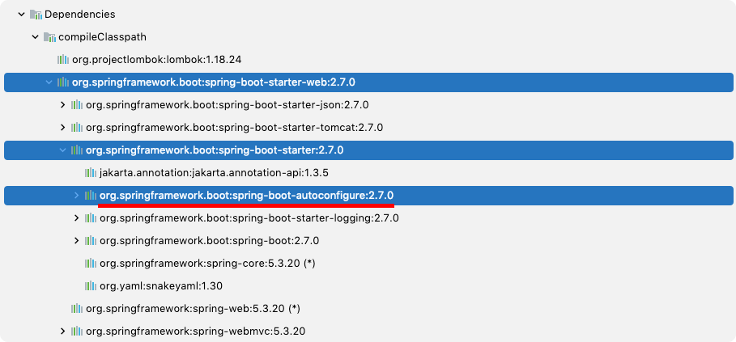

# Table of Contents
[[toc]]

# Auto Configuration
Spring Boot의 `Auto Configuration`은 프로젝트에 추가한 의존성을 바탕으로 필요한 설정들을 자동으로 구성해준다. Spring Boot는 이 덕분에 Spring Legacy에 비해 설정이 매우 쉬워졌다.

`Auto Configuration`은 `org.springframework.boot:spring-boot-autoconfiguration` 라이브러리에 포함되어있다.



`META-INF/spring.factories`
`META-INF/spring-configuration-matadata.json`
`org/springframework/boot/autoconfigure`


## @EnableAutoConfiguration


## @SpringBootConfiguration
``` java
@SpringBootApplication
public class Application {
    public static void main(String[] args) {
        SpringApplication.run(Application.class, args);
    }
}
```
``` java
@SpringBootConfiguration
@EnableAutoConfiguration
@ComponentScan(excludeFilters = { 
    @Filter(type = FilterType.CUSTOM, classes = TypeExcludeFilter.class),
    @Filter(type = FilterType.CUSTOM, classes = AutoConfigurationExcludeFilter.class) }
)
public @interface SpringBootApplication {
    // ...
}
```


