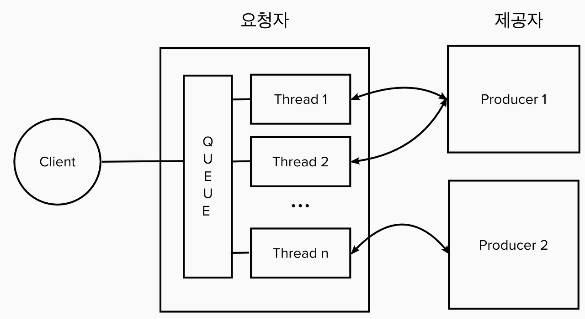

# Table of Contents
[[toc]]

# 스프링 프레임워크의 HTTP 통신
스프링 프레임워크는 HTTP 통신을 위해 다양한 기능을 제공한다.

## RestTemplate
`RestTempate`은 Spring 3부터 지원하며 멀티 스레드, 동기/블로킹 방식으로 HTTP 요청을 보내는 HTTP Client다. 



`RestTempate`은 HTTP 통신을 위한 다양한 메소드를 제공한다.

### getForObject()
서버는 다음과 같은 형태의 JSON 데이터를 반환한다고 가정하자.
``` json
{
    "email": "paul@gmail.com",
    "name": "paul",
    "age": "3"
}
```
`getForObject()`는 HTTP GET 요청에 사용된다.
``` java {3}
RestTemplate restTemplate = new RestTemplate();
String url = "https://server_url/path";
String response = restTemplate.getForObject(url, String.class); // {"email": "paul@gmail.com", "name": "paul", "age": "3"}
```
JSON 응답을 POJO로 매핑할 수도 있다. 이 때 POJO 클래스는 기본 생성자와 Setter를 반드시 포함해야한다.
``` java
public class User implements Serializable {
    private String email;
    private String name;
    private int age;

    public User() {
    }

    public void setEmail(String email) {
        this.email = email;
    }

    public void setName(String name) {
        this.name = name;
    }

    public void setAge(int age) {
        this.age = age;
    }
}
```
``` java{3}
RestTemplate restTemplate = new RestTemplate();
String url = "https://server_url/path";
User response = restTemplate.getForObject(url, User.class);
```

### getForEntity()
`getForEntity()`도 HTTP GET 요청에 사용된다. 다만 응답을 `ResponseEntity`로 래핑하여 반환한다.
``` java{3}
RestTemplate restTemplate = new RestTemplate();
String url = "https://server_url/path";
ResponseEntity<User> response = restTemplate.getForEntity(url, User.class)

HttpStatus httpStatus = response.getStatusCode();
User user = response.getBody();
HttpHeaders headers = response.getHeaders();
headers.getContentType();
```

### postForObject()
`postForObject()`는 HTTP POST 요청에 사용된다.
``` java
User user = new User("ronaldo@gmail.com", "ronaldo", 35);
HttpRequest<User> request = new HttpEntity<>(user);
User user = restTemplate.postForObject(url, request, User.class);
```

### postForEntity()
`postForEntity()`도 HTTP POST 요청에 사용된다. 다만 응답을 `ResponseEntity`로 래핑하여 반환한다.
``` java
User user = new User("ronaldo@gmail.com", "ronaldo", 35);
HttpRequest<User> request = new HttpEntity<>(user);
ResponseEntity<User> response = restTemplate.postForEntity(url, request, User.class);
```

`postForEntity()`는 Form data를 Submit 하는데 사용할 수도 있다.
``` java
HttpHeaders headers = new HttpHeaders();
headers.setContentType(MediaType.APPLICATION_FORM_URLENCODED);

MultiValueMap<String, String> map= new LinkedMultiValueMap<>();
map.add("email", "ronaldo@gmail.com");
map.add("name", "ronaldo");
map.add("age", "35");

HttpEntity<MultiValueMap<String, String>> request = new HttpEntity<>(map, headers);

ResponseEntity<User> response = restTemplate.postForEntity(url, request, User.class);
```

### postForLocation()
`postForLocation()`도 HTTP POST 요청에 사용된다. 다만 자원이 생성된 위치를 반환한다.
``` java
User user = new User("ronaldo@gmail.com", "ronaldo", 35);
HttpRequest<User> request = new HttpEntity<>(user);
URI location = restTemplate.postForLocation(url, request);
```

### delete()
`delete()`는 HTTP DELETE 요청에 사용된다.
``` java
String url = "http://server/user/1"
restTemplate.delete(url);
```

### RestTemplateBuilder
`RestTemplateBuilder`을 사용하면 빌더 패턴으로 RestTemplate을 생성할 수 있다. 보통 설정도 함께 적용하여 컨테이너에 빈으로 등록하여 사용한다.
``` java
@Configuration 
public class RestTemplateConfig { 
    @Bean 
    public RestTemplate restTemplate() { 
        return new RestTemplateBuilder() 
            .messageConverters(getHttpMessageConverters()) 
            .setConnectTimeout(Duration.ofSeconds(10)) 
            .setReadTimeout(Duration.ofSeconds(10)) 
            .errorHandler(new HttpResponseErrorHandler()) 
            .requestFactory(() -> getClientHttpRequestFactory()) 
            .additionalInterceptors(bearerAuthInterceptor()) 
            .build(); 
    }
}
```

## TestRestTemplate
테스트 시 `RestTemplate` 대신 `TestRestTemplate`을 사용할 수 있다.
``` java
@RestController
@RequestMapping("/person")
public class PersonController {

    @GetMapping("/get")
    public ResponseEntity<Person> get(HttpServletRequest request, HttpServletResponse response) {
        Person p = new Person("Paul", 35);
        return ResponseEntity.ok().body(p);
    }

}
```
``` java
@SpringBootTest(webEnvironment = SpringBootTest.WebEnvironment.RANDOM_PORT)
public class Test {

    @Autowired
    TestRestTemplate restTemplate;

    @Test
    void test() {
        ResponseEntity<Person> response = template.getForEntity("/person/get", Person.class);
        assertThat(response.getStatusCodeValue()).isEqualTo(200);
    }
}
```