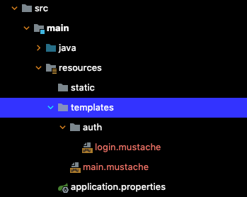

[[toc]]

# Spring WebMVC
`Spring WebMVC`는 클라이언트의 요청을 받아 적절하게 처리한 후 응답하기 위한 스프링 프레임워크의 핵심 모듈이다. 

## DispatcherSevlet
`DispatcherSevlet`은 Spring WebMVC의 핵심 컴포넌트로 사용자의 요청을 받은 후 이를 처리할 수 있는 컨트롤러를 찾아 요청을 위임한다. 이렇게 전면에 사용자 요청 수신을 전담하는 컴포넌트를 배치하는 패턴을 `Front Controller` 패턴이라고 한다. 

Spring WebMVC의 동작 원리를 그림으로 표현하면 다음과 같다.


1. `DispatcherSevlet`이 전면에 위치하여 모든 사용자의 요청을 수신한다.
1. 등록된 URL 매핑을 확인하여 적절한 컨트롤러를 찾는다.
1. 컨트롤러에 사용자 요청 처리를 위임한다.
1. 컨트롤러는 사용자 요청 처리를 위해 적절한 비즈니스 로직을 수행한 후, 보여줄 뷰의 이름이나 데이터를 반환한다.
1. `DispatcherServlet`은 `ViewResolver`를 통해 클라이언트에게 보여줄 뷰를 찾아 반환한다. `ViewResolver`는 뷰 이름을 바탕으로 클라이언트에게 보여줄 뷰를 찾아내는 역할을 한다.

Spring Legacy 프로젝트에서는 JSP를 사용하기 위해 XML 파일에 다음과 같이 `ViewResolver`를 등록할 수 있다.
``` xml {5-9}
<!-- servlet-context.xml -->
<?xml version="1.0" encoding="UTF-8"?>
<beans:beans xmlns="http://www.springframework.org/schema/mvc" ... >

    <beans:bean class="org.springframework.web.servlet.view.InternalResourceViewResolver">
        <!-- ViewResolver - 아래 경로에서 적당한 view(jsp파일)을 찾아준다. -->
        <beans:property name="prefix" value="/WEB-INF/views/" />
        <beans:property name="suffix" value=".jsp" />
    </beans:bean>

</beans:beans>
```

Spring Boot에서 뷰 템플릿으로 mustache을 사용하는 경우 다음 의존성만 추가하면 자동으로 `ViewResolver`가 설정된다.
``` groovy
// build.gradle
dependencies {
    implementation 'org.springframework.boot:spring-boot-starter-mustache'
}
```

참고로 Spring MVC는 Tomcat 같은 `Servlet Container` 위에서 동작하며 DipatcherServlet, ViewResolver, Controller 같은 스프링 MVC의 핵심 컴포넌트 또한 `Servlet`으로 동작한다.

## ViewResolver
`ViewResolver`는 컨트롤러에서 반환하는 뷰 이름을 바탕으로 실제 뷰를 탐색한다. `ViewResolver`는 스프링 컨텍스트 XML 파일에 다음과 같이 등록할 수 있다.
``` xml {11-14}
<!-- application-context.xml -->
<?xml version="1.0" encoding="UTF-8"?>
<beans xmlns="http://www.springframework.org/schema/beans"
	xmlns:context="http://www.springframework.org/schema/context" xmlns:p="http://www.springframework.org/schema/p"
	xmlns:xsi="http://www.w3.org/2001/XMLSchema-instance"
	xsi:schemaLocation="http://www.springframework.org/schema/beans
       	http://www.springframework.org/schema/beans/spring-beans-3.0.xsd
        http://www.springframework.org/schema/context
       	http://www.springframework.org/schema/context/spring-context-3.0.xsd">

	<bean id="viewResolver" class="org.springframework.web.servlet.view.InternalResourceViewResolver">
		<property name="prefix" value="/WEB-INF/view/" />
		<property name="suffix" value=".jsp" />
	</bean>

</beans>
```

Spring 3.0 부터는 이 `ViewResolver`가 자동으로 등록되기 때문에 별도의 설정이 필요없다면 따로 선언할 필요가 없다.

## @Controller
`@Controller`는 사용자의 요청을 받고 뷰를 보여주는 스프링 컴포넌트다. 뷰를 보여주기 위해서는 템플릿 엔진 또는 뷰 리솔버를 설정해야한다.



``` java
import org.springframework.stereotype.Controller;

@Controller
public class MainController {

    @RequestMapping("/")
    public String showLogin() {
        return "main";      // main.mustache
    }
}
```

``` java
import org.springframework.stereotype.Controller;

@Controller
@RequestMapping("/auth")
public class AuthController {

    @RequestMapping("/login")
    public String showLogin() {
        return "auth/login";    // auth/login.mustache
    }
}
```

### Model
`Model`을 사용하여 뷰에 데이터를 전달할 수도 있다.
``` java
import org.springframework.stereotype.Controller;

@Controller
@RequestMapping("/test")
public class TestController {

    @RequestMapping("/test")
    public String test(Model model) {
        model.addAttribute("name", "Paul");
        model.addAttribute("age", 35);
        return "test";      // test.mustache
    }
}
```

뷰에서는 다음과 같이 받을 수 있다.
``` html
<html>
    <head>
    </head>
    <body>
        {{name}}
        {{age}}
    </body>
</html>
```

### ModelAndView
`ModelAndView`를 사용하여 뷰에 데이터를 전달할 수도 있다.
``` java
@Controller
@RequestMapping("/test")
public class TestController {

    @GetMapping("/test")
    public ModelAndView test() {
        ModelAndView modelAndView = new ModelAndView();
        modelAndView.setViewName("main");
        modelAndView.addObject("name", "John");
        modelAndView.addObject("age", 35);
        return modelAndView;
    }
}
```

### @ResponseBody
`@Controller`는 반환되는 경로의 뷰를 보여준다.
``` java
import org.springframework.stereotype.Controller;

@Controller
@RequestMapping("/test")
public class TestController {

    @RequestMapping("/test")
    public String test() {
        return "test";      // test.mustache 뷰를 보여준다.
    }
}
```

`@ResponseBody`를 사용하면 뷰 대신 데이터를 반환한다.
``` java
import org.springframework.stereotype.Controller;

@Controller
@RequestMapping("/test")
public class TestController {

    @RequestMapping("/test")
    @ResponseBody
    public String test() {
        return "test";      // test라는 문자열을 반환된다.
    }
}
```

객체의 경우 JSON 형태로 변환되어 반환된다.
``` java
import org.springframework.stereotype.Controller;

@Controller
@RequestMapping("/test")
public class TestController {

    @RequestMapping("/test")
    @ResponseBody
    public DataDTO test() {
        DataDTO data = new DataDTO();
        return data;      // DataDTO가 JSON으로 변환되어 반환된다.
    }
}
```

## @RestController
`@RestController`는 REST API 엔드포인트 컨트롤러를 만들기 위한 어노테이션으로 `@Controller`와 `@ResponseBody` 합친 것과 동일하다. 아래 두 코드는 동일하다.

``` java{1,6}
@Controller
@RequestMapping("/test")
public class TestController {

    @RequestMapping("/test")
    @ResponseBody
    public DataDTO test() {
        DataDTO data = new DataDTO();
        return data;
    }
}
```


``` java{1}
@RestController
@RequestMapping("/test")
public class TestController {

    @RequestMapping("/test")
    // @ResponseBody
    public DataDTO test() {
        DataDTO data = new DataDTO();
        return data;
    }
}
```

## @RequestMapping
`@RequestMapping`는 엔드 포인트 경로를 지정하는데 사용한다. `method` 속성을 정의하지 않으면 모든 HTTP 요청을 수신할 수 있다.
``` java
@RestController
public class Controller {

    @RequestMapping(value = "/test")
    public String test() {
        return "test";
    }
}
```
``` shellsession
$ curl -X GET -G `http://localhost:8080/test`
test
```
``` shellsession
$ curl -X POST -G `http://localhost:8080/test`
test
```
`method` 속성으로 특정 HTTP 메소드만 수신하도록 제한할 수 있다.
``` java
@RestController
public class Controller {

    @RequestMapping(value = "/get", method = RequestMethod.GET)
    public String get() {
        return "get";
    }
}
```
``` shellsession
$ curl -X GET -G `http://localhost:8080/test`
test
```
``` shellsession {2}
$ curl -X POST -G `http://localhost:8080/test`
{"timestamp":"2022-05-09T13:40:02.292+00:00","status":405,"error":"Method Not Allowed","path":"/test"}
```


다음과 같이 여러 엔드 포인트 경로를 등록할 수 있다.
``` java
import org.springframework.stereotype.Controller;

@Controller
public class AuthController {
    // ...
    @RequestMapping(value = {"member/remove", "member/delete"}), method = RequestMethod.DELETE)
    public String delete() {

    }
}
```

### consumes
`@RequestMapping`의 `consumes` 속성을 사용하면 클라이언트로 부터 수신하려는 데이터 포맷을 제한할 수 있다.
``` java {4}
@RequestMapping(
    value = "/test", 
    method = RequestMethod.POST, 
    consumes = MediaType.APPLICATION_JSON_VALUE
)
public String test() {
    return "test";
}
```
이 경우 클라이언트가 요청을 보낼 때 `Content-Type` 헤더를 설정해야한다.
``` shellsession
$ curl -X POST -G 'http://localhost:8080/test' \
-H 'Content-Type: application/json'

test
```
이를 설정하지 않으면 `Unsupported Media Type` 에러가 발생한다.
``` shellsession
$ curl -X POST -G 'http://localhost:8080/test'

{"timestamp":"2022-05-09T13:51:31.221+00:00","status":415,"error":"Unsupported Media Type","path":"/test"}
```
``` shellsession
$ curl -X POST -G 'http://localhost:8080/test' \
-H 'Content-Type: text/plain'

{"timestamp":"2022-05-09T13:51:14.675+00:00","status":415,"error":"Unsupported Media Type","path":"/test"}    
```
배열 형태로 여러 타입을 받을 수도 있다.
``` java {4}
@RequestMapping(
    value = "/test", 
    method = RequestMethod.POST, 
    consumes = {MediaType.APPLICATION_JSON_VALUE, MediaType.TEXT_PLAIN_VALUE}
)
public String test() {
    return "test";
}
```

### produces
`@RequestMapping`의 `produces` 속성을 사용하면 서버가 응답하는 데이터의 타입을 지정할 수 있다.
``` java {4}
@RequestMapping(
    value = "/test", 
    method = RequestMethod.POST, 
    produces = MediaType.APPLICATION_JSON_VALUE
)
public String test() {
    return "test";
}
```
위와 같이 지정한 경우 서버는 응답 헤더의 `Content-type`을 다음과 같이 설정한다.
``` java {2}
HTTP/1.1 200 
Content-Type: application/json
Content-Length: 4
Date: Mon, 09 May 2022 14:27:37 GMT
```

클라이언트는 `Accept` 헤더를 설정해야한다.
``` shellsession{2,8,12}
$ curl -X POST -G 'http://localhost:8080/test' -v \
-H 'Accept: application/json'
*   Trying 127.0.0.1:8080...
* Connected to localhost (127.0.0.1) port 8080 (#0)
> POST /test HTTP/1.1
> Host: localhost:8080
> User-Agent: curl/7.79.1
> Accept: application/json
...
```

### headers
사용자가 요청을 보낼 때 특정 헤더를 반드시 포함하도록 강제할 수 있다.
``` java{4}
@RequestMapping(
    value = "/test", 
    method = RequestMethod.POST, 
    headers = {HttpHeaders.FROM}
)
public String test() {
    return "test";
}
```
``` shellsession {2}
$ curl -X POST -G 'http://localhost:8080/test' \
-H 'From: yologger'

test
```


## @GetMapping
`RequestMapping(method = RequestMethod.GET)`은 다음과 같이 단축할 수 있다.
``` java
@GetMapping(value = "/")
public String get() {
    // ...
}
```
### @RequestParam
`Query Parameter`는 다음과 같이 바인딩할 수 있다.
``` java
@GetMapping(value = "/")
public String getInfo(
    @RequestParam(value="name") String name, 
    @RequestParam(value="age") int age
) {
    // ...
}
```
### @PathVariable
`Path Varible`은 다음과 같이 바인딩할 수 있다.
``` java
@GetMapping(value = "/post/{page}")
public ResponseEntity<List<Post>> getPost(@PathVariable("page") int page) {
    // ...
}
```

### @ModelAttribute
쿼리 파라미터를 자바 객체로 매핑할 수도 있다. `@ModelAttribute`를 사용하는 데이터 클래스는 모든 멤버변수를 포함하는 생성자를 정의해야한다.
``` java {5-8}
public class ModelAttributeDTO {
    private String name;
    private String age;

    public ModelAttributeDTO(String name, String age) {
        this.name = name;
        this.age = age;
    }

    public String getName() {
        return name;
    }

    public String getAge() {
        return age;
    }
}
```
``` java
@Controller
@RequestMapping("/test")
public class TestController {

    @GetMapping("/test")
    public String test(@ModelAttribute ModelAttributeDTO modelAttribute, Model model) {
        model.addAttribute("name", modelAttribute.getName());
        model.addAttribute("age", modelAttribute.getAge());
        return "main";
    }
}
```

### @RequestHeader
`@RequestHeader`로 헤더를 바인딩할 수 있다.
``` java
@GetMapping
@RequestMapping("/test")
public String test(
    @RequestHeader(HttpHeaders.AUTHORIZATION) String authorization,
) {
    // ...
}
```

## @PostMapping
`RequestMapping(method = RequestMethod.POST)`은 다음과 같이 단축할 수 있다. 
``` java
@PostMapping("/member/join")
public String join() {
    // ...
}
```

### @RequestBody
`@RequestBody`어노테이션으로 HTTP POST 요청의 JSON 바디를 객체에 매핑할 수 있다.
``` java
@PostMapping(value = "/member/join")
public ResponseEntity<JoinResponse> join(@RequestBody JoinRequest request) {
    // ..
}
```
`@RequestBody`을 사용하는 데이터 클래스는 JSON 값을 역직렬화한 후 리플렉션을 통해 멤버변수 값을 설정한다. 따라서 기본 생성자가 반드시 정의되어야한다.
``` java {5-7}
public class JoinRequest {
    @JsonProperty("email") private String email;
    @JsonProperty("password") private String password; 

    public JoinRequest() {

    }

    // ...
}
```

### @RequestPart
`@RequestPart`를 사용하면 `multipart/form-data` 타입의 요청을 바인딩할 수 있다.
``` java
@RequestMapping("/post")
@RequiredArgsConstructor
public class PostController {

    @PostMapping("/write")
    public ResponseEntity<WritePostResponseDTO> write(
            @RequestPart(value = "files", required = false) MultipartFile[] files,
            @RequestParam(value = "writer_id", required = true) Long writerId,
            @RequestParam(value = "title", required = true) String title,
            @RequestParam(value = "content", required = true) String content
    ) {
        // ...
    }

}
```

## Spring WebMVC 구성 클래스
`Spring WebMVC` 구성 클래스는 `WebMvcConfigurer`인터페이스를 구현하여 정의한다. 다만 Spring Legacy와 Spring Boot의 설정이 조금 다르다.

우선 Spring Legacy 프로젝트에서는 다음과 같이 구성 클래스를 정의할 수 있다. 이 때는 `@EnableWebMvc`가 제공하는 `WebMvcConfigurationSupport` 클래스를 사용하여 Spring WebMVC와 관련된 컴포넌트를 초기화한다.
``` java {1}
@EnableWebMvc
@Configuration
public class WebMvcConfig implements WebMvcConfigurer {
	// 생략 ...
}
```
반면 Spring Boot 프로젝트에서는 보통 다음과 같이 구성 클래스를 정의한다. 이 때는 스프링 부트 `Auto Configuration`이 제공하는 `WebMvcAutoConfiguration` 클래스를 사용하여 Spring WebMVC와 관련된 컴포넌트를 초기화한다.
``` java {1}
// @EnableWebMvc
@Configuration
public class WebMvcConfig implements WebMvcConfigurer {
	// 생략 ...
}
```

`WebMvcConfigurer`인터페이스에서 제공하는 메소드는 다음과 같다. 이 메소드를 구현하여 `Spring WebMVC` 설정을 커스터마이징할 수 있다.

