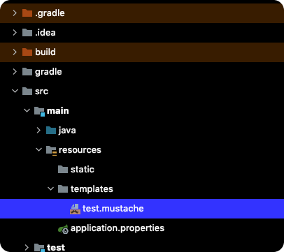
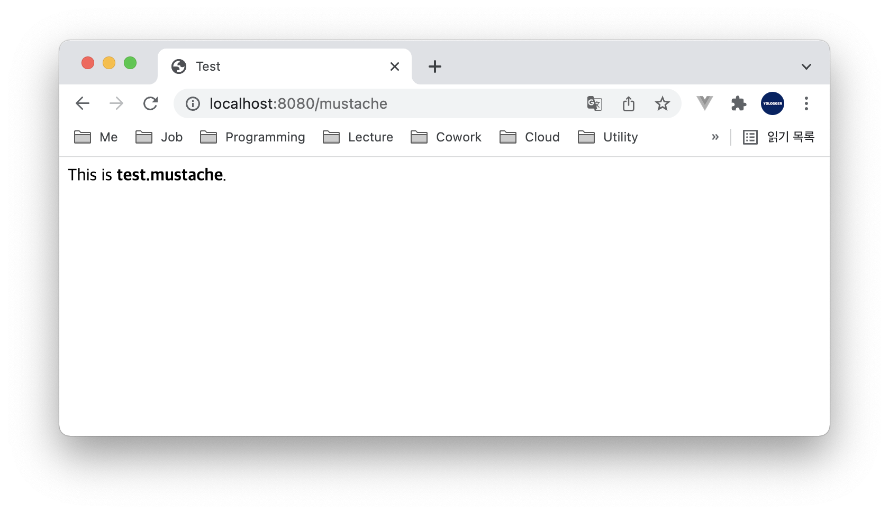

# 머스터치(Mustache)
`머스터치(Mustache)`를 스프링 부트에서 공식 지원하는 템플릿 엔진이다. 

## 의존성 추가
`머스터치(Mustache)`를 사용하기 위해 의존성을 추가해야한다.
``` groovy
dependencies {
    implementation 'org.springframework.boot:spring-boot-starter-mustache'
}
```
이 의존성을 추가하면 머스터치를 위한 `ViewResolver`가 자동으로 활성화된다.

## 사용 방법
`*.mustache`파일을 `src/main/resources/templates`에 생성한다.



`test.mustache`는 다음과 같다.

``` html
<!DOCTYPE HTML>
<html>
<head>
    <title>Test</title>
    <meta http-equiv="Content-Type" content="text/html; charset=UTF-8" />
</head>
<body>
This is <b>test.mustache</b>.
</body>
</html>
```

그리고 컨트롤러에서 `.mustache`확장자를 제외한 파일명을 반환한다.
``` java{6}
@Controller
public class MustacheController {

    @GetMapping("/mustache")
    public String mustache() {
        return "test";
    };
}
```

이제 다음과 같이 접근할 수 있다.

