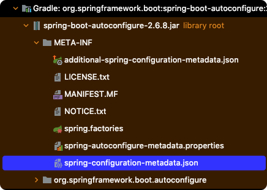

# Table of Contents
[[toc]]

## @EnableXXX 어노테이션
Spring Legacy는 프로젝트를 구성할 때 관련된 빈을 일일이 설정해야한다. 이러한 번거로움을 해소하기 위해 스프링은 사전에 합리적으로 정의된 설정을 자동으로 적용하는 기능을 제공하기 시작했는데 그것이 바로 `@Enable`로 시작하는 어노테이션이다.
- `@EnableWebMvc`
- `@EnableJpaRepositories`
- `@EnableTransactionManagement`
- `@EnableJpaAuditing`
- `@EnableWebSecurity`
- `@EnableAsync`
- `@EnableWebSocket`
- `@EnableCaching`
- `@EnableScheduling`

`@EnableXXX` 어노테이션을 `@Configuration`이 붙은 구성 클래스에 붙이면 사전에 합리적으로 정의된 설정에 따라 필요한 빈들이 자동으로 등록된다. `@EnableWebMvc`의 경우 `WebMvcConfigurationSupport`클래스를 사용하여 필요한 빈들을 자동으로 등록한다.
``` java
@Configuration
@EnableWebMvc
public class WebMvcConfig {
    // ...
}
```

물론 `@EnableXXX` 어노테이션을 통한 설정을 커스터마이징할 수도 있다. 이 때는 `XXXConfigurer`로 끝나는 인터페이스를 구현하면 된다.
``` java
@Configuration
@EnableWebMvc
public class WebMvcConfig implements WebMvcConfigurer {
      @Override
      public void addFormatters(FormatterRegistry formatterRegistry) {
          formatterRegistry.addConverter(new MyConverter());
      }
 
      @Override
      public void configureMessageConverters(List<HttpMessageConverter<?>> converters) {
          converters.add(new MyHttpMessageConverter());
      }
}
```

참고로 인터페이스가 `default` 메소드를 제공하지 않던 시절에는 인터페이스인 `XXXConfigurer` 인터페이스를 구현하기 위해 모든 메소드를 오버라이드 해야했다. 이러한 불편함을 해결하기 위해 `XXXConfigurerAdapter` 클래스를 제공하여 필요한 메소드만 구현하도록 했다.
``` java
@Configuration
@EnableWebMvc
public class WebMvcConfig implements WebMvcConfigurerAdapter {
    // 필요한 메소드만 구현
}
```
그러나 Java 8부터 `default` 메소드가 등장하면서 `XXXConfigurerAdapter` 클래스는 Deprecated 되었다.
``` java
public interface WebMvcConfigurer {

	default void configurePathMatch(PathMatchConfigurer configurer) {
	}

	default void configureContentNegotiation(ContentNegotiationConfigurer configurer) {
	}

	default void configureAsyncSupport(AsyncSupportConfigurer configurer) {
	}

	default void configureDefaultServletHandling(DefaultServletHandlerConfigurer configurer) {
	}

	default void addFormatters(FormatterRegistry registry) {
	}

	default void addInterceptors(InterceptorRegistry registry) {
	}

	default void addResourceHandlers(ResourceHandlerRegistry registry) {
	}

	default void addCorsMappings(CorsRegistry registry) {
	}

	default void addViewControllers(ViewControllerRegistry registry) {
	}

	default void configureViewResolvers(ViewResolverRegistry registry) {
	}

	default void addArgumentResolvers(List<HandlerMethodArgumentResolver> resolvers) {
	}

	default void addReturnValueHandlers(List<HandlerMethodReturnValueHandler> handlers) {
	}

	default void configureMessageConverters(List<HttpMessageConverter<?>> converters) {
	}

	default void extendMessageConverters(List<HttpMessageConverter<?>> converters) {
	}

	default void configureHandlerExceptionResolvers(List<HandlerExceptionResolver> resolvers) {
	}

	default void extendHandlerExceptionResolvers(List<HandlerExceptionResolver> resolvers) {
	}

	@Nullable
	default Validator getValidator() {
		return null;
	}

	@Nullable
	default MessageCodesResolver getMessageCodesResolver() {
		return null;
	}
}
```

`@EnableXXXX` 어노테이션의 편리함에도 불구하고 이 어노테이션을 매번 붙여주는 것도 번거롭기 때문에 이러한 설정까지 자동화해주는 Spring Boot 모듈을 만들게 된다.

## Spring Boot와 Auto Configuration
Spring Boot는 `Auto Configuration` 기능으로 프로젝트에 추가한 의존성을 바탕으로 필요한 설정들을 자동으로 구성해준다. 이 덕분에 Spring Boot는 Spring Legacy에 비해 설정이 매우 쉽다.

`Auto Configuration`은 `org.springframework.boot:spring-boot-autoconfiguration` 라이브러리에 포함되어있다.


### @EnableAutoConfiguration
`Auto Configuration` 기능은 `@EnableAutoConfiguration` 어노테이션을 추가하면 활성화된다.

``` java{1}
@EnableAutoConfiguration
@Configuration
public class SpringBootConfig {
    // ...
}
```
스프링부트 프로젝트는 기본적으로 `@SpringBootApplication` 어노테이션이 붙어있다. 
``` java {1}
@SpringBootApplication
public class Application {
    public static void main(String[] args) {
        SpringApplication.run(Application.class, args);
    }
}
```
이 어노테이션은 내부적으로 `@EnableAutoConfiguration`을 사용한다. 따라서 별도의 설정이 없다면 `Auto Configuration` 기능이 자동으로 활성화된다.
``` java {2}
@SpringBootConfiguration
@EnableAutoConfiguration
@ComponentScan(excludeFilters = { 
    @Filter(type = FilterType.CUSTOM, classes = TypeExcludeFilter.class),
    @Filter(type = FilterType.CUSTOM, classes = AutoConfigurationExcludeFilter.class) }
)
public @interface SpringBootApplication {
    // ...
}
```
그렇다면 `Auto Configuration`에 의해 자동으로 적용되는 실제 설정 값들은 어디에 정의되어있을까?

### spring.factories
`org.springframework.boot:spring-boot-autoconfiguration.jar`의 `spring.factories`에는 `Auto Configuration` 기능이 활성화될 때 적용할 구성클래스가 `XXXAutoConfiguration` 형태로 정의되어있다.


``` properties
## spring.factories

# 중략...

# Auto Configure
org.springframework.boot.autoconfigure.EnableAutoConfiguration=\
org.springframework.boot.autoconfigure.admin.SpringApplicationAdminJmxAutoConfiguration,\
org.springframework.boot.autoconfigure.aop.AopAutoConfiguration,\
org.springframework.boot.autoconfigure.amqp.RabbitAutoConfiguration,\
org.springframework.boot.autoconfigure.batch.BatchAutoConfiguration,\
org.springframework.boot.autoconfigure.cache.CacheAutoConfiguration,\
org.springframework.boot.autoconfigure.cassandra.CassandraAutoConfiguration,\
org.springframework.boot.autoconfigure.context.ConfigurationPropertiesAutoConfiguration,\
org.springframework.boot.autoconfigure.context.LifecycleAutoConfiguration,\
org.springframework.boot.autoconfigure.context.MessageSourceAutoConfiguration,\
org.springframework.boot.autoconfigure.context.PropertyPlaceholderAutoConfiguration,\
org.springframework.boot.autoconfigure.couchbase.CouchbaseAutoConfiguration,\
org.springframework.boot.autoconfigure.dao.PersistenceExceptionTranslationAutoConfiguration,\
org.springframework.boot.autoconfigure.data.cassandra.CassandraDataAutoConfiguration,\
org.springframework.boot.autoconfigure.data.cassandra.CassandraReactiveDataAutoConfiguration,\
org.springframework.boot.autoconfigure.data.cassandra.CassandraReactiveRepositoriesAutoConfiguration,\
org.springframework.boot.autoconfigure.data.cassandra.CassandraRepositoriesAutoConfiguration,\
org.springframework.boot.autoconfigure.data.couchbase.CouchbaseDataAutoConfiguration,\
org.springframework.boot.autoconfigure.data.couchbase.CouchbaseReactiveDataAutoConfiguration,\
org.springframework.boot.autoconfigure.data.couchbase.CouchbaseReactiveRepositoriesAutoConfiguration,\
org.springframework.boot.autoconfigure.data.couchbase.CouchbaseRepositoriesAutoConfiguration,\
org.springframework.boot.autoconfigure.data.elasticsearch.ElasticsearchDataAutoConfiguration
# 중략...
```
스프링부트는 `Auto Configuration`이 활성화되어있다면 이 파일에 정의된 구성 클래스를 활성화하여 필요한 빈들을 자동으로 등록한다.

예를 들어 스프링 시큐리티와 관련된 `Auto Configuration` 파일은 다음과 같다.
``` properties {3}
## spring.factories
org.springframework.boot.autoconfigure.EnableAutoConfiguration=\
org.springframework.boot.autoconfigure.security.servlet.SecurityAutoConfiguration=,\
## 중략 .. 
```
``` java {5}
@Configuration(proxyBeanMethods = false)
@ConditionalOnClass(DefaultAuthenticationEventPublisher.class)
@EnableConfigurationProperties(SecurityProperties.class)
@Import({ 
    SpringBootWebSecurityConfiguration.class,
    WebSecurityEnablerConfiguration.class,
    SecurityDataConfiguration.class,
    ErrorPageSecurityFilterConfiguration.class
})
public class SecurityAutoConfiguration {

	@Bean
	@ConditionalOnMissingBean(AuthenticationEventPublisher.class)
	public DefaultAuthenticationEventPublisher authenticationEventPublisher(ApplicationEventPublisher publisher) {
		return new DefaultAuthenticationEventPublisher(publisher);
	}

}
```
이 구성클래스는 내부적으로 `SpringBootWebSecurityConfiguration` 구성 클래스를 임포트한다.
``` java{8-11}
@Configuration(proxyBeanMethods = false)
@ConditionalOnDefaultWebSecurity
@ConditionalOnWebApplication(type = Type.SERVLET)
class SpringBootWebSecurityConfiguration {

	@Bean
	@Order(SecurityProperties.BASIC_AUTH_ORDER)
	SecurityFilterChain defaultSecurityFilterChain(HttpSecurity http) throws Exception {
		http.authorizeRequests().anyRequest().authenticated().and().formLogin().and().httpBasic();
		return http.build();
	}
}
```
이 덕분에 스프링 시큐리티 모듈을 추가하기만 하면 별도의 설정을 하지 않아도 모든 요청에 대해 인증을 요구하는 것이다.

### spring-configuration-metadata.json
`spring-configuration-metadata.json`에는 자동 구성 클래스들이 사용하는 속성 기본 값들이 정의되어있다. 



예를 들어 애플리케이션 서버의 포트로 사용할 속성값은 다음과 같이 정의되어있다.
``` json
{
    {
      "name": "server.port",
      "type": "java.lang.Integer",
      "description": "Server HTTP port.",
      "sourceType": "org.springframework.boot.autoconfigure.web.ServerProperties",
      "defaultValue": 8080
    }    
}
```
이 때문에 별도의 포트 설정을 하지 않아도 어플리케이션이 `8080`포트에서 실행된다. 물론 `application.properties` 또는 `application.yml` 파일에서 이를 오버라이딩할 수 있다.
``` properties
## application.properties
server.port=20000
```

### Auto Configuration 커스터마이징 시 주의사항
이처럼 스프링 부트는 `Auto Configuration` 기능을 통해 필요한 빈을 자동으로 등록한다. 스프링 부트 프로젝트에서는 `@EnableXXX` 어노테이션을 주의해서 사용해야한다.

Spring WebMVC를 예제로 살펴보자. 스프링 부트는 `WebMvcAutoConfiguration`를 사용하여 Spring WebMVC와 관련된 컴포넌트를 자동으로 등록한다.
``` java
@Configuration(proxyBeanMethods = false)
@ConditionalOnMissingBean(WebMvcConfigurationSupport.class)
// 생략 ..
public class WebMvcAutoConfiguration {
	// 생략 ..
}
```
여기서 주목할 부분은 `@ConditionalOnMissingBean` 어노테이션이다. 이 어노테이션은 프로젝트에 `WebMvcConfigurationSupport`클래스 또는 이 클래스를 상속하는 자식 클래스가 없는 경우에만 `WebMvcAutoConfiguration` 구성 클래스를 활성화한다.

이제 `@EnableWebMvc` 어노테이션을 살펴보자.


`@EnableWebMvc`은 기본적으로 `WebMvcConfigurationSupport`클래스를 사용하여 컴포넌트를 초기화한다. 따라서 구성 클래스에 `@EnableWebMvc`을 붙이면 스프링 부트의 `Auto Configuration`의 `WebMvcAutoConfiguration`에 정의된 컴포넌트들이 빈에 등록되지 않게된다.

따라서 `Auto Configuration`에 정의된 컴포넌트를 베이스로 사용하고 이를 커스터마이징하려면 다음과 같이 `@EnableWebMvc` 어노테이션을 빼야한다.
``` java
// @EnableWebMvc
@Configuration
public class WebMvcConfig implements WebMvcConfigurer {
	// 생략 ...
}
```
`WebMvcAutoConfiguration`는 `WebMvcConfigurationSupport`보다 더 많은 컴포넌트를 자동으로 구성해준다. 따라서 스프링 부트 프로젝트에서 Spring WebMVC 설정을 커스터마이징 할 때는 `@EnableWebMvc`를 제외하여 `Auto Configuration` 기능을 사용하는 것이 좋다.

반면 스프링 시큐리티의 경우 스프링 부트 `Auto Configuration`가 제공하는 설정을 사용하지 않고 개발자가 인증과 접근 제어를 직접 설정하는 경우가 많다. 따라서 보통 다음과 같이 구성 클래스를 구현한다.
``` java
@Configuration
@EnableWebSecurity
public class SecurityConfig extends WebSecurityConfigurerAdapter {
	// ..
}
```

스프링 부트 프로젝트에서 구성 클래스를 커스터마이징할 때는 항상 두 가지를 주의하자.
- 스프링 부트 `Auto Configuration`이 자동으로 등록하는 컴포넌트와 `@EnableXXX` 어노테이션이 등록하는 컴포넌트가 다를 수 있다.
- `@EnableXXX` 어노테이션 설정이 스프링 부트 `Auto Configuration` 설정보다 우선순위가 높다.