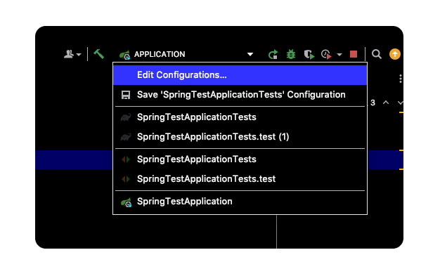
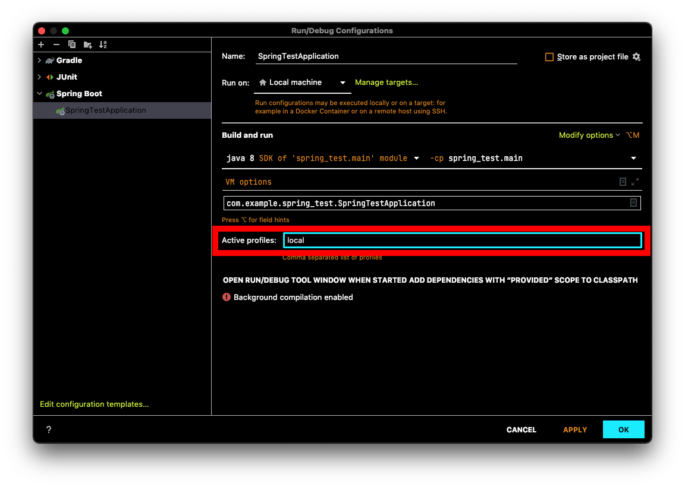

# Table of Contents
[[toc]]

# 스프링 외부 설정과 우선순위
스프링은 설정값을 소스코드에서 분리하여 외부에 위치시킬 수 있는 여러가지 방법을 제공한다. 이를 `외부 설정(Externalized Configuration)`이라고 한다.

## application.properties
`application.properties`을 사용하면 외부에서 다양한 속성값을 설정할 수 있다.

### 사용법
`src/main/resources`에 `application.properties` 생성한다.
``` properties
# application.properties
value.first=aaa
value.second=bbb
```
이제 스프링 컴포넌트에서 다음과 같은 방식으로 값을 읽어올 수 있다.
``` java{6,7,9,10}
// TestController.java
@RestController
@RequestMapping("/test")
public class TestController {

    @Value("${value.first}")
    private String first;

    @Value("${value.second}")
    private String second;

    @GetMapping("/test")
    String main() {
        return first + " " + second;
    }
}
```
### application.yml
`.properties` 확장자 대신 `.yml` 확장자를 사용할 수도 있다. `application.yml` 파일은 다음과 같다.
``` yml
# application.yml
value:
  first: aaa
  second: bbb
```

### application.properties 분리하기
보통 로컬, 개발, 운영 환경에 따라 다른 속성값을 사용한다. 이를 위해 별도의 `application.properties` 파일을 생성할 수 있다. 
- `application.properties`: 공통 속성값 정의
- `application-local.properties`: 로컬 환경에서 사용할 속성값 정의
- `application-dev.properties`: 개발 환경에서 사용할 속성값 정의
- `application-prod.properties`: 운영 환경에서 사용할 속성값 정의

``` properties
# application.properties
value.first=aaa
value.second=bbb
```

이때 `spring.config.activate.on-profile`에 어떤 파일을 사용할지 지정한다.

``` properties{2}
# application-local.properties
spring.config.activate.on-profile=local

value.second=local
value.thrid=local
```
``` properties{2}
# application-dev.properties
spring.config.activate.on-profile=dev

value.second=dev
value.thrid=dev
```
``` properties{2}
# application-prod.properties
spring.config.activate.on-profile=prod

value.second=third
value.thrid=third
```


이제 로컬 환경에서는 `application-local.properties`를 사용하도록 설정해보자. 인텔리J에서 어플리케이션의 `Edit Configurations`로 이동한다.



그리고 `spring.config.activate.on-profile`에 설정한 값을  `Active profiles`에 지정하면된다.



터미널에서 앱을 실행하는 경우 다음과 같이 옵션을 추가해주면 된다.
``` shellsession
$ java -Dspring.profiles.active=dev -jar [app_name].jar
```
``` shellsession
$ java -Dspring.profiles.active=prod -jar [app_name].jar
```

보통 `application.properties`에는 환경에 관계없는 공통 설정값을 작성한다. 그리고 `application-xxx.properties`에는 환경에 따라 달라지는 설정값을 작성한다. 또한 `application.propeties`의 속성값을 `application-xxx.properties`에도 정의하면 덮어쓰게 된다.

### 다른 application-xxx.properties 포함하기
`application.properties`는 다른 `application-xxx.properties`를 포함할 수도 있다.

``` properties{2}
# application.properteis
spring.profiles.include=sub

origin.name1=originValue1
origin.name2=originValue2
```
``` properties
# application-sub.properties
origin.name2=subValue2
sub.name1=subValue1
```
``` java
@RestController
@RequestMapping("/test")
public class TestController {

    @Value("${origin.name1}")
    String originName1;     // originValue1

    @Value("${origin.name2}")
    String originName2;     // subValue2

    @Value("${sub.name1}")
    String subName1;        // subValue1

    // ...
}

```


### 단위 테스트
`test/java/resources`에 `application.properties`를 생성하면 `main/java/resources`의 `application.properties`를 덮어쓰게 된다. 테스트 환경에서 다른 속성값을 지정할 때 유용하게 사용할 수 있다.
``` properties
# main/java/resources/application.properties
value.first=aaa
```
``` properties
# test/java/resources/application.properties
value.first=bbb
```
``` java
@SpringBootTest
class SpringTestApplicationTests {

    @Value("${value.first}")
    String first;    // bbb

    @Test
    void test() {
        assertThat(first).isEqualTo("bbb");     // Success
    }
}
```

테스트 환경에서도 `appication-xxx.properties`형태로 파일을 분리할 수 있으며, 활성화시킬 파일을 지정할 수 있다. `@ActiveProfiles` 어노테이션을 사용하면 된다.
``` properties
# src/main/resources/application.properties
value.first=aaa
value.second=aaa
```
``` properties
# src/test/resources/application.properties
value.first=testaaa
value.second=testaaa
```
``` properties
# src/test/resources/application-test.properties
spring.config.activate.on-profile=test

value.second=testbbb
value.third=testccc
```

``` java{2}
@SpringBootTest
@ActiveProfiles(profiles = {"test"})
class SpringTestApplicationTests {

    @Value("${value.first}")
    String first;

    @Value("${value.second}")
    String second;

    @Value("${value.third}")
    String third;

    @Test
    void test() {
        assertThat(first).isEqualTo("testaaa");
        assertThat(second).isEqualTo("testbbb");
        assertThat(third).isEqualTo("testccc");
    }
}
```

## @PropertySource
컴포넌트에 `@PropertySource`를 추가하여 설정파일 경로를 직접 지정할 수도 있다.
``` java{3,10-11}
// MainController.java
@RestController
@PropertySource("classpath:test.properties")
@RequestMapping("/main")
public class MainController {

    @Value("${person.name}")
    private String personName;

    @Value("${company.name}")
    private String companyName;

    @GetMapping("/name")
    String main() {
        return companyName;
    }
}
```
``` properties
# test.properties
company.name=google
```