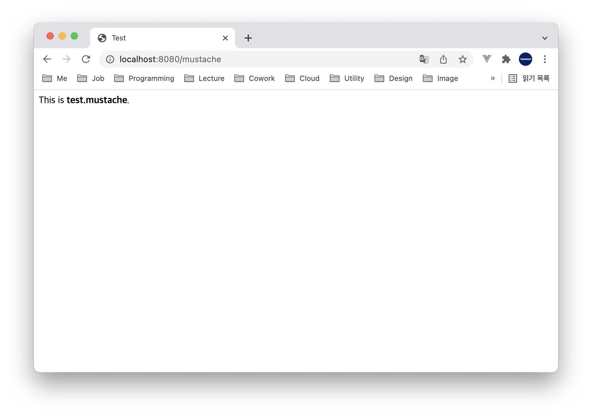

# Table of Contents
[[toc]]

# Spring Security
`Spring Security`에 대해 정리한다.

::: danger Note
현재 작성 중인 미완성된 포스트 입니다.
:::

## 의존성 설정
`Spring Security`를 사용하기 위해 의존성을 추가한다.
``` groovy
// build.gradle
dependencies {
    implementation 'org.springframework.boot:spring-boot-starter-security:${spring_security_version}'
    testImplementation 'org.springframework.security:spring-security-test:${spring_security_version}'
}
```

## 설정 파일 만들기
의존성을 추가했다면 `Spring Security` 설정 파일을 만들어야한다. `WebSecurityConfigurerAdapter`를 상속하는 클래스를 정의한 후 `@EnableWebSecurity` 어노테이션을 추가한다.

``` java {5,6}
import org.springframework.security.config.annotation.web.builders.HttpSecurity;
import org.springframework.security.config.annotation.web.configuration.EnableWebSecurity;
import org.springframework.security.config.annotation.web.configuration.WebSecurityConfigurerAdapter;

@EnableWebSecurity
public class WebSecurityConfig extends WebSecurityConfigurerAdapter {
    // ...
}
```
`@EnableWebSecurity` 정의를 살펴보자. `@Configuration`을 통해 해당 구성파일을 빈으로 등록한다.
``` java{6}
@Retention(RetentionPolicy.RUNTIME)
@Target(ElementType.TYPE)
@Documented
@Import({ WebSecurityConfiguration.class, SpringWebMvcImportSelector.class, OAuth2ImportSelector.class, HttpSecurityConfiguration.class })
@EnableGlobalAuthentication
@Configuration
public @interface EnableWebSecurity {
    // ...
}
```
이 설정 파일에서 `Spring Security`와 관련된 여러가지 설정을 한다.

## Spring Security Filter
`Spring Security`는 `Servlet Filter`를 기반으로 동작한다. 프로젝트에 의존성을 추가하면 `Spring Security`는 기본적으로 <u>모든 HTTP 엔드포인트 접근을 차단</u>한다.

예제를 살펴보자. 다음과 같은 컨트롤러가 있다. 컨트롤러는 `test.mustache` 템플릿 엔진을 보여준다.
``` java
// MustacheController.java
@Controller
public class MustacheController {

    @GetMapping("/mustache")
    public String mustache() {
        return "test";
    };
}
```
``` html
// test.mustache
<!DOCTYPE HTML>
<html>
<head>
    <title>Test</title>
    <meta http-equiv="Content-Type" content="text/html; charset=UTF-8" />
</head>
<body>
This is <b>test.mustache</b>.
</body>
</html>
```

이제 웹 브라우저에서 `http://localhost:8080/mustache`로 접근해보자. `test.mustache`를 보여주지 않고 `http://localhost:8080/login`로 리다이렉트되는 것을 확인할 수 있다. `Spring Security`가 모든 엔드포인트에 대해 인증되지 않는 접근을 차단하기 때문이다. 


인증을 받으려면 로그인을 해야한다. 별도의 설정을 하지 않았다면 Username은 `user`이며, Password는 스프링 부트 앱을 시작할 때 출력되는 로그에서 확인할 수 있다.


이제 Username과 Password를 입력하여 로그인 해보자. 그리고 `http://localhost:8080/mustache`로 접근하면 `test.mustache`가 랜더링되는 것을 확인할 수 있다.



`Spring Security`는 기본적으로 `쿠키-세션` 방식으로 인증 정보를 관리한다. 따라서 로그인 후 웹 브라우저에서 쿠키를 확인할 수 있다.


`http://localhost:8080/logout`으로 접근하면 로그아웃 할 수 있다.


## BCryptPasswordEncoder
회원 가입시 비밀번호를 암호화하여 저장할 필요가 있다. 이를 위해 `Spring Security`는 `BCryptPasswordEncoder`클래스를 제공한다. 이 객체를 반드시 빈으로 등록해야한다.
``` java
import org.springframework.security.crypto.bcrypt.BCryptPasswordEncoder;

@EnableWebSecurity
public class SecurityConfig extends WebSecurityConfigurerAdapter {

    @Bean
    PasswordEncoder passwordEncoder() {
        return new BCryptPasswordEncoder();
    }
}
```

## 인증 방법 직접 설정하기
`configure(AuthenticationManagerBuilder auth)`를 구현하여 인증 방식을 직접 구현할 수도 있다.
``` java
@EnableWebSecurity
public class SecurityConfig extends WebSecurityConfigurerAdapter {

    @Bean
    PasswordEncoder passwordEncoder() {
        return new BCryptPasswordEncoder();
    }

    @Override
    protected void configure(AuthenticationManagerBuilder auth) throws Exception {
        auth
                .inMemoryAuthentication()
                .withUser("yologger")
                .password(passwordEncoder().encode("1234"))
                .roles("USER");
    }
}
```
위 코드는 Username은 `yologger`, Password는 `1234`인 사용자를 생성한다. `roles()`를 통해 `역할(Role)`을 부여하고 있는데 이 부분은 뒤에서 알아보자.


이제 해당 정보로 인증할 수 있게 된다.


## 엔드 포인트 접근 제어
특정 HTTP 엔드포인트에 인증없이 접근을 허용하려면 설정 파일을 수정해야한다.

``` java {10-13}
import org.springframework.security.config.annotation.web.builders.HttpSecurity;
import org.springframework.security.config.annotation.web.configuration.EnableWebSecurity;
import org.springframework.security.config.annotation.web.configuration.WebSecurityConfigurerAdapter;

@EnableWebSecurity
public class WebSecurityConfig extends WebSecurityConfigurerAdapter {

    @Override
	protected void configure(HttpSecurity http) throws Exception {
		http
			.authorizeRequests()
				.antMatchers("/join", "/login").permitAll()
				.anyRequest().authenticated()
	}
}
```
위 예제는 `/join`, `/login` 엔드포인트에 대해서는 인증 없이 접근을 허용하고 있다. 그 외의 모든 엔드포인트는 인증이 필요하다.

## AuthenticationManager                                                                                                                                                                  

## SecurityContext
인증에 성공하면 `Authentication`객체에 인증 정보가 저장되며, 이 객체는 `SecurityContext`에서 유지한다.
``` java
Authentication authentication = SecurityContextHolder.getContext().getAuthentication();
```

## Role, Authority
- `Role(역할)`: 작명에 제한이 있다.
- `Authority(권한)`: 작명에 제한이 없다.

역할은 여러 권한으로 구성될 수 있다.
`ROLE_USER`
- `WRITE_ACCOUNT`
- `UPDATE_ACCOUNT`

`ROLE_ADMIN`
- `WRITE_ACCOUNT`
- `UPDATE_ACCOUNT`
- `DELETE_ACCOUNT`


## configure(HttpSecurity)
`configure(HttpSecurity)`에서는 

