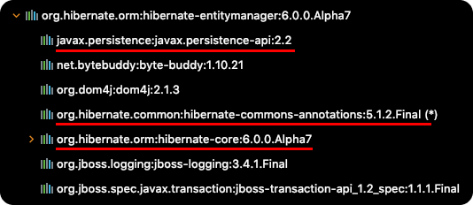
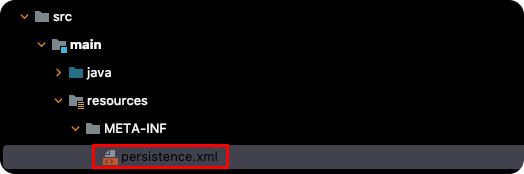

# Table of Contents
[[toc]]

## 용어 정리

- <b>`ORM(Object-Relational Mapping)`</b>: 관계형 데이터베이스의 테이블과 객체지향 프로그래밍의 객체를 매핑해주는 기술
- <b>`JPA(Java Persistence API)`</b>: Java 진형의 ORM 표준
- <b>`Hibernate`</b>: JPA는 명세고 Hibernate는 구현체다.


## Hibernate 시작하기
Gradle 기반의 Java 프로젝트에서 `Hibernate`를 시작해보자. Hibernate를 사용하려면 다음 의존성을 추가해야한다.
``` groovy {2,3}
dependencies {
    // Hibernate Entity Manager
    implementation 'org.hibernate:hibernate-entitymanager'
    
    // MySql Connector
    implementation 'mysql:mysql-connector-java':

    // Lombok
    implementation 'org.projectlombok:lombok:1.18.22'
}
```
`hibernate-entitymanager` 라이브러리를 내부적으로 다음과 같은 의존성을 포함한다.



그 다음 `src/main/resources/META-INF`에 `persistence.xml`을 생성한다. 이 파일에는 Hibernate 관련 설정을 작성한다.



``` xml {5-10}
<?xml version="1.0" encoding="UTF-8"?>
<persistence xmlns="http://xmlns.jcp.org/xml/ns/persistence" version="2.1">
    <persistence-unit name="test_persistence">
        <properties>
            <!-- 필수 속성-->
            <property name="javax.persistence.jdbc.driver" value="com.mysql.cj.jdbc.Driver"/>
            <property name="javax.persistence.jdbc.user" value="root"/>
            <property name="javax.persistence.jdbc.password" value="root"/>
            <property name="javax.persistence.jdbc.url" value="jdbc:mysql://127.0.0.1:3306/test_db"/>
            <property name="hibernate.dialect" value="org.hibernate.dialect.MySQLDialect"/>
        </properties>
    </persistence-unit>
</persistence>
```
만약 `java.lang.IllegalArgumentException: Unknown entity` 에러가 발생한다면 다음과 같이 엔티티를 등록해준다.

``` xml {4}
<?xml version="1.0" encoding="UTF-8"?>
<persistence xmlns="http://xmlns.jcp.org/xml/ns/persistence" version="2.1">
    <persistence-unit name="test_persistence">
        <class>com.yologger.project.MemberEntity</class>
        <properties>
            // ...
        </properties>
    </persistence-unit>
</persistence>
```

필수 속성 외에도 다양한 옵션을 추가할 수 있다.
``` xml {9-11}
<?xml version="1.0" encoding="UTF-8"?>
<persistence xmlns="http://xmlns.jcp.org/xml/ns/persistence" version="2.1">
    <persistence-unit name="test_persistence">
        <properties>
            <!-- 필수 속성 -->
            <!-- 중략... -->

            <!-- 옵션 -->
            <property name="hibernate.show_sql" value="true"/>
            <property name="hibernate.format_sql" value="true"/>
            <property name="hibernate.hbm2ddl.auto" value="update"/>
        </properties>
    </persistence-unit>
</persistence>
```
- `hibernate.show_sql`: 실행되는 데이터베이스 쿼리를 로그에 보여준다.
- `hibernate.format_sql`: 출력되는 로그를 보기 좋게 포맷팅해준다.
- `hibernate.hbm2ddl.auto`: 이 속성은 다음과 같은 값들을 가질 수 있다.

    |속성값|설명|
    |------|---|
    |`create`|무조건 테이블을 새로 생성한다.|
    |`create-drop`|기존 테이블이 존재하는 경우 `drop` 후 재생성한다.|
    |`update`|테이블이 없는 경우 테이블을 생성하고, 있는 경우 테이블 스키마를 변경한다.|
    |`validation`|테이블 스키마의 유효성을 확인하기만 한다.|
    |`none`|사용하지 않음|

    `hibernate.hbm2ddl.auto` 옵션은 매우 신중하게 설정해야한다. 특히 운영 환경에서는 `create`, `create-drop`, `update`를 절대 사용하면 안되며, 보통 속성값을 다음과 같이 설정한다.
    - 개발 초기 단계에는 `create` 또는 `update`를 사용한다.
    - 테스트 환경에서는 `create` 또는 `update`를 사용한다.
    - 운영 환경에서는 `validate` 또는 `none`을 사용한다.

## Entity 설계
관계형 데이터베이스의 테이블과 매핑할 엔티티는 다음과 같이 정의한다.
``` java
package com.yologger.project;

import javax.persistence.*;

import javax.persistence.Entity;
import javax.persistence.Id;

@Entity
@Table(name= "member")
public class MemberEntity {

    @Id
    @Column(name="id")
    @GeneratedValue(strategy = GenerationType.IDENTITY)
    private Long id;

    @Column
    private String email;

    @Column
    private String name;

    @Column
    private String password;

    // 기본 생성자
    public MemberEntity() {
    }

    // 생성자
    public MemberEntity(String email, String name, String password) {
        this.email = email;
        this.name = name;
        this.password = password;
    }

    public void setEmail(String email) {
        this.email = email;
    }

    public void setName(String name) {
        this.name = name;
    }

    public void setPassword(String password) {
        this.password = password;
    }

    public Long getId() {
        return id;
    }

    public String getEmail() {
        return email;
    }

    public String getName() {
        return name;
    }

    public String getPassword() {
        return password;
    }
}
```
주의할 점이 있다. `Hibernate`는 `리플렉션`으로 엔티티를 생성하기 때문에 반드시 `기본 생성자`를 정의해야한다.
``` java{8-10}
@Entity
@Table(name= "member")
public class MemberEntity {

    // 중략...

    // 기본 생성자
    public MemberEntity() {

    }

    // 중략...
}
```

`Lombok`을 사용한다면 다음과 같이 단축할 수 있다.

``` java
package com.yologger.project;

import javax.persistence.*;

import javax.persistence.Entity;
import javax.persistence.Id;

@Entity
@Table(name= "member")
@NoArgsConstructor
public class MemberEntity {

    @Id
    @Column(name="id")
    @GeneratedValue(strategy = GenerationType.IDENTITY)
    private Long id;

    @Column
    private String email;

    @Column
    private String name;

    @Column
    private String password;

    @Builder
    public MemberEntity(String email, String name, String password) {
        this.email = email;
        this.name = name;
        this.password = password;
    }
}
```

## 데이터 등록
Hibernate는 `EntityManager` 객체를 통해 CRUD 연산을 수행한다. 데이터 등록을 해보자.
``` java
package com.yologger.project;

import javax.persistence.EntityManager;
import javax.persistence.EntityManagerFactory;
import javax.persistence.EntityTransaction;
import javax.persistence.Persistence;

public class App {
    public static void main(String[] args) {

        // EntityMangerFactory 생성
        EntityManagerFactory entityManagerfactory = Persistence.createEntityManagerFactory("test_persistence");

        // EntityManager 생성
        EntityManager entityManager = entityManagerfactory.createEntityManager();

        // Transaction 생성
        EntityTransaction transaction = entityManager.getTransaction();

        try {
            // Transaction 생성
            transaction.begin();

            // 엔티티 생성
            MemberEntity member = new MemberEntity("paul@gmail.com", "paul", "1234");

            // 데이터 삽입
            entityManager.persist(member);

            // Commit
            transaction.commit();

        } catch (Exception e) {
            transaction.rollback();
        } finally {
            entityManager.close();
        }
        entityManagerfactory.close();
    }
}
```
애플리케이션을 구동하면 실행되는 쿼리는 다음과 같다.
```
Hibernate: 
    insert 
    into
        member
        (email, name, password) 
    values
        (?, ?, ?)
```

## 데이터 수정
Hibernate는 `update()`와 같은 수정 메소드를 제공하지 않는다. 그저 엔티티의 속성값을 수정하면 커밋 시점에 데이터베이스에 반영된다. 이를 `변경 감지(Dirty Checking)`이라고 한다.
``` java
MemberEntity member = new MemberEntity("john@gmail.com", "john", "1234");

// 수정
member.setEmail("monica@gmail.com");
member.setName("monica");

entityManager.persist(member);
```

## 데이터 삭제
데이터 삭제는 `remove()` 메소드를 사용한다.
``` java
entityManager.remove(member);
```

## 데이터 한 개 조회
데이터 한 개를 조회할 때는 `find()`메소드를 사용한다.
``` java
Long id = 1L;
MemberEntity member = entityManager.find(MemberEntity.class, id);
```
여러 데이터 조회 또는 조인 작업은 `JPQL`, `QueryDSL` 등을 사용할 수 있다.