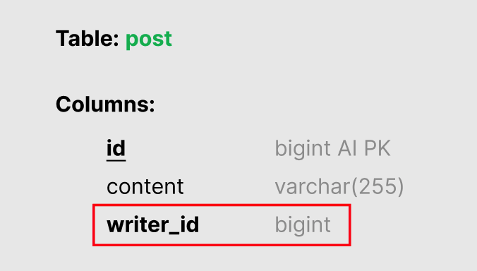
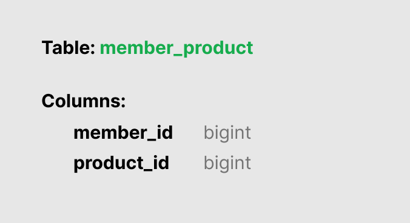
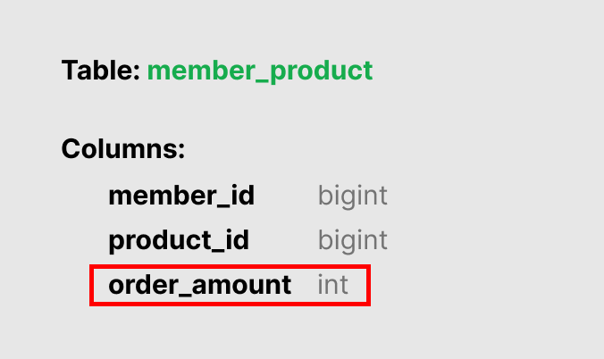
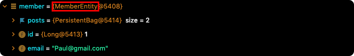
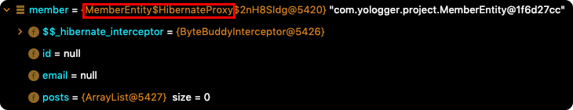

# Table of Contents
[[toc]]

# 연관관계(Relation)
`Spring Data JPA`의 `연관관계(Relation)`에 대해 정리한다.

## @OneToMany
하나의 요소에 여러 개의 다른 요소들이 연결될 수 있으면 `One-To-Many(일대다)` 관계라고 한다.

예제를 살펴보자. 하나의 사용자(MemberEntity)는 여러 게시물(PostEntity)를 작성할 수 있다. 이를 사용자 관점에서 표현하면 다음과 같다.
``` java {20,21}
// MemberEntity.java
@Entity
@Table(name= "member")
public class MemberEntity {

    @Id
    @Column(name="id")
    @GeneratedValue(strategy = GenerationType.IDENTITY)
    private Long id;

    @Column(nullable = false, unique = true)
    private String email;

    @Column(nullable = false)
    private String name;

    @Column(nullable = false)
    private String password;

    @OneToMany
    private List<PostEntity> posts = new ArrayList<>();

    // 생략 ...
}
```

## @ManyToOne
이번에는 게시물(PostEntity) 관점에서 살펴보자. 여러 게시물은 하나의 사용자에 포함될 수 있다. 이를 `Many-To-One(다대일)`관계라고 하며, 코드로 작성하면 다음과 같다.
``` java{13-14}
// PostEntity.java
@Entity
@Table(name= "post")
public class PostEntity {

    @Id
    @GeneratedValue(strategy = GenerationType.IDENTITY)
    private Long id;

    @Column(name = "content")
    private String content;

    @ManyToOne
    private MemberEntity writer;

    // 생략 ...
}
```

## 단방향 연관관계, 양방향 연관관계
MemberEntity 코드를 다시 살펴보자.  
``` java{5-6}
@Entity
@Table(name= "member")
public class MemberEntity {

    @OneToMany
    private List<PostEntity> posts = new ArrayList<>();

    // 중략 ..
}
```
MemberEntity에서 PostEntity로 연관관계를 매핑하고 있다. 이를 <b>`단방향 연관관계`</b>라고 한다.

이제 PostEntity 코드를 살펴보자.
``` java{5-6}
@Entity
@Table(name= "post")
public class PostEntity {

    @ManyToOne
    private MemberEntity writer;

    // 중략 ...
}
```
PostEntity에서 MemberEntity로 연관관계를 매핑했다. 이제 양쪽으로 연관관계가 매핑되었으며, 이를 <b>`양방향 연관관계`</b>라고 한다.

## 연관관계의 주인
관계형 데이터베이스는 투 테이블 간의 연관관계를 `외래 키(Foreign Key)`로 표현한다. MemberEntity, PostEntity로 생성된 데이터베이스 스키마에서 이를 확인할 수 있다.



반면 객체 지향 언어에서는 `참조(Reference)`로 두 엔티티의 관계를 표현한다. 
``` java {3-4}
public class MemberEntity {

    @OneToMany(mappedBy = "writer")
    private List<PostEntity> posts = new ArrayList<>();

    // 생략 ...
}
``` 

``` java {3-4}
public class PostEntity {

    @ManyToOne
    private MemberEntity writer;

    // 생략... 
}
``` 
두 엔티티를 양방향 연관관계로 매핑하면 객체의 참조는 둘인데 외래 키는 하나가 된다. 이러한 차이 때문에 <u>Hibernate에서는 두 객체 중 하나를 <b>`연관관계의 주인`</b>으로 설정해서 테이블 외래키를 관리하도록 해야한다</u>.

<b>`연관관계의 주인`</b>은 외래키가 생성되는 테이블로 지정한다. 주인이 아닌 엔티티에서 <b>`mappedBy`</b> 속성으로 다른 엔티티를 주인으로 지정하면 된다.

``` java {5}
public class MemberEntity {

    // 생략 ...

    @OneToMany(mappedBy = "writer")
    private List<PostEntity> posts = new ArrayList<>();
}
``` 

### 연관관계 주인과 관련된 주의사항
연관관계의 주인인 엔티티만이 외래키를 관리(연관관계 추가, 변경, 삭제)할 수 있다.
``` java
MemberEntity member = new MemberEntity("paul@gmail.com", "Paul", "1234");
entityManager.persist(member);

PostEntity post = new PostEntity("content", member);
entityManager.persist(post);

// 연관관계 추가
post.setWriter(member);
```
아래 코드는 연관관계의 주인이 아닌 엔티티에서 연관관계를 추가하고 있기 때문에 데이터베이스에 반영되지 않고 무시된다. 따라서 데이터베이스에 값이 추가되지 않는다.
``` java
member.getPosts().addPost(post);    // 무시
```

연관관계의 주인이 아닌 엔티티에서는 조회만 할 수 있다.
``` java
List<PostEntity> posts = member.getPosts(); 
```

### 엔티티 객체까지 고려한 양방향 관계
연관관계의 주인이 아닌 엔티티에서 연관관계를 추가하면 데이터베이스에 반영되지 않고 무시된다.  그럼에도 객체지향 관점에서는 연관관계의 주인인 엔티티 뿐만 아니라 아닌 쪽에도 데이터를 저장하는 것이 안전하다. 

예제를 살펴보자. 연관관계의 주인인 엔티티에만 데이터를 저장하고 있다.
``` java
Member member = new Member("paul@gmail.com", "paul", "1234");
Post post1 = new Post("content1")
Post post2 = new Post("content2")

// 연관관계 설정
post1.setWriter(member);
post2.setWriter(member);
```
이제 MemberEntity를 통해 PostEntity를 조회해보자. 
``` java
List<PostEntity> posts = member.getPosts();
System.out.println(posts.size());   // 0
```
`posts`의 크기가 0으로 출력된다. PostEntity에서 MemberEntity로의 연관관계는 설정되었으나 MemberEntity에서 PostEntity로의 연관관계는 설정되지 않았기 때문이다. 따라서 다음과 같이 다음과 같이 두 엔티티 객체에 데이터를 저장하도록 수정해야한다.
``` java{9-15}
@Entity
@Table(name= "post")
public class PostEntity {

    @ManyToOne
    @JoinColumn(name = "member_id")
    private MemberEntity writer;

    public void setWriter(MemberEntity writer) {
        if (this.writer != null) {
            this.writer.getPosts().remove(this);
        }
        this.writer = writer;
        writer.getPosts().add(this);
    } 

    // 중략 ...
}
```

## @JoinColumn
외래키 컬럼 이름을 별도로 지정하지 않으면 다음과 같은 형식으로 외래키 컬럼이 생성된다.
- `엔티티 필드 이름`_`참조하는 테이블의 컬럼명`

예제를 살펴보자.
``` java{6}
@Entity
@Table(name= "post")
public class PostEntity {

    @ManyToOne
    private MemberEntity writer;

    // 중략 ...
}
```
``` java {6,8}
@Entity
@Table(name= "member")
public class MemberEntity {

    @Id
    @Column(name="id")
    @GeneratedValue(strategy = GenerationType.IDENTITY)
    private Long id;

    // 중략 ...
}
```
외래키 컬럼 이름을 별도로 지정하지 않았기 때문에 `writer_id`라는 이름으로 외래키 컬럼이 생성된다.

`@JoinColumn`을 사용하면 외래키 컬럼의 이름을 지정할 수 있다. 
``` java{6}
@Entity
@Table(name= "post")
public class PostEntity {

    @ManyToOne
    @JoinColumn(name = "member_id")
    private MemberEntity writer;

    // 중략 ...
}
```

## CRUD
연관관계에 있는 엔티티의 `CRUD`에 대해 정리한다.

### 데이터 저장
연관관계를 매핑한 엔티티는 다음과 같이 저장한다.
``` java
MemberEntity member = new MemberEntity("paul@gmail.com", "Paul", "1234");
entityManager.persist(member);

PostEntity post = new PostEntity("content", member);
entityManager.persist(post);
```
실제 실행되는 데이터베이스 쿼리는 다음과 같다.
```
Hibernate: 
    insert 
    into
        member
        (email, name, password) 
    values
        (?, ?, ?)

Hibernate: 
    insert 
    into
        post
        (content, writer_id) 
    values
        (?, ?)
```

### 데이터 조회
연관관계가 매핑된 엔티티의 데이터 조회는 다음과 같이 할 수 있다.
``` java
Long id = 6L;
MemberEntity member = entityManager.find(MemberEntity.class, id);
List<PostEntity> posts = member.getPosts();
```
데이터베이스 쿼리는 다음과 같다.
```
Hibernate: 
    select
        m1_0.id,
        m1_0.email,
        m1_0.name,
        m1_0.password 
    from
        member as m1_0 
    where
        m1_0.id = ?
Hibernate: 
    select
        p1_0.writer_id,
        p1_0.id,
        p1_0.content 
    from
        post as p1_0 
    where
        p1_0.writer_id = ?
```

### 데이터 수정
Hibernate에는 `update()`같은 수정 메소드가 없다. 그저 엔티티의 속성값을 새롭게 설정하면 트랜잭션이 커밋될 때 플러시가 일어나면서 데이터베이스에 자동 저장된다.
``` java {8}
// 트랜잭션 생성
transaction.begin();

Long id = 6L;
MemberEntity member = entityManager.find(MemberEntity.class, id);

// 수정
member.setName("John");

// 커밋
transaction.commit();
```
커밋이 호출되는 시점에 실행되는 쿼리는 다음과 같다.
```
Hibernate: 
    update
        member 
    set
        email=?,
        name=?,
        password=? 
    where
        id=?
```

### 연관관계 제거
`null`을 사용하여 연관관계를 제거할 수 있다.
``` java{6}
transaction.begin();

Long id = 1L;
PostEntity post = entityManager.find(PostEntity.class, id);

post.setWriter(null);

transaction.commit();
```
커밋 시점에 실행되는 쿼리는 다음과 같다.
```
Hibernate: 
    update
        post 
    set
        content=?,
        writer_id=? 
    where
        id=?
```

### 엔티티 제거
연관관계가 매핑된 엔티티를 삭제할 때는 연관관계를 먼저 제거한 후 엔티티를 삭제한다.
``` java
post1.setWriter(null);  // post1의 연관관계 제거
post2.setWriter(null);  // post2의 연관관계 제거

entitiManager.remove(member);   // member 엔티티 제거
```

## @OneToOne
한 요소에 다른 한 요소만 연결될 수 있으면 `One-To-One(일대일)`관계라고 한다.

예제를 살펴보자. 한 사용자(MemberEntity)는 한 프로필(ProfileEntity) 정보만 가질 수 있다.
``` java
// MemberEntity.java
@Entity
@Table(name= "member")
public class MemberEntity {

    @Id
    @Column(name="id")
    @GeneratedValue(strategy = GenerationType.IDENTITY)
    private Long id;

    @OneToOne
    private ProfileEntity profile;

    // 생략 ...
}
```
``` java
// ProfileEntity
@Entity
@Table(name= "profile")
public class ProfileEntity {

    @Id
    @Column(name="id")
    @GeneratedValue(strategy = GenerationType.IDENTITY)
    private Long id;

    @Column
    private String address;

    @Column
    private String school;

    // 생략 ...
}
```
`@OneToOne` 역시 양방향 일대일 연관관계를 만들 수 있다.
``` java
// MemberEntity.java
@Entity
@Table(name= "member")
public class MemberEntity {

    @Id
    @Column(name="id")
    @GeneratedValue(strategy = GenerationType.IDENTITY)
    private Long id;

    @OneToOne
    @JoinColumn(name = "profile_id")
    private ProfileEntity profile;

    // 생략 ...
}
```
``` java
// ProfileEntity
@Entity
@Table(name= "profile")
public class ProfileEntity {

    @Id
    @Column(name="id")
    @GeneratedValue(strategy = GenerationType.IDENTITY)
    private Long id;

    @Column
    private String address;

    @Column
    private String school;

    @OneToOne(mappedBy = "profile")
    private MemberEntity member;

    // 생략 ...
}
```

## @ManyToMany
쇼핑몰을 개발하려고 한다. 한 사용자는 여러 상품을 구매할 수 있다. 한 상품을 여러 사용자가 구매할 수도 있다. 이러한 관계를 `Many-To-Many(다대다)`관계라고 한다.

다대다 관계는 사용자 엔티티, 상품 엔티티, 외래키로만 표현할 수 없고 별도의 연결 테이블이 필요하다.

이제 다대다 일대일 연관관계를 만들어보자.
``` java {14-19}
// MemberEntity.java
@Entity
@Table(name= "member")
public class MemberEntity {

    @Id
    @Column
    @GeneratedValue(strategy = GenerationType.IDENTITY)
    private Long id;

    @Column
    private String email;

    @ManyToMany
    @JoinTable(
            name = "member_product",
            joinColumns = @JoinColumn(name = "member_id"),
            inverseJoinColumns = @JoinColumn(name = "product_id")
    )
    private List<ProductEntity> products = new ArrayList<ProductEntity>();
}
```
``` java
// ProfileEntity.java
@Entity
@Table(name = "product")
public class ProductEntity {

    @Id
    @Column
    @GeneratedValue(strategy = GenerationType.IDENTITY)
    private Long id;

    @Column
    private String name;
}
```
- <b>`@JoinTable.name`</b>: 연결 테이블을 지정한다.
- <b>`@JoinTable.joinColumns`</b>: 연결 테이블에서 현재 테이블을 가리킬 외래키 컬럼을 지정한다.
- <b>`@JoinTable.reverseJoinColumns`</b>: 연결 테이블이서 상대 테이블을 가리킬 외래키 컬럼을 지정한다.

생성된 연결 테이블의 스키마는 다음과 같다.



다대다 양방향 연관관계도 만들 수 있다. `mappedBy`를 지정하지 않은 쪽이 연관관계의 주인이 된다.
``` java {14,15}
// ProductEntity.java
@Entity
@Table(name = "product")
public class ProductEntity {

    @Id
    @Column
    @GeneratedValue(strategy = GenerationType.IDENTITY)
    private Long id;

    @Column
    private String name;

    @ManyToMany(mappedBy = "products")
    private List<MemberEntity> members = new ArrayList<MemberEntity>();
}
```

### @ManyToMany의 한계와 해결방안
연결 테이블에 추가적인 컬럼이 필요하다면 어떻게 해야할까?



이러한 경우 `@ManyToMany`를 사용할 수 없다. 따라서 실무에서는 추가적인 컬럼을 포함하는 연결 엔티티를 만들고 `@OneToMany`, `@ManyToOne` 연관관계를 연결 엔티티와 양방향으로 매핑한다.
``` java
// MemberProductEntity.java
@Entity
@Table(name = "member_product")
public class MemberProductEntity {

    @Id
    @Column(name = "order_id")
    @GeneratedValue(strategy = GenerationType.IDENTITY)
    private Long id;

    @Column(name = "order_amount")
    private int orderAmount;

    @ManyToOne
    @JoinColumn(name = "buyer_id")
    private MemberEntity buyer;

    @ManyToOne
    @JoinColumn(name = "product_id")
    private ProductEntity product;

    // 중략..
}
```
외래키가 `MemberProductEntity`에 생성되므로 `MemberProductEntity`를 연관관계의 주인으로 지정한다.
``` java
// MemberEntity.java
@Entity
@Table(name= "member")
public class MemberEntity {

    @Id
    @Column
    @GeneratedValue(strategy = GenerationType.IDENTITY)
    private Long id;

    @Column
    private String email;

    @OneToMany(mappedBy = "buyer")
    private List<MemberProductEntity> memberProducts = new ArrayList<>();

    // 중략..
}
```
``` java
// ProductEntity.java
@Entity
@Table(name = "product")
public class ProductEntity {

    @Id
    @Column
    @GeneratedValue(strategy = GenerationType.IDENTITY)
    private Long id;

    @Column
    private String name;

    @OneToMany(mappedBy = "product")
    private List<MemberProductEntity> memberProducts = new ArrayList<MemberProductEntity>();

    // 중략..
}
```
이제 다음과 같이 사용할 수 있다.
``` java
MemberEntity member = new MemberEntity();
member.setEmail("paul@gmail.com");
entityManager.persist(member);

ProductEntity product = new ProductEntity();
product.setName("iPhone 10");
entityManager.persist(product);

MemberProductEntity memberProduct = new MemberProductEntity();
memberProduct.setBuyer(member);
memberProduct.setProduct(product);
memberProduct.setAmount(10);
entityManager.persist(memberProduct);
```

## Cascade
특정 엔티티를 영속 상태로 만들 때 연관된 엔티티도 함께 영속 상태로 만드는 것을 `영속성 전이`라고 한다. `Cascade`는 영속성 전이에 사용된다.

### 사용법
영속성 전이는 다음과 같이 `cascade` 속성과 `CascadeType` 열거형을 사용한다.
``` java {14}
// MemberEntity.java
@Entity
@Table(name= "member")
public class MemberEntity {

    @Id
    @Column
    @GeneratedValue(strategy = GenerationType.IDENTITY)
    private Long id;

    @Column
    private String email;

    @OneToMany(mappedBy = "writer", cascade = CascadeType.ALL)
    private List<PostEntity> posts = new ArrayList<PostEntity>();

    public void addPost(PostEntity post) {
        this.posts.add(post);
    }

    public MemberEntity() {
    }

    public MemberEntity(String email) {
        this.email = email;
    }

    // 중략 ...
}
```
``` java
// PostEntity.java
@Entity
@Table(name = "post")
public class PostEntity {

    @Id
    @Column(name="id")
    @GeneratedValue(strategy = GenerationType.IDENTITY)
    private Long id;

    @Column
    private String content;

    @ManyToOne
    @JoinColumn(name = "writer_id")
    private MemberEntity writer;

    public void setWriter(MemberEntity writer) {
        this.writer = writer;
    }

    public PostEntity(String content) {
        this.content = content;
    }

    public PostEntity() {
    }

    // 중략 ...
}
```

`CasecadeType`으로 올 수 있는 값은 다음과 같다.

|타입|설명|
|------|---|
|PERSIST|부모 엔티티를 영속화하면 자식 엔티티도 함께 영속화된다.|
|REMOVE|부모 엔티티를 삭제하면 자식 엔티티도 같이 삭제한다.|
|MERGE|병합|
|REFRESH|Refresh|
|DETACH|Detach|
|ALL|모두 적용|

자주 사용되는 `CascadeType`에 대해 알아보자.

### CascadeType.PERSIST
부모 엔티티를 영속화하면 자식 엔티티도 함께 영속화된다.
``` java {8}
// MemberEntity.java
@Entity
@Table(name= "member")
public class MemberEntity {

    // 중략 ...

    @OneToMany(mappedBy = "writer", cascade = CascadeType.PERSIST)
    private List<PostEntity> posts = new ArrayList<PostEntity>();

    // 중략 ...
}
```
`CascaseType.PERSIST`를 적용하지 않으면, 부모 엔티티를 영속화한 후 자식 엔티티도 영속화 해야한다. 
``` java
MemberEntity member = new MemberEntity("Paul@gmail.com");
entityManager.persist(member);  // 부모 엔티티 영속화

PostEntity post1 = new PostEntity("content1");
post1.setWriter(member);
member.addPost(post1);
entityManager.persist(post1);  // 자식 엔티티 영속화

PostEntity post2 = new PostEntity("content2");
post2.setWriter(member);
member.addPost(post2);
entityManager.persist(post2);   // 자식 엔티티 영속화
```

`CascaseType.PERSIST`를 적용하면 부모 엔티티만 영속화해도 자식 엔티티가 영속화된다.
``` java
MemberEntity member = new MemberEntity("Paul@gmail.com");

PostEntity post1 = new PostEntity("content1");
post1.setWriter(member);

PostEntity post2 = new PostEntity("content2");
post2.setWriter(member);

member.addPost(post1);
member.addPost(post2);

entityManager.persist(member);  // 부모 엔티티만 영속화
```

데이터베이스에 실제로 반영되는 시점은 플러시가 호출될 때다.

### CascadeType.REMOVE
부모 엔티티를 삭제하기 전 데이터의 상태는 다음과 같다고 가정하자.
```
> SELECT * FROM member;
+----+----------------+
| id | email          |
+----+----------------+
|  1 | Paul@gmail.com |
+----+----------------+
```
```
> SELECT * FROM post;
+----+----------+-----------+
| id | content  | writer_id |
+----+----------+-----------+
|  1 | content1 |         1 |
|  2 | content2 |         1 |
+----+----------+-----------+
```
다음과 같이 `Cascade.REMOVE`로 설정했을 때
``` java
@Entity
@Table(name= "member")
public class MemberEntity {

    @Id
    @Column
    @GeneratedValue(strategy = GenerationType.IDENTITY)
    private Long id;

    @Column
    private String email;

    @OneToMany(mappedBy = "writer", cascade = CascadeType.REMOVE)
    private List<PostEntity> posts = new ArrayList<PostEntity>();

    // .. 
}
```
`MemberEntity`를 삭제하면
``` java
MemberEntity member = entityManager.find(MemberEntity.class, 1L);
entityManager.remove(member);
```
다음 쿼리가 실행되어 `PostEntity`도 삭제되며,
```
Hibernate: 
    delete 
    from
        post 
    where
        id=?
```
데이터베이스 상태는 다음과 같아진다.
```
> SELECT * FROM member;
Empty set (0.00 sec) 
```
```
> SELECT * FROM post;
Empty set (0.00 sec)
```

데이터베이스에 실제로 반영되는 시점은 플러시가 호출될 때다.

만약 `Cascade.REMOVE` 옵션을 설정하지 않고 부모 엔티티를 삭제하면 자식 엔티티는 삭제되지 않는다. 하지만 자식 테이블에 걸려있는 외래 키 제약조건으로 인해 외래키 무결성 예외가 발생한다.

### Cascade.All
`Cascade.All`은 `PERSIST`, `REMOVE`, `MERGE`, `REFRESH`, `DETACH` 모두를 적용한 것과 동일하다.

먼저 `Cascade.PERSIST` 예제와 같은 방법으로 데이터베이스에 데이터가 잘 저장되는지 확인하자.
``` java
MemberEntity member = new MemberEntity("Paul@gmail.com");

PostEntity post1 = new PostEntity("content1");
post1.setWriter(member);

PostEntity post2 = new PostEntity("content2");
post2.setWriter(member);

member.addPost(post1);
member.addPost(post2);

entityManager.persist(member);  // 부모 엔티티만 영속화
```
데이터가 잘 저장된다.
```
> SELECT * FROM member;
+----+----------------+
| id | email          |
+----+----------------+
|  1 | Paul@gmail.com |
+----+----------------+
```
```
> SELECT * FROM post;
+----+----------+-----------+
| id | content  | writer_id |
+----+----------+-----------+
|  1 | content1 |         1 |
|  2 | content2 |         1 |
+----+----------+-----------+
```
이제 `Cascade.REMOVE` 예제처럼 부모 엔티티를 삭제했을 때 자식 엔티티도 잘 삭제되는지 확인해보자.
``` java
MemberEntity target = entityManager.find(MemberEntity.class, 1L);

entityManager.remove(target);
``` 
의도한대로 데이터베이스에서 데이터가 삭제되었다.
```
> SELECT * FROM member;
Empty set (0.00 sec)
```
```
> SELECT * FROM post;
Empty set (0.00 sec)
```

### 고아 객체
부모 엔티티와 연관관계가 끊어진 자식 엔티티를 자동으로 삭제하는 기능을 `고아 객체 제거`라고 한다. 이 기능은 `orphanRemoval = true` 옵션으로 활성화한다. 
``` java {13}
@Entity
@Table(name= "member")
public class MemberEntity {

    @Id
    @Column
    @GeneratedValue(strategy = GenerationType.IDENTITY)
    private Long id;

    @Column
    private String email;

    @OneToMany(mappedBy = "writer", cascade = CascadeType.All, orphanRemoval = true)
    private List<PostEntity> posts = new ArrayList<PostEntity>();

    // 생략 ...

    public List<PostEntity> getPosts() {
        return this.posts;
    }

    // 생략 ...
}
```
이 기능을 활성화하면 부모 엔티티의 컬렉션에서 자식 엔티티의 참조만 제거하면 자식 엔티티가 자동으로 삭제된다. 

예제를 살펴보자. 현재 데이터베이스 상태는 다음과 같다.
```
> SELECT * FROM member;
+----+----------------+
| id | email          |
+----+----------------+
|  1 | Paul@gmail.com |
+----+----------------+
```
```
> SELECT * FROM member;
+----+----------------+
| id | email          |
+----+----------------+
|  1 | Paul@gmail.com |
+----+----------------+
```
이제 부모 엔티티의 컬렉션에서 자식 엔티티의 참조를 제거해보자.
``` java
MemberEntity member = entityManager.find(MemberEntity.class, 1L);

// 컬렉션의 첫 번째 요소 제거
member.getPosts().remove(0);
```
플러시 이후 데이터베이스를 조회하면 첫 번째 요소에 해당하는 행이 삭제된 것을 확인할 수 있다.
```
> SELECT * FROM post;
+----+----------+-----------+
| id | content  | writer_id |
+----+----------+-----------+
|  2 | content2 |         1 |
+----+----------+-----------+
```

## Proxy
데이터베이스 상태가 다음과 같다고 가정하자.
```
> SELECT * FROM member;
+----+----------------+
| id | email          |
+----+----------------+
|  1 | Paul@gmail.com |
+----+----------------+
```
```
> SELECT * FROM post;
+----+----------+-----------+
| id | content  | writer_id |
+----+----------+-----------+
|  1 | content1 |         1 |
|  2 | content2 |         1 |
+----+----------+-----------+
```

`EntityManager.find()` 메소드를 사용하면 해당 메소드가 호출되는 시점에 데이터베이스를 조회한다.
``` java
MemberEntity member = entityManager.find(MemberEntity.class, 1L);  // 이 시점에 데이터베이스 조회
String email = member.getEmail();
```
조회된 엔티티의 타입은 `MemberEntity`이며, 속성값들도 다 채워져있는 것을 확인할 수 있다.



이제 `EntityManager.getReference()` 메소드로 조회해보자.
``` java
MemberEntity member = entityManager.getReference(MemberEntity.class, 1L);
String email = member.getEmail();
```
조회된 엔티티의 타입은 `MemberEntity`를 상속하는 <b>`HibernateProxy`</b> 이며, 속성값들이 채워져있지 않은 것을 확인할 수 있다.



이 프록시 객체는 `member.getEmail()` 처럼 속성값들에 실제로 접근할 때 데이터베이스를 조회한다.
``` java
MemberEntity member = entityManager.getReference(MemberEntity.class, 1L);
String email = member.getEmail();  // 이 시점에 데이터베이스 조회
```

이처럼 프록시 객체를 사용하면 데이터베이스 조회를 속성값에 실제로 접근하는 시점으로 미룰 수 있다.

## Lazy Fetch 
엔티티를 조회할 때 연관된 모든 엔티티를 함께 조회하는 것을 `즉시 로딩(Eager fetch)`라고 한다. 즉시 로딩은 다음과 같이 설정한다. 

``` java{7}
@Entity
@Table(name= "member")
public class MemberEntity {

    // 생략 ...

    @OneToMany(mappedBy = "writer", fetch = FetchType.EAGER)
    private List<PostEntity> posts = new ArrayList<PostEntity>();

    // 생략 ...
}
```
이제 다음 코드를 실행해보자.
``` java
MemberEntity member = entityManager.find(MemberEntity.class, 1L);  // 이 시점에 연관된 PostEntity도 모두 조회
List<PostEntity> posts = member.getPosts();
String content = posts.get(0).getContent();
```
실제 실행되는 데이터베이스 쿼리는 다음과 같다. 조인을 사용하여 `PostEntity`도 즉시 로딩하는 것을 확인할 수 있다. 
``` {10-12}
Hibernate: 
    select
        m1_0.id,
        m1_0.email,
        p1_0.writer_id,
        p1_0.id,
        p1_0.content 
    from
        member as m1_0 
    left outer join
        post as p1_0 
            on p1_0.writer_id = m1_0.id 
    where
        m1_0.id = ?
```

엔티티를 조회할 때 연관된 엔티티들을 조회하지 않고, 연관된 엔티티에 실제로 접근할 때 조회하는 것을 `지연 로딩(Lazy fetch)`라고 한다. 지연 로딩을 활성화하려면 `fetch` 속성을 `FetchType.Lazy`로 설정하면 된다.
``` java {7}
@Entity
@Table(name= "member")
public class MemberEntity {

    // 생략 ...

    @OneToMany(mappedBy = "writer", fetch = FetchType.Lazy)
    private List<PostEntity> posts = new ArrayList<PostEntity>();

    // 생략 ...
}
```
이제 다음 코드를 실행해보자.
``` java
MemberEntity member = entityManager.find(MemberEntity.class, 1L);
List<PostEntity> posts = member.getPosts();
String content = posts.get(0).getContent();
```
실행되는 쿼리는 다음과 같다.
```
Hibernate: 
    select
        m1_0.id,
        m1_0.email 
    from
        member as m1_0 
    where
        m1_0.id = ?
Hibernate: 
    select
        p1_0.writer_id,
        p1_0.id,
        p1_0.content 
    from
        post as p1_0 
    where
        p1_0.writer_id = ?
```
지연 로딩을 활성화하면 연관관계에 있는 엔티티는 프록시 객체로 조회된다. 따라서 다음 코드가 실행될 때
``` java
MemberEntity member = entityManager.find(MemberEntity.class, 1L);
```
다음 쿼리문이 실행되며,
```
Hibernate: 
    select
        m1_0.id,
        m1_0.email 
    from
        member as m1_0 
    where
        m1_0.id = ?
```
연관관계에 있는 엔티티에 실제로 접근할 때
``` java
String content = posts.get(0).getContent();
```
연관관계에 있는 엔티티를 데이터베이스에서 조회한다.
```
Hibernate: 
    select
        p1_0.writer_id,
        p1_0.id,
        p1_0.content 
    from
        post as p1_0 
    where
        p1_0.writer_id = ?
```
Hibernate는 연관 관계에 있는 엔티티가 컬렉션이면 기본적으로 지연 로딩을 적용한다. 따라서 `FetchType.Lazy`을 지정하지 않아도 자동으로 지연 로딩이 적용된다.
``` java {7}
@Entity
@Table(name= "member")
public class MemberEntity {

    // 생략 ...

    @OneToMany(mappedBy = "writer")
    private List<PostEntity> posts = new ArrayList<PostEntity>();  // 지연 로딩

    // 생략 ...
}
```