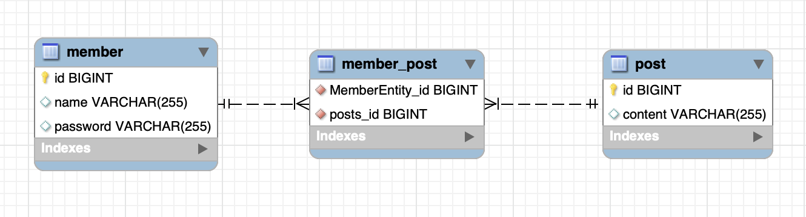
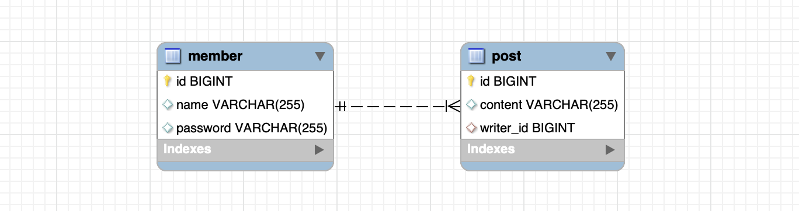

# Table of Contents
[[toc]]

# 관계(Relation)
`Hibernate`의 <b>`관계(Relation)`</b>에 대해 정리한다.

## @OneToMany
하나의 요소에 여러 개의 다른 요소들이 연결될 수 있으면 `One-To-Many(일대다) 관계`라고 한다.

예제를 살펴보자. 하나의 사용자는 여러 게시물를 가질 수 있으므로 일대다 관계이며, 이를 코드로 표현하면 다음과 같다.
``` java {16,17}
// MemberEntity.java
@Entity
@Table(name= "member")
public class MemberEntity {

    @Id
    @GeneratedValue(strategy = GenerationType.IDENTITY)
    private Long id;

    @Column
    private String name;

    @Column
    private String password;

    @OneToMany
    private List<PostEntity> posts = new ArrayList<>();

    public MemberEntity(String name, String password) {
        this.name = name;
        this.password = password;
    }

    public void addPost(PostEntity post) {
        this.posts.add(post);
    }

    // 생략 ...
}
```
``` java
// PostEntity.java
@Entity
@Table(name= "post")
public class PostEntity {

    @Id
    @GeneratedValue(strategy = GenerationType.IDENTITY)
    private Long id;

    @Column
    private String content;

    public PostEntity(String content) {
        this.content = content;
    }

    // 생략 ...
}
```
`Hibernate`의 `hibernate.hbm2ddl.auto`을 `update`로 설정하고 애플리케이션을 실행하면 다음과 같은 구조로 테이블이 생성된다. 외래키가 아닌 `member_post`라는 별도의 테이블로 관계를 표현한 점에 주목하자.

 

관계는 다음과 같이 추가할 수 있다. <u>먼저 두 엔티티를 영속화한 후 사용자 정의 메소드로 관계를 추가한다.</u>

``` java
// MemberEntity 영속화
MemberEntity member = new MemberEntity("paul", "1234");
entityManager.persist(member);

// PostEntity 영속화
PostEntity post = new PostEntity("content1");
entityManager.persist(post);

// 관계 설정
member.addPost(post);
```

데이터베이스에 저장된 데이터는 다음과 같다.
```
mysql> SELECT * FROM member;
+----+------+----------+
| id | name | password |
+----+------+----------+
|  1 | paul | 1234     |
+----+------+----------+
```
```
mysql> SELECT * FROM post;
+----+----------+
| id | content  |
+----+----------+
|  1 | content1 |
+----+----------+
```
```
mysql> SELECT * FROM member_post;
+-----------------+----------+
| MemberEntity_id | posts_id |
+-----------------+----------+
|               1 |        1 |
+-----------------+----------+
```

## @ManyToOne
이번에는 게시물 관점에서 살펴보자. 여러 게시물은 하나의 사용자에 포함될 수 있다. 이를 `Many-To-One(다대일)`관계라고 하며, 코드로 작성하면 다음과 같다.
``` java
// MemberEntity.java
@Entity
@Table(name= "member")
public class MemberEntity {

    @Id
    @GeneratedValue(strategy = GenerationType.IDENTITY)
    private Long id;

    @Column
    private String name;

    @Column
    private String password;

    public MemberEntity(String name, String password) {
        this.name = name;
        this.password = password;
    }

    // 생략 ...
}
```
``` java {16,17}
// PostEntity.java
@Table(name= "post")
public class PostEntity {

    @Id
    @GeneratedValue(strategy = GenerationType.IDENTITY)
    private Long id;

    @Column
    private String content;

    public PostEntity(String content) {
        this.content = content;
    }

    @ManyToOne
    private MemberEntity writer;

    public void setWriter(MemberEntity writer) {
        this.writer = writer;
    }
}
```
`Hibernate`의 `hibernate.hbm2ddl.auto`을 `update`로 설정하고 애플리케이션을 실행하면 다음과 같은 구조로 테이블이 생성된다. 이번에는 외래키로 관계를 표현한 점에 주목하자.



관계는 다음과 같이 추가할 수 있다. 
``` java
// PostEntity 영속화
PostEntity post = new PostEntity("content1");
entityManager.persist(post);

// MemberEntity 영속화
MemberEntity member = new MemberEntity("paul", "1234");
entityManager.persist(member);

// 관계 추가
post.setWriter(member);
```

데이터베이스 저장된 데이터는 다음과 같다.
```
mysql> SELECT * FROM member;
+----+------+----------+
| id | name | password |
+----+------+----------+
|  1 | paul | 1234     |
+----+------+----------+
```
```
mysql> SELECT * FROM post;
+----+----------+-----------+
| id | content  | writer_id |
+----+----------+-----------+
|  1 | content1 |         1 |
+----+----------+-----------+
```

## 단방향 관계, 양방향 관계
한쪽으로만 관계가 설정되면 <b>`단방향 관계`</b>라고 한다. 아래 예제는 `MemberEntity`에서 `PostEntity` 쪽으로 단방향 관계를 설정하고 있다.
``` java{5-6}
@Entity
@Table(name= "member")
public class MemberEntity {

    @OneToMany
    private List<PostEntity> posts = new ArrayList<>();

    // 중략 ..
}
```
``` java
@Entity
@Table(name= "post")
public class PostEntity {

    // 중략 ...
}
```
양쪽으로 관계가 설정되면 <b>`양방향 관계`</b>라고 한다. 아래 예제는 양방향으로 관계를 설정하고 있다.
``` java{5-6}
@Entity
@Table(name= "member")
public class MemberEntity {

    @OneToMany
    private List<PostEntity> posts = new ArrayList<>();

    // 중략 ..
}
```
``` java{5-6}
@Entity
@Table(name= "post")
public class PostEntity {

    @ManyToOne
    private MemberEntity writer;

    // 중략 ...
}
```


## 관계의 주인
양방향 관계 설정 시 기본적으로 두 테이블의 관계를 별도의 <u>테이블</u>로 표현한다.


양방향 관계 설정 시 두 테이블의 관계를 `외래 키(Foreign Key)`로도 표현할 수 있다. 이 때 외래 키가 생성되는 테이블을 <b>`관계의 주인`</b>이라고 한다.


`관계의 주인`은 관계의 주인이 아닌 엔티티에서 `mappedBy` 속성으로 관계의 주인이 될 엔티티의 속성을 지정하면 된다.

``` java {7}
@Entity
@Table(name= "member")
public class MemberEntity {

    // 생략 ...

    @OneToMany(mappedBy = "writer")
    private List<PostEntity> posts = new ArrayList<>();
}
``` 

이 경우 관계의 주인인 엔티티에 외래 키 컬럼이 생성된다.


그렇다면 왜 `관계의 주인`을 지정할까? 이는 객체지향 언어와 관계형 데이터베이스가 관계를 다르게 표현하기 때문이다. 객체 지향 언어에서는 `참조(Reference)`로 두 엔티티의 관계를 표현한다. 
``` java {3-4}
public class MemberEntity {

    @OneToMany(mappedBy = "writer")
    private List<PostEntity> posts = new ArrayList<>();

    // 생략 ...
}
``` 

``` java {3-4}
public class PostEntity {

    @ManyToOne
    private MemberEntity writer;

    // 생략... 
}
``` 
반면 `mappedBy`속성을 사용하는 경우 관계형 데이터베이스는 `외래 키`로 관계를 표현한다. 

이처럼 두 엔티티를 양방향 관계로 매핑하면 객체의 참조는 둘인데 외래 키는 하나가 된다. 이러한 차이 때문에 <u>Hibernate에서는 두 객체 중 하나를 <b>`관계의 주인`</b>으로 설정해서 테이블 외래키를 관리하도록 해야한다</u>.

### 관계의 주인과 관련된 주의사항
양방향 관계에서는 `관계의 주인`인 엔티티만이 외래 키를 관리할 수 있다. 다시 말해 <u>관계의 주인인 엔티티를 통해서만 관계를 추가, 변경, 삭제할 수 있다.</u> 

다음 예제는 관계의 주인인 `PostEntity`에서 관계를 설정하고 있다.
``` java
// MemberEntity 영속화
MemberEntity member = new MemberEntity("Paul", "1234");
entityManager.persist(member);

// PostEntity 영속화
PostEntity post = new PostEntity("content1");
entityManager.persist(post);

// 관계의 주인인 PostEntity에서 관계 추가
post.setWriter(member);
```
테이블을 조회하면 외래 키를 통해 관계가 설정된 것을 확인할 수 있다.
``` 
mysql> SELECT * FROM post;
+----+----------+-----------+
| id | content  | writer_id |
+----+----------+-----------+
|  1 | content1 |         1 |
+----+----------+-----------+
```
반면 관계의 주인이 아닌 엔티티에서 관계를 추가하면 데이터베이스에 반영되지 않는다.
``` java
// MemberEntity 영속화
MemberEntity member = new MemberEntity("paul", "1234");
entityManager.persist(member);

// PostEntity 영속화
PostEntity post = new PostEntity("content1");
entityManager.persist(post);

// 관계의 주인이 아닌 MemberEntity에서 관계 추가
member.addPost(post);
```
테이블을 조회하면 외래 키 컬럼에 `NULL`이 들어간 것을 확인할 수 있다.
```
mysql> SELECT * FROM post;
+----+----------+-----------+
| id | content  | writer_id |
+----+----------+-----------+
|  1 | content1 |      NULL |
+----+----------+-----------+ 
```
관계의 추가, 삭제, 변경은 관계의 주인인 엔티티로만 가능하다. 관계의 주인이 아닌 엔티티에서는 조회만 한다.
``` java {12}
List<PostEntity> posts = member.getPosts();
```

### 엔티티 객체까지 고려한 양방향 관계
관계의 주인이 아닌 엔티티에서 관계를 추가하면 데이터베이스에 반영되지 않고 무시된다. 그럼에도 <u>객체지향 관점에서는 관계의 주인이 아닌 쪽에도 데이터를 저장하는 것이 안전하다.</u> 

예제를 살펴보자. 관계의 주인인 엔티티에만 데이터를 저장하고 있다. 마지막 줄의 `post.size()`의 결과 값이 `0`임에 주목하자.
``` java{13,14}
// MemberEntity 영속화
Member member = new Member("paul@gmail.com", "paul");
entityManager.persist(member);

// PostEntity 영속화
Post post = new Post("content1")
entityManager.persist(post);

// 관계의 주인인 엔티티에서 관계 설정
post.setWriter(member);

// MemberEntity에서 관계에 있는 PostEntity를 조회 
List<PostEntity> posts = member.getPosts();
System.out.println(posts.size());   // 0
```

관계의 주인인 엔티티에서 관계를 추가했기 때문에 관계형 데이터베이스 관점에서는 <u>외래 키</u> 형태로 관계가  설정된다. 그러나 객체지향 관점에서는 관계의 주인이 아닌 엔티티에는 <u>참조</u>의 형태로 관계가 설정되지 않는다. 따라서 다음과 같이 관계의 주인이 아닌 엔티티에도 관계를 추가해야 객체지향 프로그래밍 관점에서도 논리적이게 된다.
``` java{14,15}
@Entity
@Table(name= "post")
public class PostEntity {

    @ManyToOne
    @JoinColumn(name = "member_id")
    private MemberEntity writer;

    public void setWriter(MemberEntity writer) {
        if (this.writer != null) {
            this.writer.getPosts().remove(this);
        }
        this.writer = writer;
        // 관계의 주인이 아닌 엔티티에도 관계를 설정한다.
        writer.getPosts().add(this);
    } 

    // 중략 ...
}
```

## @JoinColumn
외래키 컬럼 이름을 별도로 지정하지 않으면 다음과 같은 형식으로 외래키 컬럼이 생성된다.
- `엔티티 필드 이름`_`참조하는 테이블의 컬럼명`

예제를 살펴보자.
``` java{6}
@Entity
@Table(name= "post")
public class PostEntity {

    @ManyToOne
    private MemberEntity writer;

    // 중략 ...
}
```
``` java {6,8}
@Entity
@Table(name= "member")
public class MemberEntity {

    @Id
    @Column(name="id")
    @GeneratedValue(strategy = GenerationType.IDENTITY)
    private Long id;

    // 중략 ...
}
```
외래키 컬럼 이름을 별도로 지정하지 않았기 때문에 `writer_id`라는 이름으로 외래키 컬럼이 생성된다.

<b>`@JoinColumn`</b>을 사용하면 외래키 컬럼의 이름을 지정할 수 있다. 
``` java {6}
@Entity
@Table(name= "post")
public class PostEntity {

    @ManyToOne
    @JoinColumn(name = "member_id")
    private MemberEntity writer;

    // 중략 ...
}
```

## 관계가 있는 엔티티의 CRUD 연산
관계에 있는 엔티티의 `CRUD 연산`에 대해 정리한다.

### 데이터 저장
관계를 매핑한 엔티티는 다음과 같이 저장한다.
``` java
// MemberEntity 영속화
MemberEntity member = new MemberEntity("Paul", "1234");
entityManager.persist(member);

// PostEntity 영속화
PostEntity post = new PostEntity("content");
entityManager.persist(post);

// 관계 설정
post.setWriter(member);
```
실제 실행되는 데이터베이스 쿼리는 다음과 같다.
```
Hibernate: 
    insert 
    into
        member
        (name, password) 
    values
        (?, ?)
Hibernate: 
    insert 
    into
        post
        (content, writer_id) 
    values
        (?, ?)
Hibernate: 
    update
        post 
    set
        content=?,
        writer_id=? 
    where
        id=?
```

### 데이터 조회
관계가 매핑된 엔티티의 데이터 조회는 다음과 같이 할 수 있다.
``` java
MemberEntity member = entityManager.find(MemberEntity.class, id);
List<PostEntity> posts = member.getPosts();
```
데이터베이스 쿼리는 다음과 같다.
```
Hibernate: 
    select
        m1_0.id,
        m1_0.email,
        m1_0.name,
        m1_0.password 
    from
        member as m1_0 
    where
        m1_0.id = ?
Hibernate: 
    select
        p1_0.writer_id,
        p1_0.id,
        p1_0.content 
    from
        post as p1_0 
    where
        p1_0.writer_id = ?
```

### 데이터 수정
Hibernate에는 `update()`같은 수정 메소드가 없다. 그저 엔티티의 속성값을 새롭게 설정하면 트랜잭션이 커밋될 때 플러시가 일어나면서 데이터베이스에 자동 저장된다. 이를 `변경 감지(Dirty Checking)`라고 한다.
``` java {8}
// 트랜잭션 생성
transaction.begin();

// 데이터 조회
MemberEntity member = entityManager.find(MemberEntity.class, id);

// 수정
member.setName("John");

// 커밋
transaction.commit();
```
커밋이 호출되는 시점에 실행되는 쿼리는 다음과 같다.
```
Hibernate: 
    update
        member 
    set
        email=?,
        name=?,
        password=? 
    where
        id=?
```

### 관계 제거
`null`을 사용하여 관계를 제거할 수 있다.
``` java{6}
transaction.begin();

PostEntity post = entityManager.find(PostEntity.class, id);

post.setWriter(null);

transaction.commit();
```
커밋 시점에 실행되는 쿼리는 다음과 같다.
```
Hibernate: 
    update
        post 
    set
        content=?,
        writer_id=? 
    where
        id=?
```

### 엔티티 제거
관계가 매핑된 엔티티를 삭제할 때는 관계를 먼저 제거한 후 엔티티를 삭제한다. 엔티티를 삭제할 때는 `EntityManager.remove()`메소드를 사용한다.
``` java
MemberEntity member = entityManager.find(MemberEntity.class, memberId);

PostEntity post = entityManager.find(PostEntity.class, postId);

post.setWriter(null);  // PostEntity의 관계 제거

entityManager.remove(member);   // MemberEntity 제거
```
커밋 시점에 실행되는 쿼리는 다음과 같다.
```
Hibernate: 
    update
        post 
    set
        content=?,
        writer_id=? 
    where
        id=?
Hibernate: 
    delete 
    from
        member 
    where
        id=?
```

## @OneToOne
한 요소에 다른 한 요소만 연결될 수 있으면 `One-To-One(일대일)`관계라고 한다.

예제를 살펴보자. 하나의 사용자는 하나의 프로필 정보만 가질 수 있다.
``` java {11}
// MemberEntity.java
@Entity
@Table(name= "member")
public class MemberEntity {

    @Id
    @Column(name="id")
    @GeneratedValue(strategy = GenerationType.IDENTITY)
    private Long id;

    @OneToOne
    private ProfileEntity profile;

    // 생략 ...
}
```
``` java
// ProfileEntity
@Entity
@Table(name= "profile")
public class ProfileEntity {

    @Id
    @Column(name="id")
    @GeneratedValue(strategy = GenerationType.IDENTITY)
    private Long id;

    @Column
    private String address;

    @Column
    private String school;

    // 생략 ...
}
```
`@OneToOne` 역시 양방향 일대일 관계를 만들 수 있다.
``` java
// MemberEntity.java
@Entity
@Table(name= "member")
public class MemberEntity {

    @Id
    @Column(name="id")
    @GeneratedValue(strategy = GenerationType.IDENTITY)
    private Long id;

    @OneToOne
    @JoinColumn(name = "profile_id")
    private ProfileEntity profile;

    // 생략 ...
}
```
``` java
// ProfileEntity
@Entity
@Table(name= "profile")
public class ProfileEntity {

    @Id
    @Column(name="id")
    @GeneratedValue(strategy = GenerationType.IDENTITY)
    private Long id;

    @Column
    private String address;

    @Column
    private String school;

    @OneToOne(mappedBy = "profile")
    private MemberEntity member;

    // 생략 ...
}
```

## @ManyToMany
쇼핑몰을 개발하려고 한다. 한 사용자는 여러 상품을 구매할 수 있다. 한 상품을 여러 사용자가 구매할 수도 있다. 이러한 관계를 `Many-To-Many(다대다)`관계라고 한다.

다대다 관계는 외래 키로만 표현할 수 없으며, <u><b>별도의 연결 테이블이 필요하다.</b></u>

이제 다대다 일대일 관계를 만들어보자.
``` java {14-19}
// MemberEntity.java
@Entity
@Table(name= "member")
public class MemberEntity {

    @Id
    @Column
    @GeneratedValue(strategy = GenerationType.IDENTITY)
    private Long id;

    @Column
    private String email;

    @ManyToMany
    @JoinTable(
            name = "member_product",
            joinColumns = @JoinColumn(name = "member_id"),
            inverseJoinColumns = @JoinColumn(name = "product_id")
    )
    private List<ProductEntity> products = new ArrayList<ProductEntity>();
}
```
``` java
// ProfileEntity.java
@Entity
@Table(name = "product")
public class ProductEntity {

    @Id
    @Column
    @GeneratedValue(strategy = GenerationType.IDENTITY)
    private Long id;

    @Column
    private String name;
}
```
- <b>`@JoinTable.name`</b>: 연결 테이블을 지정한다.
- <b>`@JoinTable.joinColumns`</b>: 연결 테이블에서 현재 테이블을 가리킬 외래키 컬럼을 지정한다.
- <b>`@JoinTable.reverseJoinColumns`</b>: 연결 테이블이서 상대 테이블을 가리킬 외래키 컬럼을 지정한다.

생성된 연결 테이블의 스키마는 다음과 같다.


다대다 양방향 관계도 만들 수 있다. 이 경우 `mappedBy`를 지정하지 않은 쪽이 관계의 주인이 된다.
``` java {14,15}
// ProductEntity.java
@Entity
@Table(name = "product")
public class ProductEntity {

    @Id
    @Column
    @GeneratedValue(strategy = GenerationType.IDENTITY)
    private Long id;

    @Column
    private String name;

    @ManyToMany(mappedBy = "products")
    private List<MemberEntity> members = new ArrayList<MemberEntity>();
}
```
`@ManyToMany`의 양방향 관계 역시 관계의 주인을 통해서만 관계를 추가, 변경, 삭제할 수 있다.

### @ManyToMany의 한계와 해결방안
연결 테이블에 추가적인 컬럼이 필요하다면 어떻게 해야할까?


이 경우 `@ManyToMany`를 사용할 수 없다. 따라서 실무에서는 추가적인 컬럼을 포함하는 연결 엔티티를 만들고 `@OneToMany`, `@ManyToOne` 관계를 연결 엔티티와 양방향으로 매핑한다.
``` java
// MemberProductEntity.java
@Entity
@Table(name = "member_product")
public class MemberProductEntity {

    @Id
    @Column(name = "order_id")
    @GeneratedValue(strategy = GenerationType.IDENTITY)
    private Long id;

    @Column(name = "order_amount")
    private int orderAmount;

    @ManyToOne
    @JoinColumn(name = "buyer_id")
    private MemberEntity buyer;

    @ManyToOne
    @JoinColumn(name = "product_id")
    private ProductEntity product;

    // 중략..
}
```
외래키가 `MemberProductEntity`에 생성되므로 `MemberProductEntity`를 관계의 주인으로 지정한다.
``` java
// MemberEntity.java
@Entity
@Table(name= "member")
public class MemberEntity {

    @Id
    @Column
    @GeneratedValue(strategy = GenerationType.IDENTITY)
    private Long id;

    @Column
    private String email;

    @OneToMany(mappedBy = "buyer")
    private List<MemberProductEntity> memberProducts = new ArrayList<>();

    // 중략..
}
```
``` java
// ProductEntity.java
@Entity
@Table(name = "product")
public class ProductEntity {

    @Id
    @Column
    @GeneratedValue(strategy = GenerationType.IDENTITY)
    private Long id;

    @Column
    private String name;

    @OneToMany(mappedBy = "product")
    private List<MemberProductEntity> memberProducts = new ArrayList<MemberProductEntity>();

    // 중략..
}
```
이제 다음과 같이 사용할 수 있다.
``` java
MemberEntity member = new MemberEntity();
member.setEmail("paul@gmail.com");
entityManager.persist(member);

ProductEntity product = new ProductEntity();
product.setName("iPhone 10");
entityManager.persist(product);

MemberProductEntity memberProduct = new MemberProductEntity();
memberProduct.setBuyer(member);
memberProduct.setProduct(product);
memberProduct.setAmount(10);
entityManager.persist(memberProduct);
```

## 영속성 전이, CascadeType
특정 엔티티를 영속 상태로 만들 때 관계된 엔티티도 함께 영속 상태로 만드는 것을 `영속성 전이`라고 한다.

### 사용법
영속성 전이는 `cascade` 속성과 `CascadeType` 열거형으로 설정할 수 있다.
``` java {16}
// MemberEntity.java
@Entity
@Table(name= "member")
public class MemberEntity {

    @Id
    @GeneratedValue(strategy = GenerationType.IDENTITY)
    private Long id;

    @Column
    private String name;

    @Column
    private String password;

    @OneToMany(mappedBy = "writer", cascade = CascadeType.PERSIST)
    private List<PostEntity> posts = new ArrayList<>();

    public MemberEntity(String name, String password) {
        this.name = name;
        this.password = password;
    }

    // 중략 ...
}
```
``` java
// PostEntity.java
@Entity
@Table(name= "post")
public class PostEntity {

    @Id
    @GeneratedValue(strategy = GenerationType.IDENTITY)
    private Long id;

    @Column
    private String content;

    public PostEntity(String content) {
        this.content = content;
    }

    @ManyToOne
    private MemberEntity writer;

    public void setWriter(MemberEntity writer) {
        this.writer = writer;
        writer.getPosts().add(this);
    }

    // 중략 ...
}
```

`CasecadeType`으로 올 수 있는 값은 다음과 같다.

|타입|설명|
|------|---|
|PERSIST|부모 엔티티를 영속화하면 자식 엔티티도 함께 영속화된다.|
|REMOVE|부모 엔티티를 삭제하면 자식 엔티티도 같이 삭제한다.|
|MERGE|병합|
|REFRESH|Refresh|
|DETACH|Detach|
|ALL|모두 적용|

자주 사용되는 `CascadeType`에 대해 알아보자.

### CascadeType.PERSIST
부모 엔티티를 영속화하면 자식 엔티티도 함께 영속화된다.
``` java {8}
// MemberEntity.java
@Entity
@Table(name= "member")
public class MemberEntity {

    // 중략 ...

    @OneToMany(mappedBy = "writer", cascade = CascadeType.PERSIST)
    private List<PostEntity> posts = new ArrayList<PostEntity>();

    // 중략 ...
}
```
`CascaseType.PERSIST`를 적용하지 않으면, 부모 엔티티를 영속화한 후 자식 엔티티도 영속화 해야한다. 
``` java
// 부모 엔티티 영속화
MemberEntity member = new MemberEntity("Paul", "1234");
entityManager.persist(member);  

// 자식 엔티티 영속화
PostEntity post = new PostEntity("content1");
entityManager.persist(post);  

// 관계 설정
post.setWriter(member);
```

`CascaseType.PERSIST`를 적용하면 부모 엔티티만 영속화해도 자식 엔티티가 영속화된다.
``` java
MemberEntity member = new MemberEntity("Paul", "1234");

PostEntity post = new PostEntity("content1");
post.setWriter(member);

// 부모 엔티티만 영속화
entityManager.persist(member); 
```
실행되는 쿼리는 다음과 같다.
```
Hibernate: 
    insert 
    into
        member
        (name, password) 
    values
        (?, ?)
Hibernate: 
    insert 
    into
        post
        (content, writer_id) 
    values
```

데이터베이스에 실제로 반영되는 시점은 플러시가 호출될 때다.

### CascadeType.REMOVE
부모 엔티티를 삭제하기 전 데이터의 상태는 다음과 같다고 가정하자.
```
> SELECT * FROM member;
+----+----------------+
| id | email          |
+----+----------------+
|  1 | Paul@gmail.com |
+----+----------------+
```
```
> SELECT * FROM post;
+----+----------+-----------+
| id | content  | writer_id |
+----+----------+-----------+
|  1 | content1 |         1 |
|  2 | content2 |         1 |
+----+----------+-----------+
```
다음과 같이 `Cascade.REMOVE`로 설정했을 때
``` java{13}
@Entity
@Table(name= "member")
public class MemberEntity {

    @Id
    @Column
    @GeneratedValue(strategy = GenerationType.IDENTITY)
    private Long id;

    @Column
    private String email;

    @OneToMany(mappedBy = "writer", cascade = CascadeType.REMOVE)
    private List<PostEntity> posts = new ArrayList<PostEntity>();

    // .. 
}
```
`MemberEntity`를 삭제하면
``` java
MemberEntity member = entityManager.find(MemberEntity.class, 1L);
entityManager.remove(member);
```
다음 쿼리가 실행되어 `PostEntity`도 삭제되며,
```
Hibernate: 
    delete 
    from
        post 
    where
        id=?
```
데이터베이스 상태는 다음과 같아진다.
```
> SELECT * FROM member;
```
```
> SELECT * FROM post;
```

데이터베이스에 실제로 반영되는 시점은 플러시가 호출될 때다.

만약 `Cascade.REMOVE` 옵션을 설정하지 않고 부모 엔티티를 삭제하면 자식 엔티티는 삭제되지 않는다. 하지만 자식 테이블에 걸려있는 외래 키 제약조건으로 인해 외래키 무결성 예외가 발생한다.

### Cascade.All
`Cascade.All`은 `PERSIST`, `REMOVE`, `MERGE`, `REFRESH`, `DETACH` 모두를 적용한 것과 동일하다.

먼저 `Cascade.PERSIST` 예제와 같은 방법으로 데이터베이스에 데이터가 잘 저장되는지 확인하자.
``` java
MemberEntity member = new MemberEntity("Paul@gmail.com");

PostEntity post1 = new PostEntity("content1");
post1.setWriter(member);
member.addPost(post1);

PostEntity post2 = new PostEntity("content2");
post2.setWriter(member);
member.addPost(post2);

entityManager.persist(member);  // 부모 엔티티만 영속화
```
데이터가 잘 저장된다.
```
> SELECT * FROM member;
+----+----------------+
| id | email          |
+----+----------------+
|  1 | Paul@gmail.com |
+----+----------------+
```
```
> SELECT * FROM post;
+----+----------+-----------+
| id | content  | writer_id |
+----+----------+-----------+
|  1 | content1 |         1 |
|  2 | content2 |         1 |
+----+----------+-----------+
```
이제 `Cascade.REMOVE` 예제처럼 부모 엔티티를 삭제했을 때 자식 엔티티도 잘 삭제되는지 확인해보자.
``` java
MemberEntity target = entityManager.find(MemberEntity.class, 1L);

entityManager.remove(target);
``` 
의도한대로 데이터베이스에서 데이터가 삭제되었다.
```
> SELECT * FROM member;
```
```
> SELECT * FROM post;
```

## 고아 객체
부모 엔티티와 관계가 끊어진 자식 엔티티를 자동으로 삭제하는 기능을 `고아 객체 제거`라고 한다. 이 기능은 `orphanRemoval = true` 옵션으로 활성화한다. 
``` java {13}
@Entity
@Table(name= "member")
public class MemberEntity {

    @Id
    @Column
    @GeneratedValue(strategy = GenerationType.IDENTITY)
    private Long id;

    @Column
    private String email;

    @OneToMany(mappedBy = "writer", cascade = CascadeType.All, orphanRemoval = true)
    private List<PostEntity> posts = new ArrayList<PostEntity>();

    // 생략 ...

    public List<PostEntity> getPosts() {
        return this.posts;
    }

    // 생략 ...
}
```
이 기능을 활성화하면 부모 엔티티의 컬렉션에서 자식 엔티티의 참조만 제거하면 자식 엔티티가 자동으로 삭제된다. 

예제를 살펴보자. 현재 데이터베이스 상태는 다음과 같다.
```
> SELECT * FROM member;
+----+----------------+
| id | email          |
+----+----------------+
|  1 | Paul@gmail.com |
+----+----------------+
```
```
> SELECT * FROM member;
+----+----------------+
| id | email          |
+----+----------------+
|  1 | Paul@gmail.com |
+----+----------------+
```
이제 부모 엔티티의 컬렉션에서 자식 엔티티의 참조를 제거해보자.
``` java
MemberEntity member = entityManager.find(MemberEntity.class, 1L);

// 컬렉션의 첫 번째 요소 제거
member.getPosts().remove(0);
```
플러시 이후 데이터베이스를 조회하면 첫 번째 요소에 해당하는 행이 삭제된 것을 확인할 수 있다.
```
> SELECT * FROM post;
+----+----------+-----------+
| id | content  | writer_id |
+----+----------+-----------+
|  2 | content2 |         1 |
+----+----------+-----------+
```

## 프록시(Proxy)
실제 엔티티 객체 대신에 데이터베이스 조회를 지연할 수 있는 가짜 객체를 `프록시(Proxy)` 객체라고 한다. JPA는 프록시 객체를 사용하여 지연로딩 기능을 구현한다.

데이터베이스 상태가 다음과 같다고 가정하자.
```
> SELECT * FROM member;
+----+----------------+
| id | email          |
+----+----------------+
|  1 | Paul@gmail.com |
+----+----------------+
```
```
> SELECT * FROM post;
+----+----------+-----------+
| id | content  | writer_id |
+----+----------+-----------+
|  1 | content1 |         1 |
|  2 | content2 |         1 |
+----+----------+-----------+
```

`EntityManager.find()` 메소드를 사용하면 해당 메소드가 호출되는 시점에 데이터베이스를 조회한다.
``` java
MemberEntity member = entityManager.find(MemberEntity.class, 1L);  // 이 시점에 데이터베이스 조회
String email = member.getEmail();
```
조회된 엔티티의 타입은 `MemberEntity`이며, 속성값들도 다 채워져있는 것을 확인할 수 있다.


이제 `EntityManager.getReference()` 메소드로 조회해보자.
``` java
MemberEntity member = entityManager.getReference(MemberEntity.class, 1L);
String email = member.getEmail();
```
조회된 엔티티의 타입은 `MemberEntity`를 상속하는 <b>`HibernateProxy`</b> 이며, 속성값들이 채워져있지 않은 것을 확인할 수 있다.


이 프록시 객체는 `member.getEmail()` 처럼 속성값들에 실제로 접근할 때 데이터베이스를 조회한다.
``` java
MemberEntity member = entityManager.getReference(MemberEntity.class, 1L);
String email = member.getEmail();  // 이 시점에 데이터베이스 조회
```

이처럼 프록시 객체를 사용하면 데이터베이스 조회를 속성값에 실제로 접근하는 시점으로 미룰 수 있다.

## 글로벌 페치 전략
엔티티를 조회할 때 관계된 엔티티들을 어떻게 조회할 것인가를 결정하는 것을 `글로벌 패치 전략`이라고 한다. 글로벌 패치 전략은 크게 두 가지 방법이 있다.

### Eager fetch
엔티티를 조회할 때 관계된 모든 엔티티를 함께 조회하는 것을 `즉시 로딩(Eager fetch)`라고 한다. 즉시 로딩은 다음과 같이 설정한다. 

``` java{7}
@Entity
@Table(name= "member")
public class MemberEntity {

    // 생략 ...

    @OneToMany(mappedBy = "writer", fetch = FetchType.EAGER)
    private List<PostEntity> posts = new ArrayList<PostEntity>();

    // 생략 ...
}
```
이제 다음 코드를 실행해보자.
``` java
MemberEntity member = entityManager.find(MemberEntity.class, 1L);  // 이 시점에 관계된 PostEntity도 모두 조회
List<PostEntity> posts = member.getPosts();
String content = posts.get(0).getContent();
```
실제 실행되는 데이터베이스 쿼리는 다음과 같다. 조인을 사용하여 `PostEntity`도 즉시 로딩하는 것을 확인할 수 있다. 
``` {10-12}
Hibernate: 
    select
        m1_0.id,
        m1_0.email,
        p1_0.writer_id,
        p1_0.id,
        p1_0.content 
    from
        member as m1_0 
    left outer join
        post as p1_0 
            on p1_0.writer_id = m1_0.id 
    where
        m1_0.id = ?
```
### Lazy fetch 
엔티티를 조회할 때 관계된 엔티티들을 함께 조회하지 않고, 관계된 엔티티에 실제로 접근할 때 조회하는 것을 `지연 로딩(Lazy fetch)`라고 한다. 지연 로딩을 활성화하려면 `fetch` 속성을 `FetchType.Lazy`로 설정하면 된다.
``` java {7}
@Entity
@Table(name= "member")
public class MemberEntity {

    // 생략 ...

    @OneToMany(mappedBy = "writer", fetch = FetchType.Lazy)
    private List<PostEntity> posts = new ArrayList<PostEntity>();

    // 생략 ...
}
```
이제 다음 코드를 실행해보자.
``` java
MemberEntity member = entityManager.find(MemberEntity.class, 1L);
List<PostEntity> posts = member.getPosts();
String content = posts.get(0).getContent();
```
실행되는 쿼리는 다음과 같다.
```
Hibernate: 
    select
        m1_0.id,
        m1_0.email 
    from
        member as m1_0 
    where
        m1_0.id = ?
Hibernate: 
    select
        p1_0.writer_id,
        p1_0.id,
        p1_0.content 
    from
        post as p1_0 
    where
        p1_0.writer_id = ?
```
지연 로딩을 활성화하면 관계에 있는 엔티티는 프록시 객체로 조회된다. 따라서 다음 코드가 실행될 때
``` java
MemberEntity member = entityManager.find(MemberEntity.class, 1L);
```
다음 쿼리문이 실행되며,
```
Hibernate: 
    select
        m1_0.id,
        m1_0.email 
    from
        member as m1_0 
    where
        m1_0.id = ?
```
관계된 엔티티에 실제로 접근할 때
``` java
String content = posts.get(0).getContent();
```
관계된 엔티티를 데이터베이스에서 조회한다.
```
Hibernate: 
    select
        p1_0.writer_id,
        p1_0.id,
        p1_0.content 
    from
        post as p1_0 
    where
        p1_0.writer_id = ?
```
Hibernate는 <u><b>관계된 엔티티가 컬렉션이면 기본적으로 지연 로딩을 적용한다.</b></u> 따라서 `FetchType.Lazy`을 지정하지 않아도 자동으로 지연 로딩이 적용된다.
``` java {7}
@Entity
@Table(name= "member")
public class MemberEntity {

    // 생략 ...

    @OneToMany(mappedBy = "writer")
    private List<PostEntity> posts = new ArrayList<PostEntity>();  // 지연 로딩

    // 생략 ...
}
```

### 글로벌 페치 전략의 기본값
글로벌 페치 전략의 기본값은 다음과 같다.
- `@OneToOne`, `@ManyToOne`: 즉시 로딩
- `@OneToMany`, `@ManyToMany`: 지연 로딩