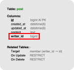

# Table of Contents
[[toc]]

# 연관관계(Relation)
`Spring Data JPA`의 `연관관계(Relation)`에 대해 정리한다.

## One To Many
하나의 요소에 여러 개의 다른 요소들이 연결될 수 있으면 `One To Many(일대다)` 관계라고 한다.

예제를 살펴보자. 하나의 사용자 `MemberEntity`는 여러 포스트 `PostEntity`를 작성할 수 있다. 이를 `MemberEntity` 관점에서 표현하면 다음과 같다.
``` java {24,25}
// MemberEntity.java
@Entity
@Table(name= "member")
@Builder
@Getter
@AllArgsConstructor
@NoArgsConstructor
public class MemberEntity extends BaseEntity {

    @Id
    @Column(name="id")
    @GeneratedValue(strategy = GenerationType.IDENTITY)
    private Long id;

    @Column(length = 200, nullable = false, unique = true)
    private String email;

    @Column(nullable = false)
    private String name;

    @Column(nullable = false)
    private String password;

    @OneToMany(mappedBy = "writer", cascade = CascadeType.ALL)
    private List<PostEntity> posts;
}
```

## Many To One
이번에는 포스트 `PostEntity` 관점에서 살펴보자. 여러 포스트 `PostEntity`가 하나의 `MemberEntity`에 포함될 수 있다. 이를 코드로 작성하면 다음과 같다.
``` java
// PostEntity.java
@Table(name= "post")
@ToString
@Getter
@Builder
@AllArgsConstructor
@NoArgsConstructor
public class PostEntity extends BaseEntity {

    @Id
    @GeneratedValue(strategy = GenerationType.IDENTITY)
    private Long id;

    @Column(name = "content", nullable = false, columnDefinition = "TEXT")
    private String content;

    @ManyToOne(fetch = FetchType.LAZY)
    @JoinColumn(name = "writer_id")
    private MemberEntity writer;
}
```

## 테이블 외래키 vs. 객체 연관관계
RDBMS에서는 투 테이블 간의 관계를 `외래 키(Foreign Key)`로 표현한다. 위의 `MemberEntity`, `PostEntity`로 생성된 데이터베이스의 스키마에서 이를 확인할 수 있다.



반면 객체 지향 언어에서는 연관관계로 두 엔티티의 관계를 표현한다. 

``` java

``` 

## Many To Many

## 늦은 로딩
:::
추후 작성될 내용입니다. 
:::
