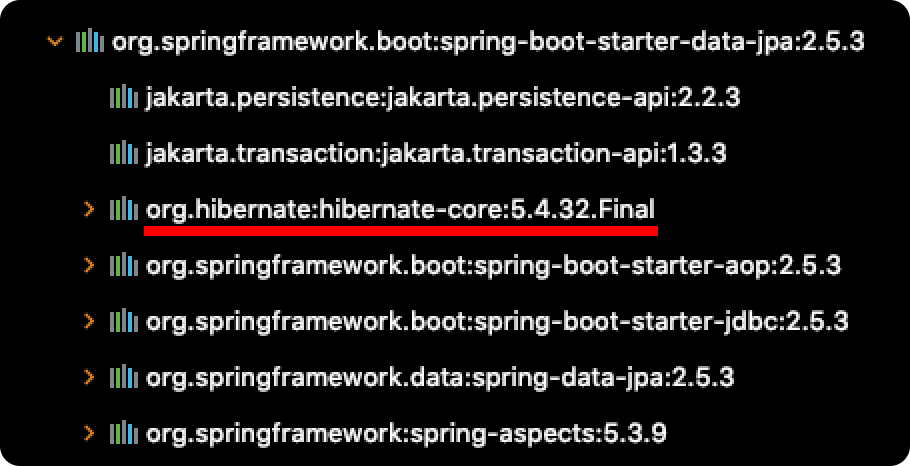

# Table of Contents
[[toc]]

# Spring Data JPA
`Spring Data JPA`는 스프링 프레임워크에서 `JPA`를 좀 더 편하게 사용할 수 있도록 하는 프로젝트다. 내부적으로 `Hibernate`을 포함하고 있기 때문에 `Hibernate`의 기능을 모두 사용할 수 있으며, 추가적인 기능도 제공한다.

## 설정
`Spring Data JPA`를 사용하려면 의존성을 추가해야한다.
``` groovy
// build.gradle
dependencies {
    // Spring Data JPA
    implementation "org.springframework.boot:spring-boot-starter-data-jpa"
}
```

내부적으로 `Hibernate`를 포함하는 것을 확인할 수 있다.


## JpaRepository 인터페이스
`Spring Data JPA`의 `JpaRepository`인터페이스는 CRUD 작업을 위한 다양한 메소드를 자동으로 생성한다.
``` java
import javax.persistence.Entity;
import javax.persistence.Table;
import javax.persistence.Id;
import javax.persistence.Column;
import javax.persistence.GeneratedValue;

import lombok.Builder;

@Entity
@Table(name= "member")
public class MemberEntity extends BaseEntity {

    @Id
    @Column(name="id")
    @GeneratedValue(strategy = GenerationType.IDENTITY)
    private Long id;

    @Column
    private String email;

    @Column
    private String name;

    @Column
    private String password;

    @Builder
    public MemberEntity(String email, String name, String password) {
        this.email = email;
        this.name = name;
        this.password = password;
    }
}
```
``` java
import org.springframework.data.jpa.repository.JpaRepository;

public interface MemberRepository extends JpaRepository<MemberEntity, Long> {
}
```

`JpaRepository`인터페이스를 상속하면 자동으로 생성되는 메소드 몇 가지는 다음과 같다.

### save()
새로운 엔티티를 저장한다. 이미 있는 엔티티는 수정한다.
``` java
MemberEntity member = MemberEntity.builder()
    .email("monica@gmail.com")
    .name("Monica")
    .password("1234")
    .build();

memberRepository.save(member);
```
### saveAll()
여러 엔티티들을 저장한다.
``` java
List<MemberEntity> members = Arrays.asList(
    MemberEntity.builder().email("monica@gmail.com").name("Monica").password("1234").build(),
    MemberEntity.builder().email("ross@gmail.com").name("Ross").password("1234").build(),
    MemberEntity.builder().email("chandler@gmail.com").name("Chandler").password("1234").build(),
);

memberRepository.saveAll(members);
```


### delete()
엔티티 하나를 삭제한다.
``` java
MemberEntity member = MemberEntity.builder()
    .email("monica@gmail.com")
    .name("Monica")
    .password("1234")
    .build();

memberRepository.delete(member);
```

### deleteById()
`id`로 엔티티를 삭제한다.
```
memberRepository.deleteById(1);
```

### deleteAll()
모든 엔티티를 삭제한다.
``` java
memberRepository.deleteAll();
```
``` java
List<MemberEntity> members = Arrays.asList(
    MemberEntity.builder().email("monica@gmail.com").name("Monica").password("1234").build(),
    MemberEntity.builder().email("ross@gmail.com").name("Ross").password("1234").build(),
    MemberEntity.builder().email("chandler@gmail.com").name("Chandler").password("1234").build(),
);

memberRepository.deleteAll(members);
```

### deleteAllById
`id`로 엔티티를 삭제한다.
``` java
memberRepository.deleteAllById(1);
```

### getById()
`id`로 엔티티 하나를 조회한다.
``` java
MemberEntity target = memberRepository.getById(1);
```
엔티티가 없으면 `EntityNotFoundException`를 발생시킨다.

### findById()
`id`로 엔티티 하나를 조회한다. `getById()`와 달리 `Optional`로 래핑한 객체가 반환된다.
``` java
Optional<MemberEntity> target = memberRepository.findById(1);
if (target.isPresent()) {
    MemberEntity member = target.get();
} else {
    // ..
}
```

### count()
엔티티의 개수를 반환한다.
``` java
long count = memberRepository.count();
```

### existsById()
엔티티의 존재 여부를 반환한다.
``` java
boolean isPresent = memberRepository.existsById(1);
```