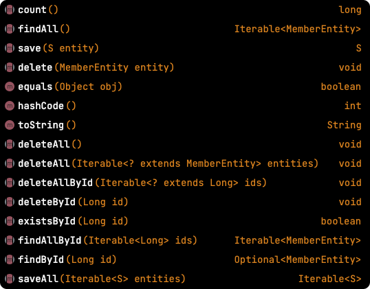

# Table of Contents
[[toc]]

# Spring Data JPA
<b>`Spring Data JPA`</b>는 스프링 프레임워크에서 JPA를 더 추상화하여 사용하기 쉽게 만든 프로젝트다. 내부적으로 Hibernate을 사용하며, `EntityManager`를 직접 관리하지 않고 `JpaRepository`인터페이스를 사용한다. 또한 Query Method, JPQL, 페이징, 정렬 기능을 추가적으로 제공한다.

## 설정
`Spring Data JPA`를 사용하려면 의존성을 추가해야한다.
``` groovy
// build.gradle
dependencies {
    // Spring Data JPA
    implementation "org.springframework.boot:spring-boot-starter-data-jpa"
}
```

내부적으로 `Hibernate`를 포함하는 것을 확인할 수 있다.


## CrudRepository
`CrudRepository` 인터페이스는 CRUD 작업을 위한 다양한 메소드를 자동으로 생성한다.
 
``` java
import javax.persistence.Entity;
import javax.persistence.Table;
import javax.persistence.Id;
import javax.persistence.Column;
import javax.persistence.GeneratedValue;

import lombok.Builder;

@Entity
@Table(name= "member")
public class MemberEntity {

    @Id
    @Column(name="id")
    @GeneratedValue(strategy = GenerationType.IDENTITY)
    private Long id;

    @Column
    private String email;

    @Column
    private String name;

    @Column
    private String password;

    @Builder
    public MemberEntity(String email, String name, String password) {
        this.email = email;
        this.name = name;
        this.password = password;
    }
}
```
``` java
import org.springframework.data.repository.CrudRepository;

public interface MemberRepository extends CrudRepository<MemberEntity, Long> {
}
```

`CrudRepositry` 인터페이스 제공하는 메소드들은 다음과 같다.



자주 사용되는 메소드 몇 가지를 알아보자.

### save()
새로운 엔티티를 저장한다. 이미 있는 엔티티는 수정한다.
``` java
MemberEntity member = MemberEntity.builder()
    .email("monica@gmail.com")
    .name("Monica")
    .password("1234")
    .build();

memberRepository.save(member);
```
### saveAll()
여러 엔티티들을 저장한다.
``` java
List<MemberEntity> members = Arrays.asList(
    MemberEntity.builder().email("monica@gmail.com").name("Monica").password("1234").build(),
    MemberEntity.builder().email("ross@gmail.com").name("Ross").password("1234").build(),
    MemberEntity.builder().email("chandler@gmail.com").name("Chandler").password("1234").build(),
);

memberRepository.saveAll(members);
```


### delete()
엔티티 하나를 삭제한다.
``` java
MemberEntity member = MemberEntity.builder()
    .email("monica@gmail.com")
    .name("Monica")
    .password("1234")
    .build();

memberRepository.delete(member);
```

### deleteById()
`id`로 엔티티를 삭제한다.
```
memberRepository.deleteById(1);
```

### deleteAll()
모든 엔티티를 삭제한다.
``` java
memberRepository.deleteAll();
```
``` java
List<MemberEntity> members = Arrays.asList(
    MemberEntity.builder().email("monica@gmail.com").name("Monica").password("1234").build(),
    MemberEntity.builder().email("ross@gmail.com").name("Ross").password("1234").build(),
    MemberEntity.builder().email("chandler@gmail.com").name("Chandler").password("1234").build(),
);

memberRepository.deleteAll(members);
```

### deleteAllById
`id`로 엔티티를 삭제한다.
``` java
memberRepository.deleteAllById(1);
```

### count()
엔티티의 개수를 반환한다.
``` java
long count = memberRepository.count();
```

### existsById()
엔티티의 존재 여부를 반환한다.
``` java
boolean isPresent = memberRepository.existsById(1);
```

### findById()
`id`로 엔티티 하나를 조회하며, `Optional`로 래핑한 객체가 반환된다.
``` java
Optional<MemberEntity> target = memberRepository.findById(1);
if (target.isPresent()) {
    MemberEntity member = target.get();
} else {
    // ..
}
```

## PagingAndSortingRepository
`PagingAndSortingRepository`인터페이스는 `CrudRepository`를 상속하며 정렬 및 페이징 관련된 메소드가 추가적으로 생성된다.


### Sorting

정렬은 `findAll(Sort sort)` 메소드와 `Sort` 클래스를 사용한다. 오름차순 정렬은 다음과 같다.
``` java
import org.springframework.data.domain.Sort;

Sort sort = Sort.by("age").ascending();
List<MemberEntity> members = memberRepository.findAll(sort);
```
내림차순 정렬은 다음과 같다.
``` java
import org.springframework.data.domain.Sort;

Sort sort = Sort.by("age").descending();
List<MemberEntity> members = memberRepository.findAll(sort);
```
`and()`메소드로 여러 개의 정렬 조건을 지정할 수 있다.
``` java
Sort sort1 = Sort.by("age").ascending();
Sort sort2 = Sort.by("name").descending();
Sort sortAll = sort1.and(sort2);
List<MemberEntity> members = memberRepository.findAll(sortAll);
```

### Paging
`Pageable`, `PageRequest`클래스로 페이징을 구현할 수 있다.
``` java
import org.springframework.data.jpa.repository.JpaRepository;
import org.springframework.data.jpa.repository.Query;
import org.springframework.data.repository.query.Param;

import org.springframework.data.domain.Pageable;

public interface MemberRepository extends JpaRepository<MemberEntity, Long> {
    List<MemberEntity> findByAge(int age, Pageable pageable);
}
```
``` java
import org.springframework.data.domain.PageRequest;

PageRequest pageRequest = PageRequest.of(0, 10);
List<MemberEntity> members = findByAge(30, pageRequest);
```

조회 결과를 `Page`클래스로 래핑할 수도 있다.
``` java
import org.springframework.data.jpa.repository.JpaRepository;
import org.springframework.data.jpa.repository.Query;
import org.springframework.data.repository.query.Param;

import org.springframework.data.domain.Pageable;

public interface MemberRepository extends JpaRepository<MemberEntity, Long> {
    Page<List<MemberEntity>> findByAge(int age, Pageable pageable);
}
```
페이징에 `findAll(Pageable pageable)` 메소드를 사용할 수도 있다. 이 메소드는 `Page` 객체를 반환한다.
``` java
import org.springframework.data.domain.Page;
import org.springframework.data.domain.PageRequest;
import org.springframework.data.domain.Pageable;

Pageable pageable = PageRequest.of(0, 10);
Page<MemberEntity> page = memberRepository.findAll(pageable);
```
`Page`클래스는 조회한 엔티티에 대한 정보를 제공하는 다양한 메소드를 제공한다.
``` java
public interface Page<T> extends Slice<T> {
    int getNumbers();               // 현재 페이지
    int getSize();                  // 페이지 크기
    int getTotalPages();            // 전체 페이지 수
    int getNumberofElements();      // 현재 페이지에 나올 데이터 수
    long getTotalElements();        // 전체 데이터 수
    boolean hasPreviousPage();      // 이전 페이지 여부
    boolean isFirstPage();          // 현재 페이지가 첫 페이지인지 여부
    boolean hasNextPage();          // 다음 페이지 여부
    boolean isLastPage();           // 현재 페이지가 마지막 페이지인지 여부
    Pageable nextPageable();        // 다음 페이지 객체, 다음 페이지가 없으면 null
    Pageable previousPageable();    // 이전 페이지 객체, 이전 페이지가 없으면 null
    List<T> getContent();           // 조회된 데이터
    boolean hasContent();           // 조회된 데이터 존재 여부
    Sort getSort();                 // 정렬 정보
}
```
``` java
Pageable pageable = PageRequest.of(0, 10);
Page<MemberEntity> page = memberRepository.findAll(pageable);

List<MemberEntity> members = page.getContent();
int totalPages = page.getTotalPages();
long totalElements = page.getTotalElements();
boolean isEmpty = page.isEmpty();
boolean isFirst = page.isFirst();
boolean isLast = page.isLast();
```

`PageRequest`에는 정렬 정보도 함께 전달할 수 있다.
``` java
import org.springframework.data.domain.PageRequest;
import org.springframework.data.domain.Sort;

Sort sort = Sort.by("age").ascending();
Pageable pageable = PageRequest.of(0, 10, sort);
Page<MemberEntity> page = memberRepository.findAll(pageable);
```


## JpaRepository
`JpaRepository`인터페이스는 `PagingAndSortingRepository`를 상속하며 <u>영속성 컨텍스트</u>, <u>Flush</u>, <u>Batch Delete</u> 같이 JPA와 관련된 메소드를 추가적으로 제공한다.


### getById()
`id`로 엔티티 하나를 조회한다.
``` java
MemberEntity target = memberRepository.getById(1);
```
엔티티가 없으면 `EntityNotFoundException`를 발생시킨다.

## Query Method
Spring Data JPA는 `쿼리 메소드(Query Method)`라는 기능을 제공한다. 

### 메소드 이름으로 JPQL 생성하기
쿼리 메소드를 사용하면 <u>메소드 이름</u>으로 <u>JPQL 쿼리</u>를 생성할 수 있다. 즉 쿼리 메소드는 내부적으로 JPQL로 변환되어 실행된다.

예제를 살펴보자. 다음과 같이 MemberEntity 라는 엔티티 클래스가 있다.
``` java
@Entity
@Table(name= "member")
public class MemberEntity extends BaseEntity {

    @Id
    @Column(name="id")
    @GeneratedValue(strategy = GenerationType.IDENTITY)
    private Long id;

    @Column
    private String email;

    @Column
    private String name;

    @Column
    private String nickname;

    @Column
    private String nation;

    @Column
    private Integer age;

    @Column
    private String password;

    // 생략 ...
}
```
`email`과 `name`으로 엔티티를 조회하려면 <u>메소드 이름</u>을 다음과 같이 정의하면 된다. 이 메소드를 `쿼리 메소드(Query Method)`라고 한다.
``` java
import org.springframework.data.jpa.repository.JpaRepository;

public interface MemberRepository extends JpaRepository<MemberEntity, Long> {
    List<MemberEntity> findByEmailAndName(String email, String name);
}
```
쿼리 메소드는 내부적으로 `JPQL` 쿼리로 변환된 후 실행된다.
```
select m from Member m where m.email = ?1 and m.name = ?2
```

물론 정해진 규칙에 따라서 쿼리 메소드의 이름을 작성해야한다.


메소드 이름에 정렬도 추가할 수 있다.

``` java
import org.springframework.data.jpa.repository.JpaRepository;

public interface MemberRepository extends JpaRepository<MemberEntity, Long> {
    List<MemberEntity> findByEmailOrderByAgeAsc(String email);
    List<MemberEntity> findByNameOrderByAgeDesc(String name);
}
```

### @Query
`@Query` 어노테이션을 사용하면 `JPQL`을 직접 사용할 수 있다.
``` java
import org.springframework.data.jpa.repository.JpaRepository;
import org.springframework.data.jpa.repository.Query;
import org.springframework.data.repository.query.Param;

public interface MemberRepository extends JpaRepository<MemberEntity, Long> {
    @Query("select m from MemberEntity where m.email = :email and m.name = :name")
    List<MemberEntity> findByEmailAndName(@Param("email") String email, @Param("name") String name);
}
```


## JPA Auditing
데이터베이스의 중요한 테이블은 새로운 행이 추가되거나, 행이 변경되거나, 삭제되면 이 기록을 별도의 컬럼에 기록해야한다. Spring Data JPA는 이러한 기능을 제공하며, 이를 `JPA Auditing` 이라고 한다.

JPA Auditing 기능을 활성화하려면 스프링 설정 클래스에 `@EnableJpaAuditing` 어노테이션을 추가해야한다.
``` java {5}
import org.springframework.context.annotation.Configuration;
import org.springframework.data.jpa.repository.config.EnableJpaAuditing;

@Configuration
@EnableJpaAuditing
public class JpaConfiguration {
}
```
그리고 다음과 같이 모든 엔티티 클래스의 베이스를 구현한다.
``` java {1,2,6,10}
@MappedSuperclass
@EntityListeners(value = { AuditingEntityListener.class })
@Getter
public class BaseEntity {

    @CreatedDate
    @Column(name = "created_at", updatable = false)
    private LocalDateTime createdAt;

    @LastModifiedDate
    @Column(name = "updated_at")
    private LocalDateTime updatedAt;
}
```
그리고 베이스 엔티티를 상속하면 된다.
``` java
@Entity
@Table(name= "member")
@Getter
@NoArgsConstructor
public class MemberEntity extends BaseEntity {

    @Id
    @GeneratedValue(strategy = GenerationType.IDENTITY)
    private Long id;

    @Column
    private String email;

    // ...

}    
```
이제 엔티티를 추가하면 `@CreatedDate` 어노테이션이 추가된 컬럼에 생성일자가 자동으로 추가된다. 그리고 `@LastModifiedDate` 어노테이션이 추가된 컬럼에 마지막 변경일자가 자동으로 추가된다.

## 데이터베이스 초기화 스크립트
스프링부트 애플리케이션이 시작될 때 데이터베이스 초기화 스크립트를 실행할 수 있다.

### schema.sql
스프링부트 앱을 구동할 때 DDL을 실행시킬 수 있다. `src/main/resources`경로 아래에 `schema.sql`을 정의하면 된다.
``` sql
-- schema.sql
CREATE TABLE country (
     id   INTEGER      NOT NULL AUTO_INCREMENT,
     name VARCHAR(128) NOT NULL,
     PRIMARY KEY (id)
);
```
그리고 `spring.sql.init.mode`와 `spring.sql.init.schema-locations`를 다음과 같이 설정한다.
``` yml
# application.yml
spring:
  sql:
    init:
      mode: always
      schema-locations: classpath:schema.sql
```
충돌을 피하기 위해 JPA가 스키마를 자동으로 생성하는 기능을 반드시 비활성화한다.
``` yml {3-5}
# application.yml
spring:
  jpa:
    hibernate:
      ddl-auto: none
  sql:
    init:
      mode: always
      schema-locations: classpath:schema.sql
```

### data.sql
스프링부트 앱을 구동할 때 DML을 실행시킬 수 있다. `src/main/resources`경로 아래에 `data.sql`을 정의하면 된다.
``` sql
-- data.sql
INSERT INTO member(email, password) VALUES('paul@gmail.com', '1234'), ('smith@gmail.com', '1234'), ('monica@gmail.com', '1234');
```
그리고 `spring.sql.init.mode`을 다음과 같이 설정한다.
``` yml
# application.yml
spring:
  sql:
    init:
      mode: always
```
가능한 설정값은 다음과 같다.
- `none`: SQL 스크립트를 실행하지 않는다.
- `embedded(default)`: H2를 사용할 때만 SQL 스크립트가 실행된다.
- `always`: 항상 SQL 스크립트가 실행된다.