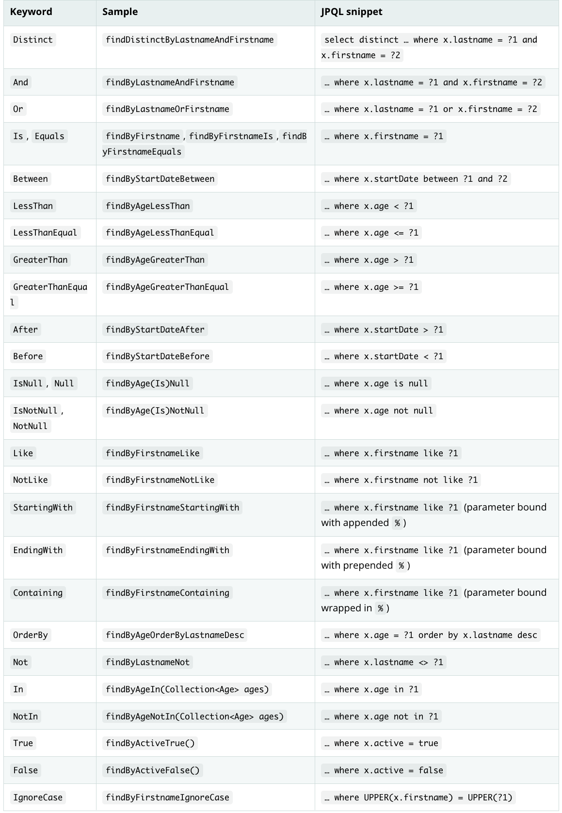

# Table of Contents
[[toc]]

# Query Method
`Spring Data JPA`는 `쿼리 메소드(Query Method)`라는 기능을 제공한다. 

## 메소드 이름으로 JPQL 생성하기
`Query Method`를 사용하면 <u>메소드 이름</u>으로 <u>JPQL 쿼리</u>를 생성할 수 있다. 다음과 같이 `MemberEntity`라는 엔티티 클래스가 있다고 가정하자.
``` java
@Entity
@Table(name= "member")
public class MemberEntity extends BaseEntity {

    @Id
    @Column(name="id")
    @GeneratedValue(strategy = GenerationType.IDENTITY)
    private Long id;

    @Column
    private String email;

    @Column
    private String name;

    @Column
    private String nickname;

    @Column
    private String nation;

    @Column
    private Integer age;

    @Column
    private String password;

    // 생략 ...
}
```
`email`과 `name`으로 엔티티를 조회하려면 <u>메소드 이름</u>을 다음과 같이 정의하면 된다. 이 메소드를 `쿼리 메소드(Query Method)`라고 한다.
``` java
import org.springframework.data.jpa.repository.JpaRepository;

public interface MemberRepository extends JpaRepository<MemberEntity, Long> {
    List<MemberEntity> findByEmailAndName(String email, String name);
}
```
Spring Data JPA는 이 쿼리 메소드를 JPQL 쿼리로 변환하여 실행한다.
```
select m from Member m where m.email = ?1 and m.name = ?2
```

물론 정해진 규칙에 따라서 쿼리 메소드의 이름을 작성해야한다.



메소드 이름에 정렬도 추가할 수 있다.

``` java
import org.springframework.data.jpa.repository.JpaRepository;

public interface MemberRepository extends JpaRepository<MemberEntity, Long> {
    List<MemberEntity> findByEmailOrderByAgeAsc(String email);
    List<MemberEntity> findByNameOrderByAgeDesc(String name);
}
```

## @Query
`@Query` 어노테이션을 사용하면 `JPQL` 문자열로 쿼리를 정의할 수 있다.
``` java
import org.springframework.data.jpa.repository.JpaRepository;
import org.springframework.data.jpa.repository.Query;
import org.springframework.data.repository.query.Param;

public interface MemberRepository extends JpaRepository<MemberEntity, Long> {
    @Query("select m from MemberEntity where m.email = :email and m.name = :name")
    List<MemberEntity> findByEmailAndName(@Param("email") String email, @Param("name") String name);
}
```

## Sorting
`Spring Data JPA`는 `Query Method`에서 정렬 기능을 사용하기 위해 `Sort`클래스를 제공한다.
``` java
import org.springframework.data.jpa.repository.JpaRepository;
import org.springframework.data.jpa.repository.Query;
import org.springframework.data.repository.query.Param;

import org.springframework.data.domain.Sort;

public interface MemberRepository extends JpaRepository<MemberEntity, Long> {

    List<MemberEntity> findByAge(int age, Sort sort);

    @Query("select m from MemberEntity where m.nation = :nation")
    List<MemberEntity> findByNation(@Param("nation") String nation, Sort sort);
}
```
``` java
memberRepository.findAll(Sort.by("name").ascending());
memberRepository.findAll(Sort.by(Sort.Direction.ASC, "name"));
memberRepository.findByAge(30, Sort.by(Sort.Direction.DESC, "nation"));
memberRepository.findByNation("England", Sort.by(Sort.Direction.DESC, "name").and(Sort.by(Sort.Direction.ASC, "age")));
```

## Paging
`Spring Data JPA`는 페이징 기능을 위해 `Pageable`, `PageRequest`클래스를 제공한다.
``` java
import org.springframework.data.jpa.repository.JpaRepository;
import org.springframework.data.jpa.repository.Query;
import org.springframework.data.repository.query.Param;

import org.springframework.data.domain.Pageable;

public interface MemberRepository extends JpaRepository<MemberEntity, Long> {
    List<MemberEntity> findByAge(int age, Pageable pageable);
}
```
``` java
import org.springframework.data.domain.PageRequest;

PageRequest pageRequest = PageRequest.of(0, 10);
List<MemberEntity> members = findByAge(30, pageRequest);
```
`PageRequest`에는 정렬 정보도 함께 전달할 수 있다.
``` java
import org.springframework.data.domain.PageRequest;
import org.springframework.data.domain.Sort;

PageRequest pageRequest = PageRequest.of(0, 10, Sort.by("name"));
```
조회 결과를 `Page`클래스로 래핑할 수도 있다.
``` java
import org.springframework.data.jpa.repository.JpaRepository;
import org.springframework.data.jpa.repository.Query;
import org.springframework.data.repository.query.Param;

import org.springframework.data.domain.Pageable;

public interface MemberRepository extends JpaRepository<MemberEntity, Long> {
    Page<List<MemberEntity>> findByAge(int age, Pageable pageable);
}
```
`Page`클래스는 조회한 엔티티에 대한 정보를 제공하는 다양한 메소드를 제공한다.
``` java
public interface Page<T> extends Slice<T> {
    int getNumbers();               // 현재 페이지
    int getSize();                  // 페이지 크기
    int getTotalPages();            // 전체 페이지 수
    int getNumberofElements();      // 현재 페이지에 나올 데이터 수
    long getTotalElements();        // 전체 데이터 수
    boolean hasPreviousPage();      // 이전 페이지 여부
    boolean isFirstPage();          // 현재 페이지가 첫 페이지인지 여부
    boolean hasNextPage();          // 다음 페이지 여부
    boolean isLastPage();           // 현재 페이지가 마지막 페이지인지 여부
    Pageable nextPageable();        // 다음 페이지 객체, 다음 페이지가 없으면 null
    Pageable previousPageable();    // 이전 페이지 객체, 이전 페이지가 없으면 null
    List<T> getContent();           // 조회된 데이터
    boolean hasContent();           // 조회된 데이터 존재 여부
    Sort getSort();                 // 정렬 정보
}
```